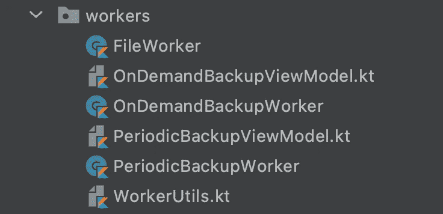
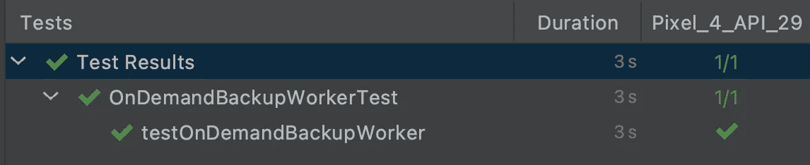
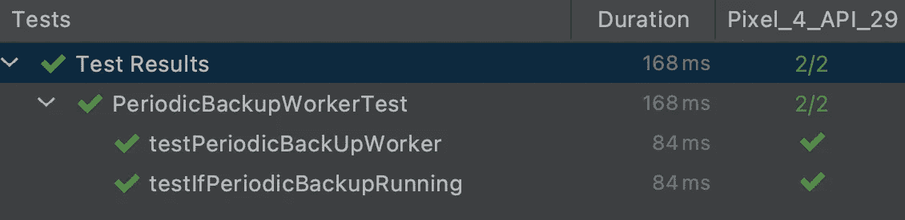

# 在 Android 中使用工作管理器

> 原文：<https://levelup.gitconnected.com/using-workmanager-in-android-be5cae1f155a>

在 Android 中使用工作管理器

*文章在此:*[*https://flattered with flutter . com/using-work manager-in-Android/*](https://flatteredwithflutter.com/using-workmanager-in-android/)

在 Android 中使用工作管理器

我们将简要介绍:

1.  创建自定义工作管理器
2.  创建一次工作请求
3.  创建 PeriodicWorkRequest
4.  为工人编写测试(步骤 2 和步骤 3)

> 注意:本文并不解释工作管理器的[工作原理，而是侧重于它的使用。](https://medium.com/androiddevelopers/introducing-workmanager-2083bcfc4712)


在 Android 中使用工作管理器

# 创建自定义工作管理器

如果您不熟悉 WorkManager，这里有详细的描述[和](https://developer.android.com/topic/libraries/architecture/workmanager)

根据文件

> 默认情况下，当您的应用程序启动时，WorkManager 会自动配置自身。如果您需要更多地控制工作管理器如何管理和调度工作，您可以定制工作管理器配置。

*   在您的应用程序的`build.gradle`中安装依赖项

```
def work_version = "2.5.0"implementation "androidx.work:work-runtime-ktx:$work_version"
androidTestImplementation "androidx.work:work-testing:$work_version"
```

*   从`AndroidManifest.xml`中移除默认初始化器

```
<provider
   android:name="androidx.work.impl.WorkManagerInitializer"
   android:authorities="${applicationId}.workmanager-init"
   tools:node="remove" />
```

*   创建您的应用程序类并定义您自己的自定义配置。

```
class TodoApplication() : Application(), Configuration.Provider {
    override fun onCreate() {
      super.onCreate()
      // LATER PUT THE PERIODIC WORK REQUEST HERE
    } override fun getWorkManagerConfiguration(): Configuration {

       return if (BuildConfig.DEBUG) {         Configuration.Builder().setMinimumLoggingLevel(Log.DEBUG).build()
        } 
        else {            Configuration.Builder().setMinimumLoggingLevel(Log.ERROR).build()
        }
    }}
```

> 这里，我们使用**配置。提供者**扩展我们的 TodoApplication **、**并覆盖**getWorkManagerConfiguration**

在我们的例子中，我们只需配置日志记录级别。有关可用定制的完整列表，请参见`[*Configuration.Builder()*](https://developer.android.com/reference/androidx/work/Configuration.Builder)`

# 创建一次工作请求

这是我们的文件夹结构的样子



应用程序中的工人

为了创建任何工作者，我们需要以下内容:

*   Worker(此部分) :您希望在后台执行的实际工作
*   WorkRequest(在 viewmodel 部分创建):这表示做一些工作的请求。
*   工作管理器(上面创建的):安排您的`WorkRequest`并让它运行

我们将从**ondemankbackupworker**开始，它的基本目标是将数据保存到某个后端上(在我们的演示中，我们在网络调用中假装)

然后是**文件工作器**，它在设备上创建一个文件，并将时间戳附加到新创建的文件中


文件工作器输出

## OnDemandBackupWorker

*   这个类从[协同工作器](https://developer.android.com/reference/kotlin/androidx/work/CoroutineWorker)扩展而来(提供与 Kotlin 协同程序的互操作)
*   我们为挂起的工作覆盖了 doWork 函数

```
override suspend fun doWork(): Result {
    val appContext = applicationContext
    showNotifications("Backing up the data", appContext) return try {
       val res = dummyWork()
       val outputData = workDataOf(KEY_ONDEMANDWORKER_RESP to res) Result.success(outputData)
    } catch (throwable: Throwable) {
       Timber.e(throwable)
       Result.failure()
    }
}private suspend fun dummyWork(): String {
     // Faking the network call
     sleep()
     return "Completed successfully!"
} 
```

> 在这里，我们创建了一个 dummyWork 函数，(它将线程置于睡眠状态)并返回字符串结果。

*   然后使用一个键(应该是一个字符串)将结果放入`workDataOf`(这将对列表转换为数据对象)
*   这个结果/输出然后被传递到工人的`Result.success`上，表示工作成功完成
*   如果有任何错误，我们打电话给工人的`Result.failure`

## 档案工作者

*   这个类从 [Worker](https://developer.android.com/reference/androidx/work/Worker) 扩展而来(在后台线程上同步执行工作)
*   我们覆盖了同步工作的 doWork 函数

```
override fun doWork(): Result {return try {
   val content="Backed up on ${dateFormatter.format(Date())}" val outputUri = saveToFile(appContext, content)
   val data=workDataOf(KEY_FILEWORKER_RESP to outputUri.toString()) Result.success(data)

 } catch (throwable: Throwable) {
     Timber.e(throwable)
     Result.failure()
   }
}
```

> 这里，我们使用 saveToFile 创建一个文件，并将当前时间戳作为文本放入该文件

*   然后结果被放入`workDataOf`中，像以前一样，我们将它传递给工人的`Result.success`

## OnDemandBackupViewModel

*   该类负责创建工作请求，并从 [AndroidViewModel](https://developer.android.com/reference/androidx/lifecycle/AndroidViewModel) 扩展而来。
*   我们在这个类中定义了两个函数( *beginBackup 和 cancelBackup* )

```
internal fun beginBackup() {
   val constraints = Constraints.Builder()
     .setRequiresStorageNotLow(true)
     .setRequiresBatteryNotLow(true)
     .setRequiredNetworkType(NetworkType.CONNECTED)
     .build()var continuation = workManager.beginUniqueWork(
       ONDEMAND_BACKUP_WORK_NAME,
       ExistingWorkPolicy.KEEP,
    OneTimeWorkRequest.from(OnDemandBackupWorker::class.java)
   )// BACKUP WORKER
   val backupBuilder = OneTimeWorkRequestBuilder<OnDemandBackupWorker>()

  backupBuilder.addTag(TAG_BACKUP)
  backupBuilder.setConstraints(constraints)
  continuation = continuation.then(backupBuilder.build())// SAVE FILE WORKER
  val saveInFile = OneTimeWorkRequest.Builder(FileWorker::class.java)
      .setConstraints(constraints)
      .addTag(TAG_FILE)
      .build() continuation = continuation.then(saveInFile)
  continuation.enqueue()
} internal fun cancelBackup() { workManager.cancelUniqueWork(ONDEMAND_BACKUP_WORK_NAME)
}
```

*   指定工作人员应该运行的约束条件(在我们的例子中，我们指定存储、电池和互联网)
*   我们在 viewmodel 类中获得了一个 workmanager 实例。利用这个实例，我们称之为`beginUniqueWork`

> 因为我们需要链接我们的工作请求，所以我们使用`beginUniqueWork`

*   我们给我们的 worker 一个惟一的名字(基本上是一个字符串)，用选项`[KEEP](http://d.android.com/reference/androidx/work/ExistingWorkPolicy#keep)`指定`[ExistingWorkPolicy](http://d.android.com/reference/androidx/work/ExistingWorkPolicy)`，并从 OnDemandBackupWorker 类创建一个 OneTimeWorkRequest
*   `beginUniqueWork`的输出是一个连续工作。
*   接下来，我们使用`OneTimeWorkRequestBuilder`创建 WorkRequest 构建器。我们为这项工作添加了标签，用于以后识别这项工作的进度
*   该请求被添加到`WorkContinuation`
*   我们为我们的文件工作者重复最后两个步骤
*   最后，我们的工作请求链需要添加到队列中(以便在后台线程上运行)。这是使用`enqueue`完成的

> 注意:为了取消一个工作请求，我们简单地调用带有标签的`cancelUniqueWork`(用于创建工作)

## 跟踪工作请求的进度

*   因为我们为我们的工人添加了标签，所以我们可以利用它们来获得任何`WorkRequest`的状态
*   它返回一个保存了一个`[WorkInfo](http://d.android.com/reference/androidx/work/WorkInfo)`对象的`LiveData`。`WorkInfo`是一个包含关于当前状态细节的对象`WorkRequest`

```
internal val backupDataInfo: LiveData<List<WorkInfo>> = workManager
        .getWorkInfosByTagLiveData(TAG_BACKUP)
```

> 这里，`TAG_BACKUP`是我们之前指定的标签

# 创建 PeriodicWorkRequest

> 注意:PeriodicBackupWorker 与 FileWorker 相同(唯一的区别是文件内容)

*   该工作执行多次，直到被取消，第一次执行立即发生，或者在满足给定的`[Constraints](https://developer.android.com/reference/androidx/work/Constraints)`后立即发生。
*   下一次执行将发生在周期间隔期间。
*   转到我们的应用程序类并实例化`[PeriodicWorkRequest.Builder](https://developer.android.com/reference/androidx/work/PeriodicWorkRequest.Builder)`

```
val constraints = Constraints.Builder()
    .setRequiresStorageNotLow(true)
    .setRequiresBatteryNotLow(true)
    .setRequiredNetworkType(NetworkType.UNMETERED)
    .build()val periodicBackup = PeriodicWorkRequestBuilder<PeriodicBackupWorker>(1, TimeUnit.DAYS)
    .addTag(TAG_PERIODIC_BACKUP)
    .setConstraints(constraints)
    .build()WorkManager.getInstance(this).enqueueUniquePeriodicWork(
     PERIODIC_BACKUP_WORK_NAME,
     ExistingPeriodicWorkPolicy.KEEP,
     periodicBackup
 )
```

*   我们根据需要指定约束
*   使用`PeriodicWorkRequestBuilder`，我们创建了我们的`PeriodicWorkRequest`
*   时间间隔被指定为每天一次。

> 周期性工作的最小间隔为 15 分钟。此外，如果您的定期工作有约束，即使满足了期间之间的延迟，也不会执行，直到满足约束。

*   我们使用`enqueueUniquePeriodicWork`对`PeriodicWorkRequest`进行排队，保持工作策略为`Keep`

> PeriodicWorkRequest 的正常生命周期是`ENQUEUED -> RUNNING -> ENQUEUED`

# 为工人编写测试


我们现在将为我们的工人编写测试:`OnDemandBackupWorker`和`PeriodicBackupWorker`

## `OnDemandBackupWorkerTest`

*   创建一个测试类[ondemankbackupworkertest](https://github.com/AseemWangoo/hands_on_kotlin/blob/master/app/src/androidTest/java/com/aseemwangoo/handsonkotlin/worker/OnDemandBackupWorkerTest.kt)
*   我们用`AndroidJUnit4`注释我们的类，这是驱动单个类测试的东西。

```
@RunWith(AndroidJUnit4::class)
class OnDemandBackupWorkerTest { private lateinit var context: Context
 private lateinit var executor: Executor @Before
 fun setUp() {
     context = ApplicationProvider.getApplicationContext()
     executor = Executors.newSingleThreadExecutor()
 } @Test
 fun testOnDemandBackupWorker() {
    val worker = TestListenableWorkerBuilder<OnDemandBackupWorker> (context).build()

   runBlocking {
     val result = worker.doWork()
     assertTrue(result is ListenableWorker.Result.Success)
   }
 }
}
```

*   我们初始化`setUp`中的上下文和执行器，并编写一个测试`testOnDemandBackupWorker`
*   因为我们的 OnDemandBackupWorker 是一个协同工作器，所以我们使用了`TestListenableWorkerBuilder`，它基本上构建了用于测试的`[ListenableWorker](https://developer.android.com/reference/androidx/work/ListenableWorker)`的实例。
*   接下来，我们调用 [runBlocking](https://kotlin.github.io/kotlinx.coroutines/kotlinx-coroutines-core/kotlinx.coroutines/run-blocking.html) 中的`doWork`(它在主线程上同步执行测试，我们想要测试它)



OnDemandBackupWorkerTest

## `PeriodicBackupWorkerTest`

*   创建一个测试类[PeriodicBackupWorkerTest](https://github.com/AseemWangoo/hands_on_kotlin/blob/master/app/src/androidTest/java/com/aseemwangoo/handsonkotlin/worker/PeriodicBackupWorkerTest.kt)
*   和以前一样，我们用`setUp`方法初始化并编写 2 个测试

```
// TEST 1@Test
fun testPeriodicBackUpWorker() {
   val worker = TestWorkerBuilder<PeriodicBackupWorker>(
        context = context,
        executor = executor
    ).build() val result = worker.doWork()
   assertTrue(result is ListenableWorker.Result.Success)
}
```

*   因为我们的 PeriodicBackupWorker 是一个 Worker，所以我们使用了`TestWorkerBuilder`，它基本上构建了用于测试的`[Worker](https://developer.android.com/reference/androidx/work/Worker)`的实例。
*   接下来，我们调用`doWork`并断言`Result.success`

*   对于第二个测试，我们检查周期性工作状态是否为`ENQUEUED`

```
// TEST 2@Test
fun testIfPeriodicBackupRunning() {
 WorkManagerTestInitHelper.initializeTestWorkManager(context)

 val testDriver = WorkManagerTestInitHelper.getTestDriver(context)
 val workManager = WorkManager.getInstance(context) val constraints = Constraints.Builder()
     .setRequiresStorageNotLow(true)
     .setRequiresBatteryNotLow(true)
     .setRequiredNetworkType(NetworkType.UNMETERED)
     .build() val request =
     PeriodicWorkRequestBuilder<PeriodicBackupWorker> (repeatInterval=24, TimeUnit.HOURS)
         .setConstraints(constraints)
         .build() workManager.enqueue(request).result.get() with(testDriver) {
      this?.setPeriodDelayMet(request.id)
      this?.setAllConstraintsMet(request.id)
 } val workInfo = workManager.getWorkInfoById(request.id).get()
 assertEquals(workInfo.state, WorkInfo.State.ENQUEUED)
}
```

*   我们利用`WorkManagerTestInitHelper`帮助初始化`WorkManager`进行测试。
*   设置约束，创建一个 PeriodicWorkRequest，并使用 workManager 实例将其入队
*   接下来，我们利用`testDriver`来满足约束，并断言状态是否为`ENQUEUED`



`PeriodicBackupWorkerTest`

其他文章:

[](/using-room-in-jetpack-compose-d2b6b674d3a5) [## 在 Jetpack Compose 中使用房间

### 在 Jetpack Compose 中使用房间

使用喷气背包 Composelevelup.gitconnected.com 的房间](/using-room-in-jetpack-compose-d2b6b674d3a5) [](/using-state-in-jetpack-compose-b7445b697736) [## 在 Jetpack 撰写中使用状态

### 介绍 Jetpack 编写和使用状态

levelup.gitconnected.com](/using-state-in-jetpack-compose-b7445b697736) [](https://proandroiddev.com/google-signin-compose-a9afa67b7519) [## Google 登录撰写

### Google 登录撰写

谷歌登录 Composeproandroiddev.com](https://proandroiddev.com/google-signin-compose-a9afa67b7519) 

```
 [Source code](https://github.com/AseemWangoo/hands_on_kotlin)
```