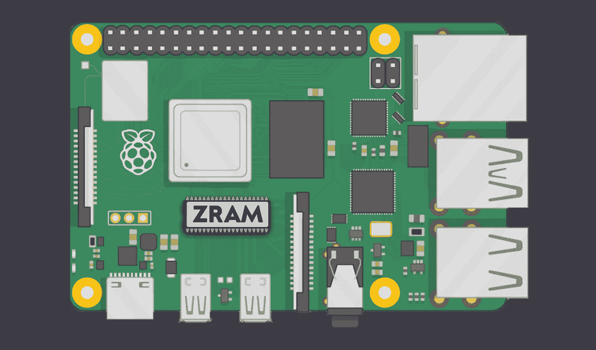
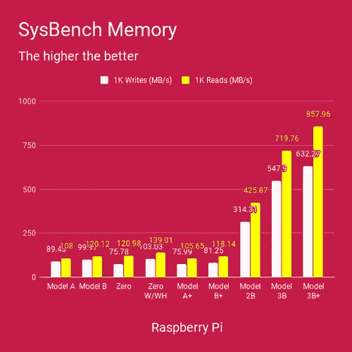

# 如何使用 zram 从您的树莓 Pi 中多挤出 50%的内存

> 原文：<https://levelup.gitconnected.com/using-zram-to-squeeze-more-out-of-your-raspberry-pi-55be552e309a>

## 我演示了如何使用 zram 将 Raspberry Pi 的可用内存增加 50%以上，而性能影响可以忽略不计。



最初发布于 2020 年 8 月 17 日 [ikarus.sg](https://ikarus.sg/using-zram-to-get-more-out-of-your-raspberry-pi/)

Raspberry Pi 和其他单板计算机(SBC)的内存一直很小。在 *Raspberry Pi 3* 中最大 1GB，只够运行轻量级程序和脚本。这种趋势一直持续到*的 Raspberry Pi 4* 和*的 2GB* 、 *4GB* 以及几个月后的 *8GB* 型号的出现，为运行数据库和其他内存密集型应用程序打开了大门。

这种转变在很大程度上是由于数据行业的爆炸式增长，以前 SBCs 的重点是物联网和嵌入式应用，现在重点正慢慢转向数据应用。近年来，内存也变得越来越便宜，允许新的 SBC 拥有更多内存，同时保持类似的价格范围。

# 我的担忧

随着 Raspberry Pi 3 趋于过时，我开始担心我的 [28 核北海巨妖集群](https://ikarus.sg/how-i-built-kraken/)如何能够至少再保持一年的相关性和有用性。

另一方面，我私下期待着放弃北海巨妖集群，因为我遇到过无数尴尬的情况，系统耗尽内存，所有 SSH 会话都被锁定，而内核在死机和强制重启之前挣扎了好 **10 分钟**。

> 事实上，这种情况每周都会发生在我身上一次！如果你以前在 Raspberry Pi 3 上运行过很多应用程序，我相信你会和我一样痛苦。

经过在树莓 Pi 论坛深处的一轮挖掘，我为树莓 Pi 3 即将过时和限制性内存容量的问题找到了一丝希望。

> 解决方案是 ***zram 互换*** 。

[](https://github.com/StuartIanNaylor/zram-swap-config) [## StuartIanNaylor/zram-swap-config

### 和 zram-config-0.5 一样，zram-config-0.5 是一个残破的包，出于许多原因不应该使用。Zram-swap-config 是…

github.com](https://github.com/StuartIanNaylor/zram-swap-config) 

在本文中，我将演示如何使用 zram 来增加大约 50%的可用内存，而对性能的影响可以忽略不计。

# zram 是什么？

> **zram** ，原名 **compcache** ，是一个 [Linux 内核模块](https://en.wikipedia.org/wiki/Linux_kernel_module)，用于在 ram 中创建一个压缩的[块设备](https://en.wikipedia.org/wiki/Block_device)，即一个 [RAM 磁盘](https://en.wikipedia.org/wiki/RAM_disk)，但是带有动态“磁盘”压缩。用 zram 创建的块设备可以用于交换或作为通用 ram 磁盘。([维基百科](https://en.wikipedia.org/wiki/Zram))

在英语中，zram 背后的思想基本上是留出一部分可用内存，将其用作传统*磁盘*存储的块设备，并对写入/读取的所有数据执行压缩/解压缩。

# 有没有性能打击？

> 能力越大，责任越大

虽然这句被广泛滥用的蜘蛛侠名言适用于大多数情况，但这是个例外。事实上，无论何时使用压缩，都会增加计算需求。但压缩是一项成熟的技术，多年来已经取得了进步，在现代处理器中，额外的计算负载是最小的，允许实时应用，如随机存取存储器。

在 SBC(如 Raspberry Pi 3)的情况下，在大多数自托管场景中，你更可能受到内存而不是 CPU 的限制，因为自托管应用程序往往相对来说 CPU 较少而内存较多。由于有 4 个可用内核和 1 GB 的 RAM，如果不先耗尽内存，您不太可能长时间保持所有 4 个内核的充分利用。

假设总有一些 CPU 资源可用，以增加 CPU 利用率为代价来增加内存肯定不会产生明显的性能影响。

# 你能从中得到什么？



Raspberry Pi 设备的内存带宽从 0 到 4 ( [来源](https://magpi.raspberrypi.org/articles/raspberry-pi-3bplus-specs-benchmarks))

在上表( [Github](https://github.com/StuartIanNaylor/zram-swap-config) )中，我们看到了每种压缩算法的压缩比和性能。通过这些性能数据，我们可以很容易地看到，大多数压缩算法都符合实时使用条件，因为它们的压缩/解压缩吞吐量分别超过或接近所有 Raspberry Pi 型号的最大内存写入/读取吞吐量。

即使在最保守的情况下，仅单独使用压缩也会产生一个*额外的* ***108%*** *的空间*，甚至这个估计本身也是保守的。这是因为测试假设混合了要压缩的数据类型、不可压缩的二进制数据以及文本。在内存中，大部分数据可以*安全地假设为文本*，因此真实世界的空间产量预计会大得多。

## 例子

假设为 zram 交换留出了 512MiB 的 RAM，并假设保守的压缩率为 2，那么我们将获得 500MB 的额外内存。

对于 RPi 3 来说，这使得总内存达到了相对舒适的 1.5GiB！

# 安装 zram-swap-config

废话说够了，让我们言归正传。安装 zram-swap-config 只需要几个步骤。

确保安装了 git:

```
$ sudo apt-get install git 
```

克隆 zram-swap-config 存储库:

```
$ git clone https://github.com/StuartIanNaylor/zram-swap-config \ && cd zram-swap-config
```

安装 zram-swap-config:

```
$ chmod +x install.sh && sudo ./install.sh
```

清理安装文件

```
$ cd .. && rm -r zram-swap-config
```

# 配置 zram 交换配置

zram-swap-config 以相同的缺省值安装。但是如果你是那种不摆弄每一个旋钮和控制杆就绝对睡不着觉的人，你很幸运。以下是你可以调整它的方法。

编辑`/etc/zram-swap-config.conf`并根据您的喜好修改以下参数。

**注意:**配置中的数值仅为**整数**。

一般来说，除了`MEM_FACTOR`、`DRIVE_FACTOR`和`COMP_ALG`之外，你不需要关心其他任何设置。

这里调整配置的想法是不要给 zram-swap 分配太多的内存，这样机器就不会花费太多的 CPU 来尝试压缩和解压缩数据，同时分配足够的内存来产生大小合适的交换空间。你可以根据自己的需要通过调整`MEM_FACTOR`来微调分配。

配置`DRIVE_FACTOR`的预计压缩比:

请注意，这些值是保守的，如果内存中的数据主要是文本(如日志)，实际压缩比可能会更高。

# 警告:压缩算法的可用性

查看上面的压缩算法表，人们很容易推测出 *zstd* 给出了性能和压缩比的最佳平衡。然而，恐怕我不得不在这里失望了，因为 *zstd* 和许多其他列出的压缩算法一样，*不一定在您的 Linux 发行版*中提供。

要检查可用的压缩算法，请运行以下命令:

```
$ modprobe zram && cat /sys/block/zram0/comp_algorithm
lzo [lz4] deflate
```

输出将显示可用的压缩算法以及用方括号括起来的当前选择的压缩算法。

# 我的配置为 Raspbian 对树莓派 3B

```
MEM_FACTOR=25
DRIVE_FACTOR=300
COMP_ALG=lz4
SWAP_DEVICES=1
SWAP_PRI=75
PAGE_CLUSTER=0
SWAPPINESS=80
```

*   `MEM_FACTOR`被设置为 25，这意味着 *256MiB* 内存将被留出用于 zram 交换。
*   `DRIVE_FACTOR`被设置为 300，这意味着我估计净压缩比为 *3.00* (仍然相对保守)。
*   `COMP_ALG`被设置为 *lz4* ，因为它是 Raspbian lzo、lz4 和 deflate 中可用算法中最好的。

## 此配置的快速说明

*   `MEM_FACTOR`被设置为 25，这意味着 *256MiB* 内存将被留出用于 zram 交换。
*   `DRIVE_FACTOR`被设置为 300，这意味着我估计净压缩比为 *3.00* (仍然相对保守)。
*   `COMP_ALG`被设置为 *lz4* ，因为它是 Raspbian lzo、lz4 和 deflate 中可用算法中最好的。

这种配置将产生 25%×1gb 的总内存× 3.00 = 0.75GiB 的交换空间。

# Raspberry Pi 4B 4GB 上 Raspbian 的配置

```
MEM_FACTOR=10
DRIVE_FACTOR=300
COMP_ALG=lz4
SWAP_DEVICES=1
SWAP_PRI=75
PAGE_CLUSTER=0
SWAPPINESS=80
```

这种配置将产生 10%×4gb 的总内存×3.00 = 1.2 GB 的交换空间。

# Raspberry Pi 4B 2GB 上 Raspbian 的推荐配置

```
MEM_FACTOR=15
DRIVE_FACTOR=300
COMP_ALG=lz4
SWAP_DEVICES=1
SWAP_PRI=75
PAGE_CLUSTER=0
SWAPPINESS=80
```

这种配置将产生 15%×2gb 的总内存× 3.00 = 0.9GiB 的交换空间。

## 需要注意的几点

*   通常我的目标是大约 1GB 的 zram 交换，这是一个很好的折衷方案，你可能已经从我目前的配置中看出来了。
*   我发现 300 的`DRIVE_FACTOR`对我的设置来说是最理想的，但是如果你觉得冒险或者幸运，无论如何，把`DRIVE_FACTOR`增加到 400。
*   如果你没有使用 Raspbian，那么你也有一个很好的机会可以使用其他压缩算法，所以一定要检查和调整！

# 当你这么做的时候

如果您正在安装 zram-swap-config，您可能希望在您的 Raspberry Pi 上禁用 swap。

一般来说，无论您是否使用 zram swap，都建议禁用 Raspbian 安装的默认 swap，原因如下:

1.  它会缩短您的 SD 卡的预期寿命，因为交换设备会受到大量和频繁的写入。
2.  考虑到 SD 卡糟糕的随机 I/O 性能，它的性能非常差。

要禁用默认交换设备:

```
$ dphys-swapfile swapoff \
&& dphys-swapfile uninstall \
&& update-rc.d dphys-swapfile disable
```

这样，你就可以用你的树莓派 3Bs 在接下来的一年左右做好准备了！

## 下一步是什么？

接下来，我将介绍 *log2ram* ，一种将日志写入内存以减少 SD 卡磨损的方法，更不用说，它还可以与 zram-swap-config 配合使用。回头见！

最初发表于 2020 年 8 月 17 日 [ikarus.sg](https://ikarus.sg/using-zram-to-get-more-out-of-your-raspberry-pi/) 。