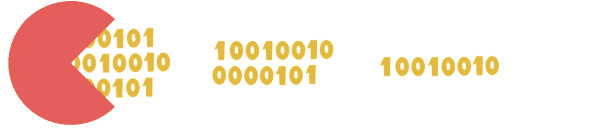
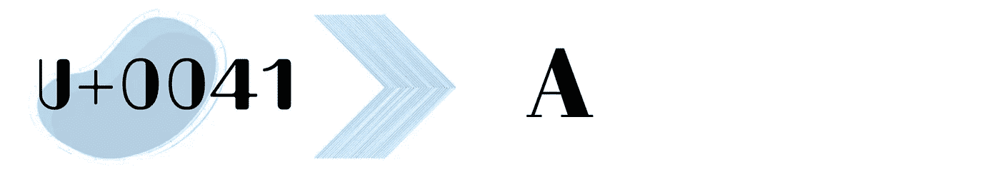
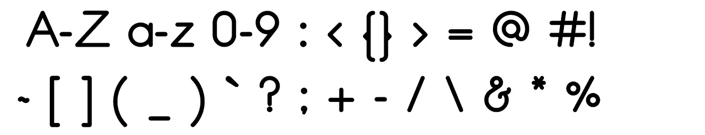
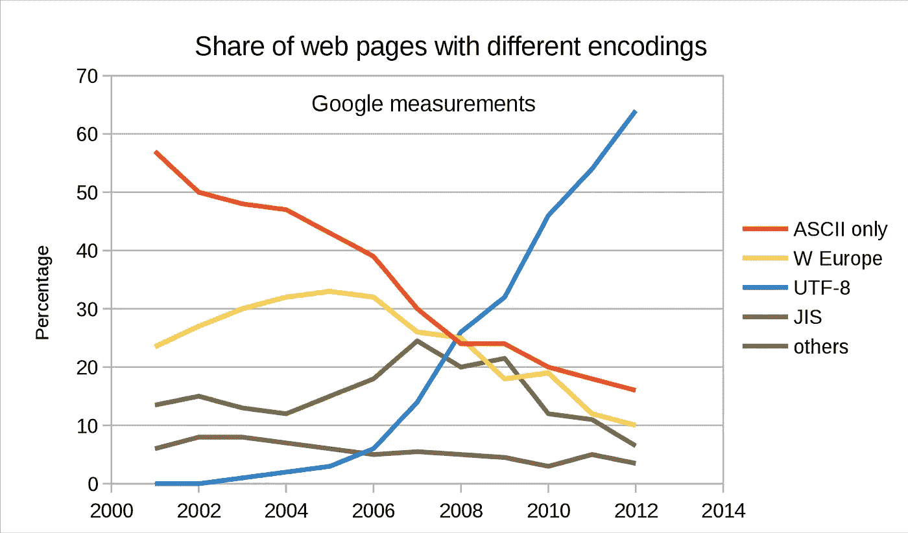

# UTF:你之所以能读到这个媒介故事👀

> 原文：<https://levelup.gitconnected.com/utf-the-reason-you-can-read-this-medium-story-63bb37f18280>

## 这是每个开发人员都需要知道的最低要求。👨🏽‍💻


UTF——由皮尤什·科赫哈尔创作

# 什么是 Unicode❓

Unicode 是一套表示字符的标准。这只是一个巨大的字符列表，包含国际语言、表情符号、字形等的标准。它甚至包含了尚不存在的角色标准。每个字符由十六进制的“U+xxxx”表示(不要担心，以后会有意义)。有许多编码可用于表示字符，但我们将把范围限制在 ASCII 和 UTF (Unicode 转换格式)编码，如 UTF-8、UTF-16 和 UTF-32。

在我们深入研究 ASCII 和 UTF 之前，让我们先来看看理解这些概念所需的一些术语。

请记住，我们在设备上看到的一切最终都会转化为二进制代码。类似地，使用不同的字符编码将字符编码成二进制。

对字符进行编码和解码的基本过程是，我们将**字节/八位字节**转换为**代码单元**，代码单元转换为**代码点**，代码点再转换为**字符**，反之亦然。让我们来理解这些术语。

## **字节/字/八位字节**


这些是 8 位的集合，如→10010011

## **代码单位**



它是固定大小、固定数量的八位字节的二进制数据。这只是意味着对于每种编码，我们都有一些固定数量的八位字节。以下是一些例子:

对于 UTF-8，1 个代码单元→8 位→1 个八位字节

对于 UTF-16，1 个代码单元→16 位→ 2 个八位字节

对于 UTF-32，1 个代码单元→32 位→ 4 个八位字节

## **代码点**



它是唯一标识给定字符的整数值。根据字符，代码点可以由一个或多个代码单元组成。

例如:对于字符“A”码位→UTF 中的 U+0041-8→11000011 10101001

在上面的例子中，第一个八位字节是一个代码单元，第二个八位字节是另一个代码单元。所以，我们用了 2 个代码单位来表示字符“A”。

**注意:**您可能想知道我们是如何得到代码点值的，为什么是这些特定的值。老实说，这没什么逻辑可言。代码点只是一个抽象的概念，它描述了我们人类希望如何表示每个字符，以便让计算机理解。这就是全部了。

## **字符集**

要表示的字符列表。

## **编码**

它是将字符转换成字节的过程。点击了解更多关于编码的信息。

## **代码页**

它是字符集和编码的结合。

# 美国信息交换标准代码



它不是一种编码。这是一个代码页，即类似 UTF 的字符集，但字符有限。你问几个人物？才 128。足够的英语语言字符(a-z 和 A-Z)，数字(0-9)和一些控制字符，如退格等。正如我们所看到的，这个字符集甚至没有考虑我们使用的数千种其他语言。但是这个字符集是 Unicode 的基础，Unicode 是一个比 ASCII 优越得多的字符集。Unicode 也是 ASCII 的超集。这意味着 Unicode 的前 128 个字符与 ASCII 匹配。这里有一些有趣的东西。如果我们突然改变说英语的人的字符集，他们甚至不会注意到任何变化，但世界上其他人将不得不改变他们的字符编码。事情就是这样！当我们从 ASCII 转换到 Unicode 时，说英语的人没有注意到，但是其他国家(尽管花了一些时间)必须将他们的字符编码成 Unicode。随着互联网的发展，信息传递变得更加迅速，我们需要每个人都遵循相同的字符编码，这样每个人都能收到想要的信息。

# UTF

它代表“ **Unicode 转换格式**”这是一个总括术语，指不同类型的字符编码。我们有 UTF-7、UTF-8、UTF-16 和 UTF-32。末尾的数字表示代表每个字符所需的位数。此外，我们将只讨论 UTF-32、UTF-16 和 UTF-8，因为它们更常见。

# UTF-32

如上所述，具有 UTF 的数字表示代表一个字符所需的位数。这里是 32，这意味着每个代码点有一个 32 位的字。如此大的空间足以代表地球上任何已知的字符/符号。很迷人，不是吗？虽然一切都可以用 UTF-32 表示，但这并不意味着我们应该这样做。这是因为表示每个字符需要很大的空间，即 32 位，这是很浪费的。例如，字母 8 可以仅用 8 位来表示。我们不需要 32 位。这就是它没有被广泛使用的原因。您可能还会看到 UTF-32 被称为 USC-4(通用字符集-4)。关于原因，我们不会涉及太多细节。但简短的回答是，该标准最初被命名为 USC-4，UTF-32 只是它的一个子集，但经过多年的修订，它们基本上被认为是相同的。

# UTF-16

用 16 位来表示一个字符，即每个代码单元是 16 位。每个码点可以有一到两个码单元。与 UTF-32 不同，在 UTF-32 中，我们只有一个代码单元来表示一切，而 UTF-16 可能需要一个或两个代码单元，这取决于字符。

它有以下代码单元:

## →单个 16 位代码单元

这些字符只需要一个 16 位代码单元来表示一个字符。代码点 U+0000 到 U+DTFF 和 U+E000 到 U+FFFF 由单个代码单元表示，在这种情况下它等于代码点。我们很快就会调查此事，请耐心等待！😬

## →两个 16 位代码单元

为了用 2 个代码单元表示一个字符，我们需要**代理**。

代理是两个代码单元的序列，它们一起形成单个代码点。这些是代码单元的前 6 位。这些有两种类型:

*   **高代** →这些都在 U+D800 到 U+D8FF 的范围内。分别表示如下:
    11011**0**xxxxxxxxxxxxxxx
*   低代理人 →这些在 U+DC00 到 U+DCFF 的范围内。分别表示如下:
    11011**1**xxxxxxxxxxxx

仔细看，高代理的第 6 位是 0，低代理的第 6 位是 1。

让我们看看第一个使用 UTF-16 的例子。

我们如何得到这些任意的代码点值 U+xxxx？作为开发人员，我们给每个字符一个特定的十六进制代码，然后我们使用下面的过程来获得代码点值。

```
+-----------+-----------+----------------+
| Character | Hex Code  | Character Name |
+-----------+-----------+----------------+
|     💩    | D83D DCA9 |   PILE OF POO  |
+-----------+-----------+----------------+
```

步骤 1:将十六进制转换为二进制

→ 110110000011110 1101110010101001

第二步:获得高低代理人

**→110110**000011110**110111**0010101001

第三步:放弃代理人

→ 000011110 0010101001

第四步:组合代理人

→ 0000111100010101001

步骤 5:将二进制转换回十六进制

→ F4A9

第六步:添加 0x10000

**注意**:由两个代码单元组成的字符总是在 10000 以上。因此，我们将它加到十六进制中，以获得正确的码位值。

F4A9 + 0x10000 → 1F4A9。

因此，码位= **U+1F4A9**

现在，如果我们看到一些东西，我们将从两个 16 位代码单元中丢弃两个 6 位代理。这样我们就剩下 32–12 = > 20 位了。这意味着 2 ⁰是可以用 UTF-16 表示的最高代码位。

## UTF-16 用在哪里？

它被 JavaScript、Java、纯文本文字处理器和一些其他应用程序使用。

那么，我们完成 UTF-16 了吗？还没有，我们只需要担心一件非常小的事情，那就是**大端(BE)** 和**小端(LE)** 。

很简单。

**大端(BE)** →当高位代理人在前，低位代理人在后。

**小端(了)** →低代在前，高代在后。

为什么我们需要这个“*”？嗯，因为开发者对如何处理他们的数据有自己的看法。一些人选择了 big(仍然是最常见的),其他人选择了 little endian。*

*回到我们的💩举例！*

***UTF-16BE**→D8**3D**DC**A9***

***UTF-16LE**→**3D**D8**A9**DC*

*Amiga 6800 和 TCP(通过互联网发送数据)使用 Big Endian。*

*x86 计算机体系结构使用 Little Endian。*

*因此，您应该知道您要将数据传输到哪台机器，以及该机器使用什么编码。*

# *UTF-8*

*在 UTF-8 中，代码单元是八位字节，即 8 比特。与 UTF-16 不同，在 UTF-16 中，我们用一个或两个代码点来表示一个字符，在 UTF-8 中，一个字符可以用每个代码点一到四个代码单元来表示。*

*它也与 ASCII 兼容。如果数据流被破坏或者丢失了一个字节，我们也可以恢复 UTF-8 编码的数据，这在 UTF-16 和 UTF-32 中是不可能的。*

*UTF-8 有 3 种类型的代码单元:*

## *→单个 8 位代码单元*

*这里，一个字符由一个字节表示。*

*示例:*

```
*+-----------+------------+-----+------------------------+
| Character | Code-point | hex | Name                   |
+-----------+------------+-----+------------------------+
|     A     |   U+0041   |  41 | LATIN CAPITAL LETTER A |
+-----------+------------+-----+------------------------++----------+-----+----------+------------------------+
| Encoding | Hex | Binary   | Name                   |
+----------+-----+----------+------------------------+
|   UTF-8  |  41 | 01000001 | LATIN CAPITAL LETTER A |
+----------+-----+----------+------------------------+*
```

## *→N 的第一个代码单元(N = 2，3，4)*

## *→非第一代码单元*

*第一代码单元和非第一代码单元都给出了表示一个字符的八位字节数的信息。*

*让我们举个例子来更好地理解它。*

```
*+-----------+------------+-------+---------------------------------+
| Character | Code Point | Hex   | Name                            | 
+-----------+------------+-------+----------------------------------
|     é     |   U+00E9   | C3 A9 | LATIN SMALL LETTER E WITH ACUTE | 
+-----------+------------+-------+---------------------------------+*
```

*UTF-8 = >**11**000011**10**101001*

*第一个八位字节中 1 的数量表示存在多少个八位字节，非第一个八位字节由*10 xxxxxxxx*表示。剩下的位用来表示字符。*

*将十六进制转换为码位的过程与我们在 UTF-16 中所做的一样，但是在这个特殊的例子中，因为我们有一个码位，所以我们不需要添加 *0x10000* 。*

*步骤 1:将十六进制转换为二进制*

*→**11**000011**10**101001*

*步骤 2:丢弃第一个和非第一个 N 个代码单元。*

*→ 000011 101001*

*步骤 3:合并八位字节*

*→ 000011101001*

*步骤 4:转换回十六进制*

*→ 00E9*

*因此，代码点是 **U+00E9** 。*

*让我们看另一个例子，我们的朋友💩。*

```
*+-----------+------------+-------------+-------------+
| Character | Code Point | Hex         | Name        |
+-----------+------------+-------------+-------------+
|     💩    |   U+1F4A9  | F0 9F 92 A9 | PILE OF POO |
+-----------+------------+-------------+-------------+*
```

*UTF-8→**1111**0000**10**011111**10**010010**10**101001*

*在上面的例子中，我们第一个代码单元有 4 个 1。因此，我们有 4 个八位字节，对于每个非第一个八位字节，它由 10 后跟字符位来表示。

当我们按照步骤从十六进制中获取码位时，我们得到。
000011111010010101001→**0F49A**。
现在，由于它使用 2 个以上的代码点来表示这个字符，我们像在 UTF-16 中一样添加 0x10000 来获得值:
0F49A+0x 10000 = 1F49A→**U+1F49A***

## *为什么使用 UTF-8？*

*UTF-8 正在成为各地默认的字符编码系统(像万维网和 Linux/UNIX)。它可以使用可变代码单元表示所有已知可用的字符，从而提高效率。它还消除了服务器端逻辑为提供的每个页面或每个输入表单提交单独确定字符编码的需要。*

**

*上图向我们展示了 UTF 八号协议的日益普及*

# *JavaScript 和 Unicode*

*不要把字符串看作是字符的集合，而要把它们看作是代码单元值的集合。需要注意的一点是，我们不能仅仅从一个字符串中确定代表一个代码点的代码单元。*

*例如:*

```
*console.log(‘trés’);        //=> ‘trés’`console.log(‘tre\u0301s’) //=> ‘trés’*
```

*在这里，*' tre \u s '*和' *tre\u0301s'* 都被呈现为相同的字符序列，但是具有不同的代码单元。*

*要在 JavaScript 中呈现 Unicode，我们有以下选项:*

***十六进制转义序列***

*要表示一个 Unicode 字符，我们只需使用格式:\x <hex>，其中\x 是一个前缀，后跟一个固定长度为 2 位数的十六进制数<hex>。它的范围有限:从 U+00 到 U+FF</hex></hex>*

*例子*

```
*const js = ‘\x4a\x41\x56\x41\x53\x43\x52\x49\x50\x54’console.log(js,js.length,‘JAVASCRIPT’===js) //=> JAVASCRIPT 10 true*
```

*为了表示字符串' *JAVASCRIPT* '，我们可以将十六进制序列组合在一起。此外，转义序列等同于只用普通字符编写的文本。这是因为这些普通字符最终被解码得到正确的二进制序列，因此它们是匹配的。*

## ***Unicode 转义序列***

*为了表示一个 Unicode 字符，我们只需使用格式:\u <hex>。其中<hex>的固定长度为 4。它只有从 U+0000 到 U+FFFF 的有限范围。</hex></hex>*

*像在*例子中一样，我们使用 Unicode 转义序列来呈现字符。**

*另一个例子*

```
*const poo = ‘\uD83D\uDCA9’;console.log(poo);         // => ‘💩’console.log(poo.length); // => 2*
```

*我们的便便表情符号的长度是 2，因为它由 2 个代码单元表示。**(记得我们计算过 UTF-16 段的码位！)***

*现在，当我们试图删除由 2-4 个代码单元表示的字符时，事情开始变得奇怪了。*

```
*console.log(‘🧑🏾’);console.log(‘🧑🏾’.length); // => 4console.log(‘🧑’)console.log(‘🧑’.length) // => 2*
```

*在第 2 行，我们有一个成年黑皮肤表情符号人，他的长度等于 4，因为它由 4 个代码单元表示。为什么？这是因为这个表情符号包含两条信息:表情符号本身和颜色信息。更具体地说，它是“**成人**角色和“**表情符号修饰符 FITZPATRICK TYPE-6** 角色”的组合。*

*现在，将第 1 行复制并粘贴到第 3 行，并尝试使用 backspace/delete 删除该字符。我们会看到这个角色没有被删除，而是变成了更浅肤色的表情符号。这是因为我们删除了由 2 个代码单元表示的颜色信息。因此，我们只剩下一个长度为 2 的普通表情符号。*

## ***码位转义序列***

*它类似于 Unicode 转义序列，但<hex>的可变长度为 1-6。它可以表示 U+0000 到 U+10FFFF 之间的字符。其格式为:\u{ <hex>}</hex></hex>*

*示例:*

*🧑的代码是 U+1F9D1。*

```
*console.log(‘\u{1F9D1}’) //=> ‘🧑’*
```

## *标准化长度*

*规范化字符串会返回序列中正确的字符数。我们为什么需要它？因为直到现在，我们都是基于代码单元来计算长度的。*

*问题来了。*

```
*console.log(‘tre\u0301s’.length); //=> 5*
```

*我们得到 5 是因为‘e’与另一个锐字符组合在一起。这些有不同的代码点。因此，当我们为每个字符{t:1}、{r:1}、{e:1}、{**:1 }、{s:1}添加 1 个码位时，我们得到 5 个码位。***

*如果我们想将重音视为字符的一部分，我们使用 normalize()。*

```
*console.log(‘tre\u0301s’.normalize().length); // => 4*
```

*但是这种标准化有其局限性。它不能处理一个以上的组合字符。*

```
*const str = ‘tre\u0327\u0301s’console.log(str);                    //=> trȩ́sconsole.log(str.length);             //=> 6console.log(str.normalize().length); // => 5*
```

*这里规范化的值应该是 4，但是由于 normalize()的工作方式，我们得到了 5。*

*因此，在计算其他国际语言的带重音的字符长度时要小心。*

# ***HTML 和 Unicode***

*在我们的 HTML 文档中，我们写。*

```
*<head>
  <meta charset="UTF-8">
</head>*
```

*这意味着该网页将呈现任何可以用 Unicode 表示的字符，并将使用 UTF-8 编码来表示它。要了解更多，请看我在 meta [上的故事。](/you-dont-know-meta-a1ee7e381bc1)*

# *包裹*

*字符编码是怪异的，迷人的，有趣的。不同的字符编码将呈现不同的字符。应该根据代码点而不是单个字符来理解字符串。Unicode 和 UTF 是你，我亲爱的读者，能够阅读这篇文章的原因。*

****那都是乡亲们！*🚀***