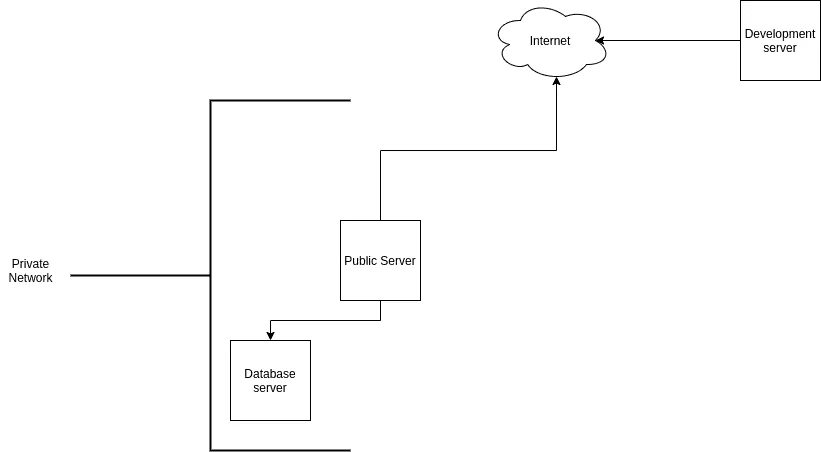

# 利用端口转发访问另一个专用网络中的 MySQL 数据库

> 原文：<https://levelup.gitconnected.com/utilize-port-forwarding-to-access-mysql-database-in-another-private-network-d58d2e4f358c>

## 动手操作您的 Golang 应用程序如何做到这一点

照片由[盖尔·马塞尔](https://unsplash.com/@gaellemarcel?utm_source=medium&utm_medium=referral)在 [Unsplash](https://unsplash.com?utm_source=medium&utm_medium=referral) 上拍摄

有时，您必须开发一个应用程序，在一些专用网络中与数据库进行交互。您的开发服务器不能直接访问数据库(在本例中是 MySQL ),因为它位于另一个私有网络中。要访问它，您必须首先在专用网络中使用公共 IP 访问另一个服务器，然后从那里，您可以远程访问数据库服务器。为了更容易理解，这里是我们讨论的条件的图表。

在这篇文章中，我将演示如何在你的应用中访问数据库。在这种情况下，我将使用 Golang 。这里按部就班地说:

## **做一个 SSH 隧道**

在这种情况下，我们将使用端口转发。命令是

这里的`-L`意味着我们将为这个隧道绑定`local_port`，这里的`3306`是 MySQL 的默认端口。如果你的 MySQL 使用不同的端口，就用那个端口代替`3306`。`database_local_ip`是私有网络中数据库服务器的 IP 地址。**如果 MySQL 在公共服务器上，命令是**

想象一下，你在公共 IP 的服务器上运行应用程序。从那个服务器的角度来看数据库服务器 IP 是什么，那就是你如何确定`database_local_ip`。

当您运行这个命令时，**到您的开发服务器**的本地主机中的** `local_port`的所有连接将被定向到私有网络**中的数据库服务器。

**额外提示**当您使用 SSH 成功连接时，运行`ping google.com`，或者 ping 您想要的任何地址，**以保持连接有效**。

## 编写通过本地主机访问数据库的代码

网络端的所有准备工作都完成了，现在我们写代码。使用 Go 玩 MySQL 的主要代码是

将`line 12`改为这个

其中`local_port`与前面 SSH 命令中的`local_port`相同。`username`和`password`是 MySQL 的用户名和密码。因此，当你的应用通过`local_port`、**端口中的本地主机连接时，该连接将通过端口 3306 被定向到**(假设你的 MySQL 使用默认端口)。看起来你试图连接你的本地 MySQL，但事实并非如此。

这就是如何从另一个私有网络访问 MySQL。另一个提示是**如果端口转发失败，那么无论什么查询**，结果查询都将返回 nil。我不会进一步阐述，因为这是题外话，需要比这个话题更多的解释。我们将在另一篇文章中保存关于 Go 和 MySQL 的主题。