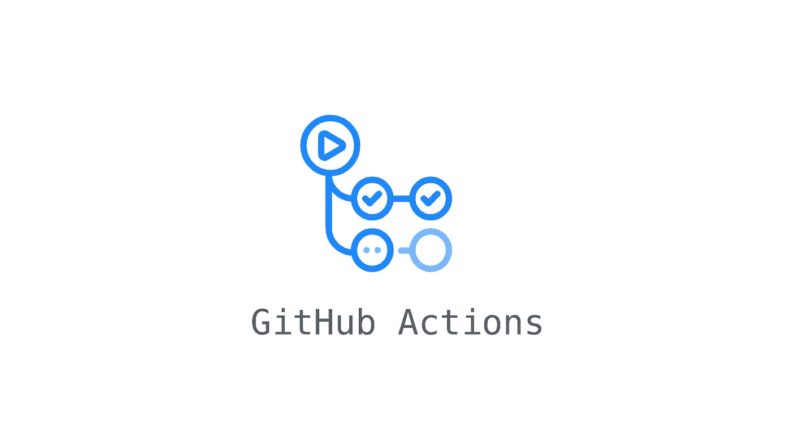
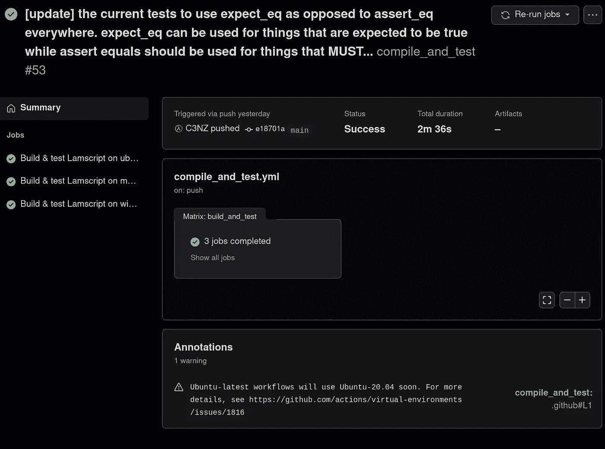
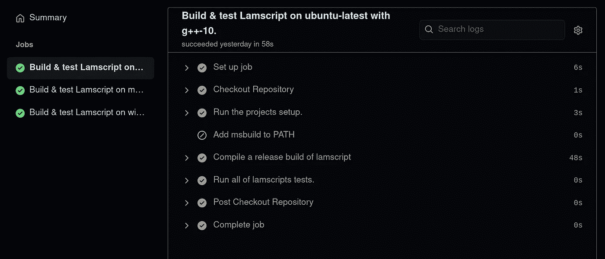
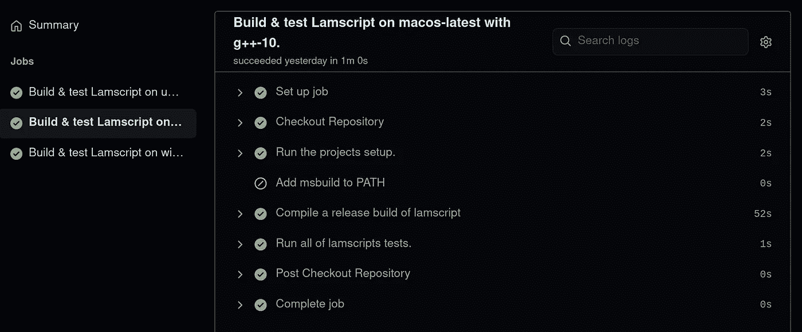
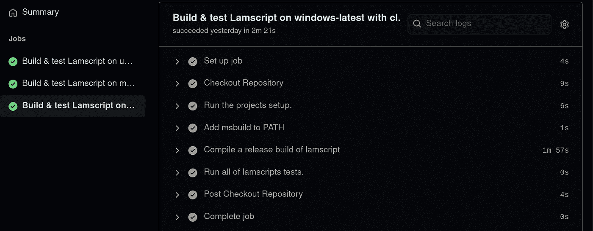

# 利用 GitHub 动作在多个平台上构建和测试您的项目

> 原文：<https://levelup.gitconnected.com/utilizing-github-actions-to-build-and-test-on-multiple-platforms-a7fe3aa6ce2a>

我如何在三个不同的平台上构建和测试一个 C++应用程序。



无论您使用 C、C++、Java、Python 还是*在此插入选择的语言*，有一点是肯定的:为多个平台构建和测试您的项目是困难的。无论您使用哪种语言，每个平台都有细微差别，在不同程度上可能需要对我们编写的代码、我们实现的构建系统或两者都进行更改。在考虑这些问题之前，您首先需要访问所有的目标平台！

对我来说不幸的是，我不得不处理我在从事业余编程项目 [Lamscript](https://github.com/lambda-sh/lamscript) 时列出的所有上述问题。该项目是用 C++编写的，我利用 [CMake](https://cmake.org/) & [Make](https://www.gnu.org/software/make/manual/make.html) 在我基于 Linux 的系统上配置、编译和链接该项目。虽然我创建的构建过程在 Linux 上运行得非常好，但我想将项目扩展到 MacOS 和 Windows 上，使它更容易访问。这时我才知道在另一个平台上构建一个项目是多么令人沮丧和复杂。虽然获得对 MacOS/Windows 操作系统的虚拟访问并不困难，但是开发一种直接从我的代码库到平台上持续构建&测试项目的方法。对我来说幸运的是，我不需要看很远就能发现 [GitHub Actions](https://github.com/features/actions) 及其潜力。

如果你已经或正在使用 GitHub，你很可能听说过 GitHub 的动作。我知道在将它集成到 Lamscript 之前我是这样做的，但是我并没有完全理解它的功能以及它如何对我有用。在通读 GitHub 和其他使用该平台解决与我面临的问题类似的问题的开发人员提供的所有文档时，我觉得没有任何文档能够抓住如何使用 GitHub 操作的要点，而是只关注他们的特定用例。这导致了大量的交叉引用，花费了大量的时间来区分 GitHub 操作的预期和实际行为，并对当前的构建系统进行了大量的更改，以使其可以在 CI 系统中运行，如 GitHub 操作和多个平台。虽然我将使用我创建的 GitHub action config 来演示 GitHub Actions 的一些功能，但我计划展示我在使用该工具方面学到的东西，以及我认为什么使它最有效，而不深入我的项目的细节。事不宜迟，让我向您展示我是如何用不到 100 行配置在多个平台上一致地构建和测试 Lamscript 的。

# 入门指南

为了使用 GitHub 动作，您必须:

1.  拥有 GitHub 帐户
2.  拥有一个项目(公共或私人)

很简单，不是吗？一旦这两个先决条件得到满足，就可以开始用两种不同的方法设置 GitHub 动作。

*   **图形化** —每个项目都有一个 actions 选项卡，允许你创建、更新和管理 GitHub 动作。提供了一些不错的模板，但是我不会讨论这个方法，因为它实际上与通过下一个方法在你的文本编辑器中做的是一样的。
*   **编辑器** —在您的项目根目录中，(您的项目`.git` 文件夹所在的位置)，您可以通过创建文件夹`.github`然后创建嵌套文件夹:`.github/workflows`来开始创建 GitHub 动作。创建了文件夹后，我们现在可以开始创建 yaml 配置文件，这些文件描述了在我们的操作中应该发生的事情。

一个示例文件路径和我在 Lamscript 中使用的路径如下:`.github/workflows/compile_and_test.yml`。但是您可以随意使用您创建的 GitHub 动作的名称。该操作的唯一约束是文件内容由有效的 yaml 组成。

GitHub 动作使用 yaml 来描述你希望 GitHub 执行的动作，给定你围绕该动作设置的约束。虽然我无法在本文中介绍 yaml，但总结它的最简单方法是将它视为使用 JSON 配置和保存设置的替代方法。记住这一点，在分解主要组件之前，让我们先来看看我创建的整个配置。

用于编译和测试我的编程语言 Lamscript 的整个 Github 操作。

根据你对 GitHub 操作的熟悉程度，这可能看起来很可怕，也可能看起来不可怕，但是一旦我们完成了这个配置所描述的内容，它就会变得更有意义。关于配置的整体，最重要的是*只描述了一次构建我们项目的步骤。*

# 定义我们的行动

首先，我们需要给我们的行动起一个名字。

将我们的构建管道命名为“编译和测试”。

每当我们触发 Actions 选项卡时，该名称就会显示在其中。为了触发这个动作，我们需要指定事件的类型和与这些事件相关的数据，这个动作应该监听和响应这些事件。

GitHub 操作的触发器

在我的配置中，我告诉 GitHub 我想让这个动作监听 Lamscript 内部的分支`main`上发生的任何`push`或`pull_request`。`workflow_dispatch` 允许您从 GitHub Actions 标签中触发动作。您可以为您的操作指定尽可能多的分支来响应，但是私有项目被限制为每月 2000 分钟的运行时间。这实际上给了你每月可以运行的有限数量的动作，与动作运行的时间成比例。

> 每月 2000 分钟/每个动作 4 分钟=每月 500 个动作

描述我们操作的最后一条元信息是为设置步骤而隐式设置的默认值

默认情况下，我们的 GitHub 操作作业对任何 shell 命令都使用 bash。

该位设置默认 shell，供`run`命令使用 bash。您可以在这里指定您喜欢的任何 shell，但是 bash 受 Linux、MacOS 甚至 Windows 的 git-bash 支持。

已经编写了 bash 脚本来完成 Linux 的所有设置、构建和测试；GitHub Actions 允许在所有平台上使用 bash，这使我能够在所有平台上使用相同的脚本，而不必(太)担心特定于平台的系统。我不会过多地详细介绍这些脚本，但是如果您对我的构建过程感兴趣，我会在最后提供每个脚本的链接。现在，是时候来布局一下这个动作本身最重要的部分了:`jobs`。

# 作业和步骤

作业是当 GitHub 上的活动触发动作时预期运行的步骤。默认情况下，作业并行运行，但可以设置为依赖于另一个作业的完成，从而允许它们线性运行。

将作业 build_and_test 添加到 GitHub 操作中。

`build_and_test`成为作业的名称，是执行该作业所需的所有信息的映射。下面，我们设置构建的名称以及它运行的平台。

运行时作业 build_and_test 将执行并验证成功的步骤。

`name` —定义作业的名称。这将显示在 GitHub Actions 选项卡中。

`${{ matrix.os }}` —存储在`matrix`中的变量`os`的评估。我们稍后会更详细地讨论这个问题，但是把`matrix`想象成一个存储当前构建信息的地图。`os`是映射的一个属性，它包含运行构建的当前操作系统的名称。

`${{ matrix.compiler }}` —存储在`matrix`中的变量`compiler`的另一次评估。我们稍后还将介绍这是从哪里来的，但它只是用于当前工作的编译器。

`runs-on` —定义运行该构建的平台。我们使用前面提到的`matrix.os`变量来获取我们的构建将在其上运行的当前操作系统。

# 矩阵从何而来？

通过定义一个`strategy`将`matrix`赋予我们的构建。一个`strategy`允许我们通过从我们提供的数据构建所有可能组合的`matrix`来定义多个要运行的作业。这听起来很多，所以让我们来看看 yaml 并解开它。

如何运行作业构建和测试的策略以及每次运行中使用的变量。

`strategy` —允许我们配置当前作业，以利用`matrix`来存储关于我们想要生成的构建类型的信息，并允许他们访问。

`matrix` —存储我们想要用来创建多个工作的信息。

`os` —我们希望为其运行作业的一系列不同的操作系统。

`compiler` —我们希望为其运行作业的一系列编译器。

在我们进一步讨论之前，让我们先来看看矩阵中的这些定义值:

具有两个变量的简单矩阵，每个变量存储一个或多个唯一值的数组。

该矩阵将产生两个总构建，如下所示:

```
# First build
${{ matrix.os }} -> ubuntu-latest
${{ matrix.compiler }} -> g++-10# Second build
${{ matrix.os }} -> macos-latest
${{ matrix.compiler }} -> g++-10
```

理解这一步非常关键。我们的矩阵定义允许我们通过创建我们提供的所有可能的数据组合来生成 2 个不同的作业。为了`include`一个特定的作业或覆盖一个将由`matrix`创建的作业，您只需像前面一样使它成为矩阵的一个属性:

`include`中的前两项覆盖了我们之前的两个构建，提供了一个名为`target`的新数据。`target`是一个属性，我的 bash 脚本将使用它来确定正在编译的操作系统，并运行特定于我的项目的命令。`include`中的最后一项添加了一个新任务，其属性为:

```
# Third build
${{ matrix.os }} -> windows-latest
${{ matrix.compiler }} -> cl
${{ matrix.target }} -> Windows
```

总的来说，我们现在有 3 个不同的作业，它们将利用我们在`matrix`中定义的属性来填充我们的动作属性的元数据，以及每个作业将采取的完成步骤。通过利用`strategy`,我们现在已经在一个要运行的作业定义中定义了 3 个作业，现在我们需要做的就是创建所有这些作业将采取的步骤。

# 走向终点线

最后，是时候定义这个动作要完成的步骤了。如果这些步骤中的任何一个在任何一个构建中失败，那么整个操作都会失败。下面是三个作业中的每个作业在构建 Lamscript 时将执行的所有步骤。

作业构建和测试的所有步骤

`steps`是我们工作的一个属性，作为工作应该执行的线性步骤集。让我们按发生的时间来分解这些步骤:

1.  **结账**

使用预定义的 GitHub 操作步骤的 Checkout 命令。

这将检查运行到我的项目的 git 目录中的当前作业。这允许我运行所有的脚本，就好像您要手动构建它一样。

`uses:actions/checkout@v2` —定义用于当前步骤的动作。GitHub 动作最酷的一点是，你可以在自己的构建管道中使用 GitHub 上的任何动作。这使您能够自动完成原本需要自己完成的任务。

2. **Lamscript 设置**

运行我的项目的安装脚本。

在签入项目目录后，我运行`./scripts/setup.sh`来设置项目，并传入`--within-ci true`来让脚本知道它正在 CI 环境中运行。这仅与 Lamscript 相关，因为我的设置脚本能够设置带有额外依赖项的开发环境，但是在 CI 中不需要它们来验证我们的构建。

`runs` —允许我们在当前任务上运行命令。还记得我们设置默认`shells`为 bash 吗？这保证了所有平台都利用 bash 来执行我们的命令。

3.**为 Windows 配置**

仅当当前操作系统是 windows 时才运行的步骤。

在我们的设置之后，这个下一步是一个*条件步骤*，它仅在`matrix.os`的当前值为`windows-latest`时运行。每个作业都会评估该步骤，但该步骤仅在 windows 作业中运行。这一步在 Linux 或 MacOS 环境中不起作用，但在 Windows 环境中绝对需要。如果条件评估为真，则执行该步骤。如果条件评估为 false，则跳过该步骤并继续作业。

`uses: microsoft/estup-msbuild@v1.0.2` —是微软提供的一个动作，将最新版本的 MSBuild 添加到应用程序路径中。我的脚本使用它在不使用 Visual Studio 的情况下在 Windows 上构建 Lamscript。

4.**编译、链接和生产我们的工件**

使用矩阵提供的值编译 Lamscript 的发布版本。

现在我们的环境已经设置好了，是时候构建我们的项目了。使用绑定到当前作业的属性，我们利用`matrix.compiler`使用哪个编译器，利用`matrix.target`获得期望的平台。同样，这个脚本高度特定于我的项目，可以通过编写自己的脚本或简单地在步骤本身内部编写 bash 来实现。在这一步中发生的最重要的事情是，由于每个作业都有相似的属性和唯一的值，脚本在每个作业上生成一个工作构建。

5.**运行所有测试**

运行 Lamscript 的测试运行程序。

最后，我运行所有的测试来验证一切都正常工作。如果是的话，那么这个任务就完成了，这个构建被验证为正在工作并被测试！如果没有，我想我还有工作要做！

# 结果呢

下面是我刚才带你看的 GitHub 中的动作。



由主分支触发的操作

“总体”菜单显示了在矩阵中运行的所有构建的状态。每个作业彼此并行运行，并允许您查看该作业执行的所有步骤的状态和输出。



用 gcc-10 在 Ubuntu 上构建 Lamscript 的步骤。



用 g++-10 在 MacOS 上构建 Lamscript 的步骤。



用 cl 在 Windows 上构建 Lamscript 的步骤。

经过几天的努力，我终于能够创建一个工作流，让我能够在我打算支持的所有平台上轻松地构建和测试我的代码。我希望这个关于我如何使用 GitHub Actions 的演示能帮助你理解这个平台是什么，以及它如何潜在地应用在你的工作流程中。

# 资源

*   Lamscript —这个项目用来演示 GitHub 动作是如何工作的。
*   [路过岗位截图](https://github.com/lambda-sh/lamscript/actions/runs/432761465)
*   [GitHub 动作](https://github.com/features/actions)
*   [GitHub 动作文档](https://docs.github.com/en/free-pro-team@latest/actions)