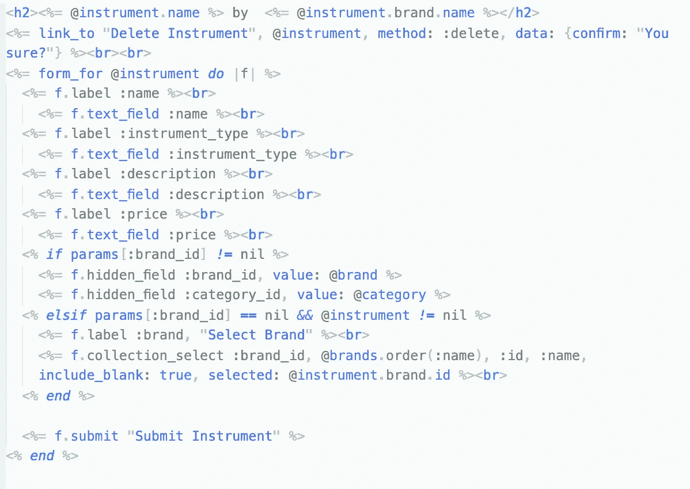
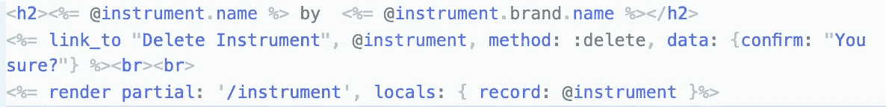
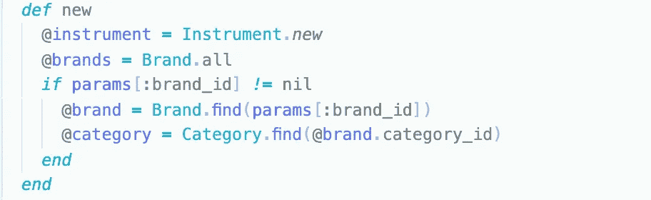
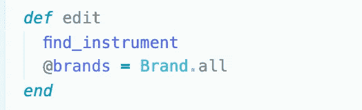
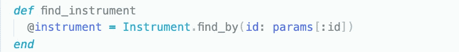

# 在 Rails 应用程序中利用片段

> 原文：<https://levelup.gitconnected.com/utilizing-partials-in-your-rails-application-7a6806cfaaa4>

## 何时、如何以及为什么

在 Rails 中构建一个应用程序是构建一个强大的、全功能的 web 应用程序的最简单的方法之一。最近我的任务就是这样，虽然我不打算详细介绍我的项目和各个部分，但我想分享一些我觉得在我第一次构建 Rails 时非常有用的东西。

web 开发和编程的黄金法则之一就是干(不要重复自己)。在构建我的应用程序时，我发现自己重复了大量相同的代码，特别是用于创建和编辑模型的表单。我知道这是一个我*可以*解决的问题，但是我没有必要的知识来解决。当同样的(字面上的，同样的)被使用的形式可以被用来创建和编辑模型时，我很难理解。经过一些修改并习惯了一点奇怪的语法之后，这个想法变得非常明显而且几乎微不足道。

以我的模型`instrument.`为例

编辑和新建的部分表单

这里没有过多地剖析代码，我只想说明这里有很多乏味的代码。光是 ERB 的标签就给人不好的回忆。更糟糕的是，我的四个模型将会有相似的创造形式。加上`edit`功能所需的表单，我们为应用程序中的每个模型准备了两个几乎相同的表单。如果你问我的话，我觉得不是很干。这是在任何页面的顶部，带有显示数据库中所有仪器的索引。如果不明显的话，这款应用的第一个版本是在浏览器中运行的，但在编辑器端完全是一个重复代码的垃圾桶。这就是偏音能够并且很可能成为救命稻草的地方。

用一个局部为仪表的表格，我的编辑视图当从这个:

`edit view before partial`

对此:

部分后编辑视图

看似消失的代码并没有被删除，只是被移动了。由于 Rails 的魔力，只要部分视图文件在视图目录的根目录下，Rails 就可以毫不费力地找到它。创建局部视图文件非常简单，只需在视图目录的根目录下创建一个文件，文件名放在上面的正斜杠后面，前面加一个下划线。在我的例子中，局部渲染在文件`/app/views/_instrument.html.erb`中。我们就快成功了，但是你可能仍然不确定我们如何在两个不同的动作中使用同一个表单。为了实现这一点，我们只需要确保*控制器*中的实例变量精确到我们所需要的。在我的例子中，`new`方法中的实例变量`@instrument`被设置为`Instrument.new`。然而，在 edit 方法中，调用了一个帮助器方法，该方法基于 params 散列将数据库中的`@instrument`设置为与相应的`id`相等。两个视图将有相同的代码行:`<%= render partial: ‘/instruments’, locals: { record: @instrument }%>`。我选择对两者使用相同的实例变量名，这样两个方法可以使用相同的分部变量，具有相同的实例方法名。但是根据用户到达分部的路径，实例变量将有不同的定义(`@instrument = Instrument.new`与`@instrument = Instrument.find_by(id: params[:id])`)。

仪器#新

仪器#编辑

仪器#查找 _ 仪器

我从中发现的主要好处是，如果我需要添加或删除或更改模型的属性，并且我希望用户能够在创建时指定该属性是什么，或者以后编辑它，我只需在一个地方更改它。这是一个简单的概念，但却常常被认为是理所当然的。当使用完整的 Rails 应用程序时，与应用程序的一个方面相关的不同视图和控制器文件的数量可能会令人望而生畏，减少进行更改所需的行程可以节省时间并确保应用程序的连续性。