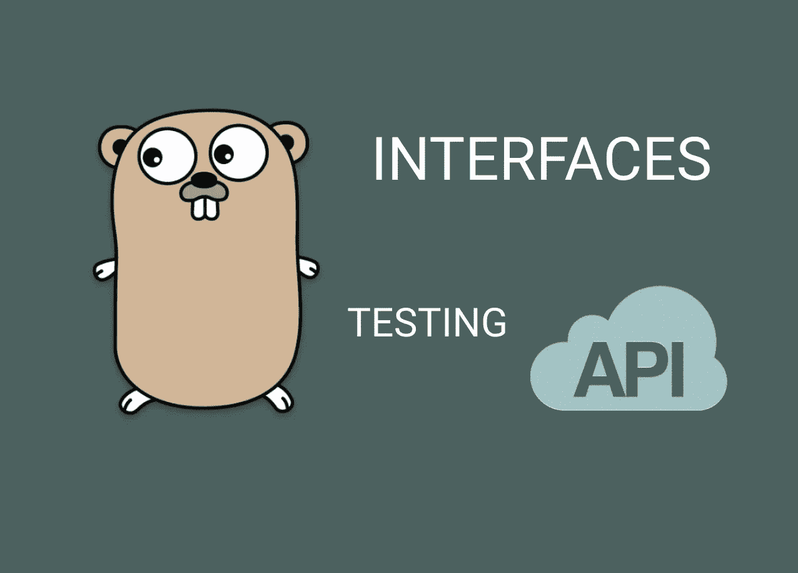
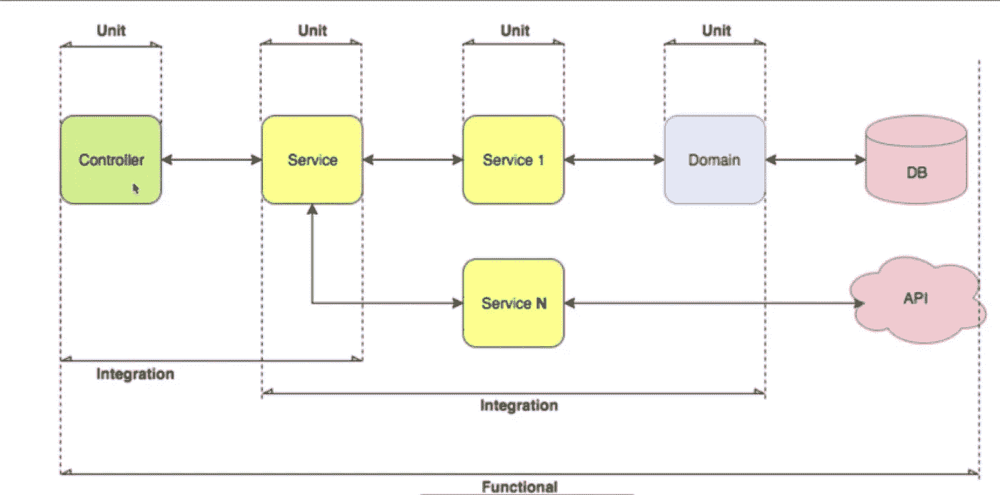
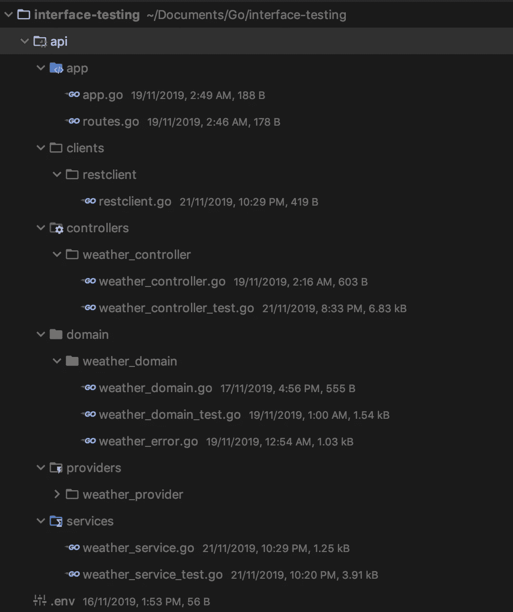

# 在 Golang 中模拟和测试外部 API 时利用接口的力量

> 原文：<https://levelup.gitconnected.com/utilizing-the-power-of-interfaces-when-mocking-and-testing-external-apis-in-golang-1178b0db5a32>



在测试文件中调用实际的外部 API 端点并不是好的做法，尤其是在单元测试中。

以下是一些原因:

*   API 服务器可能已关闭。
*   API 可以有一个速率限制(您可能需要在测试中多次达到这个限制)

测试时，我们最好模仿外部 API。

我们将构建一个调用 [darksky](https://darksky.net/dev) api 的**微服务**。

[Darksky](https://darksky.net/dev) 是一个天气 API。我们将需要输入经度和纬度的位置，以获得基于上述参数的天气细节。

你可以注册 [Darksky](https://darksky.net/dev) API 来获得一个免费的 API 密匙，你可以用它来获取天气数据。

# 我们开始吧

这是我们希望在本文中实现的一个想法:



图片来自费德里科的课程

## 步骤 1:基本设置

**a .创建根目录:**在您的终端中，创建一个名为`interface-testing`的目录

```
mkdir interface-testing
```

初始化 go 模块:对于依赖关系管理，我们需要一个文件来保存我们将使用的所有依赖关系。

在我们的`interface-testing`目录中，初始化 **go 模块:**

```
go mod init interface-testing
```

我们将模型名作为我们的根目录名。你可以随便叫它什么。

在项目根目录下创建`api`目录:

```
mkdir api
```

另外，在根项目目录中创建`main.go`文件:

```
touch main.go
```

您的初始设置应该如下所示:

接口测试├──API├──main . go└──go . mod

## 第二步:客户

我们需要一个能够让我们与 API 对话的客户端。我们将定义一个对 API 执行 **GET 请求**的函数。

在`**api**` **目录**内，创建`clients`目录:

```
cd api && mkdir clients
```

然后在`**clients**`目录中创建`**restclient**`目录:

```
cd clients && mkdir restclient
```

在`**restclient**`目录下创建`**restclient.go**`文件:

```
cd restclient && touch restclient.go
```

文件的内容:

从上面的文件中可以看出，“clientStruct”正在实现 ClientInterface。因此，接口中定义的任何方法，结构也必须定义该方法。接口在测试中简直牛逼；因为它们帮助我们创造假方法。

## 步骤 3:域

此应用程序的范围不需要数据库。但是我们需要定义一个模式，类似于我们将要发送和接收的 API 请求和响应数据。

在`**api**` **目录下，**创建`**domain**` 目录:

```
mkdir domain
```

因为我们正在构建天气 API，所以我们将创建`**weather_domain**`目录:

```
cd domain && mkdir weather_domain
```

**a .天气模式**

要获取某个地方的天气信息，我们需要提供:

*   Darksky 认证密钥
*   这个地方的纬度
*   这个地方的经度

我们将在 GET 请求中提供这些细节，我们将收到来自 API 的带有天气结果的响应。

在`**weather_domain**`目录下，创建`**weather_domain.go**`文件。

```
cd weather_domain && touch weather_domain.go
```

**b .错误模式**

当输入错误的细节时，API 会抛出一个错误。我们将定义一个错误接口，并连接一些我们将在整个应用程序中使用的方法。

在`**weather_domain**`目录下，创建`**weather_error.go**` **文件**

```
touch weather_error.go
```

**c .测试模式**

我们可以测试上面定义的模式。仍然，在`**weather_domain**`目录中，创建`**weather_domain_test.go**`文件。

```
touch weather_domain_test.go
```

您可以使用以下方式运行测试:

```
go test -v
```

`**v**` **标志**为用于详细输出。

您可以使用以下工具运行特定测试:

```
go test -v --run TestWeather
```

## 第四步:供应商

在**客户端**中定义的 **Get** 函数，需要在提供者中调用。

从 **API** 目录中，创建`**providers**`目录

```
mkdir providers
```

然后，在`**providers**`目录中创建`**weather_providers**`目录。

```
cd providers && mkdir weather_providers
```

**a .天气提供者文件:**

在`**weather_provider**`目录中，创建`**weather_provider.go**`文件

```
touch weather_provider.go
```

注意来自 rest 客户端的 **Get** 函数被调用。

**b .气象提供商测试案例**

我们将测试当我们从 restclient 调用 **Get** 函数时会发生什么，包括好的和坏的数据。

在`**weather_provider**`目录下，创建`**weather_provider_test.go**`文件。

```
touch weather_provider_test.go
```

从上面的测试文件中，您可以看到使用接口是如何避免我们碰到实际的 **API 的。**我们模拟请求和响应。这些测试的好处是，你可以在每个测试中访问实际的 URL 提供者，但是这一次，来自 [Darksky](https://darksky.net/dev) 的 **real API key** 仍然得到与我们在模拟中提供的响应相同的结果。在上面的文件中为需要它们的测试用例提供了解释。

## 第五步:服务

让我们连接我们的服务。我们将定义`**GetWeather**` **方法**，该方法将调用我们在提供者中定义的`**GetWeather**` **函数**。

从 **API** 目录中，创建`**services**` **目录**

```
mkdir services
```

**a .气象服务文件:**

然后在`**services**`目录下创建`**weather_service.go**`文件:

```
cd services && touch weather_service.go
```

您可能需要注意上面的文件，因为我们定义了一个接口，我们将使用该接口在测试时创建一个假的`**GetWeather**` **方法**。

我们让`**weatherService**` 结构实现了`**weatherServiceInterface**`。在我们的测试中，我们将定义一个实现相同接口的伪结构。因此，该结构必须具有实现该接口的方法。例如`**GetWeather**`中的**法。这在测试我们的控制器文件时会很有用。**

**b .气象服务测试文件**

我们将需要测试`GetWeather`方法。在`**services**` 目录下，创建`**weather_service_test.go**`文件。我们还将在测试中使用模拟数据。

```
touch weather_service_test.go
```

## 第七步:控制器

创建天气控制器，它将调用我们在服务中定义的`**GetWeather**`方法。

从`**api**`目录中，创建`**controllers**`目录

```
mkdir controllers
```

在`**controllers**`目录中，创建`**weather_controller**`目录。

```
cd controllers && mkdir weather_controller 
```

**a .天气控制器文件**

然后创建`**weather_controller.go**`文件。

```
touch weather_controller.go
```

记住，我们是从 URL 中获取 **api 键**、**纬度、**和**经度**。我们使用 [gin](https://github.com/gin-gonic/gin) 来路由和处理 JSON 响应。

**b .天气控制器测试文件**

还记得我们如何在服务中使用接口吗？我们这样做是为了模仿服务中的`GetWeather`方法。在上面的控制器中，我们调用了那个方法。但是我们不应该在控制器测试中调用真正的方法。因此，我们将定义一个实现`**WeatherErrorInterface**` **的结构。**当我们这样做时，我们必须定义 GetWeather 方法(这次是假的)。请参见下面的测试文件。

在`**weather_controller**`目录下，创建`**weather_controller_test.go**` 文件:

```
touch weather_controller_test.go
```

对于上述所有测试，没有一个真正触及真正的 API。这就是测试外部 API 的方式。

## 步骤 8:运行应用程序

我们已经准备好运行这个应用程序了。

从`**api**`目录中，创建`**app**` **目录。**

```
mkdir app
```

**a .路由**

在`**app**`目录下创建`**routes.go**` **文件**:

```
cd app && touch routes.go
```

b .申请文件

仍然在 app 目录中，创建`**app.go**`文件。该文件将调用路由:

```
touch app.go
```

**c. main.go**

记住，前面我们在项目根目录中创建了`main.go`文件。我们需要调用`app.go`文件中定义的`RunApp`函数。

您的目录结构应该如下所示:



此时运行是安全的:

```
go run main.go
```

您的应用程序应该在端口 8080 上运行。

使用 curl、postman 或导航到您的浏览器并输入测试细节(您的 API 密钥、纬度和经度)。根据提供的数据，你应该得到天气的反应。

您可以再次运行您的测试套件。如果你使用的是 [GoLand](https://www.jetbrains.com/go/) 编辑器，右击`api`目录，你可以选择运行`api`目录下的测试。当您这样做时，您将会观察到所有的**提供者**、**服务、**和**控制器**包都有 100%的覆盖率。

**获取**[**github**](https://github.com/victorsteven/Go-Interfaces-and-API-Testing)**上的代码。**

干杯。