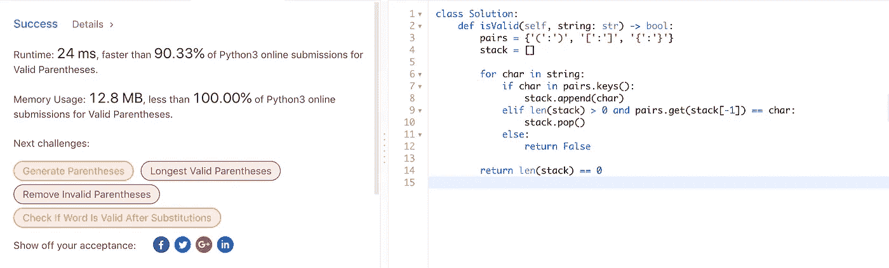

# Python3 中的有效括号面试问题

> 原文：<https://levelup.gitconnected.com/valid-parentheses-interview-problem-in-python3-f98fb99c9cf>


图片来自 [MSCI](https://www.msci.com/www/blog-posts/all-faangs-are-not-created/01065933661)

许多公司已经在面试中使用有效括号问题作为白板编码挑战，以测试候选人的算法写作技能。尽管通常被问到这个问题的面试是在早期，但尽管如此，脸书、谷歌和亚马逊等公司在他们的一些软件工程师面试中都被问到这个问题。

# 问题是:

给定一个仅包含字符`'('`、`')'`、`'{'`、`'}'`、`'['`和`']'`的字符串，确定输入的字符串是否有效。

在以下情况下，输入字符串有效:

1.  左括号必须用相同类型的括号括起来。
2.  左括号必须以正确的顺序结束。

请注意，空字符串也被视为有效。

**例 1:**

```
**Input:** "()"
**Output:** true
```

**例 2**

```
**Input:** "()[]{}"
**Output:** true
```

**例 3:**

```
**Input:** "(]"
**Output:** false
```

**例 4:**

```
**Input:** "([)]"
**Output:** false
```

**例 5:**

```
**Input:** "{[]}"
**Output:** true
```

> 免责声明:如果你真的想在这些方面做得更好，先自己尝试这个问题，然后再回来比较

# 解决方案是:

代码和提交给 LeetCode 的结果在文章的底部，但是首先我想解释一下这个解决方案背后的一些想法。

我在 Python3 中实现了这个解决方案，使用一个基本的键值字典来存储值，使用一个 LIFO 堆栈来跟踪进度。

## 键值字典

我坚信，在进行采访或编码挑战时，键值字典通常是一个很好的工具，因为与常用的数组相比，内存访问非常快。在数组中查找一个项的最坏情况运行时间是 O(n ),而在字典中查找总是 O(1 ),因为查找是直接的。

Python 的键值字典是一个哈希表，但是您可以为键值条目传递一个值，而不是为给定的值条目生成一个哈希键。键必须总是唯一的，而值可以是您想要的任何值。

例如:

```
fruitDict = {'banana': 'yellow', 'apple': 'red', 'lime':'green'}
```

现在，每当您查找该键(即`fruitDict.get(‘lime’)`)时，它将返回该条目的值(*绿色*)。

[更多关于 Python Key Val Dict 的内容可以在这里阅读](https://developers.google.com/edu/python/dict-files)

## 后进先出堆栈

堆栈是一种线性数据结构，它以后进/先出(LIFO) *(例如一堆盘子，最后放置的盘子是下一个要使用的第一个)*或先入/后出(FILO)*(也称为队列，因为有一个等待的人的队列的相关示例。第一个排队的人首先得到服务)*。在堆栈中，一个新元素被添加到一端，一个元素仅从该端移除。

使用堆栈背后的想法是，我可以将括号的“左侧”放在堆栈上，每当我到达“右侧”时，我将从堆栈中取出顶部的“左侧”。

如果从堆栈中取出的“左侧”和字符串中下一个出现的“右侧”彼此匹配，那么算法可以继续，否则字符串无效。

Python3 有效括号

以及由此产生的 LeetCode 分析:



速度的第 10 个百分点和内存使用的第 1 个百分点…还不错

这是最基本的、经常被提及的挑战之一，但仍然是一个巨大的挑战。你想看到我崩溃吗？下面评论一下！

感谢阅读！关于软件开发实践的一些技巧，[查看我的系列文章](https://www.msci.com/www/blog-posts/all-faangs-are-not-created/01065933661)