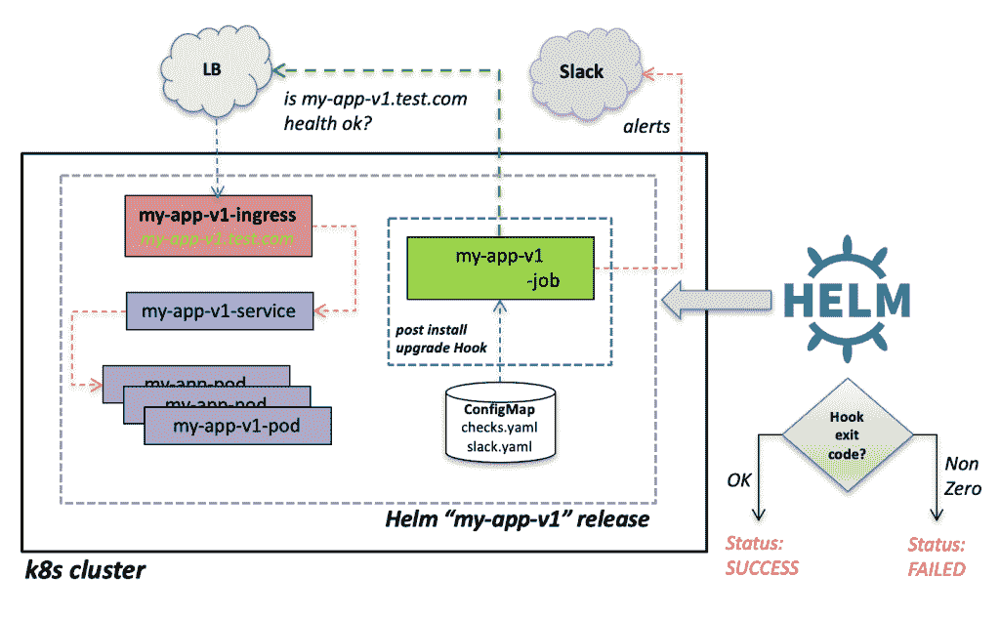

# 通过基于舵钩的健康检查验证海图安装

> 原文：<https://levelup.gitconnected.com/validate-chart-installs-with-helm-hook-based-health-checks-4524d1960b1>

*“使用基于头盔挂钩的健康检查验证海图安装”* …这听起来有点拗口。

在致力于开发一套非常通用的导航图表来部署各种应用程序时，出现了验证图表安装或升级是成功还是失败的特定需求。鉴于这些图表所部署的应用程序都暴露了某种健康检查端点(任何应用程序都应该如此)，我只是希望有一种方法能够自动调用这种检查，并能够在成功/失败(或两者兼有)时发出警报，同时还能够在必要时将 Helm 版本标记为失败。

你可能会问*“为什么不仅仅依靠原生 k8s 活性/就绪检查？”*。这是一个合法的问题，所有部署的应用程序确实都在使用这些…但是这些基本上是在后台持续进行的检查，与任何特定事件都没有关联。我希望有一种方法，能够在很短的时间内，在安装或升级 Helm chart 的过程中，直接、明确地进行特定的检查，并提供额外的元数据(如果需要的话),这些元数据与部署应用程序这一独特的事件相关，并且是特定的。正常的“活性”和“准备就绪”检查不提供这样的上下文。

一种方法是用头盔和 Kubernetes 杠杆[头盔挂钩](https://helm.sh/docs/charts_hooks/)来实现。在开发图表时，您还可以为 Kubernetes 作业提供特殊的注释，将它标识为一个 Helm Hook。作业的结果(即成功或失败，其退出代码为 1 或 0)标记 Helm，将释放视为失败(如果非零)。

我认为这是在部署后验证应用程序的一个很好的方法，但是我也希望能够在这种状态下发出警报。因此..我最后写了[kubernetes-helm-health check-hook](https://github.com/bitsofinfo/kubernetes-helm-healthcheck-hook)

这个工具是一个简单的应用程序，你可以将它作为 Kubernetes 的一项工作，如上所述，作为`post-upgrade`或`post-install`的舵钩。它可以根据您想要执行的每个端点的检查数量进行定制，并且能够发送一个或多个警报，每个警报都可以通过 Jinja2 模板进行完全定制。

我希望其他人也觉得它有用。完整的源代码和文档可从以下网址获得:[https://github . com/bitsofinfo/kubernetes-helm-health check-hook](https://github.com/bitsofinfo/kubernetes-helm-healthcheck-hook)

*原载于 2019 年 5 月 28 日*[*【http://bitsofinfo.wordpress.com】*](https://bitsofinfo.wordpress.com/2019/05/28/kubernetes-helm-hook-health-check/)*。*