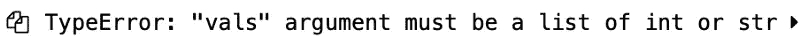
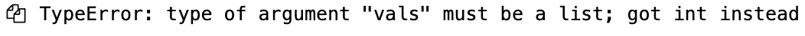
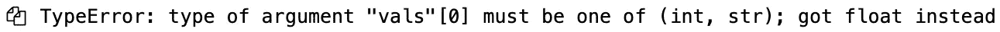
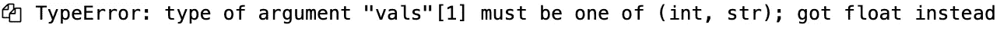

# 在 Python 函数中验证用户输入

> 原文：<https://levelup.gitconnected.com/validate-user-input-in-python-function-d3c1776e9e52>

## 为函数参数编写类型提示是一个好的开始，但是顾名思义，它只提示参数的数据类型。当代码的功能依赖于参数的数据类型时，我们必须进行验证。

# 介绍

类型提示很棒，它们帮助你写出更好的代码，减少外部用户或下游软件开发人员所需的文档。但是，类型提示不会验证用户的输入。在我看来，没有任何验证，你在玩赔率，但如果你是一个赌博，那么祝你好运！对于非赌徒，我们将通过一个例子来探索如何做到这一点。


是否验证类型提示

# 密码

让我们编写一个简单的函数(`add`)，它只有一个参数`vals`。该功能的逻辑是:

*   验证`vals`参数的输入是`int`或`string`的`List`。
*   根据用户输入返回加 1 后的列表`integer`或参数`vals`后附加句点的列表`string`。

您可以用一个简单的`isinstance`函数来验证用户输入。上面的代码可以工作，但是由于以下原因它是不可伸缩的:

1.  必须为函数的每个参数编写验证。
2.  当函数参数被修改时，可能需要很大的努力来重写。
3.  不要忘记类型验证所需的测试用例。

**测试**

*阳性:*

阳性测试案例

*否定:*

```
# Test Function add for int
add(1)# Test Function add for list of float
add([1.0])# Test Function add for list of mixed data types
add([1, 1.0])
```



负面测试用例的错误消息

# 更好的方法

Python 的类型提示和 [type_extensions](https://github.com/python/typing/tree/master/typing_extensions) 在最近几次迭代中变化很快，所以我的建议是使用像 [Typeguard](https://pypi.org/project/typeguard/) 这样的外部包，原因如下:

1.  在装饰器的帮助下，帮助抽象出用于类型验证的代码。
2.  提供额外的功能(远远超过我们编写或需要的)。
3.  已经测试了对多个 Python 版本的支持。
4.  错误信息详细且易于理解。

为了复制上面的例子，我们只需在函数定义之前添加`typechecked`装饰器，并删除类型检查的验证。

**阴性测试:**

```
# Test Function add_ext for int
add_ext(1)
```



负测试用例的错误消息— Int

```
# Test Function add_ext for list of float
add_ext([1.])
```



负测试用例的错误消息—浮点型

```
# Test Function add_ext for list of mixed data types
add_ext([1, 1.0])
```



阴性测试用例的错误消息—混合列表数据

# 外卖食品

如果你正在做一些严肃的事情，那么不要忘记验证用户的输入。

# 进一步阅读

[20 种更好的 Python 代码类型提示技术和工具](https://betterprogramming.pub/twenty-type-hinting-techniques-and-tools-for-better-python-code-e877e0b0c679)