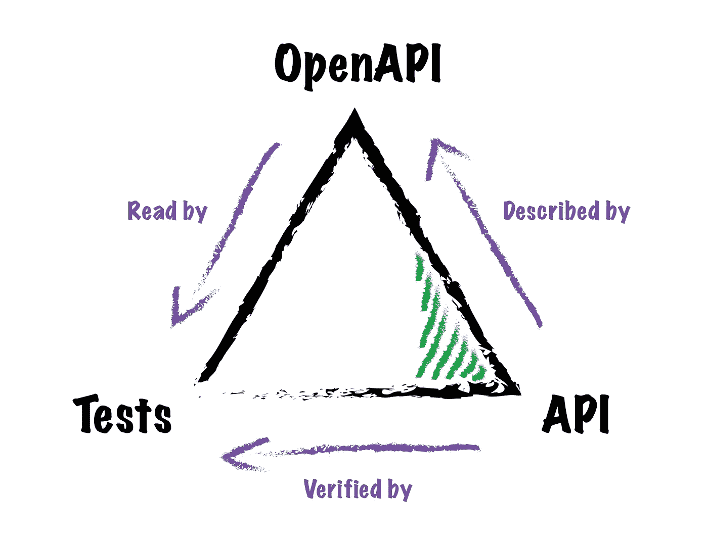

# 对照 OpenAPI 定义验证您的 PHP API 测试——一个 Laravel 示例

> 原文：<https://levelup.gitconnected.com/validate-your-php-api-tests-against-openapi-definitions-a-laravel-example-24dca3419151>

OpenAPI 定义非常适合生成漂亮的文档，但是我们可以用它们做更多的事情


我为这个蒙太奇感到骄傲吗？你打赌我是(作者

[OpenAPI](https://swagger.io/specification/) 是一个旨在用 JSON 和 YAML 描述 RESTful APIs 的规范，目的是让人类和机器都能理解。

OpenAPI 定义是与语言无关的，可以以多种不同的方式使用:

> *open API 定义可以被文档生成工具用来显示 API，代码生成工具用来生成各种编程语言的服务器和客户端，测试工具，以及许多其他用例。*

-[open API 规范](https://swagger.io/specification/)

在本文中，我们将看到如何使用[open API http foundation Testing](https://github.com/osteel/openapi-httpfoundation-testing)包，将 OpenAPI 3.0.x 定义与集成测试结合起来，以验证 API 是否按照预期的方式运行。

我们将在一个全新的 [Laravel](https://laravel.com/) 安装中这样做，为此我们还将使用 [L5 Swagger](https://github.com/DarkaOnLine/L5-Swagger) 包生成一个 [Swagger UI](https://swagger.io/tools/swagger-ui/) 文档。

我将首先进一步阐述为什么这是有用的，但是如果你只是为了代码，欢迎你直接跳到 *A Laravel 示例*部分。

# 问题

API 现在相当普遍，如果我们幸运的话，它们会附带某种形式的文档，帮助我们找到绕过端点的方法。这些文档有多种形式和风格(有些比其他的更好吃)，但是它们有一个共同点，那就是每当它们描述的 API 发生变化时，它们都需要更新。

对于许多开发人员来说，维护一个 API 的文档感觉像是他们已经通过了考试的额外作业；这很无聊，有时很乏味，而且往往没有回报。一些策略会有所帮助，比如使用注释将代码和文档放在一个地方；但是写起来还是很烦人，即使是最有意愿的开发人员也不能避免不被同事发现的疏忽。

通常的结果是，无论如何，文档和 API 变得不同步，导致消费者困惑。

API 维护的另一个方面是确保没有端点停止正常工作；回归最终会被引入，如果没有合适的测试策略，它们可能会暂时被忽视。

避免这种情况的一种方法是实现集成测试，该测试将自动检查 API 的行为是否正确，以及最近引入的更改是否有意想不到的后果。这很好，但是仍然不能保证集成测试中设置的期望与文档中推断的完全相同。

如果有一种方法可以确保它们完美地相互反映就好了…

# 一个解决方案

我们现在假设我们已经得到了一个 API 文档和一些集成测试，我们希望以某种方式符合他们的期望。

随着时间的推移，OpenAPI 规范已经成为描述 API 的流行选择，但我们是否使用它并不能改变相应定义需要维护的事实；换句话说，使用 OpenAPI 不会自动消除上述问题。

然而，使 OpenAPI 与众不同的是，它被用作越来越多的工具[的基础层，这些工具](https://openapi.tools)使该规范的用途远远超出了简单的文档方面。

这些为 PHP 生态系统构建并由 PHP 联盟[维护的工具之一是](https://thephpleague.com) [OpenAPI PSR-7 消息验证器](https://github.com/thephpleague/openapi-psr7-validator)，这是一个用于验证 HTTP 请求和响应的包，实现了针对 OpenAPI 定义的 [PSR-7](https://www.php-fig.org/psr/psr-7) 标准。

这个想法本质上是获取 HTTP 请求和响应，并确保它们与 OpenAPI 定义中描述的操作之一相匹配。

你能看出这是怎么回事吗？

我们基本上可以使用这个包在我们的集成测试之上添加一个额外的层，它将获取测试中获得的 API 响应，并确保它们与描述我们的 API 的 OpenAPI 定义相匹配。如果他们不这样做，测试就会失败。

这是它看起来像一个奇特的图表:



由[作者](https://github.com/osteel)

OpenAPI 定义描述了 API，测试使用 OpenAPI 定义来确保 API 实际上按照定义所说的方式运行。

突然间，我们的 OpenAPI 定义成为了我们代码和测试的参考，从而成为了 API 唯一的事实来源。

# PSR 七号

您可能已经注意到上一节中的一个小细节:OpenAPI PSR-7 消息验证器包只适用于——它的名字是— [PSR-7](https://www.php-fig.org/psr/psr-7) 消息。这里的问题是，并不是所有的框架都支持这个现成的标准；事实上，他们中的很多人在幕后使用 [Symfony 的 HttpFoundation 组件](https://symfony.com/components/HttpFoundation)，其请求和响应默认不实现该标准。

Symfony 的人已经把我们包括在内了，因为他们已经开发了[桥](https://symfony.com/doc/current/components/psr7.html)把 HttpFoundation 对象转换成 PSR-7 对象，只要给 PSR-7 和 [PSR-17](https://www.php-fig.org/psr/psr-17) 工厂这么做，他们建议使用[托拜厄斯·尼霍姆](https://github.com/Nyholm)的 [PSR-7 实现](https://github.com/Nyholm/psr7)。

所有这些组成了一个拼图游戏，OpenAPI HttpFoundation 测试包为我们提供了这个拼图游戏，允许开发人员在利用 HttpFoundation 组件的项目中使用 OpenAPI 定义来支持他们的集成测试。

让我们看看如何在 Laravel 项目中使用它，它属于这一类。

# 一个典型的例子

本节包含的代码也可以作为 [GitHub 库](https://github.com/osteel/openapi-httpfoundation-testing-laravel-example/)获得。

首先，让我们使用 Composer 创建一个新的 Laravel 8 项目:

```
$ composer create-project --prefer-dist laravel/laravel openapi-example "8.*"
```

进入项目的根文件夹并安装几个依赖项:

```
$ cd openapi-example
$ composer require --dev osteel/openapi-httpfoundation-testing
$ composer require darkaonline/l5-swagger
```

第一个是前面提到的[open API http foundation Testing](https://github.com/osteel/openapi-httpfoundation-testing)包，我们将其作为开发依赖项安装，因为它旨在用作我们测试套件的一部分。

第二个是 [L5 Swagger](https://github.com/DarkaOnLine/L5-Swagger) ，一个将 [Swagger PHP](https://github.com/zircote/swagger-php) 和 [Swagger UI](https://swagger.io/tools/swagger-ui/) 带到 Laravel 的热门包。这里我们实际上不需要 Swagger PHP，因为它使用教条注释来生成 OpenAPI 定义，我们将手动编写自己的定义。然而，我们确实需要 Swagger UI，并且软件包方便地对它进行了修改，以便与 Laravel 一起工作。

为了确保 Swagger PHP 不会覆盖 OpenAPI 定义，让我们在项目根目录下的`.env`文件中设置以下环境变量:

```
L5_SWAGGER_GENERATE_ALWAYS=false
```

在`storage/api-docs`文件夹(您需要创建的文件夹)中创建一个名为`api-docs.yaml`的文件，并在其中添加以下内容:

这是一个简单的 OpenAPI 定义，描述了一个操作——一个对`/api/test`端点的`GET`请求，它应该返回一个包含所需的`foo`键的 JSON 对象。

让我们检查 Swagger UI 是否正确显示了我们的 OpenAPI 定义。用这个`artisan`命令启动 PHP 的开发服务器，从项目的根目录运行:

```
$ php artisan serve
```

在浏览器中打开[localhost:8000/API/documentation](http://localhost:8000/api/documentation)，将顶部导航栏中的`api-docs.json`替换为`api-docs.yaml`(这是因为 Swagger UI 加载的是 YAML 定义，而不是 JSON 定义，因为我们没有提供后者)。

点击 *enter* 键或点击*Explore*——我们的 OpenAPI 定义现在应该呈现为一个 Swagger UI 文档:


扩展`/test`端点并进行试验——它应该会失败，并出现`404 Not Found`错误，因为我们还没有实现它。

让我们现在就解决这个问题。打开`routes/api.php`文件，用以下路径替换示例路径:

```
Route::get('/test', function (Request $request) {
    return response()->json(['foo' => 'bar']);
});
```

回到 Swagger UI 选项卡，再次尝试端点——它现在应该返回一个成功的响应。

该写测试了！打开`tests/Feature/ExampleTest.php`并用这个替换它的内容:

让我们打开包装。对于那些不熟悉 Laravel 的人来说，`$this->get()`是由`[MakesHttpRequests](https://github.com/laravel/framework/blob/8.x/src/Illuminate/Foundation/Testing/Concerns/MakesHttpRequests.php)`特征提供的一个测试方法，本质上是在提供的端点上执行一个`GET`请求，在不离开应用程序的情况下执行请求的生命周期。它返回的响应与我们从外部执行相同请求时获得的响应相同。

然后，我们使用`Osteel\OpenApi\Testing\ValidatorBuilder`类创建一个验证器，通过`fromYaml`静态方法将我们之前编写的 YAML 定义提供给这个验证器(`storage_path`函数是一个助手，它返回到`storage`文件夹的路径，我们在那里存储定义)。

如果我们有一个 JSON 定义，我们可以使用`fromJson`方法；此外，这两种方法分别接受 YAML 和 JSON 字符串，以及文件。

构建器返回一个`Osteel\OpenApi\Testing\Validator`的实例，我们对其调用`get`方法，将路径和响应作为参数传递(`$response`在这里是一个`Illuminate\Testing\TestResponse`对象，它是底层 HttpFoundation 对象的包装器，可以通过`baseResponse`公共属性检索)。

以上基本上相当于说:

> *我想验证这个响应符合 OpenAPI 对* `*/test*` *路径上的* `*GET*` *请求的定义。*

也可以这样写:

```
$result = $validator->get($response->baseResponse, '/test');
```

这是因为 validator 对 OpenAPI 支持的每个 HTTP 方法都有一个快捷方法(`GET`、`POST`、`PUT`、`PATCH`、`DELETE`、`HEAD`、`OPTIONS`和`TRACE`)，这样可以更简单地测试相应操作的响应。

注意，指定的路径必须与 OpenAPI 定义的路径[之一](https://swagger.io/specification/#paths-object)完全匹配。

您现在可以运行测试了，应该会成功:

```
$ ./vendor/bin/phpunit tests/Feature
```

再次打开`routes/api.php`,改变这条的路线:

```
Route::get('/test', function (Request $request) {
    return response()->json(['baz' => 'bar']);
});
```

再次运行测试；它现在应该失败了，因为响应包含了`baz`而不是`foo`，而 OpenAPI 定义说应该是后者。

我们的测试是由 OpenAPI 支持的！

为了便于演示，上面的例子显然过于简单，但在实际情况中，一个好的做法是覆盖`MakesHttpRequests` trait 的`[call](https://github.com/laravel/framework/blob/8.x/src/Illuminate/Foundation/Testing/Concerns/MakesHttpRequests.php#L496)`方法，这样它既执行测试请求又执行 OpenAPI 验证。

因此，我们的测试现在只有一行:

```
$this->get('/api/test');
```

这可以作为一个新的`MakesOpenApiRequests`特征来实现，它将“扩展”那个`MakesHttpRequests`特征，并且将首先调用父`call`方法来获得响应。然后，它将计算出来自 URI 的路径，并在返回响应之前根据 OpenAPI 定义验证响应，以便调用测试根据需要执行任何进一步的断言。

# 结论

虽然上述设置在提高 API 的健壮性方面迈出了一大步，但它并不是灵丹妙药；它需要用集成测试覆盖每一个端点，这不容易以自动化的方式执行，并且最终仍然需要开发人员的一些纪律和警惕。起初，对一些人来说，这甚至有点强制的感觉，因为结果是他们基本上被迫维护文档，以便编写成功的测试。

然而，附加的价值是，所述文档现在保证更加准确，从而使消费者高兴，他们将喜欢不太可能不稳定的 API 这反过来会让开发人员不那么沮丧，他们会花更少的时间去寻找讨厌的差异。

总而言之，使 OpenAPI 定义成为 API 文档和集成测试的唯一真实来源，这本身就是一个保持更新的强大动力；它们自然成为优先事项，而以前它们只是事后才想到的。

至于维护这些定义，手动维护确实有点令人生畏。注释是一种解决方案，但我个人不喜欢注释，更喜欢直接维护 YAML 文件。像 VSCode one 这样的 IDE 扩展使它变得更容易，但是如果你不能忍受 YAML 或 JSON 文件，你也可以使用像 T4 stop light Studio 这样的 T2 工具来通过一个更友好的用户界面做到这一点。

既然我们在讨论 Stoplight*，[Phil Sturgeon](https://stoplight.io/blog/api-design-first-vs-code-first/)[撰写的这篇关于 API 设计优先与代码优先的文章](https://twitter.com/philsturgeon)是 API 文档的一个很好的起点，可能会帮助你选择一种适合你的文档方法。

**我与交通信号灯没有任何关系*

# 资源

*   [open API 规范](https://swagger.io/specification/)
*   [open API http foundation 测试包](https://github.com/osteel/openapi-httpfoundation-testing)
*   [Laravel 范例库](https://github.com/osteel/openapi-httpfoundation-testing-laravel-example)
*   [Swagger UI](https://swagger.io/tools/swagger-ui)
*   [L5 Swagger Laravel 包](https://github.com/DarkaOnLine/L5-Swagger)
*   [OpenAPI。工具](https://openapi.tools)
*   [open API PSR-7 消息验证器包](https://github.com/thephpleague/openapi-psr7-validator)
*   [http foundation 组件](https://symfony.com/components/HttpFoundation)
*   [PSR-7: HTTP 消息接口](https://www.php-fig.org/psr/psr-7/)
*   [PSR 7 号大桥](https://symfony.com/doc/current/components/psr7.html)
*   [PSR-7 实施](https://github.com/Nyholm/psr7)
*   [API 设计优先 vs 代码优先](https://stoplight.io/blog/api-design-first-vs-code-first)

*这个故事最初发表于*[*tech . osteel . me*](https://tech.osteel.me/posts/openapi-backed-api-testing-in-php-projects-a-laravel-example)*。*