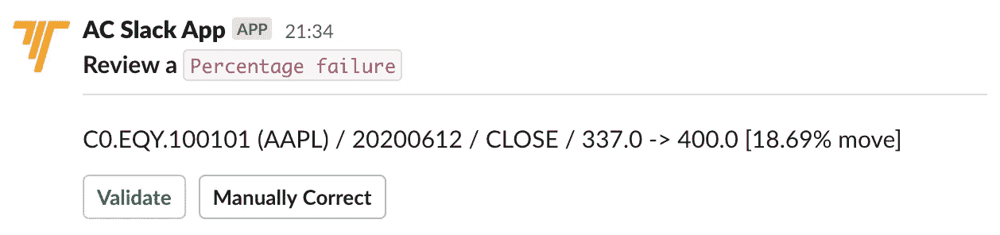
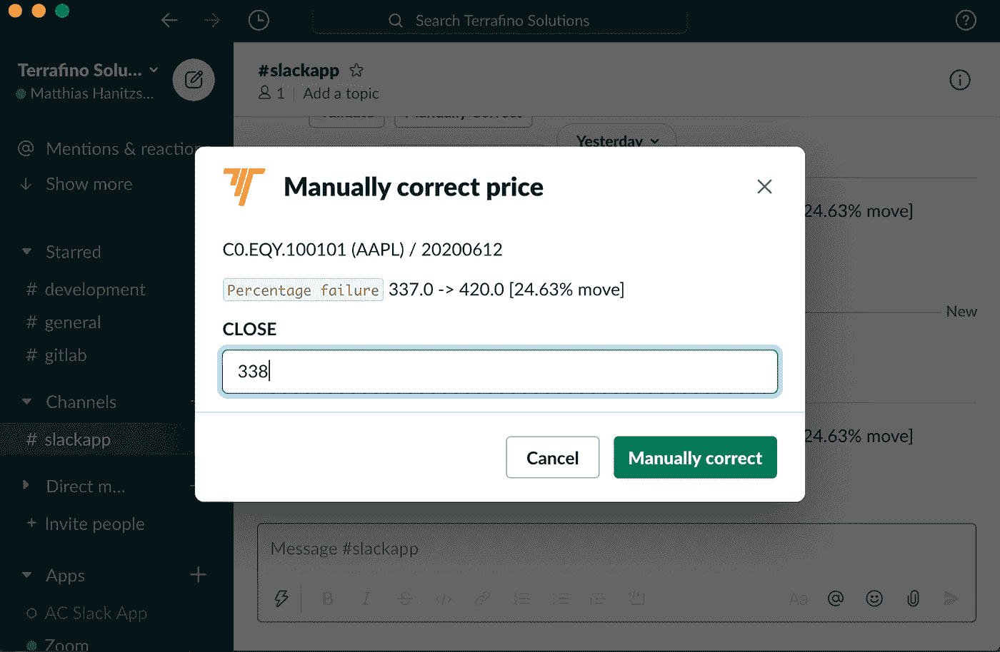
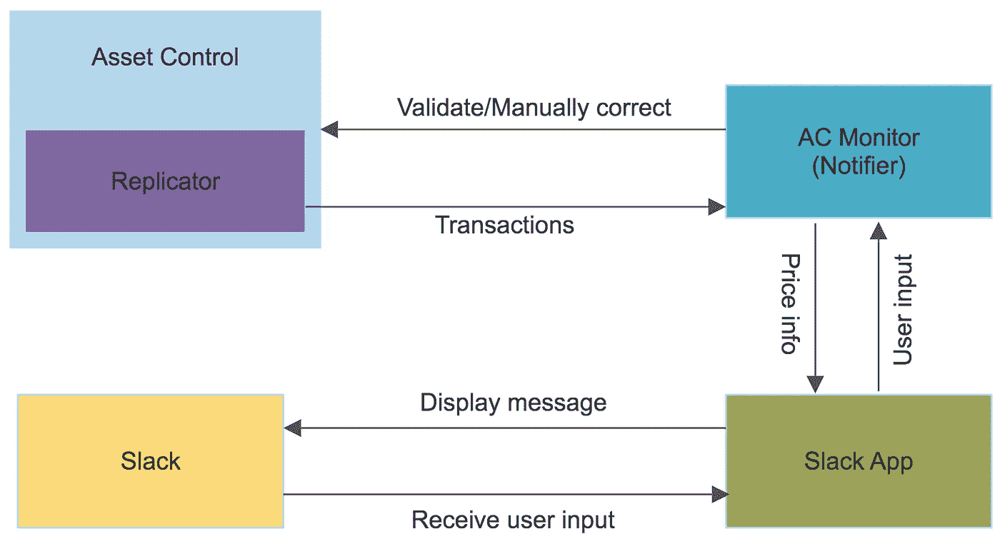

# 验证闲置的可疑股票价格

> 原文：<https://levelup.gitconnected.com/validating-suspect-stock-prices-in-slack-c89ff6b991ca>

在本文中，我将介绍一种解决方案，它可以在可疑数据进入系统时向用户发出警报，并给他们机会采取行动，所有这些都集成到 Slack 中。

# 用例

想象以下场景:股票价格被载入资产控制，并一直传播到 C0 水平。这里配置了一个验证功能，将任何超过 10%的价格变动标记为可疑。在系统将它们发送到下游之前，您需要检查和验证它们。您要么接受价格(验证)，要么自己提供修改后的价格(手动更正)。

如果您熟悉资产控制中的时间序列验证，那么这些都不是新的。这次不同的是，我不再使用资产控制中的异常日志或工作流，而是每当系统中出现新的可疑股票价格时，我都会在 Slack 中得到通知。我将能够从那里验证或手动更正价格。

现在，我明白你可能还不想验证 Slack 中的价格，但我认为这是一个很好的例子，说明了如何将资产控制中的数据流与你组织中的其他系统相集成。Slack 是众所周知的，许多人都有一些使用 Slack 应用程序的经验，能够看到如何使用它，所以请耐心听我说。

# Slack 应用程序

让我们来看看 Slack 应用程序的运行情况:

以下是视频中发生的事情:

*   我在系统中模拟了一个可疑价格，并立即在 Slack 中看到了警报:

*   我选择验证并在资产控制桌面中检查价格。可以看到已经验证过了。
*   然后我再次改变价格，触发了 Slack 中的另一个警报。
*   这次我选择手动更正，将价格调整为 338.0:

*   最后，我可以确认价格已经在资产控制桌面中进行了手动更正。

# 它是如何工作的？

现在，让我们在下图中看看实现这一点所涉及的组件:

*   我需要能够在资产控制中发现可疑价格。
*   实现这一点的一个解决方案是利用资产控制复制器并实现我们自己的通知程序 AC Monitor。
*   AC 监视器将从复制器接收提交给资产控制的任何交易。
*   然后，它将过滤由于百分比失败导致的可疑价格。
*   对于任何此类可疑价格，我们使用 Slack 客户端/应用程序向预定义的 Slack 通道发送消息。
*   然后，用户可以验证或手动更正价格。
*   根据选择，空调显示器将在资产控制中执行相应的操作。

正如你从图表中看到的，我已经谈到了一些你可能熟悉也可能不熟悉的有趣话题。我不会试图在一篇博客文章中涵盖这些内容，而是将此作为后续文章的机会:

*   资产控制复制器
*   如何实现自定义通知程序
*   用 Adetta 测试自定义通知程序
*   第三方集成

现在，我希望你喜欢这篇文章。如果您对其他集成感兴趣，请告诉我们。