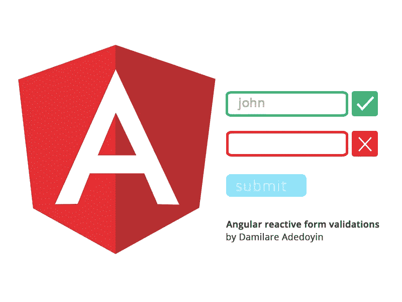

# 角反应形式的验证

> 原文：<https://levelup.gitconnected.com/validations-in-angular-reactive-forms-64b60f6169b0>

在 Angular 上构建表单是很直观的，直到你到达用户输入验证点。如果可以信任用户在每个输入字段中输入正确的值，前端工程师的工作就会容易得多。不幸的是，这并不总是可能的。因此，在入口点验证用户输入的重要性怎么强调都不为过。

# Angular 中的反应形式是什么？

在 Angular 中制作表单的反应式方法是将所有表单验证逻辑传递给 ViewModel。表单字段在 ViewModel 上启动，默认情况下具有双向绑定，因此状态更新是自动完成的。因为验证逻辑是在 ViewModel 上完成的，所以模板变得不那么复杂。

# 在 Angular 中建立用户注册反馈表单

我们将构建一个用于注册用户(客户)的反应式表单。

下面是最终应用程序的链接:[链接](https://angular-reactive-forms-12.stackblitz.io)

让我们开始——照片由 [Serghei Trofimov](https://unsplash.com/@sergeytrofimov?utm_source=medium&utm_medium=referral) 在 [Unsplash](https://unsplash.com?utm_source=medium&utm_medium=referral) 上拍摄

## 将 ReactiveFormsModule 添加到父模块

您可能已经注意到，Angular 中的每个组件都是在父模块中声明的。这确保了声明数组中添加的所有组件都可以访问导入模块中的类。因此，为了在我们的 app 组件中使用反应式表单，我们需要从`@angular/forms`导入`ReactiveFormsModule`，并将其添加到传递给`@NgModule`指令的`imports`数组中。

向 app.modules.ts 添加了 ReactiveFormsModule

## 将 angular/forms 中的表单和验证类导入到组件中

app.component.ts 中导入的表单和验证类

FormBuilder 类通过消除创建`FormGroups, FormArrays or FormControls`实例的需要，使构建复杂和简单的表单变得容易。

`FormGroup`类将所有表单控件(输入)的值和状态合并到一个对象中。基本上，它将表单中所有字段的状态汇总到表单自己的状态中。例如，假设表单组中有 3 个表单控件(输入字段)，如果其中一个输入字段无效，表单的状态也将是无效的。只有当所有表单控件都有效时，表单的状态才有效。

Validator 类提供了一组内置的静态验证函数，表单控件可以使用这些函数。[点击此处查看验证功能列表。](https://angular.io/api/forms/Validators)

## 开发表单组

对于我们的项目，客户需要提供以下个人数据:名、姓、电子邮件和地址。地址数据进一步细分为更小的部分，它们是:第一行，第二行，城市，州，国家。

为了确保完全合规，我们最终会强制要求每个输入，并禁用表单提交，直到客户输入正确的详细信息。目前，该表单开发如下:

启动了 app.component.ts 中的用户表单

userForm 在第一行用 FormGroup 类型初始化。此外，私有类实例属性`fb`被创建并在构造函数的参数中分配给 FormBuilder 类。这将把所有的 FormBuilder 类函数`group(), control(), and array()`传递给类属性`fb.`

FormBuilder 类中的函数`group`通过将 FormControls 的一个对象作为参数来构造 FormGroup 实例。表单控件是输入字段，表示要从用户处收集的数据(名字、姓氏等)。`address`字段是用户属性中的嵌套对象，包含用户的城市、州、国家等信息。使地址有点像另一个窗体中的一个窗体，因此地址将是一个嵌套在窗体组中的窗体组。

## 添加 onSubmit 函数

显示表单值的简单 onSubmit 函数

## 在模板文件上开发表单

在模板文件上设计表单与 HTML 实现只有一点不同。

显示表单实现的模板文件(被截断以仅显示重要部分)

唷！太多了，让我们休息一会儿，欣赏这只可爱的猫打哈欠。(要查看我们的进度，[点击此处](https://github.com/Damilare1/angular-reactive-forms-12/tree/without-validation))

索菲·戴尔在 [Unsplash](https://unsplash.com?utm_source=medium&utm_medium=referral) 上拍摄的照片

欢迎回来。让我们进入下一个阶段，添加验证。

# 表单验证

## 将验证器函数添加到 FormGroup 初始化中

为了确保严格遵守客户注册表单，我们需要向`userForm`控件添加验证。

验证函数可以是`Validators`类中的`static`函数，也可以是自定义创建的验证函数，它们不是强制的，也可以有多个验证器附加到 FormControl 上。对于多个验证器的情况，函数应该在一个数组中列出。

值得注意的是，验证器可以是同步或异步函数。如果将多个同步和异步函数添加到 FormControl 中，为了优化资源使用，同步验证程序将在异步验证程序之前首先被检查。

添加验证函数将触发表单及其控件的`status`和`error` 属性。

## 为必填字段或错误输入添加验证消息

验证消息

## 添加无效的输入处理器

不幸的是，在撰写本文时，即使控件中有错误，Angular 表单也不会更新`FormGroup`错误属性(参见[问题](https://gist.github.com/Damilare1/4a53c9d258e5529d72cdc461bcaf0a9e))。因此，每次输入值改变或发出`blur`事件来检查错误时，我们必须通过迭代表单控件来创建自己的错误对象。

无效的输入迭代器

这里迭代器在`form`树中查找输入错误。`control`变量表示之前传递给`fb.group`函数的对象中定义的`formControl`(名字，姓氏，…，地址)。

迭代器检查每个`control`是否是一个`FormGroup`的实例，`address`控件将通过这个测试，然后嵌套的`FormGroup`的字段也将被迭代。

如果键不是 FormGroup 的实例，迭代器将检查控件的状态属性以确定它们的有效性。如果控件(输入字段)包含错误，并且已经被触摸或有值，迭代器将输入的验证消息映射到错误对象。error 对象可以将错误映射到视图(模板文件)中的相应控件。

## 表单控件和表单状态属性

1.  dirty:(boolean) true 表示已输入值
2.  priest:(布尔)与 dirty 相反
3.  disabled:(boolean)如果输入被禁用，则为 true
4.  enabled:(boolean)与 disabled 相反。
5.  无效:(boolean)如果控制输入有错误，则为 true
6.  pending:(boolean)对于等待响应的异步事件为 true
7.  touched:(boolean)如果输入字段未被触摸/更改，则为 true
8.  valid:(布尔值)与 invalid 相反
9.  errors:(object)由输入的当前验证错误组成。例如，如果没有输入值，我们的表单将有一个错误的电子邮件属性为`{required: true}`,如果输入的值不是电子邮件，则为`{email: true}`。
10.  status: (string)有效/无效取决于其他控件的状态。

## 向模板添加验证

为了让用户接收验证消息，我们需要一个指示器来显示输入错误，并将保存在输入消息中的消息传递给用户。为此，我们将使用在上面的视图模型中创建的错误对象(消息)。

显示验证和消息的代码片段

这里需要注意的是:

1.  `[ngClass]`属性绑定使元素能够根据条件的变化而改变类。在上面的代码片段中，`ngClass`属性表示如果`lineOne`输入字段的 messages 对象中存在错误，边框颜色应该变成红色。
2.  `*ngIf`接受条件语句，仅当条件为真时才显示元素。
3.  “提交”按钮被禁用，直到“表单有效”属性为 true。
4.  `{{}}`表示插值。这允许模型中的 Javascript 语句显示在模型上。

## 其他需要注意的事项

使用以下功能在表格中监控数值变化和模糊事件:

ViewChildren 指令(注意新的导入 FormControlName)

`viewChildren`指令与`document.getElementById`的相似之处在于，它提供了一个标识符，并返回视图中相似元素的`QueryList`。因为 Angular 是平台不可知的，这意味着它不一定要在 web 上运行，所以最好坚持 Angular 的方式(`@viewChildren`)。在`ngAfterViewInit`函数之前调用`viewChildren`指令。

如果我们决定在模板上手动监控每个控件的`blur`事件，我们的代码库可能会变得有点太复杂。`rxjs`提供一个简单的实用函数，从元素中的事件源创建可观察值。这是`fromEvent`函数，我们用它从 formControls `ElementRef`的`nativeElement`中的模糊事件创建 observables。

Observables 一旦被订阅，就会在表单状态改变时自动通知订阅函数。为了在一个地方订阅所有的可观测量，函数`merge`传递了所有关注的可观测量。

`debounceTime`功能确保在消息显示给用户之前有一小段时间(0.5 秒)。

我们结束了。

祝贺你走到了最后——照片由 [Aditya Joshi](https://unsplash.com/@adijoshi11?utm_source=medium&utm_medium=referral) 在 [Unsplash](https://unsplash.com?utm_source=medium&utm_medium=referral) 上拍摄

要查看我们项目的完整源代码，[点击这里](https://github.com/Damilare1/angular-reactive-forms-12)。

在这篇文章中，我已经能够涵盖

1.  角反应形式([延伸阅读](https://angular.io/guide/reactive-forms)、[复视教程](https://app.pluralsight.com/course-player?clipId=dec50e4b-b318-46ec-8718-015a18e6a67b))
2.  表单控件、表单生成器、表单组和验证器([进一步阅读](https://angular.io/api/forms/FormBuilder))
3.  ViewChildren 指令([进一步阅读](https://angular.io/api/core/ViewChildren))
4.  rxjs、Observables、fromEvent 和 merge 属性([进一步阅读](https://angular.io/guide/observables))。

请在下面的评论区留下您的评论、问题或反馈，我会尽快回复。

此外，如果你做到了这一步，请继续前进，并给予一两次掌声。那会让我非常开心。:).