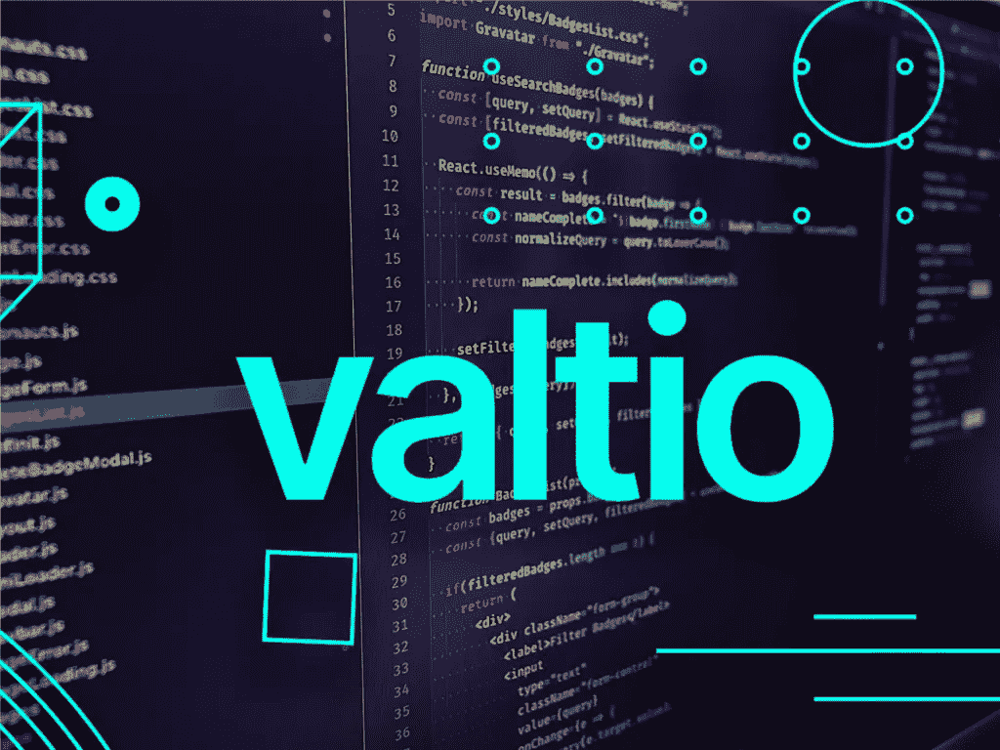

# 用 Valtio 反应状态管理:一种基于代理的方法

> 原文：<https://levelup.gitconnected.com/valtio-the-proxy-based-state-management-6f3304b53968>



在开发 web 应用程序之前，决定正确的状态管理工具是最重要的决定之一。有许多工具和技术来管理应用程序状态，但是人们倾向于过度设计选择太复杂的工具**和引入**样板**代码。人们开始转向简单或轻量级的状态管理工具，如 Zustand、Jotai、反冲、上下文 API 来解决这个问题。**

**在本文中，让我们看看另一个简单的状态管理工具，称为 [Valtio](https://github.com/pmndrs/valtio) ，这是一个基于代理的工具，旨在解决一些著名的状态管理工具(如 Redux)带来的问题。**

# **什么是瓦尔蒂奥**

**Valtio 是一个在 react 应用程序中管理状态的小工具。Valtio 由 [Jotia](https://github.com/pmndrs/jotai) 和 [Zustand](https://github.com/pmndrs/zustand) 的相同开发者开发。Valtio 在底层使用了一个[代理](https://developer.mozilla.org/en-US/docs/Web/JavaScript/Reference/Global_Objects/Proxy)模式，使我们能够订阅应用程序状态的特定部分。它避免了传统的选择或区分技术来订阅应用程序状态。**

# **是什么让它独一无二**

**Valtio 是基于状态突变的风格。因此，您不需要使用传统的方法，如选择器和 diffing 来识别和重新呈现状态的组件。 **Hookstate 是最早采用** [**代理**](https://developer.mozilla.org/en-US/docs/Web/JavaScript/Reference/Global_Objects/Proxy) **设计模式**的库之一，这有助于解决现代应用程序中的重复问题，如**改变**状态、**监听或订阅应用程序状态**。代理有两个重要的规则。**

*   **您应该控制用代理包装的 Javascript 对象**
*   **您应该提供访问对象的功能**

**与 Redux 或 Zustand 不同，代理模式不需要触发独特的动作，并且很容易订阅存储中的值。让我们看一个代理，看看它是如何工作的。**

**一个`Proxy`对象包装另一个对象并拦截操作，如读/写属性和其他，可选地独立或透明地处理它们，允许对象处理它们。代理接受两个参数。**

*   **`**target**`–是要包装的对象，可以是任何东西，包括函数。**
*   **`**handler**`–代理配置:一个带有“陷阱”的对象，方法是拦截操作(通常是 get 或 set)。**

```
let proxy = new Proxy(**target**, **handler**)
```

**如果代理对象没有处理函数，它会直接转发目标对象。您可以通过处理程序为代理提供额外的特性，这将允许读取(`get`)、写入(`set`)、删除(`deleteProperty`)一个属性(甚至是一个不存在的属性)。现在让我们来看一个带有适当目标和处理函数的例子。**

```
let state = {
 'Pokemon': 'Pickachu',
 'Power': 'Fire'
};state = new Proxy(state, {
 get(target, phrase) { *// intercept reading a property from state* if (phrase in target) { *// if we have it in the state* return target[phrase]; *// return the translation* }
  else {
    *// otherwise, return the non-translated phrase* return phrase;
  }
 }
});*// Look up arbitrary phrases in the state!
// At worst, they're not translated.* alert(state['Pokemon']); *// Pickachu* alert(state['Welcome to Pokemon World']); *// Welcome to Pokemon World (no translation)*
```

**Valtio 还引入了一个名为“作用域状态”的独特功能，它将频繁变化的深度嵌套状态的重新呈现优化到了极致。**

# **瓦尔蒂奥与祖斯坦德比较，约泰**

**尽管所有这些库都是由同一批创建者创建的，但在成熟度、流行程度和技术上还是有一些差异。**

**Zustand 用的图案和 Redux 一样，是**通量**图案。但与 Redux 不同，Zustand 的样板文件较少。Jotai 使用类似于 React 状态的原子模式，并将状态存储在 React 树中。Jotai 有**原子**来保持应用程序的状态，组件可以订阅这些独立的原子。**

**Valtio 使用代理模式。代理模式不需要触发独特的动作，就像 Redux 或 Zustand 一样，它将订阅存储中的值。Valtio 看起来很神奇，它只需要很少的代码和普通的 JavaScript 就可以工作，而且 Valtio 是独立的。**

# **从 Valtio 开始。**

**在本节中，让我们用 valtio 创建一个小的 pokemon 应用程序，涵盖 valtio 的基本用法。**

## **步骤 01:安装**

**我们将使用 create-react-app 和 TypeScript 一起使用 React，并安装其他必要的库。**

```
npx create-react-app **valtio-pokemon** --template typescriptyarn add semantic-ui-react semantic-ui-css **valtio**
```

**安装完依赖项后，让我们继续创建应用程序的存储。**

## **步骤 02:创建商店**

**首先，让我们为 store 对象创建接口，并用 valtio 的代理包装器包装 store 对象。**

**请注意，我们添加了可以改变代理对象中存储数据的附加函数。我们在一个单独的 util.ts 文件中使用了一些常用函数来更新和删除 pokemon 数据。**

## **步骤 03:订阅和使用商店**

**与 Redux、Zustand 或 Jotail 不同，使用 Valtio，您必须用提供者高阶组件包装应用程序。这意味着您可以直接从存储中导入代理对象，并使用其数据和函数来改变状态。首先，让我们创建一个表单组件。**

**注意，我们使用了一个名为 **useSnapshot** 的钩子来包装我们的应用程序状态。API 方法专门用于优化 react 的渲染。有了 Valtio，建议**从快照中读取，对源代码进行变异。**接下来，让我们创建一个列表组件，它将订阅 pokemon 数组。**

## **步骤 o4:使用 Redux 开发工具**

**你可以使用 [Redux DevTools 扩展](https://github.com/zalmoxisus/redux-devtools-extension)来观察你的商店的状态，只需要一些额外的配置。首先，您需要从 Valtio 的 util API 导入 DevTools 方法。**

```
import { **devtools** } from 'valtio/utils'

const state = proxy({ isEditing: fasle, pokemons: [],.....})
const unsub = **devtools**(state, 'pokemon state')
```

**你可以通过 [GitHub repo](https://github.com/TRomesh/valtio-pokemon) 找到完整的代码，通过[这个链接](https://valtio-pokemon.netlify.app/)找到工作演示。**

# **结论**

**Valtio 看起来是最简单的状态管理工具之一。React 和 JavaScript 中代理的强大功能使得管理前端应用程序的状态变得很容易。有了像 Redux devtools 和持久功能这样的附加功能，Valtio 看起来是一个完整的包，值得 web 开发社区更多的关注。要了解更多信息，请务必通读 Valtio 的[文档。最后，感谢您花时间阅读本文。我想看看你下面的问题和评论。](https://github.com/pmndrs/valtio)**

**干杯！**

# **了解更多信息**

**[](/jotai-atom-based-state-management-for-react-1ce8fd380296) [## jotai:React 的基于原子的状态管理

### 在过去的几年里，国家管理有了很大的发展。有很多库和方法可以让你…

levelup.gitconnected.com](/jotai-atom-based-state-management-for-react-1ce8fd380296) [](/hookstate-the-simplest-state-management-tool-b02f7d3b01a4) [## 最简单的状态管理工具

### 小型、最小、简洁、可扩展、基于钩子的状态管理库

levelup.gitconnected.com](/hookstate-the-simplest-state-management-tool-b02f7d3b01a4) [](https://medium.com/swlh/intro-to-recoil-d689a77c5f04) [## 反冲介绍

### 反冲是一个反应的状态管理库，是由脸书的实验和开放源码…

medium.com](https://medium.com/swlh/intro-to-recoil-d689a77c5f04) [](/urql-the-highly-customizable-and-versatile-graphql-client-69e4e3406904) [## 高度可定制和多功能的 GraphQL 客户端

### 在过去的十年里，REST 架构已经成为 web 应用程序的行业标准，因为 REST 提供了一个…

levelup.gitconnected.com](/urql-the-highly-customizable-and-versatile-graphql-client-69e4e3406904) [](/build-your-own-self-hosted-ci-cd-workflow-with-github-actions-ec9ee1dcd800) [## 使用 GitHub 操作构建您自己的自托管 CI/CD 工作流

### GitHub 引入了 GitHub Actions，使开发人员能够直接从他们的 GitHub 库自动化工作流…

levelup.gitconnected.com](/build-your-own-self-hosted-ci-cd-workflow-with-github-actions-ec9ee1dcd800) [](/lets-go-and-build-graphql-api-with-gqlgen-bfea2f346ea1) [## 让我们开始用 gqlgen 构建 Graphql API

### Golang 是过去十年中最受欢迎的编程语言之一，主要是因为它的快速…

levelup.gitconnected.com](/lets-go-and-build-graphql-api-with-gqlgen-bfea2f346ea1)**