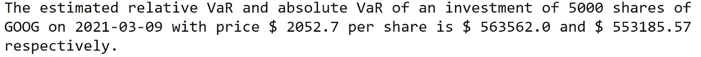

# 使用 Python 的风险价值

> 原文：<https://levelup.gitconnected.com/value-at-risk-with-python-d87cf6c41ed1>

## 从历史数据执行 VaR 的完全初学者指南(带代码！)

风险价值(VaR)提供了一个数字，它概括了投资组合或资产的总金融风险。它由 J.P. Morgan 于 1990 年首创，现已被基金经理、公司管理层以及金融机构广泛使用。监管机构也选择这一指标来设定市场风险、信用风险和运营风险的资本要求。总之，风险值是用来管理和度量风险的。[1]

马丁·范·登·霍维尔在 [Unsplash](https://unsplash.com/?utm_source=medium&utm_medium=referral) 上的照片

# 定义

风险值定义为在给定时间内持有投资组合或资产的最大损失，置信水平为 1 ˗ α。

例如，VaR(1 天，95%)= 1000 万美元意味着在 95%的置信水平下，一天的最大损失约为 1000 万美元。
或者，平均来说，每 100 个交易日中，只有 5 天的日均已实现亏损高于 1500 万美元。

它表明实际损失超过风险值的可能性，旨在衡量短期内的风险。因此，VaR 是两个参数的函数:时间范围和置信水平。[2]

# VaR 的优势

> 提供风险的综合度量
> 
> 通过根据风险值设定限额来监控业务部门承担的风险
> 
> 提供一个通用、一致的风险衡量标准，以便每个人(监管者、高级管理层和董事会)都能理解
> 
> 成为内部和外部的报告工具[2]

# 计算投资组合的风险值

根据定义:
相对 VaR =预期利润/损失˗在 1 ˗ α置信水平下的最坏情况损失
绝对 VaR (VaR') = ˗在 1 ˗ α置信水平下的最坏情况损失

## 1.非参数 VaR

它来源于使用历史数据构建的分布。非参数意味着它不涉及估计理论分布的参数。

VaR 的图解。图片作者。

V =投资组合的当前市值(股票数量*股价)
R =超过期限的回报
H =时间期限
μ = E(R) =预期回报
R* =对应于在 1-α置信水平下最差情况损失的回报
V* = V * (1+R*) =在 1 ˗ α置信水平下最差情况损失

**VaR(H，1-α)= E(V)-V * = V *(1+μ)-V *(1+R *)= V *(μ-R)
VaR '(H，1-α) = -V * R***

例如:让我们观察从 2018 年 1 月 1 日到 2021 年 3 月 9 日的谷歌股票，并使用非参数方法估计 2021 年 3 月 9 日以 2052.70 美元的价格投资 5000 股谷歌股票的相对和绝对 VaR(1 天，0.99)。

使用历史数据计算非参数 VaR 的步骤:

1.  计算谷歌股票从 2018 年 1 月 1 日到 2021 年 3 月 10 日的日回报率(800 次观察)
2.  从最小到最大排列每日回报率。然后用 1%的回报率(第 8 个最小的利率)估算 VaR(1 天，0.99)
    VaR(1 天，0.99)=-5000 股*价格 2052.70 美元*第 8 个最小的利率
    VaR'(1 天，0.99)= 5000 股*价格 2052.70 美元*(平均回报率-第 8 个最小的利率)

代码的输出。图片作者。

## 2.参数 VaR

如果一个投资组合是非常多样化的，并且收益是相互独立的，那么这个投资组合可以被认为是正态分布的。[1]

如果收益 R 在时间范围 h 内呈均值μ和标准差σ正态分布，在 1-α置信水平下，R*定义为:

假设收益服从正态分布来推导 VaR。图片作者。

代码的输出。图片作者。

# 参考

[1]密苏里科技大学讲座—文清·胡，[《风险价值(VaR)及其计算:概述》，2016。](https://web.mst.edu/~huwen/teaching_VaR_Weiqian_Li.pdf)

[2] M. Crouhy，D. Galai，和 R. Mark，[风险管理。](https://melakukan.com/wp-content/uploads/2018/02/Risk-Management-Michel-Crouhy-Dan-Galai-Robert-Mark.pdf)