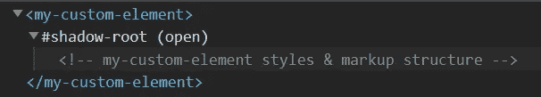
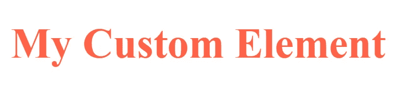
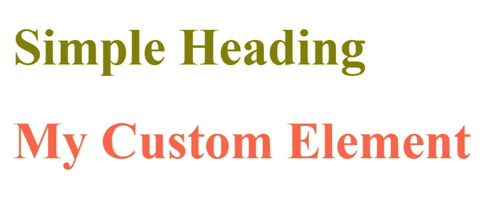

# 普通 Web 组件

> 原文：<https://levelup.gitconnected.com/vanilla-web-components-caa1bd83ed86>


维塔利·塔拉诺夫在 [Unsplash](https://unsplash.com?utm_source=medium&utm_medium=referral) 上拍摄的照片

# 什么是 Web 组件？

web 组件是自定义的、可重用的 Web 元素，通过使用普通的 javascript/HTML/CSS 以及本地 Web APIs 来封装功能、标记结构和样式。

> **自定义元素教给浏览器新的技巧，同时保留 HTML 的优点**
> 
> **—** [埃里克·比德尔曼](https://developers.google.com/web/resources/contributors/ericbidelman)

它们可以像普通的 HTML 元素一样在模板中使用(例如`<p>`或`<span>`)。

```
<body>
  <p>a simple paragraph</p> <script type="module" src="my-custom-element.js"></script>
  <my-custom-element></my-custom-element>
</body>
```

它们通过扩展`HTMLElement` 接口建立在 ECMAScript 2015 类语法的基础上，提供了[有用的 API](https://developer.mozilla.org/en-US/docs/Web/API/HTMLElement)来操作元素或响应事件。

```
class MyCustomElement extends HTMLElement {}
```

您还可以扩展现有的 HTML 元素，如`HTMLInputElement`、`HTMLButtonElement`或`HTMLParagraphElement`，以继承它们的属性和方法。因此，您可以创建自己的通用 HTML 元素实现。

## 生命周期挂钩

有几个预定义的回调函数可用于对特定的生命周期事件做出反应，例如

*   `connectedCallback` —每当您的元素被插入到 DOM 中时，就会调用这个回调函数
*   `disconnectedCallback` —每当从 DOM 树中删除元素时调用

这些回调对于安全地获取/访问数据或运行一些清理代码非常有用。

## 阴影 DOM

样式和标记结构的封装是通过将一个所谓的**影子 DOM** 附加到您的 web 组件来实现的，它会在您的定制 HTML 元素下创建一个隐藏的 DOM 树。



阴影 DOM 可视 Chrome DevTools 元素选项卡

当组件标记和样式不受全局样式定义影响时，影子 DOM 很有用。

## 浏览器支持

所有现代浏览器都支持 Web 组件，如 Chrome、Firefox 和 Opera(对于 Edge、Safari 和 IE11，您可以使用 [polyfills](https://github.com/webcomponents/polyfills) )。

[](https://github.com/webcomponents/polyfills) [## web 组件/聚合填充

### Web 组件聚合填充。在 GitHub 上创建一个帐户，为 webcomponents/polyfills 的开发做出贡献。

github.com](https://github.com/webcomponents/polyfills) 

## 结构

有一些框架可以加速你的 web 组件开发，比如 [**聚合物**](https://www.polymer-project.org/) 或者 [**混合**](https://github.com/hybridsjs/hybrids) 。在将您选择的框架添加到您的项目之前，请尝试评估您是否真的需要这个额外的依赖项。

如果您只想创建几个简单的组件，而不是整个组件库，那么您应该选择无框架路径。

# 实现 Web 组件

澄清了所有必要的基础知识之后，让我们动手实现一个普通的 web 组件。目标是创建一个基本的 web 组件，它包含封装的样式/标记，并且可以很容易地扩展。

在本文的结尾，您还可以找到一个链接，指向我的简单 web 组件模板库。

## 设置

出于演示的目的，我们将创建一个简单的 web 页面，其中将使用我们的自定义 web 元素。

为了检查我们的定制元素是否像预期的那样工作，我将使用工具 *serve* 来托管我们的简单 web 页面。

[](https://github.com/vercel/serve) [## 韦尔塞尔/发球

### 假设你想提供一个静态网站，单页应用程序或只是一个静态文件(不管你的…

github.com](https://github.com/vercel/serve) 

有了 *serve* ，你只需要在你的简单网页所在的目录下运行`serve .`命令，就可以启动一个 web 服务器，它在`localhost:5000`上托管。

## 基金会

首先，我们将扩展`HMTMLElement`接口来获取所需的 API，并将我们的类注册为一个自定义元素，这样我们就可以在示例 HTML 页面中使用它。

现在，您已经可以通过导入 javascript 文件和插入 html 标记将它添加到 web 页面，我们已经在`customElements.define()`调用中将它定义为第一个参数。

不要忘记将 javascript 文件作为`type="module"`导入，否则它不会被加载。

现在我们已经完成了利用我们自己的 web 组件所需的步骤。当然，我们的自定义元素还没有任何内容，但是我们将在下一节中改变它。

有了这个坚实的基础，我们将继续使用 Shadow DOM APIs 向我们的自定义元素添加封装的标记结构和样式。

## 使用阴影 DOM

正如已经提到的，影子 DOM 是一个隐藏的 DOM 树，它附加到您的自定义元素上。这确保了自定义元素的样式不会受到全局或其他元素样式的影响。

让我们给自定义元素附加一个阴影 DOM。我们将在`constructor`中这样做，并选择`open`作为我们想要的封装模式。

当将封装模式设置为`open`时，我们确保可以通过 javascript 访问我们的影子 DOM 子元素。

接下来，我们应该添加一个模板和一些样式到我们的自定义元素。

注意，我们的标记结构驻留在一个`<template>` HTML 元素中，它不会显示在呈现的 web 页面上。

网页现在应该显示自定义元素。



现在，为了证明我们的自定义样式被封装并且不受全局样式的影响，我们向我们的`index.html`文件添加了全局样式和一个简单的标题元素。

网页呈现两个标题，但样式不同。



您仅仅使用普通的 javascript 就创建了一个简单的、定制的、具有封装风格的 web 元素。以此为起点，根据您的喜好扩展它，创建您自己独特的 web 元素。

你可以在这里找到完整的例子:

[](https://github.com/j-sommer/web-component-starter) [## j-sommer/web 组件-starter

### 通过在 GitHub 上创建一个帐户，为 j-sommer/web-component-starter 开发做出贡献。

github.com](https://github.com/j-sommer/web-component-starter)