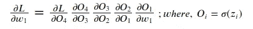

# 消失和爆炸渐变

> 原文：<https://levelup.gitconnected.com/vanishing-and-exploding-gradients-ae7fb88f3b66>

## 带乙状结肠激活(功能)

图— 1: [爆炸](https://www.pixtastock.com/illustration/14535028)和[消失](https://harrypotter.fandom.com/wiki/Vanishing_Spell)图像

在这篇博客中，我将解释为什么 sigmoid 激活会有消失和爆炸梯度问题。消失和爆炸梯度是神经网络面临的最大问题之一。消失梯度导致收敛缓慢，而爆炸梯度导致权重变化太大，而这种太大的变化通常是不希望的。由于消失梯度和爆炸梯度，神经网络不收敛。

这个博客是关于乙状结肠激活中的消失和爆炸梯度。所以，我们先讨论一下什么是 sigmoid 函数。

# Sigmoid 函数

这是一个数学函数，它有一条**-**形状的曲线(或称 sigmoid 曲线)。该功能可以定义为:

图 2: Sigmoid 函数

这个函数的导数将是—

图 Sigmoid 函数的导数

这就是这个函数的美妙之处，因为它的导数是用 it 来表示的。这个导数关于 y 轴对称，导数的最大值是 **0.25。**所以乙状结肠的导数在于[0，0.25]。对于导数最大值 ***x=0。*** 我们来看看乙状结肠和它的导数的图。

图 4

# 消失梯度

在消失渐变中，渐变变得非常小(接近 ***0*** )，这导致权重的变化非常小(或者几乎没有变化)。权重无变化(即 ***gradient=0*** )是终止的条件，但这不是收敛的解决方案。让我们看看这个消失的梯度是如何发生的，为什么会发生。

> 让我们看看数据是如何在神经元中流动的—

***x*** :是对神经元的输入， ***O:*** 是神经元的输出。类似地，我们可以使用这个概念定义许多层的架构。下图显示了神经网络架构。

图— 5

让我们计算第一层(输入层，即 w1 和 b1)的梯度。

图 6

sigmoid 的导数的最大值是 0.25，最小值是 0。最大值小于 1。较小的数多次相乘得到的数非常小(接近 ***0*** )。这就是在具有 sigmoid 激活的神经网络中消失梯度是如何发生的。如果 NN 很深，所有激活都是 sigmoid，那么消失梯度的几率非常高。

**注:**权重小(不要太小)。

# 爆炸梯度

在爆炸梯度中，梯度值变得非常大，这导致更新的权重变化太大(不希望的)。在上面的例子中，我们看到渐变消失是因为 sigmoid 的最大导数值小于 1。

> 那么问题来了，sigmoid 激活如何导致爆炸梯度？

在图-6 中，如果我们可以证明一个大于 1 的项，那么，以同样的方式，我们可以证明每个大于 1 的项，我们可以说，sigmoid 激活可以导致爆炸梯度。

图— 7

图— 8

以上偏导值如果 ***w_2*** 大可以大于 1(设 ***w_2=100，*** 那么这个值就变成 ***25)*** 。同样，如果所有权重都是大值，则其他值可以大于 1 ***。***

如果初始化的权重非常大，则 sigmoid 激活可以具有爆炸梯度。所以在初始化权重时要小心。

 [## 编写面试问题

### 一个完整的平台，在这里我会教你找到下一份工作所需的一切，以及…

技术开发](https://skilled.dev)