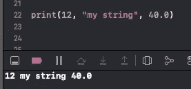
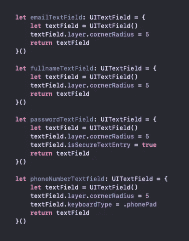
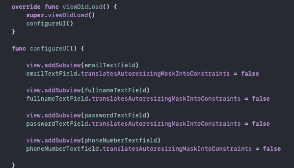
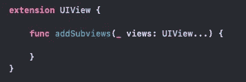
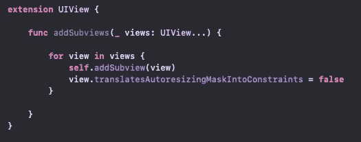
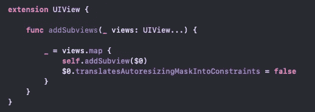
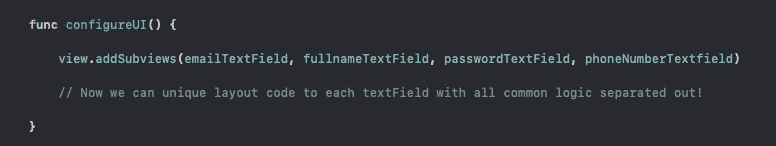

# Swift 中的可变函数

> 原文：<https://levelup.gitconnected.com/variadic-functions-in-swift-58d45dd08035>

萨法尔·萨法罗夫在 [Unsplash](https://unsplash.com/s/photos/coding?utm_source=unsplash&utm_medium=referral&utm_content=creditCopyText) 上拍摄的照片

函数在编程中起着至关重要的作用。它们允许我们将一组指令定义成模块化的代码块，以便重用，使我们的代码更干净，更容易出错。像任何编程语言一样，苹果为开发人员在他们的项目中使用内置了过多的函数；我们经常需要编写自己的自定义函数来满足我们的编码需求。

如果你在 swift 中做过任何编程/调试，你很可能使用过 Swift 的原生 **print()** 功能向控制台呈现数据。这个方便的小函数可以接受许多数据类型，但是它也可以一次接受多条数据。

print 函数接受 Any 类型的参数，允许传递和打印不同的数据类型。

Print()是一种特殊的函数，称为**变量函数**，它*接受多种数据类型，并将它们放入一个* ***数组*** *中，以便在函数体内使用。*最好的函数解决常见问题，减少完成任务所需的代码行数，让我们保持在**干**的原则内(**不要重复自己**)。

假设我们正在以编程方式构建一个没有故事板的应用程序。我们正在为我们的应用程序建立一个注册字段，要求用户向我们提供电子邮件，全名，密码和电话号码。开始时，我们将在表单中创建所有的属性。

我们的下一步是用 addSubView()函数将我们的 textfield 添加到我们的视图中，然后禁用自动布局，这样我们就可以指定我们的 textfield 应该放在哪里。为了保持 ViewDidLoad()函数的整洁，我们将在名为 configureUI()的自定义函数中进行额外的设置。

虽然这肯定是可行的，但对于减少我们项目中的代码量来说，这并不是最优雅的解决方案。当涉及到布局和设计时，我们的文本字段确实需要独特的约束，但它们确实有一些共同的*要求*来启动和运行它们:它们需要作为子元素添加到我们的视图中，以便可以放置在我们的视图层次结构中，并且为了启用编程布局，需要禁用自动布局，这由 translatesAutoresizingMaskIntoConstraints 或简称 TAMIC 来指示。我们属性的共性可以被重构为一个变量函数来清理我们的代码。那么这些奇特函数的语法是什么呢？

这真的很简单，定义一个变量函数，所需要的就是在类型声明之后加三个句点(…) 。为了遵循与 Apple 的 addSubview()相似的命名惯例，我们将把我们的变量函数命名为 addSubview()。我们函数的声明将作为 UIView 上的扩展添加。

如前所述，函数中声明的常量将是一个**数组**，在我们的例子中是一个 UIView 类型的**数组(就像 print 的 items 参数是一个 Any 类型的数组)。现在我们所有的文本字段都分组在同一个地方，就像*遍历集合*并在我们的文本字段上设置公共属性一样简单。**

解析我们的集合就像建立一个 for 循环，然后添加我们的逻辑一样简单。由于这是 UIView 的扩展，我们将调用 addSubview 到 self，就像您在 ViewController 中调用 view.addSubview()一样；然后，我们将视图的 TAMIC 属性设置为 false，用于自动布局。这段代码大大减少了 ViewController 中设置 textFields 所需的代码行数，但通过将其声明为 UIView 的扩展，它甚至更加模块化，允许我们在应用程序的其他地方设置从 UIView 继承的任何对象！使用 Array 内置的 Map 函数以及闭包的语法糖，可以进一步简化我们的变量函数逻辑。

闭包提供了用美元符号和数字表示的内置常数，从 0 开始

我们的新函数已经可以在我们的 ViewController 中使用了！要传入我们的 textFields(或其他 UIViews ),我们需要做的就是像数组一样用逗号分隔每一项。

可变函数可以减少完成给定任务所需的重复代码的数量，使我们的代码干净、可重用和可读。