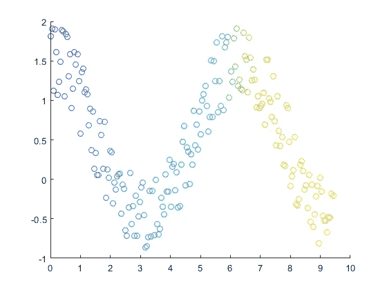

# 方差、协方差和相关系数

> 原文：<https://levelup.gitconnected.com/variance-covariance-and-correlation-coefficient-7e845795728f>

理解方差、协方差和相关性的概念是机器学习中最关键的步骤之一。

## 差异

数学上，方差定义为:

> **平均值的平方差的平均值**

下面是相同的数学表示:

[图片来源](https://www.google.com/url?sa=i&url=https%3A%2F%2Fwww.onlinemathlearning.com%2Fvariance.html&psig=AOvVaw3bY_C-GJ1p0QKFZbRiTGMX&ust=1592845769462000&source=images&cd=vfe&ved=0CAIQjRxqFwoTCLCwyb60k-oCFQAAAAAdAAAAABAD)

现在，你会想我到底在说什么？所以让我用简单的英语来说。

> 方差衡量数据集中数字之间的差异

以下是让您清晰了解情况的图示:

[图片来源](https://www.google.com/url?sa=i&url=https%3A%2F%2Fwww.pinterest.com%2Fpin%2F326299935485508475%2F&psig=AOvVaw3oanCNYEz45jpoyjAbjylD&ust=1592845857336000&source=images&cd=vfe&ved=0CAIQjRxqFwoTCLj1lPmzk-oCFQAAAAAdAAAAABAD)

## 协方差

协方差帮助我们测量(和理解)变量之间的线性关系。

让我们举个例子来更好地理解这一点。假设我有两个变量身高和体重，我想测量它们之间的关系。但是在我们这么做之前，我们能确定他们之间确实有关系吗？我如何知道它们之间是否存在某种关系？理解这一点的一个简单方法是检查(例如):

如果身高随着体重的增加而增加

随着重量的增加，高度降低

请参考下图以获得清晰的理解:

[图像来源](https://www.google.com/url?sa=i&url=https%3A%2F%2Fcourses.lumenlearning.com%2Fsuny-microeconomics%2Fchapter%2Freading-types-of-graphs%2F&psig=AOvVaw3Xy0yehRhRQieTxrBrZYoj&ust=1592846465610000&source=images&cd=vfe&ved=0CAIQjRxqFwoTCPijrdG1k-oCFQAAAAAdAAAAABAD)

在上面的图像中，非常清楚的是，随着身高的增加，学生的体重也增加，无论学生是女孩还是男孩。

这种观察(使用散点图)可以让我们了解变量之间的线性关系。

数学形式的协方差表示为:

[图像来源](https://www.google.com/url?sa=i&url=https%3A%2F%2Fgetcalc.com%2Fstatistics-covariance-calculator.htm&psig=AOvVaw1B7tmzec-hq3JsxUW_GWcM&ust=1592846705945000&source=images&cd=vfe&ved=0CAIQjRxqFwoTCPil1s62k-oCFQAAAAAdAAAAABAD)

现在，我们来看看基于上述协方差公式的两个观察值:

COV(X，Y) =正，如果随着 X 增加，Y 也增加

COV(X，Y) =负，如果 X 增加，Y 减少

让我们借助图表来看看上面的观察结果。

[图像来源](https://www.google.com/url?sa=i&url=https%3A%2F%2Fwww.geeksforgeeks.org%2Fmathematics-covariance-and-correlation%2F&psig=AOvVaw0W6BKKV37FZ05VtnuH2Zr9&ust=1592916140728000&source=images&cd=vfe&ved=0CAIQjRxqFwoTCLD-spy5leoCFQAAAAAdAAAAABAZ)

**限制:**

让我们用上面同样的身高和体重的例子来理解协方差的局限性。为了便于理解，让我们假设上面给出的身高和体重分别以英寸和磅为单位。现在，我们将这些相同的身高和体重转换成新的测量单位(比如说)身高以英尺为单位，体重以千克为单位。我们最终得到如下变量:

X →英寸高度(原始变量)

Y →以磅为单位的重量(原始变量)

X' →相同的英尺高度

y’→相同重量，单位为千克

所以现在，当我们计算协方差(X，Y)和协方差(X '，Y ')时，值是不一样的。请注意，协方差是针对同一数据集计算的，但转换为不同的测量单位。

> COV(X，Y) ≠ COV(X '，Y ')

因此，用一个简单的术语来说，协方差受公制系统变化的影响。为了克服上述限制，我们使用皮尔逊相关系数(PCC)

## 皮尔逊相关系数

PCC 的公式与协方差相同，只是稍有改动。我们将协方差除以 x 和 y 的标准偏差的乘积。PCC 的公式为:

[图片来源](https://www.google.com/url?sa=i&source=imgres&cd=&cad=rja&uact=8&ved=2ahUKEwjetZnKp5XqAhWdzjgGHQroDmMQjRx6BAgBEAQ&url=https%3A%2F%2Fwww.youtube.com%2Fwatch%3Fv%3D35NWFr53cgA&psig=AOvVaw2OGxe-8ymNQ5B1H75Z8PYi&ust=1592911415329106)

你可能想知道我们刚刚做了什么？更重要的是为什么？

如果你还记得标准化的概念，我们也做过类似的事情。通俗地说，我们使用了标准化的绝妙概念，使我们的协方差摆脱了公制。如上所述，PCC 是对协方差的一个小的修改，但是给了我们更好的结果。

PCC 的值将始终介于-1 和+1 之间。即-1 ≤ p ≤ +1

让我们理解 PCC 的不同情况，比如它的值何时为负，何时为正，何时为零

[图像来源](http://www.picronline.org/articles/2016/7/4/images/PerspectClinRes_2016_7_4_187_192046_f1.jpg)

让我们对上图有一个直观的理解。

看看上面图表中的图 a。有两个观察结果:

*   随着 x 轴上的值**增加**，y 轴上的相应值**也增加**
*   所有点都正好在同一条线上。

由于以上两种观察，我们可以说 PCC 的值= +1

接下来，考虑图 b。这里，虽然 y 轴上的值随着 x 轴上的值的增加而增加，但是数据点**不在同一条线上，因此我们得出结论，PCC 的值在 0 和 1 之间。**

现在，考虑图 d，我有两个观察结果:

*   随着 x 轴上的值**增加，**y 轴上的值**减少**
*   同样，所有的点都在同一条直线上。

所以，由于上面的观察，我们可以说 PCC 的值= -1

类似地，在图 e 的情况下，y 轴的值**减小**，而 x 轴的值**增加**，但是点**不在同一直线上，因此我们得出 PCC 的值在-1 和 0 之间的结论**

**PCC 的限制:**

如果你有敏锐的眼光，你一定注意到了，在以上 PCC 的不同情况下，我们使用了两个变量之间的线性关系。如果变量之间的关系是复杂的和非线性的呢？如下图所示:

[图像来源](https://www.mathworks.com/help/matlab/ref/scatter.html)

当然，上述变量之间存在某种关系，但 PCC 未能捕捉到这一点。它仅适用于**线性关系。**

PCC 的另一个限制是，它不考虑直线的斜率。我这么说是什么意思？

考虑下图。

[图像来源](https://www.google.com/url?sa=i&url=https%3A%2F%2Fstatistics.laerd.com%2Fstatistical-guides%2Fpearson-correlation-coefficient-statistical-guide.php&psig=AOvVaw0MPwGTr2mK1FL49sO2C2ey&ust=1592913283840000&source=images&cd=vfe&ved=0CAIQjRxqFwoTCODGodWuleoCFQAAAAAdAAAAABAD)

这两条线有不同的斜率，这反过来让我们了解一个变量相对于另一个变量是如何变化的。PCC 不会捕获这些信息。两条线的 PCC 值= +1。

为了克服 PCC 的这些局限性，我们使用了 Spearman 的秩相关系数。

## **斯皮尔曼等级相关系数(SRCC):**

理解任何概念的最好方法是使用例子。让我们在这里做同样的事情。考虑下面的例子:

[图像来源](https://en.wikipedia.org/wiki/Spearman%27s_rank_correlation_coefficient)

这是给我们的数据集。我们将一步一步地执行。

**Step-0** (内心的 Python 开发者):对 IQ 字段进行升序排序。创建一个新列 Rank_IQ，给他们排名。最小的元素获得第一级。每周看几个小时的电视，做同样的事情。创建另一个专栏 Rank _ Hours of TV week。

**第一步** : SRCC 说，在我们刚刚创建的**排名栏**上计算 PCC，而不是实际变量智商和每周看电视的时间。

[图像来源](https://en.wikipedia.org/wiki/Spearman%27s_rank_correlation_coefficient)

现在，如果等级 _ 智商**增加**，&每周看电视的等级 _ 小时数也**增加**，那么 SRCC = +1。这种关系是线性的还是复杂的并不重要，因为我们计算的是等级上的 PCC，而不是实际变量。

类似地，如果 Rank_IQ **增加**并且每周看电视的 Rank _ Hours**减少**，那么 SRCC= -1。

如果所有等级都是不同的整数，则可以使用以下公式进行计算:

[图像来源](https://en.wikipedia.org/wiki/Spearman%27s_rank_correlation_coefficient)

在上面的例子中，我们有不同的等级，因此我们可以很容易地实现上面的公式。

下面是同样的详细计算:

[图像来源](https://en.wikipedia.org/wiki/Spearman%27s_rank_correlation_coefficient)

**SRCC 的优势:**

*   如果有几个异常值，与 PCC 相比，SRCC 处理得很好，因为它考虑的是等级，而不是实际值。
*   与 PCC 相比，SRCC 更加稳健
*   它独立于公制

如果您有任何疑问/建议，请在下面的评论区回复。你的反馈激励我写更多。

快乐学习！