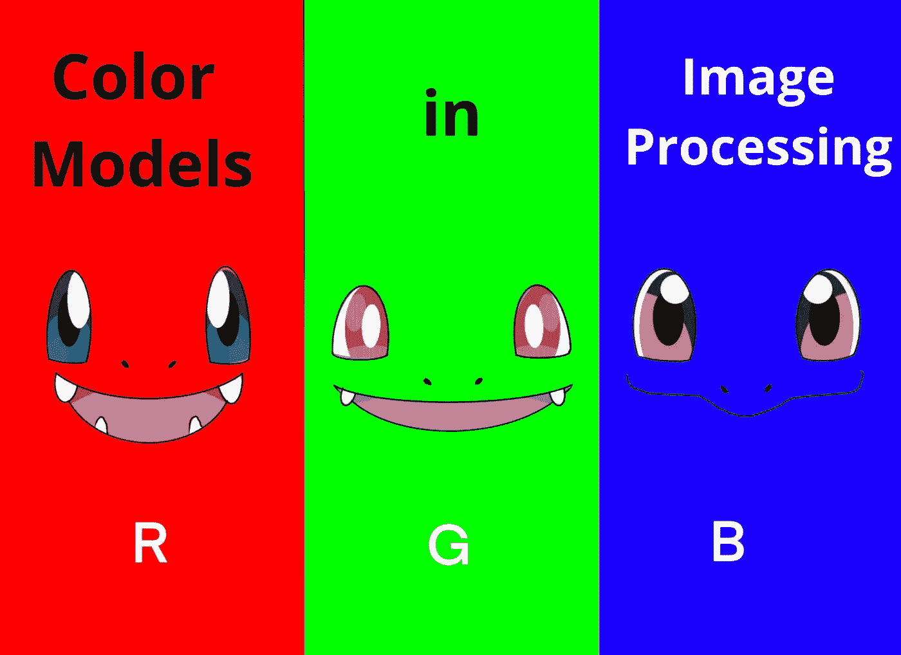
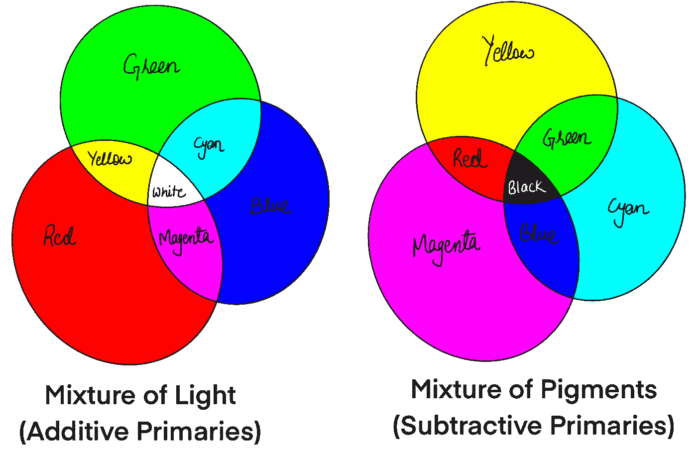
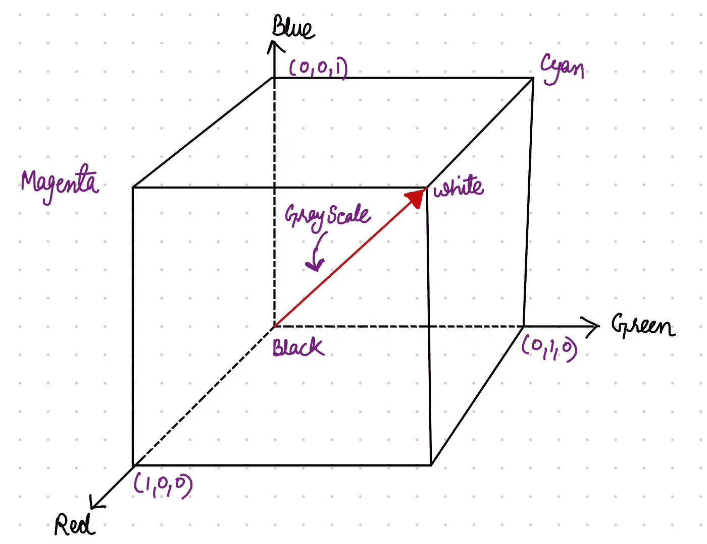
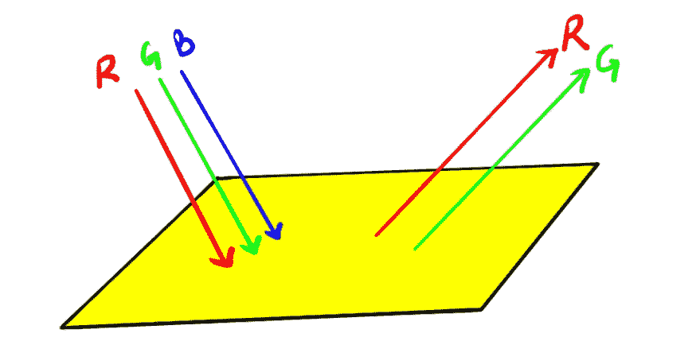
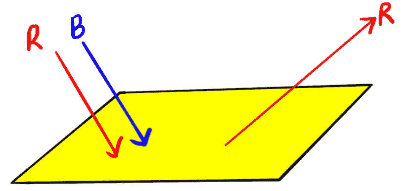
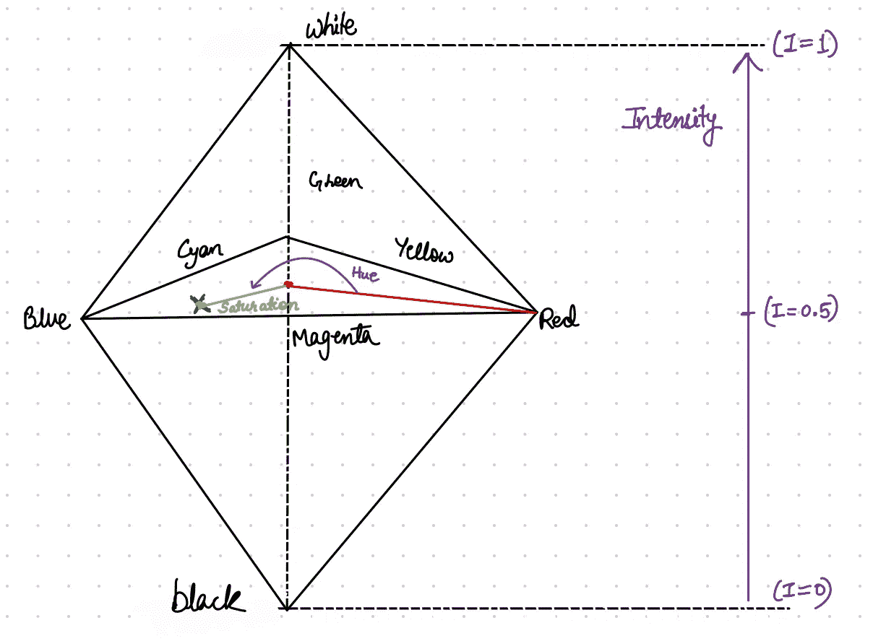
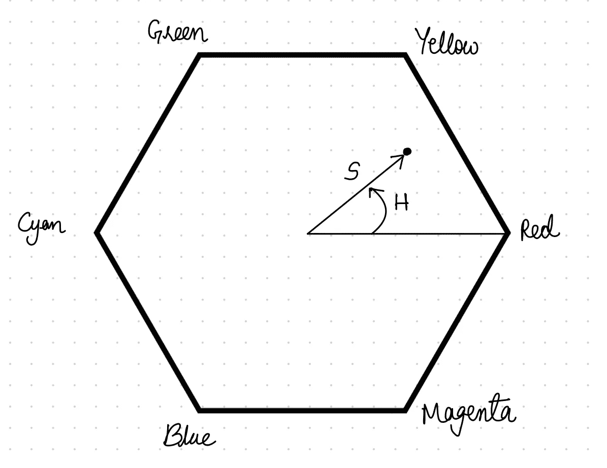
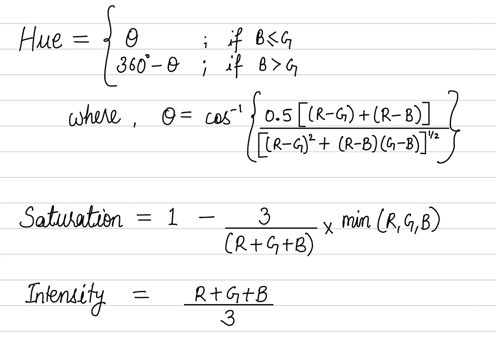

# 数字图像处理中使用的各种颜色模型

> 原文：<https://levelup.gitconnected.com/various-color-models-used-in-digital-image-processing-77d7289a2f2c>

## 本文用用例说明了不同的颜色模型及其属性



描绘 RGB 通道的封面艺术。(来源:图片由作者提供)

人类认知基于波长形成彩色图像的心理方式不能用于机器。相反，机器使用颜色模型，这是人类视觉的自然不可量化本质的数学近似[1]。存在许多颜色模型，并且推测起来，它们都有优点和缺点，使得它们或多或少地适合于给定的应用。本文讨论最常用的颜色模型如下。

1.  **RGB** (红色—绿色—蓝色)
2.  **CMY 和 CMYK** (青色—洋红色—黄色)
3.  **HSI** (色调—饱和度—强度)

在深入研究颜色模型之前，让我们先了解加色和减色模型的区别[6]。

## 加色模型

1.  这些类型的模型使用直接从光源发出的光来显示颜色。
2.  这些模型混合不同量的红、绿和蓝(原色)光来产生其余的颜色。
3.  将这三种原色相加产生白色图像。
4.  示例:RGB 模型用于笔记本电脑、电视、平板电脑等数字显示器。

## 减色模型

1.  这些类型的模型使用印刷油墨来显示颜色。
2.  减色法从反射光的物体开始，使用着色剂减去照亮物体的部分白光，以产生其他颜色。
3.  如果一个物体把所有的白光反射给观察者，它就呈现白色，如果它吸收了所有的光，它就呈现黑色。
4.  示例:图形设计人员将 CMYK 模型用于印刷目的。

图 1 显示了加色和减色模型的纹理图。



图一。加色和减色模型类型的纹理图。(来源:图片由作者提供)

# 1.RGB

该型号的名称来自三种加色原色的首字母，即红、绿和蓝。RGB 颜色模型是一种加色模型，其中红色、绿色和蓝色以各种方式相加，以再现各种颜色[4]。

通常，在 RGB 中，一个像素用 8 位来表示每个红色、绿色和蓝色。这总共产生了大约 1670 万种颜色(2 ⁴).这三种原色的相等值表示从黑色到白色的灰色阴影。

让我们以立方体的形式在三维平面上绘制这三种原色，如图 2 所示；RGB 值将位于三个轴上的拐角处。原点将是黑色的，与原点相对的对角线将是黑色的。立方体的其余三个角将是青色、洋红色和黄色。在立方体内部，我们得到了由 RGB 向量表示的各种颜色(原点为黑色)。



图二。三维平面中的 RGB 颜色图。(来源:图片由作者提供)

在原色的帮助下，我们可以生成如下的二次色(黄色、青色和品红色)。

```
**Colour combination:** 
Green(255) + Red(255) = Yellow 
Green(255) + Blue(255) = Cyab
Red(255) + Blue(255) = Magenta
Red(255) + Greeb(255) + Blue(255) = White
```

# 2.CMY 和 CMYK

CMY 颜色模型是一种减色法颜色模型，其中青色、品红色和黄色(二次色)颜料或染料以不同方式混合，以产生各种颜色[5]。二次色也被称为原色颜料。CMY 颜色模型本身没有从色度上描述青色、品红色和黄色的含义，因此混合结果不是绝对的，而是相对于原色的。当青色、品红色和黄色原色的精确色度被定义时，颜色模型就变成了绝对颜色空间。

## 减色的过程

如果已知入射光和颜料的颜色，减色法是预测物体最终颜色外观的一种有价值的方法[2]。RGB 和 CMY 颜色模型之间的关系由下式给出:

```
**RGB = 1 — CMY** or **CMY = 1 — RGB**
```

换句话说，红光吸收青色，反之亦然；品红色吸收绿色，反之亦然；黄色吸收蓝色，反之亦然。为了理解颜色减法的过程，让我们考虑一个黄色颜料的表面。当白光(R+G+B)入射到这个黄色表面时，蓝光将被吸收，我们将只看到红光和绿光的组合，如图 3 所示。



图 3。颜色减法示例 1。(来源:图片由作者提供)

同样，如果我们将红色和蓝色的组合品红色光投射到黄色颜料上，结果将是红色光，因为黄色颜料吸收了蓝色光，如图 4 所示。



图 4。颜色减法示例 2。(来源:图片由作者提供)

## 用于印刷的四分色

CYMK 颜色模型用于硬拷贝设备。根据理论，100%的青色、100%的品红色和 100%的黄色会产生纯黑色[3]。对于今天的印刷颜色，实现这一点是不可行的，因此在印刷领域，需要额外的组件键“K”(黑色)。通过混合 C、M 和 Y 颜色颜料获得的黑色是浑浊或呆滞的。

# 3.HSI

RGB 和 CMY 颜色模型非常适合硬件实现；然而，这些都不太适合用人类解释的实用术语来表示颜色[7]。RGB 并不是一种特别直观的描述颜色的方式。HSI 代表色调、饱和度和强度。当人类观察一个彩色物体时，它的色调、饱和度和亮度被描述。

1.  **色相:**是描述一种纯色的颜色属性。
2.  **饱和度:**衡量纯色被白光冲淡的程度。
3.  **亮度:**取决于色彩强度，这是描述色彩感觉的一个关键因素。强度很容易测量，结果也很容易解释。

**注:** *RGB 很适合色彩生成，HSI 很适合色彩描述。*

# **计算色相、嫩度和强度**

如果我们将立方体(如图 2 所示)立在黑色顶点上，并将白色顶点直接放在它上面，我们将得到类似于图 5 所示的东西。直立立方体的对角线(从黑到白)或高度代表强度。在最低级别，强度为零，而在最高级别，强度最大(=1)。



图 5。彩色立方体。(来源:图片由作者提供)

因此，HSI 模型包括垂直强度轴和位于垂直于该轴的平面上的色点轨迹。

现在，假设我们像前面那样直视 RGB 立方体；我们会看到一个六边形，每个原色相隔 120 °,而二次色与原色相隔 60 °,如图 6 所示。在这种情况下，色调是从参考点的角度，通常是红色，饱和度是从原点到该点的距离。



图 6。颜色立方体的俯视图。(来源:图片由作者提供)

## 将 RGB 转换为 HSI 的数学公式

**色调:**其取值范围从 0 到 360 或者可以归一化为 0–1。可以用上面圆上的一个角来形容，每一度代表一种鲜明的颜色。

**饱和度:**它表示颜色的量，或者更准确地说，它所占的百分比，或者代表颜色的鲜艳度。它的值范围从 0 到 1；0 表示没有颜色，而 1 表示全彩色。饱和度值越低，颜色越灰，看起来就越像。

**强度:**范围为 0–255 或归一化 0–1。

给定一种 RGB 格式的颜色，可以计算 HSI 值，如图 7 [8]所示。



图 7。将 RGB 像素转换为 HSI 像素的数学公式。(来源:图片由作者提供)

# 结论

本文首先讨论了三种颜色模型:RGB、CMY/CMYK 和 HSI。此外，我们通过可视化来理解这些模型。我们还讨论了 HSI 模型的必要性，即使 RGB 模型已经存在。最后，我们看到将 RGB 像素转换为 HSI 像素的数学图示。

# 参考资料:

1.  [https://www . allaboutcircuits . com/technical-articles/understanding-color-models-used-in-digital-image-processing](https://www.allaboutcircuits.com/technical-articles/understanding-color-models-used-in-digital-image-processing)

[](https://www.physicsclassroom.com/class/light/Lesson-2/Color-Subtraction) [## 2.彩色减影

### 一个物体的最终颜色外观是由开始的单一颜色或混合颜色和…

www.physicsclassroom.com](https://www.physicsclassroom.com/class/light/Lesson-2/Color-Subtraction) [](https://www.b2bsolutions.gr/en/articles-en/372/CMY---CMYK-Color-printing.-What-is-the-difference-/#:~:text=Therefore,%20the%20difference%20between%20the,black%20as%20an%20additional%20color) [## 3.CMY & CMYK 彩色印刷。有什么区别？

### 这些字符代表青色(C)、品红色(M)、黄色(Y)和黑色(K、黑色)。青色是蓝色的一种…

www.b2bsolutions.gr](https://www.b2bsolutions.gr/en/articles-en/372/CMY---CMYK-Color-printing.-What-is-the-difference-/#:~:text=Therefore,%20the%20difference%20between%20the,black%20as%20an%20additional%20color) [](https://www.hisour.com/rgb-color-model-24867/) [## 4.RGB 颜色模型

### RGB 颜色模型是一种加色模型，其中红色、绿色和蓝色光以各种方式加在一起，以…

www.hisour.com](https://www.hisour.com/rgb-color-model-24867/) [](https://en.wikipedia.org/wiki/CMY_color_model) [## 5.CMY 颜色模型-维基百科

### CMY 颜色模型是减色法颜色模型，其中青色、品红色和黄色颜料或染料被加在一起…

en.wikipedia.org](https://en.wikipedia.org/wiki/CMY_color_model) [](https://pavilion.dinfos.edu/Article/Article/2355687/additive-subtractive-color-models/) [## 6.加色和减色模型

### 颜色模型解释了颜色如何工作、相互作用以及我们如何复制颜色。加色和减色模型是一种…

pavilion.dinfos.edu](https://pavilion.dinfos.edu/Article/Article/2355687/additive-subtractive-color-models/) [](https://www.asquero.com/article/hsi-color-model-in-digital-image-processing/) [## 7.数字图像处理中的 HSI 颜色模型

### HSI 代表色调、饱和度和强度。当人类观察一个彩色物体时，它是由它的色调、饱和度…

www.asquero.com](https://www.asquero.com/article/hsi-color-model-in-digital-image-processing/) [](https://www.imageeprocessing.com/2013/05/converting-rgb-image-to-hsi.html) [## 8.将 RGB 图像转换为 HSI

### 初学者的博客。MATLAB 图像处理代码，有例子，说明和流程图。MATLAB GUI 代码是…

www.imageeprocessing.com](https://www.imageeprocessing.com/2013/05/converting-rgb-image-to-hsi.html)