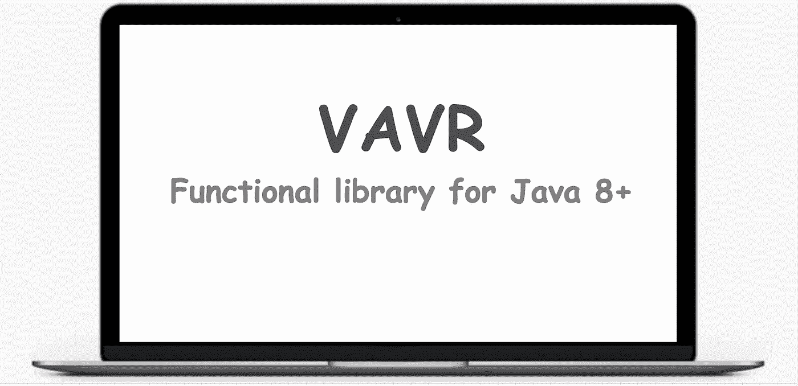

# Vavr:迈向 Java 函数式编程的又一步

> 原文：<https://levelup.gitconnected.com/vavr-another-step-towards-functional-programming-in-java-6929bbe914ce>

**Vavr** (之前被称为 SlangJava)，是一个函数库，它帮助我们使用函数式风格编写 Java 代码，就像我们用 Scala/JavaScript 编写代码一样。它有助于减少代码量并增加健壮性。每当我们想到函数式编程时，不变性是我们首先想到的。Vavr 提供了不可变的集合和对这些集合进行操作以获取所需结果的函数。



在函数式编程中，错误(或非局部 goto 语句的异常)不会被抛出，相反，它们还会与成功结果一起传递给管道的第一个方法。它有助于将程序可视化为管道，并且流程不会中断。Vavr 作为一个函数库，有助于实现这一切。

让我们通过一个例子来理解异常是如何传播回应用程序的入口点的。

引发异常的存储库方法:

```
@Service
public class EmployeeRepository {

     public String getEmployeeThrowsException2(int value) throws IOException, MalformedInputException {

           System.*out*.println("get employee throws exception for    employeeId");
           if(value == 1)
                 throw new IOException("get employee throws exception for employeeId");
           else
                 throw new MalformedInputException(value);
     }
}
```

调用存储库方法的服务方法:

```
@Service
public class EmployeeService {
     public Try<String> readEmployee() {
          //it takes only lambda function that's why vavr can be used with Java 8 or more
          return Try.*of*(() ->  employeeRepository.getEmployeeThrowsException2(10));
    }
}
```

控制器方法从服务方法的结果中获取值:

```
@RestController
@RequestMapping("/test")
public class EmployeeController {
@GetMapping("/read")
public String readEmployee() {

    Try<String> employee = employeeService.readEmployee();

    System.*out*.println(employee.isFailure()); //to check the readEmployee method response is having exception or not

    System.*out*.println(employee.isSuccess()); //to check the readEmployee method response is having exception or not

    //on success and failure, we can log or take other actions on Try
    employee.onSuccess(System.*out*::println);
    employee.onFailure(System.*out*::println);

    System.*out*.println("printing andThen before");

    //andThen has 2 implementations, so need to specify which implementation, we are intended to use
    //Consumer or Runnable
    //addFinally takes only runnable
    employee.andThen((Consumer<String>) System.*out*::println).andFinally(()-> System.*out*.println("I am done with finally channel")); System.*out*.println("printing andThen after");

    //in case of failure, failure can be recovered by this
    employee = employee.recover(IOException.class, "ioException handling").recover(FilerException.class,
            "filer exception handling"); System.*out*.println("printing andThen after recovering");

    //andThen gets executed only in case of success
    //andFinally get executed in both cases irrespective of the result
    employee.andThen((Consumer<String>) System.*out*::println).andFinally(()-> System.*out*.println("I am done with finally channel after recovering"));

    //now employee will have only success
    //value can be fetched using get method
    //return employee.get();

    //suppose you dont want to recover, we can use getOrElse method to provide default value in case of failure

    return employee.getOrElse("default value"); //here employee is already recovered, it will return recovered string only
}
}
```

## Vavr 的其他 API:

1.  **未来**:未来`Future.of()`是在某一时刻变得可用的计算结果。提供的所有操作都是非阻塞的。底层 ExecutorService 用于执行异步处理程序。它有两种状态:待定和已完成
2.  **Lazy:** Lazy `Lazy.of()`是一个一元容器类型，表示一个延迟求值的值。懒惰是记忆性的，因为它只计算一次，因此是引用透明的。引用透明性是指方法定义可以被其结果替换。
3.  **流:**`io.vavr.collection.Stream`实现是一个懒惰链表。仅在需要时才计算值。由于它的懒惰，大部分操作都是在恒定的时间内进行的。
4.  **TryWithResources**:`Try.*withResources()*`*可用于声明程序结束后必须关闭的资源。任何实现了 **AutoCloseable** 接口的类都可以作为资源传递。*

## *结论*

*通过遵循函数式编程风格，Vavr 可以使我们的代码更具可读性。异常不需要在流程之间使用 **try/catch** 块显式处理，并且可以由第一个调用者读取和恢复。默认情况下，它提供不可变的集合。Vavr 中的记忆化使得它的功能(处理它的集合)更加有效。请参考 https://www.vavr.io/的 vavr 官方文档以了解更多信息。*

*感谢阅读！*