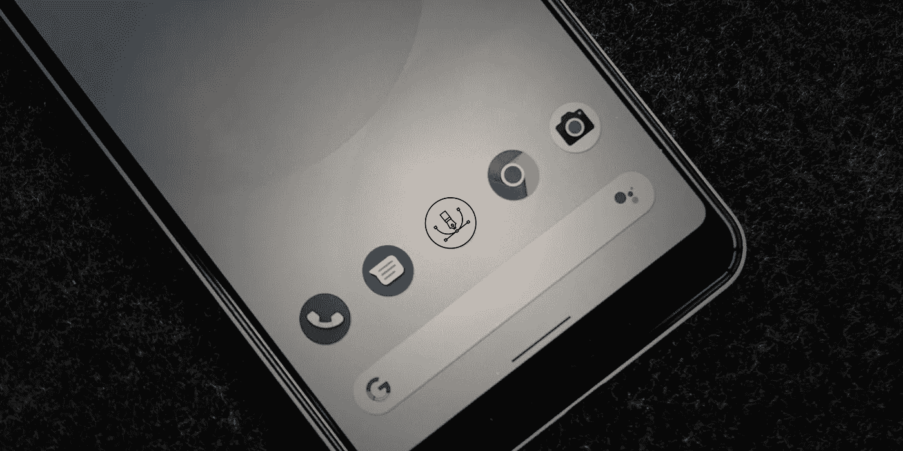

# 安卓矢量应用图标-完整指南。

> 原文：<https://levelup.gitconnected.com/vector-application-icon-for-android-a-complete-guide-en-658a3dab79a1>



在浏览 [Android 的文档](https://developer.android.com/studio/write/vector-asset-studio#kts)时，我注意到 26 版的 SDK 中不仅添加了自适应图标，而且在最新版本的 Android 上，可以完全忘记启动器的光栅应用图标。这意味着你根本不需要为每个屏幕分辨率创建一个位图图标，而是为所有可能的分辨率使用一个或两个矢量文件！由于光栅图标非常庞大，你可以节省大量的应用程序大小千字节。然而，它确实有一些局限性，我将在这里描述它们，也作为对其准备的整个过程的完整描述，包括它的一个视频。该指南还有[捷克语](https://tsinis.medium.com/vector-application-icon-for-android-a-complete-guide-cs-f5996ddbbea0)和[俄语](https://tsinis.medium.com/vector-application-icon-for-android-a-complete-guide-ru-6ef1d63b964b)两种语言版本。

# 开始之前

在整个应用程序中摆脱位图是许多优化者的梦想。特别是如果应用程序不是很大，并且 PNG 图标(如果制作不正确)几乎占据了整个应用程序大小的四分之一。但是它有一些缺点，让我们来谈谈，也许在你的情况下，矢量图标不是一个选项。所以:

*   Android 操作系统中的矢量格式是在版本 21 中引入的，只有在版本 26 和更高版本中，您才能在启动器中使用矢量图像作为应用程序图标。这意味着，如果你的应用也必须支持旧版本的 Android，你仍然需要为它们提供光栅图标。所以这里没什么好处。
*   Android 使用的矢量格式不是流行的 SVG/EPS/AI 格式，而是 XML，这意味着它的用途非常有限。这种格式不支持样式属性，即任何效果，混合，甚至最简单的阴影，模糊。你可以在视频的开头看到阴影发生了什么——它们消失了。如果你的团队中有一个相当熟练的图形设计师，那么一般来说，这个限制可以通过将阴影转换成从全色到完全透明的简单渐变来绕过。如果你根本没有矢量原作，或者那里的效果太多，大概游戏就得不偿失了。

这就是不利的一面。如果您的应用程序需要在仍然受安全补丁支持的设备上运行(即，在撰写本文时，它是 SDK 版本 27+)或者使用某种现代 Android 系统/传感器/设备功能，vector 图标是一个很好的选择。你可以节省图标的应用程序大小和文件——只有一两个矢量图像和一些带有描述的文件！听起来很酷吗？下面你会找到让这一切发生的秘诀。

# 准备文件

我不会深入到创建图标图像的细节，因为它们与其他自适应图标完全相同。互联网上有各种各样的自适应图标模板和教程，你可以全部使用它们，唯一的区别是——我们将最终使用 SVG 文件而不是 PNG 文件。也就是说，它将是一个/两个文件，第一个是背景，它应该有视差效果的“安全区域”和前景文件。在我的例子中，我使用了一个变体，其中背景只是一种颜色，所以我将有一个带有颜色描述的文件和一个带有矢量图形的文件。

因此，如果你有 SVG 文件，那么下一步是获得 Android Studio，但如果你正在为 Android 开发应用程序，你已经知道这个软件。这个免费的 IDE 可以从以下网址下载:

[https://developer.android.com/studio](https://developer.android.com/studio)

> **重要的**！向量资源只能使用版本 4.2.2 和更高版本创建。

启动 Studio，打开您的项目，加载后选择项目选项卡(左上方的第一个选项卡)。在包含资源的文件夹中，单击鼠标右键打开上下文菜单。选择其中的第一项—“新建”，然后选择“矢量资产”。Asset Studio 将打开，然后通过文件夹按钮选择类型:本地文件和路径。检查图标的外观，如果满意，请单击下一步。这将显示您的矢量图标 XML 文件的路径和名称。如果您在前景和背景中都使用了矢量，请对第二个文件重复这些步骤。完成了。

# 设置配置文件

因此图像已经准备好了，但是您的项目还不知道它们的路径以及如何显示它们。您需要添加/修改几个文件:

*   *build.gradle* —您需要在这里启用对矢量文件的支持，只需将这两行添加到配置和依赖项中:

```
android {
    defaultConfig {
        **vectorDrawables.useSupportLibrary = true**
    }
}

dependencies {
    **implementation("com.android.support:appcompat-v7:23.2.0")**
}
```

*   将文件夹“ *mipmap-anydpi-v26* ”添加到 resources 文件夹，即从名称可以看出，这些是 26 以上 OS 版本中任何 dpi 的资产。会有两个文件: *ic_launcher_round.xml* 和 *ic_launcher.xml* 在这两个文件中，你需要描述用什么做背景，用什么做前景。在我的例子中，它是背景的颜色和前景的矢量图形。
*   前一节中描述的东西必须添加到“ *drawable* ”文件夹中，如果您使用颜色作为背景，请在“ *values* ”目录中的 colors.xml 中描述该颜色。

**一般来说，下面是应该显示在您的 VCS 中的变更列表:**

您的 *defaultConfig* 和 *dependencies* 中至少有两行位于:
`./app/build.gradle`

“ *mipmap-anydpi-v26* ”文件夹中有两个新文件，位于:
`./app/src/main/res/mipmap-anydpi-v26/ic_launcher_round.xml`
`./app/src/main/res/mipmap-anydpi-v26/ic_launcher.xml`

“ *drawable* 文件夹:
`./app/src/main/res/drawable/ic_launcher_foreground.xml`中至少有一个新的前台 XML 文件

或者添加颜色作为背景:
`./app/src/main/res/values/colors.xml`
或者使用图像文件:
`./app/src/main/res/drawable/ic_launcher_background.xml` *(本指南中未介绍)*

现在，系统知道如何、在哪里以及用什么作为启动器的应用程序图标。运行全新安装并检查您的工作结果。如你所见，技术部分相当简单(与 PNG 图标相比)。

在下面的链接中，你可以找到视频示例中你需要的所有文件。您可以将它们用作应用程序的蓝图。感谢阅读！

[https://gist . github . com/tsin is/7580343 ef2c 973 be 231 B1 c 9 ca 4a 52 bb 1](https://gist.github.com/tsinis/7580343ef2c973be231b1c9ca4a52bb1)