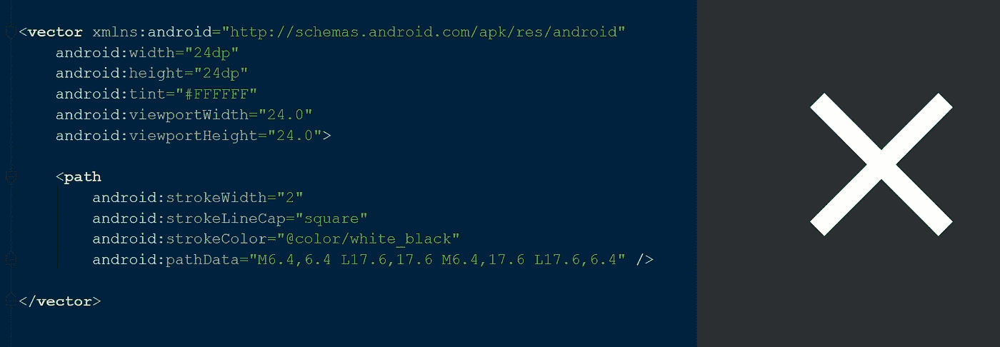

# 了解如何在 Android 中创建矢量资源

> 原文：<https://levelup.gitconnected.com/vector-asserts-in-android-f0774ba8bf92>

## 开始使用矢量资产时应该知道的一切。


# 为什么你应该在 Android 中使用矢量资源？

在目前的 Android 开发中，我们使用像 png 或 jpg 这样的位图格式的资源文件。这种类型的资源文件适合时代初期的 Android 开发。久而久之，安卓手机开始以不同的形状和尺寸出现。而且，密度不同。

为了让资源在所有设备上完美地工作，我们开始包含同一个文件的不同版本。


事实证明，所有这些资源都有固有的大小，它们的质量取决于像素，这对于今天的 Android 设备来说并不理想。

这个问题的理想解决方案是拥有一个不应该有多个副本的单一资源文件，并且它应该能够根据设备来调整其质量。这就是创建矢量绘图工具的目的。


# 矢量资产的优势

第一个优点是同一资源没有多个文件。除此之外，它们还很尖，很小，很有活力。

## 锋利的

它们很清晰，因为它们可以调整到任何屏幕大小，并且它们的质量不依赖于资源文件的像素。矢量资产是文本的，因此可以很好地压缩。

## 小的

由于我们不再包含同一资源的多个文件，文件的大小会变小。

## 可制作动画

这是你可以用矢量绘图来做的新事情，你不能用位图资源文件来实现。我们可以在代码中定义路径，并动态地将它们动画化。看一看


# 向量资产如何工作

在编译时，你的向量资产将被缩小到字节码。所以你的应用需要执行一些操作，从字节码生成一个模型对象，可以在屏幕上虚化。然后，您的应用程序使用一些画布操作在屏幕上绘制矢量资产的各个部分。如果向量资产不是动画向量，那么它将被存储在缓存**、**中以加速该过程。


另一方面，位图资源文件没有这些在屏幕上加载文件的步骤。你的应用程序只是解码位图并在屏幕上绘制。


一开始，Android 手机没有那么强大，所以在那个时候使用位图似乎是正确的。但在当今世界，Android 手机已经升级，现在是我们(AndroidDev)升级项目资产的时候了，因为矢量资产的优势超过了位图资产的优势。

# 矢量可绘制格式

Vector drawable 是一个 XML 文件，根节点为 Vector，内部节点有 path、stroke、solid 等，用于绘制断言的各个部分，并为它们分配颜色等属性。向量资源可以有一个或多个路径节点来绘制断言的不同部分。看看简单的向量断言文件

在上面的代码中，vector 节点具有 width 和 height 属性。当你把它放入高度和宽度为`wrap_content`的`imageview` 中时，这将是向量的大小。`viewportWidth` 和`viewportHeight` 是画布绘制路径的尺寸。其中视口和固有尺寸可以不同，但它们应该具有相同的纵横比。

# 如何创建矢量资产？

现在让我们看看如何在矢量绘图中绘制一条路径，这非常简单，我发现在开始绘制矢量之前，你应该学习五件事情。

**M** —表示**移动**笔到指定点。

**L** —表示从笔的当前点到指定点画一条**线**。

**C** —表示从笔的当前点到指定点画一条**曲线**。

**A** —指从笔的当前点到指定点画一条**弧**。

Z —表示**关闭**，当前路径结束。

现在让我们看一个简单的例子:让我们使用矢量绘图工具画一个十字标记。首先，看看我们的最终目标和我用来实现的代码，然后我会一步一步地解释如何实现它。



绘制十字标记的向量断言代码

在这里，我们使用路径节点来绘制路径，并使用`strokewidth`、`strokeColor` 等属性来为路径分配不同的属性，如宽度、颜色和线帽。

**strokeWidth:** 这个属性用来表示笔画的大小(这里是线条的大小)。
**strokeLineCap:** 该属性用于设计方形或圆形笔画的端点外观。看一看可用的类型。


**strokeLineCap** 属性的圆形、方形和对接样式

**strokeColor:** 该属性用于提及 path 属性中提及的实际路径的颜色。

## 小路

现在该看路径属性了，首先看一下总路径。

```
M6.4,6.4 L17.6,17.6 M6.4,17.6 L17.6,6.4
```

让我们看看当我们逐点绘制时会发生什么。

**M6.4，6.4 -** 这会将笔从 0，0 坐标移动到 6.4，6.4。因为它没有画任何东西，预览将是空的。看一看:


**L17.6，17.6 -** 这会从现在的点画一条线，是 6.4，6.4 到 17.6，17.6。看一看:


**M6.4，17.6 -** 这将再次把指针从 17.6，17.6 移动到 6.4，17.6。


**L17.6，6.4 -** 这会从现在的点画一条线，是 6.4，17.6 到 17.6，6.4。看一看:


这就是你现在可以创建自己的矢量资产。

在我们结束之前，我要感谢尼克·布彻。我从他在 KotlinConfig 2019 上的演讲中学到了我在这里提到的许多概念。如果你有兴趣，可以看看

你可以在[中](https://medium.com/@sgkantamani)、[推特](https://twitter.com/SG5202)和 [LinkedIn](https://www.linkedin.com/in/siva-kantamani-bb59309b/) 上找到我。

下次见，感谢阅读。