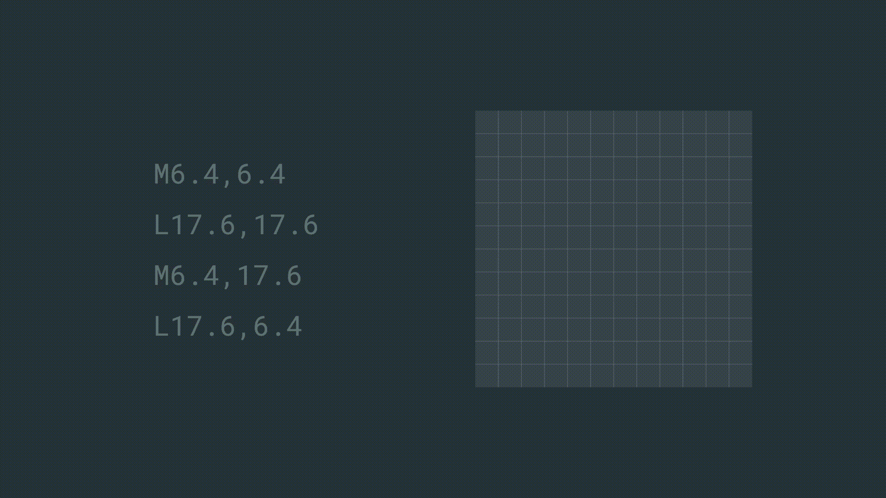
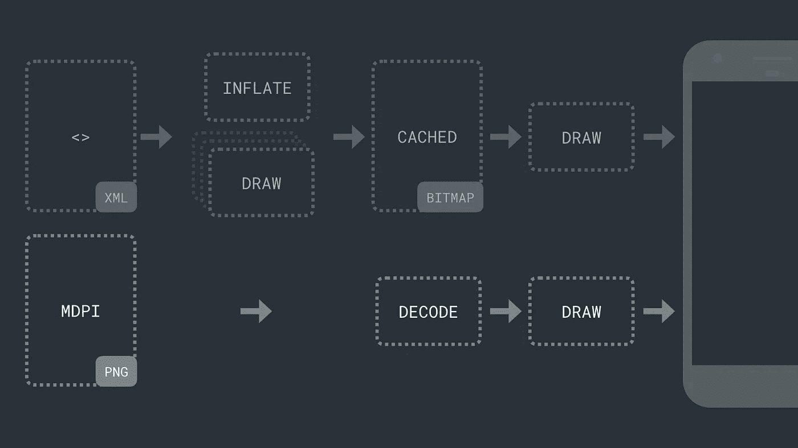

# 向量资产:在 Android 中创建图标和菜单项的强大方法

> 原文：<https://levelup.gitconnected.com/vector-assets-powerful-way-to-create-icons-and-menu-items-in-android-c28b469a7c9b>

几乎所有的 android 应用程序中都有图标和菜单项。最有效的方法是使用矢量资产。这是因为 android 有各种各样的设备(手机、平板电脑或可穿戴设备)，不同的屏幕尺寸和不同的屏幕密度。在 android 中，大多数资源都是位图格式，就像图像一样，有一个固有的范围，这使得我们的资源在屏幕密度不同的相同大小的设备上看起来不同。现在，人们可以通过对不同密度的同一资产使用不同版本来解决这个问题。另一方面，仅仅通过使用矢量格式，你只需要做一次。


以下是使用 android 矢量资产的显著优势:

1.  **更清晰的图像** —由于它们被分配了编程定义的尺寸，因此图标在不同的屏幕尺寸下都很清晰。
2.  **更小的尺寸** —矢量资产是文本的，这使得它们易于压缩。此外，我们只需要一个版本，而不是每个屏幕大小多个版本，这有助于我们使我们的应用程序更小。
3.  **可制作动画的** —因为矢量资产描述资产而不是保存实际的图像，所以它提供了做多种事情的机会，如添加动画或在运行时动态地进行更改。

# 我们如何制作矢量资产？

谈到可缩放图像，SVG(可缩放矢量图形)是 web 的标准，它使用任意 JavaScript 来添加动画。但是 SVG 不适合受限制的移动设备。但是 android 确实支持 SVG 的矢量绘制形式的路径规范。

它被写在具有如下属性的向量标签中:

*   **安卓:宽度** —固有宽度。
*   **安卓:身高** —内在身高。
*   **Android:viewport width**—画布宽度
*   **Android:viewport height**—画布高度

通常，宽度和高度以及 viewportWidth 和 viewportHeight 具有相同的纵横比。向量中可以有一个或多个 **path** 元素，pathData 是负责绘制路径的属性。让我们来看看它是如何工作的。



android:pathData

很像 PC Logo 您可以使用不同的命令来控制移动和动作。在这里，画布中某个点前的“M”代表“移动”“L”代表画一条线。下面列出了其他命令，您可以使用它们来绘制几乎任何形状:

*   **男**男
*   **行到**
*   **C** urve to
*   **一**区局来了
*   **Z** 关闭

在 path 元素中，我们有其他属性，如定义边界颜色的 strokeColor 和定义填充颜色的 fillColor。(注。我们还可以添加 android:alpha 属性，该属性采用 0–1 之间的值来改变颜色的不透明度。)

```
<vector ... />
    <path .../>
    <group
        android:name="egg"
        android:pivotX="8"
        android:pivotY="0"
        android:rotation="180"
        android:scaleX="1"
        android:translateY="-5" />
        <path .../>
    </group>
</vector>
```

矢量绘图也支持不同组路径之间的转换。像旋转、缩放、平移这样的变换，非常类似于 CSS。这里的 pivotX 和 pivotY 类似于 CSS 的 transform-origin 属性，它们定义了动画发生的原点。旋转属性用于根据用户给定的角度旋转图标。缩放用于改变图标的大小，平移用于相对于当前位置移动图标。这些对于动画来说是有益的，但是对于静态图标来说就不那么有用了。

在这里，我们也可以使用 clip-path，它屏蔽了要显示的区域。但是它不支持抗锯齿，这就是为什么它不被广泛使用的原因。

我们如何在应用程序中使用向量呢？现在，SDK 版本 21 (Lollipop)中增加了 vector drawable。我们通过静态版本的 VectorDrawable 类和动画版本的 AnimatedVectorDrawable 来使用它。但是它们也被反向移植到 jetpack 库，所以 VectorDrawableCompat 和 AnimatedVectorDrawableCompat 也是可用的。建议使用 VectorDrawableCompat，因为它允许 android 支持添加到后续版本的新功能，并提供新的错误修复。

# 如何使用矢量资产？

要在我们的应用程序中使用它，我们可以使用带有 srcCompat 属性的 ImageView 或带有 drawableCompat 属性的 TextView，例如

```
<!-- With ImageView -->
<ImageView
    app:srcCompat="@drawable/my_vector" /><!-- With TextView --><TextView
    app:drawableLeftCompat="@drawable/my_vector"
    app:drawableTint="@colot/vector_tint"
    app:drawableTintMode="src_in" />
```

或者，在 java 代码中使用它，

```
Drawable d = AppCompatResources.getDrawable(context,
       R.drawable.my_vector)
```

# 向量资产如何加载到我们的应用程序中？

矢量资产分两步加载到我们的应用程序中，首先，我们编写的 XML 文件被编译成二进制表示，并膨胀模型对象。其次，执行 canvas 操作来绘制这些二进制数据，这可能需要时间。但是对于静态矢量资源，我们可以将结果缓存到位图中，以避免后续的绘制。但是我们不能对动画向量做同样的事情。与 android 只需解码和绘制的位图相比，这是一个小小的缺点。



# 想要更多吗？

我将添加更多关于矢量资产的内容，包括转换过程、路径变形等等。