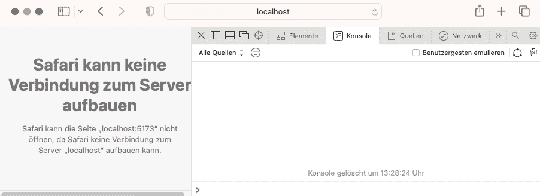

# VeeValidate 4:如何禁用提交按钮

> 原文：<https://levelup.gitconnected.com/veevalidate-4-how-to-disable-the-submit-button-2c893c437021>


[Florian Olivo](https://unsplash.com/@florianolv?utm_source=unsplash&utm_medium=referral&utm_content=creditCopyText) 在 [Unsplash](https://unsplash.com/s/photos/programming?utm_source=unsplash&utm_medium=referral&utm_content=creditCopyText) 上拍摄的照片

# 介绍

[VeeValidate](https://vee-validate.logaretm.com/v4/) 是最流行的 [Vue.js](https://vuejs.org) 表单库之一，可以帮助你验证表单输入——目前在版本 4 中可用。该库使得在提交表单时验证表单输入字段变得很容易。但是，有时您希望通过禁用 submit 按钮来通知用户表单尚未完全填写和验证。

# 在本指南中

在安装 VeeValidate 4 之前，用 [Vite](https://vitejs.dev/) 设置一个 Vue 3 项目。虽然带有`<script setup>`语法的组合 API 用于应用程序本身，但基本表单是用 VeeValidate 的`<Form /`和`<Field />`组件构建的，而不是用`useForm()`和`useField()`组合函数构建的。最终的表单将包含一个定制的提交按钮组件，只要没有使用`useIsFormValid()`和`useIsFormDirty()`组合函数完全填充和验证表单，该组件就会被禁用。

**注意，这个解决方案只是众多解决方案中的一个！**

# 先决条件

*   对如何使用 Vue 3 + Vite、组合 API 和`<script setup>`语法有基本的了解
*   基本了解如何使用 VeeValidate 4，如`<Form />`、`<Field />`和`<ErrorMessage />`组件。
*   你的机器上已经安装了 node.js

# 安装 Vue 3 和 VeeValidate 4

在所需的工作目录下打开您的终端，通过执行[文档](https://vuejs.org/guide/quick-start.html#with-build-tools)中描述的以下命令，用 Vite 初始化一个新的 Vue 3 应用程序:

```
npm init vue@latest
```

你可能会被要求安装官方的 Vue 项目搭建工具`create-vue@latest`。通过键入`y`确认安装，并点击*进入*。接下来，您可以键入一个项目名称并选择可选功能，这在本指南的上下文中是不需要的。因此，用`No`来回答所有的问题。

现在导航到项目根文件夹，添加 VeeValidate 并安装所有依赖项:

```
cd vue3_vite_i18n
npm add vee-validate
npm install
```

*为避免混淆，请注意:*`*src/components/*`*`*src/assets/*`*目录中的* `*create-vue@latest*` *创建的组件和 CSS 文件在本指南的上下文中是不需要的，可以删除。**

# *基本形式*

*出于演示目的，我们用以下内容替换`App.vue`组件的内容:*

*App.vue*

*`<template>`包含一个带有两个输入字段的表单，两个错误消息字段和一个提交表单的按钮组件。我们使用 VeeValidate 的`<Field />`组件，而不是为输入字段`firstName`和`lastName`使用 HTML5 `<input>`元素。两者都将被呈现为由`type` 属性指定的文本输入字段。*

*VeeValidate 使用用`:rules`属性定义的规则来验证输入。在上面的例子中，我们只检查字段是否包含任何值(第 9 行到第 11 行)。如果没有，我们返回一个错误消息。然后错误信息显示在相应的`<ErrorMessage />`组件中。为了正确工作，`<Field />`和相应的`<ErrorMessage />`组件的`name`属性值必须相同。*

*我们没有使用 HTML5 `<button>`元素来提交表单，而是使用了一个`<CustomButton />`组件，这个组件将在下一步中创建和解释。*

*表单的元素用 VeeValidate `<Form />`组件包装，而不是标准的 HTML5 `<form>`元素。提交时，VeeValidate 根据定义的规则验证表单的输入字段，然后调用开始标记(第 15 行)中定义的`onSubmit()`函数处理函数(第 5 到 7 行)。处理函数只是在控制台中记录表单值。*

# *提交按钮*

*在`src/components/`中创建一个新文件`CustomButton.vue`，内容如下:*

*<custombutton>组件</custombutton>*

*模板包含一个`<button>`元素，其`:disabled`属性通过计算属性`isDisabled`绑定到 VeeValidate 中的`useIsFormValid()`和`useIsformDirty()`辅助函数(第 8 到 9 行)。两个助手函数都从表单的`meta`状态返回计算的 refs 到`valid`和`dirty`属性的值，这可以分别用`valid.value`和`dirty.value`检索。当表单被成功验证时，`valid`变为`true`，否则变为`false`。`dirty`如果至少一个字段的值已被更改，则变为真。因此，只有当`isDirty`和`isValid`的值都为`true`时，`isDisabled`才会返回`false`。此时，表单被完全填充和验证，并且可以启用提交按钮。*

*使用`valid`和`dirty`属性而不仅仅是`valid`的原因是在表单还没有被验证的情况下`valid`可能是`true`。*

*来自`useIsFormValid()`上的[文档](https://vee-validate.logaretm.com/v4/api/composition-helpers#api-reference):*

> *基于`valid`属性创建被禁用的按钮是不准确的，因为如果表单还没有被验证，那么`valid`属性将是`true`，这是不准确的。您应该将`valid`检查与`dirty`状态结合起来，以获得最大的准确性。*

*需要指出的另一件事是`useIsFormValid()`和`useIsFormDirty()`助手函数可用于`<Form />`组件的子组件。这就是为什么提交按钮没有在`App.vue`中实现，而是在一个单独的组件中实现，而这个单独的组件又被用作`<Form />`组件的子组件。*

*来自[文档](https://vee-validate.logaretm.com/v4/api/composition-helpers):*

> *这些函数向子组件公开验证状态，大多数函数公开每个状态的两个变量。在表单级别和字段级别。*

# *结果*

*使用重新生成项目*

```
*npm run dev*
```

*并浏览至`[http://localhost1:5173](http://127.0.0.1:5173.)` [。](http://127.0.0.1:5173.)*

**

*如您所见，只要两个输入字段都无效，submit 按钮就会被禁用。*

# *摘要*

*使用 VeeValidate 4 进行表单验证时，可以通过不同方式禁用无效表单的提交按钮。在本指南中，我们使用了 VeeValidate `useIsFormDirty()`和`useIsFormValid()`助手函数来启用/禁用提交按钮。由于助手函数将验证状态暴露给`<Form />`子组件，提交按钮被实现为一个单独的组件，该组件又被用作`<Form />`的子组件。*

# *源代码*

*[要旨](https://gist.github.com/robinkloeckner/8538a3528039fc08955b22fc8c6e3ed4?file=CustomButton.vue)*