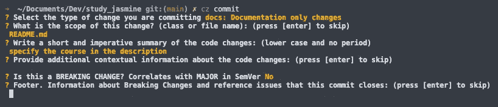

# Python 中带提交和版本标准化的自动变更日志

> 原文：<https://levelup.gitconnected.com/version-control-and-automatic-changelog-python-4d193ec90427>

## 如何为您的 Python 项目自动创建 CHANGELOG 并设置提交和版本标准化指南。


凯拉·霍泽尔在 [Unsplash](https://unsplash.com?utm_source=medium&utm_medium=referral) 上拍摄的照片

## 摘要

*   语义版本化；
*   常规提交；
*   自动变更日志生成器；
*   结论。

# 语义版本控制

语义版本化是在软件管理领域内创建的一种规则结构，这种结构旨在控制标签并避免一种称为“依赖地狱”的问题，这种问题会阻止发布给定应用程序的新版本或对依赖问题的研究，这种问题会随着项目的复杂性而增长。


随着复杂性的增长而增长的依赖性。

简而言之，用于映射标签的建议结构由 X.Y.Z (Major。Minor.Patch)，如下图所示，其中不再与先前版本兼容的更改导致了对 MAJOR 的更改。添加或更改当前版本，但仍然兼容的次要更改，增加次要版本。最后，仅与错误修复相关的版本会增加补丁的价值。


语义版本化结构。

这种结构是由[**Tom Preston-Werner**](https://tom.preston-werner.com/)[GitHub](https://github.com/)的联合创始人和 [Gravatar](https://pt.gravatar.com/) 的创建者提出的，通过遵循[语义版本化](https://semver.org/#semantic-versioning-specification-semver)的规则，开发者获得了好处，例如**映射代码**、**按时间顺序控制变更**、**版本间导航的可能性**和**依赖管理。**

 [## 语义版本 2.0.0

### 给定主要版本号。补丁，增加:主要版本当你做不兼容的 API 改变，次要…

semver.org](https://semver.org/) 

# 常规提交

当想到科学家或开发人员已经应用了与版本化他们的代码或研究笔记本相关的最佳实践时，留出空间来交流提交对于 Git 用户的重要性是值得的，因为提交由携带在存储库中应用的变更的消息组成，以便有助于理解变更。然而，趋势是随着项目的增长，提交变得不标准，消息失去了真正的意义，如下图所示。


没有提交模式的存储库历史示例。

在这一点上，我们提出了[常规提交](https://www.conventionalcommits.org/en/v1.0.0/)作为“为提交消息添加人类和机器可读含义的规范”的建议。这个约定通过为提交建立一个结构来工作，这可以在下面演示。

```
<type>[optional scope]: <description>[optional body][optional footer(s)]
```

基本上，约定内的提交开始使用一个类型(可以是`fix`、`feat`、`build`、`chore`、`ci`、`docs`、`style`、`refactor`、`perf`或`test`)，后跟主消息。其他参数是可选的。

因此，举例来说，公约结构内的一些承诺将是:

```
1) docs: correct spelling of CHANGELOG2) feat(lang): add Polish language3) fix: prevent racing of requests Introduce a request id and a reference to latest request. Dismiss
   incoming responses other than from latest request. Remove timeouts which were used to mitigate the racing issue but are obsolete now. Reviewed-by: Z
   Refs: #123
```

采用这种结构后，传统的提交格言变成了现实，为机器和项目的受益者带来了语义。

 [## 常规提交

### 为提交消息添加人类和机器可读含义的规范

www.conventionalcommits.org](https://www.conventionalcommits.org/en/v1.0.0/) 

## 承诺

有助于采用传统提交的工具是 [Commitizen](https://commitizen-tools.github.io/commitizen/) 。在这个工具的功能中，提到了它用用户界面格式化提交，所以它不需要记住提交的默认结构。

在安装 Python 3.6+和 Git 1.8.5.2+作为先决条件后，可以通过在终端中使用以下命令轻松安装该工具:

```
sudo pip3 install -U Commitizen (Linux)brew install commitizen(macOS)
```

它的常见用途是格式化提交，可以通过以下方式执行:

```
cz commit
```

上面的命令将在终端中演示一些帮助格式化提交的选项，如下图所示。



使用 commitizen 的示例。

 [## 承诺

### 文档:https://commitizen-tools.github.io/commitizen/ commit izen 是一个为团队设计的工具。它的主要目的…

提交-tools.github.io](https://commitizen-tools.github.io/commitizen/) 

# 自动变更日志生成器

在标准化了提交以及存储库中的版本控制之后，就可以自动创建和更新 CHANGELOG，它对应于一个包含所有变更记录的列表。这个变更列表的好处是，有了它，就有了一个特定的地方来查找项目中所做的变更，就有可能将它们呈现给项目领导以及所有相关方。

为了实现这种自动化，有必要使用 commitzen 工具，尽管也有其他工具可以实现相同的目标，例如[自动变更日志](https://pypi.org/project/auto-changelog/)库。

第一步是启动存储库中的 commitzen 配置文件，这可以通过在终端中运行以下命令来完成:

```
cz init
```

执行此命令后，将显示终端中要选择的选项列表，以便建立版本配置。随意使用下图作为配置示例，放置所有参数后，一个`pyproject.toml`文件将被插入到项目中，以便建立版本控制。


正在配置提交设置。

在终端中运行的下一个命令将是:

```
cz bump --files-only
```

此命令将更新项目的版本，并假设版本控制文件已随本教程的演练一起创建，将建立项目的第一个版本。


创建第一个项目版本。

最后，下一个命令将创建一个 CHANGELOG.md 文件，这样它将包含所有标准化的提交，并由提交类型分隔。

```
cz changelog
```


自动生成的变更日志示例。

# 结论

通过为我们工作的项目建立代码标准、语义版本化和常规提交，我们提高了所呈现的专业水平，因此我们能够发展为自动化，向所有对项目感兴趣的人交付价值，这在今天的文章中得到证明，当时我们用几个命令行生成了一个 changelog。这对于开发人员和数据科学家来说都是可以实现的，因为当应用这些实践时，可以更好地组织项目。