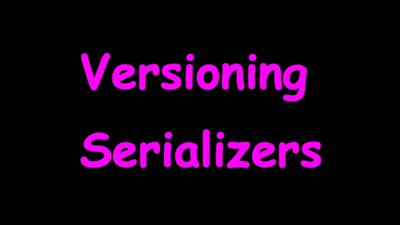
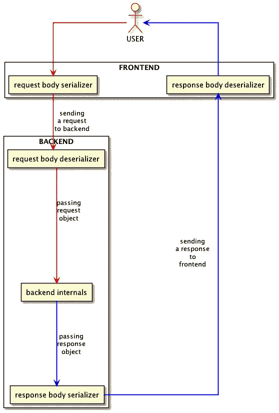

# 版本控制序列化程序

> 原文：<https://levelup.gitconnected.com/versioning-serializers-4cf7afa54141>

在分布式系统中，微服务使用预定义的通信协议在彼此之间交换信息。当软件开发人员独立更改不同的微服务时，数据序列化可能会出现一些中断。在本文中，我将重新审视版本化序列化程序以及在整个系统中传播它们的变化的最相关的实践。

# 通信协议

OSI 模型为互联网上的通信建立了 7 个抽象层。微服务通常使用最后的第七层交换信息，称为*应用层*，利用预先存在的协议，如 HTTP 或定制的协议。我发现值得注意的是，HTTP/2 协议依赖于 TCP 协议(*传输层*)，而 TCP 协议又依赖于 IP 协议(*互联网层*)——这意味着在两台机器之间共享信息涉及的工作*比看上去的*要多。我不会在这里描述文本和二进制协议之间的根本区别，但我想强调的是，与属于后者家族的 TCP 和 IP 协议相比，HTTP 属于前者家族。从现在开始，我将在 HTTP 协议的范围内讨论序列化，主要是因为它在分布式系统中的流行和适用性。使用上述协议，开发者可以以如下方式传输合理大小的信息:

*   *请求行*(包括查询参数)、
*   *请求或响应的报头*(协议允许自定义)，
*   *请求或响应的消息体*。

要进行任何有意义的通信，必须存在理解这些组件中包含的信息的精确规则。

在请求行、报头和消息体中包含信息的示例性 HTTP 请求。

如果服务可以对一条信息进行编码以满足 URI 编码的要求，它可以使用请求线来传输数据。尽管有不同的限制，定制头也会发生同样的情况。`Content-Type`头定义了消息体的适用格式；XML、JSON 和 YAML 是微服务之间共享信息最流行的格式。

即使微服务可能理解消息体包含 JSON 结构，它也需要知道如何提取适当的信息。它需要一个组件知道在消息中查找哪些字段，以及它们的预期值类型。在我所知的大多数系统中，开发者称这样的组件为*解串器*或*解码器*。

# *序列化和反序列化*

我将*序列化*理解为将依赖于环境的*内存对象*转换为其在特定介质(例如，互联网)上的可转移表示的过程。称为*反序列化*的反向操作可能会在不同的环境中重新创建初始对象，使用不同的编程语言、不同的字符串编码或不同的 CPU 架构。由于*序列化*和*反序列化*协同工作，我相信任何分布式系统都不应该以比后者更高的相关性对待前者；如果其中任何一个失败，有问题的系统就不能可靠地工作。

微服务使用称为串行化器和去串行化器的特殊组件来执行前述操作。任何(反)序列化器都是使用它的微服务的一部分，因此，它很大程度上依赖于所用编程语言的类型系统。理论上，可以使用描述语言对某个实体的表示进行建模，并使用各自的编程语言为发送方和接收方生成专用的(反)串行化器；但是，这种解决方案可能需要绑定，而对于某些堆栈来说，这种绑定尚不存在。

如果发送方和接收方使用相同的编程语言，他们的开发人员可能会使用例如库、`git submodule`或`git subtree`产生一次串行化器和去串行化器并共享结果代码。一些编程语言，即 Java，允许实例的平台相关的序列化，包括其类的版本。我建议读者阅读关于本机序列化的内容，以了解其他开发人员对所讨论问题的体验。对象表示的反序列化可以以严格的方式工作，这意味着反序列化器只处理显式属性，忽略未完成的属性或抛出错误。我通常倾向于严格的方法，因为我认为接收额外的属性是一个危险信号。此外，我认为所有的反序列化失败都需要一个错误类日志条目，尤其是在封闭的专有系统中。

# *版本控制*

当系统设计者希望序列化程序和反序列化程序随时间变化时，这些组件需要版本控制。将版本控制应用于所有组件还是只是它们的一个子集，这个决定还是属于架构师的。不管具体选择是什么，开发人员都必须设计一个过渡计划，将有问题的系统从一个版本的(反)串行化器转移到另一个版本。

当代互联网产品最基本的模型由 3 个要素组成:物理用户、前端应用和后端服务器。用户使用前端向后端发出命令，利用连接上述系统组件的通信协议。我在下图中举例说明了这个概念:

显示用户、前端和后端之间简化通信的图表。使用 PlantUML 创建。

我发现指出存在两类串行化器/解串行化器对是至关重要的:一类用于*请求体*，另一类用于*响应体*。这意味着如果软件开发者改变了这两个组合，系统将需要处理 4 个组合:

*   *旧请求体对象*与*旧响应体对象*(旧状态)，
*   *旧请求体对象*与*新响应体对象*(前向转换状态)，
*   *新请求体对象*与*旧响应体对象*(后向转换状态)，
*   *新请求体对象*与*新响应体对象*(新状态)。

如果可能的话，系统架构师应该以一种在转换状态中不发生信息交换的方式来计划转换，以免通信变得不可靠——从定义(反)序列化程序或相关 API 端点的版本开始。

## 手动版本控制

在以下情况下，系统可能会使用手动版本化(反)序列化程序:

*   串行器/解串器对在不同技术栈的微服务上工作，
*   共享的串行化器(如果存在的话)不支持散列的概念，
*   系统架构师希望能够轻松区分不同版本的序列化程序。

开发人员可以将版本表示为整数，或者与语义版本兼容的字符串。版本的传输通过不可缓存的 HTTP 头(如`X-Request-Body-Serializer-Version`)或作为消息体中根对象的属性(如`serializerVersion`)进行。

## 基于哈希的版本控制

当(反)序列化程序可以创建自己的哈希时，开发人员可能会使用基于哈希的版本控制。创建一个合适的散列函数本身就是一个相当大的挑战，因此我设计了一个与称为编解码器的 *io-ts* (解)串行化器一起工作的函数，如下例所示:

一个非常简单的基于哈希的 io-ts 编解码器版本工具。

系统组件可以再次使用不可缓存的 HTTP 报头(例如`X-Request-Body-Serializer-Hash`)或者作为消息体的根对象上的属性(例如`serializerHash`)来指定版本。

## *实施&部署*

如果前面提到的两个串行器/解串器对都发生了变化，应该会发生以下情况:

*   改变后的后端支持*旧*和*新*对(或者说，*旧*和*新*状态)，
*   变更后的前端仅识别出*新*对(即*新*状态)。

这确保了在*新*版本的后端上线后，旧版本的前端应用程序仍然可以使用旧*状态。后端部署完成后，开发者可以发布*新*版本的前端，它将与*新*状态一起工作。后端必须根据传入的 HTTP 头或请求消息体中根对象的版本属性选择合适的序列化程序；这同样适用于用于响应消息体的反序列化器。在更高级的系统中，特定后端的负载平衡器可能使用提供的 HTTP 头将调用者指向具有特定序列化程序版本的后端实例。在某些情况下，旧的串行化器可以通过利用例如某些属性的默认值，使用简单的转换来构建来自新的串行化器的对象。*

# 摘要

尽管我展示了两种版本化序列化程序的方法，但是还有更多的方法，尤其是如果系统架构师允许创建版本化端点的话。我相信确保没有停机时间是分布式系统中任何转换的最重要的方面，除非另有说明。我鼓励有经验的读者写一个评论，如果你最近偶然发现了一个不同的解决上述问题的方法。