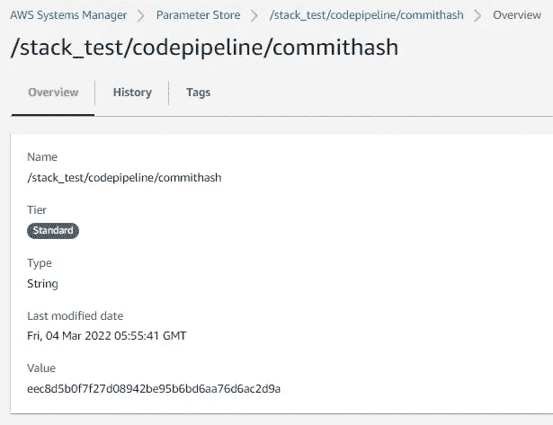

# 版本控制 Thy Infra:在 CICD 管道中用 Git 提交哈希标记 AWS 资源

> 原文：<https://levelup.gitconnected.com/versioning-thy-infra-tagging-aws-resources-with-git-commit-hash-in-cicd-pipelines-75bb4a21f359>

## 通过使用 AWS CodePipeline，CloudFormation，Lambda 和 Python。

埃里克·范·迪克在 [Unsplash](https://unsplash.com?utm_source=medium&utm_medium=referral) 上的照片

如果您的团队遵循领先的 DevOps 实践，那么您很有可能将基础设施作为代码(IaC)来维护。IaC 方法加快了基础架构及其配置的一致且可重复的部署。IaC 特别有用的一个用例是在 CICD 管道中，您的代码在发布到生产环境之前会经历一系列阶段，例如构建、测试和部署。通常在这样的管道中，在测试变更的地方使用一个暂存环境/帐户。这种暂存帐户通常在本质上是短暂的，即作为发布周期的一部分，暂存帐户中的资源被供应(使用 IaC)，针对供应的资源执行测试，并且基于测试的结果，确定将更改分级到生产环境/帐户是否安全。

在所有这些和许多其他场景中，你的 IaC 也在进化。例如，您可以从初始版本的 S3 桶配置开始，并将 IaC(例如使用 CloudFormation、CDK 或 Terraform 等)存储在您的版本控制系统(例如 Git)中。经过一两次冲刺后，您发现需要改变 S3 铲斗的配置。因此，您将更新您的 IaC 脚本/模板，并将更新的版本推/提交给 Git。如果现在调配了基础架构，您的环境中将有一个更新的 S3 存储桶，它可以是您执行测试所依据的堆栈的一部分。现在，在任何时候，如果您想要确定您的基础架构的状态，即您当前的基础架构配置基于哪个版本的代码，这可能会变得很棘手。当然，您可以通过您的 CICD 工具跟踪过去的部署，以确定哪个最新的 Git commit 代码被部署到您的基础设施中。然而，如果你能以一种快速简单的方式收集这些信息，它会特别有帮助。例如，仅通过查看您的基础设施资源(例如，通过标记)，如果您能够确定它们对应于哪个 Git 提交，它可以帮助您理解预期的行为，并且还可以在需要时帮助进行故障排除或回滚。Git 提交在概念上代表了提交时特定时间点的代码版本(在这里阅读更多关于这个[的内容](https://www.mikestreety.co.uk/blog/the-git-commit-hash/))。

在本文中，我将介绍如何通过 Amazon 原生服务在 AWS 中实现这一切。具体来说，我将介绍如何在 CICD 管道中用 Git 提交散列来标记您的资源。如果您希望在部署管道期间将标记动态地应用到您所提供的资源，那么您可以将这里的概念用于类似的用例。

简单来说，该流程由以下步骤组成:

*   Lamba 函数将从 CICD 管道的“源”级检索提交散列。该函数将把它作为一个参数存储在亚马逊系统管理器(SSM)中。
*   在云形成模板中，SSM 参数将在资源的“标签”属性中被引用。这将导致用更新的提交散列来添加/更新资源的标签。
*   CodePipeline 将用于协调 CICD 管道的不同阶段。从技术上来说，由于我不是在构建代码或运行测试用例，所以它不完全是一个 CI 管道，但为了简单起见，我在本文中使用 CICD 关键字。

让我们来看看该解决方案中涉及的组件的详细信息:

# 代码管道:

AWS 代码管道中的管道应如下所示:

关键点:

*   它包括三个阶段。第一个阶段是“源代码”阶段，代表源代码所在的位置。在这种情况下，它的 Github。我已经将它配置为连接到我的 Github repo，它指向那里的一个特定分支(主)。这是通过 CodeStar 完成的(更多细节[在这里](https://docs.aws.amazon.com/codepipeline/latest/userguide/connections-github.html)

*   第二阶段(UpdateCommitHash)由一个调用现有 Lambda 函数的操作组(RunCommitHashLambda)组成。这个 Lambda 函数(代码将在本文后面介绍)负责从 CodePipeline 事件中检索提交散列，并将其存储为 SSM 参数。

*   第三阶段(Deploy)也由单个操作组(StorageLayer)组成，并使用 CloudFormation 来部署资源。Cloudformation 模板位于 Git 中我的代码库(aws-devops/s3_bucket.yaml)中，它是在这个阶段指定的:

# λ函数:

逻辑的核心是在 Lambda 函数中实现的。它的代码看起来像这样:

代码通过注释和 docstring 被完整地记录下来，因此应该是不言自明的。几个要点:

*   从 CodePipeline 传递给 Lambda 函数的事件如下所示:

注意，InputArtifacts 部分中的“revision”表示提交散列。

*   如果像这样的 Lambda 函数打算与 CodePipeline 一起使用，那么使用 CodePipeline boto3 客户端来相应地更新作业的状态(即，将作业标记为成功或失败)是很重要的。如果没有完成，CodePipeline 中的作业将停留在“进行中”状态，必须手动停止。即使 Lambda 函数执行失败，它也不会在 CodePipeline 中注册，您必须在异常处理逻辑中将 CodePipeline 作业状态显式更新为 fail。这就是为什么您会注意到代码中使用了*code pipeline _ client . put _ job _ failure _ result()*和*code pipeline _ client . put _ job _ success _ result()*方法调用。
*   请确保您的 Lambda 函数有权更新 SSM 参数和代码管道作业状态。您可以配置附加到 Lambda 函数的 IAM 角色的 IAM 策略。否则，您将得到 AccessDenied 错误。

# 云的形成:

拼图的最后一块是 CloudFormation 模板，它引用了资源标签属性中的 SSM 参数。这是一个简单的云形成模板，它部署了一个 S3 桶:

关键点:

*   在第 7–9 行，我定义了一个 SSM 类型的云形成参数。此外，我在“默认”值，我正在传递 SSM 参数的名称，其中 Lambda 函数存储更新的提交哈希。
*   在第 32–33 行，我指的是 S3 桶的标签属性部分中的云形成参数。这将在创建时将标签应用到 S3 存储桶。

# 灯光、摄像机、动作:

当所有的难题都解决后，当您运行代码管道时，您将会看到想要的结果:

如果我对我的 repo 进行提交，我的提交散列将按如下方式生成:

由于 CodePipeline 与 Github 的完美集成，它自动触发我的管道，并成功完成每个阶段:

我可以从 Cloudwatch 验证 Lambda 函数得到了执行:

SSM 参数用提交散列值更新:

创建了一个 CloudFormation 堆栈，它部署了我的资源(S3 存储桶通过逻辑 ID“RawPayloadBucket”表示):

最重要的是，创建的 bucket 具有所需的标记:

令人惊奇不是吗？

我希望你能从这种方法中学到一些东西。你可以以此为基础，实现很多有趣的事情。AWS CodePipeline 与 AWS 服务进行了本机集成，无缝集成 Lambda 和 CloudFormation 的能力帮助我们实现了很大的灵活性。

编码快乐！