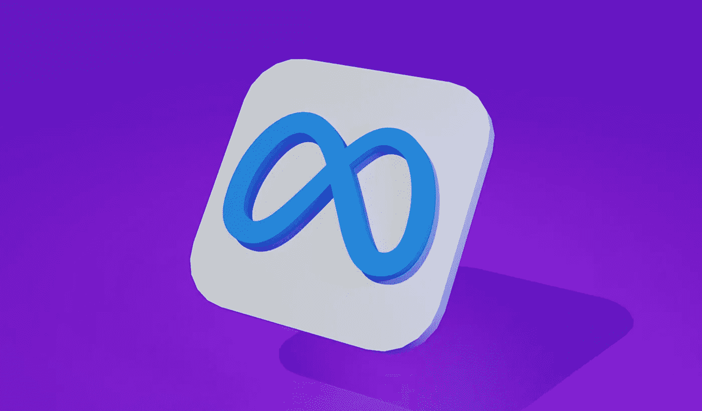
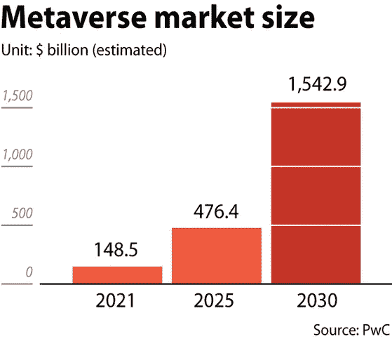

# 视频游戏股票一决高下，成为元宇宙的明星

> 原文：<https://levelup.gitconnected.com/video-game-stocks-battle-it-out-to-become-the-stars-of-the-metaverse-fa7ee342d824>

随着越来越多的公司继续争相适应有望永远改变我们生活的新兴技术，元宇宙将成为 2022 年的流行语。脸书将自己更名为 Meta，旨在为变革性技术做好准备——这表明该公司对元宇宙的重视程度。然而，在看蓝筹股如何争先恐后地适应元宇宙的时候，我们可能会忽略视频游戏公司将在实现下一个数字前沿中发挥的关键作用。

我们已经看到主要的科技公司着眼于元宇宙的游戏世界。最近，微软以 687 亿美元收购了动视暴雪，微软首席执行官[塞特亚·纳德拉](https://www.theverge.com/2022/1/18/22889258/microsoft-activision-blizzard-xbox-acquisition-call-of-duty-overwatch)声称这笔交易“将在元宇宙平台的发展中发挥关键作用”

元宇宙将为个人提供统一和可互操作的虚拟体验，在这种体验中，我们将能够通过高级人机交互(HCI)硬件和软件在数字世界中相互交流。

这项新兴技术的影响是巨大的，但在我们开始带着虚拟现实耳机去购物和参加商务会议之前，它可能会扰乱 VR 游戏的世界。

目前，VR 游戏可以作为独立的应用程序使用，可以安装在桌面 PC、智能手机或 VR 耳机上，以体验更具沉浸感的视频游戏渲染。这个 3D 世界允许用户观看 360 度的风景，并通过数字渲染的感知与周围的世界互动。

然而，元宇宙接受了这个想法，并在[大规模推广。通过元宇宙，多个虚拟现实游戏可以与其他虚拟现实应用程序或在线空间互连——为用户铺平了一个单一且完全可互操作的环境。](https://www.xrtoday.com/virtual-reality/gaming-in-the-metaverse-the-next-frontier/#:~:text=What%20Does%20Gaming%20in%20the,gaming%20to%20incredible%20new%20heights.)

这将使玩家能够在游戏应用程序中导航，与不同空间的其他玩家互动，并无缝分享他们的进度-所有这些都无需摘下他们的虚拟现实耳机。

*(图片:* [*【韩国日报】*](https://koreajoongangdaily.joins.com/2021/07/01/business/finance/metaverse-zepeto-roblox/20210701190000577.html) *)*

正如我们从上面的数据中可以看到的，对于那些作为早期市场领导者出现的公司来说，推动适应元宇宙将是一个非常有利可图的过程。据估计，到 2030 年，元宇宙的市场规模将达到 1.5 万亿美元，它将成为一项变革性的技术，它将改变华尔街，就像它将改变社会一样。

考虑到这一点，让我们更深入地看看[元宇宙](/buying-into-the-metaverse-5-high-potential-metaverse-stocks-to-invest-in-d7da99daf077)如何对视频游戏股票产生地震般的影响:

# 成为视频游戏的迪士尼

微软在 2022 年 1 月收购动视的交易是视频游戏公司收购系列中的最新一起。在收购之前，微软已经收购了 23 家游戏工作室，包括《《我的世界》》、《辐射》和《战争机器》等热门游戏的制作方。现在，随着动视的出现，微软也有了行业领先的热门游戏，如《使命召唤》、《魔兽争霸》、《守望先锋》和《暗黑破坏神》——它还拥有著名的智能手机称号《糖果粉碎》。

就规模而言，动视的游戏每月聚集了 1.19 亿活跃用户。

微软的行为似乎是有意效仿迪士尼收购皮克斯(Pixar)等工作室所取得的成功。该公司希望它能在《元宇宙就绪》系列电影的未来发展中发挥主导作用，并效仿迪士尼在皮克斯和最近的《漫威》中多产的成功表现。

微软游戏公司首席执行官菲尔·斯潘塞在接受《美国消费者新闻与商业频道》采访时表示:“我们认为，元宇宙将是一个由特许经营所支撑的社区集合，无论是《使命召唤》、《魔兽世界》还是《糖果粉碎》,那些拥有数亿玩家的特许经营都将成为我们所认为的巨大虚拟世界的基础。”。

# 元宇宙对华尔街的影响

虽然元宇宙的[到来很可能在遥远的未来发生，但它的影响已经可以在整个华尔街感受到，因为各公司都在争先恐后地为变革的未来做准备。](/metaverse-what-is-it-and-what-can-it-be-1173a0e65d73)

虽然刚刚更名的 Meta 是已经采取行动拥抱元宇宙的最值得注意的股票，但在不久的将来，无数视频游戏股票也将受到新兴技术的影响。

自由金融欧洲投资顾问主管马克西姆·曼图罗夫(Maxim Manturov)说:“视频游戏制造商，如 Roblox 、电子艺界(Electronic Arts)、动视暴雪(Activision Blizzard)和 Take Two Interactive，也值得注意。Take Two Interactive 拥有在线 GTA，可能是目前最大的元宇宙之一。”

“除了通常的电话会议服务，元宇宙还为公司提供了许多实际的好处。更不用说，就连科技界的一些知名人士现在也开始转向这个新兴行业。”

对于投资者来说，视频游戏行业可能是一个在[被低估的空间，目前对于元宇宙](https://www.businessinsider.com/metaverse-stocks-to-buy-three-companies-set-to-soar-expert-2022-2?r=US&IR=T)投资来说，这似乎是违反直觉的，因为随着景观的发展，该行业有可能成为潮流引领者。

考虑到这一点，可能值得关注那些提供可能演变成与元宇宙兼容的[产品的视频游戏股票。微软可能正在迅速将自己定位为行业领导者，但沉浸式游戏体验中仍有大量投资机会尚未开发。](/roblox-and-healthcares-metaverse-1ed8d83bdbee)