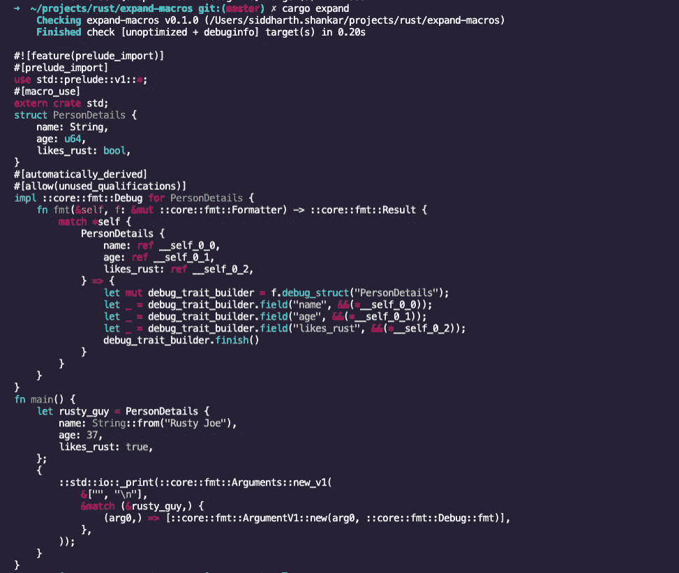

# 在 Rust 中查看您的“黑暗代码”

> 原文：<https://levelup.gitconnected.com/view-your-dark-code-in-rust-3b2e9699ea7e>

## 并且知道你的代码真正在做什么

“我可以拥有黑暗代码吗？”—[米哈伊尔·瓦西里耶夫](https://unsplash.com/@miklevasilyev?utm_source=unsplash&utm_medium=referral&utm_content=creditCopyText)在 [Unsplash](https://unsplash.com/s/photos/hide?utm_source=unsplash&utm_medium=referral&utm_content=creditCopyText) 上的照片

[宏](https://doc.rust-lang.org/1.7.0/book/macros.html)和[属性](https://doc.rust-lang.org/reference/attributes.html)在 Rust 中比比皆是，而且经常有用(不，重要！)来了解他们是如何改变你的源代码的。这些知识对帮助您很重要:

1.  更深入地了解您的代码在做什么。
2.  当使用宏或属性产生意外结果时，可以更容易、更有效地调试源代码。

[**cargo-expand**](https://github.com/dtolnay/cargo-expand) 是一个有用的 cargo 子命令，可以安装并运行它来“扩展”您源代码中的宏和属性(以下统称为“代码快捷方式”)，并向您显示正在生成的代码。

假设您从下面的代码开始，其中我们有一个简单的叫做`PersonDetails`的`struct`，我们希望这个类型是可打印的。

代码如下所示:

我通过使用从`fmt::Debug`特征派生的`Derive`属性，使`PersonDetails` [可打印](https://doc.rust-lang.org/rust-by-example/hello/print/print_debug.html)。

> 但是*如何* *准确地*使用这个属性和`fmt::Debug`特征使结构可打印呢？
> 
> 事实证明，您可以 ***扩展*** 属性，并使用 **rust** 编译器查看生成的代码。

不幸的是:

1.  扩展代码快捷方式所需的`rustc`命令要求您首先安装，然后手动切换到 rust nightly 工具链。
2.  生成的代码打印到终端，带有不理想的**格式**，没有**语法高亮**。
3.  完成后，您需要切换回非夜间版本的工具链。

在我的项目根目录下，我需要运行:

`rustup override set nightly`

然后:

`cargo rustc —-profile=check -- -Zunstable-options --pretty=expanded`

产生以下结果:

使用带有右标志的 rustc 扩展输出。

您会发现有些地方的格式很简单，尤其是在`main`函数中。

让我们用 [cargo-expand](https://github.com/dtolnay/cargo-expand) 做同样的事情。

`cargo install cargo-expand`

如果您的系统上安装了`rustfmt`工具，cargo-expand 将使用它来格式化/修饰生成的代码。

即使没有安装`rustfmt`也可以运行`cargo expand`。要安装`rustfmt`运行:

`rustup component add rustfmt`

虽然 cargo-expand 也在幕后使用 rust 的夜间构建，但它并不期望您手动更改您正在工作的项目的默认工具链。

使用 cargo-expand 扩展同一个示例中的代码快捷方式会产生:

使用“货物扩展”扩展代码输出

观察到:

1.  格式化时，输出可以更好地利用空白。✨
2.  输出是语法高亮显示的！🎉

前进，探索，并在包含其他宏的代码上尝试`cargo expand`比如`vec!`或者使用[这些超级有用的属性](https://blog.usejournal.com/6-useful-rust-macros-that-you-might-not-have-seen-before-59d1386f7bc5)。

# 参考

货物扩展:[https://github.com/dtolnay/cargo-expand](https://github.com/dtolnay/cargo-expand)

鲁斯特普:[https://rustup.rs/](https://rustup.rs/)

https://github.com/rust-lang/rustfmt

宏:[https://doc.rust-lang.org/1.7.0/book/macros.html](https://doc.rust-lang.org/1.7.0/book/macros.html)

属性:[https://doc.rust-lang.org/reference/attributes.html](https://doc.rust-lang.org/reference/attributes.html)

6 个你以前可能没见过的有用的 Rust 宏:[https://blog . use journal . com/6-useful-Rust-macros-the-you-may-not-before-seen-59d 1386 F7 BC 5](https://blog.usejournal.com/6-useful-rust-macros-that-you-might-not-have-seen-before-59d1386f7bc5)