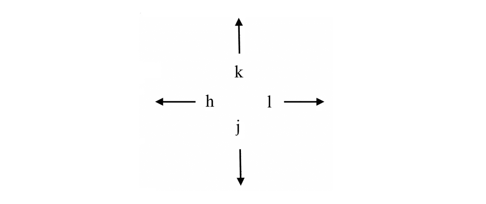
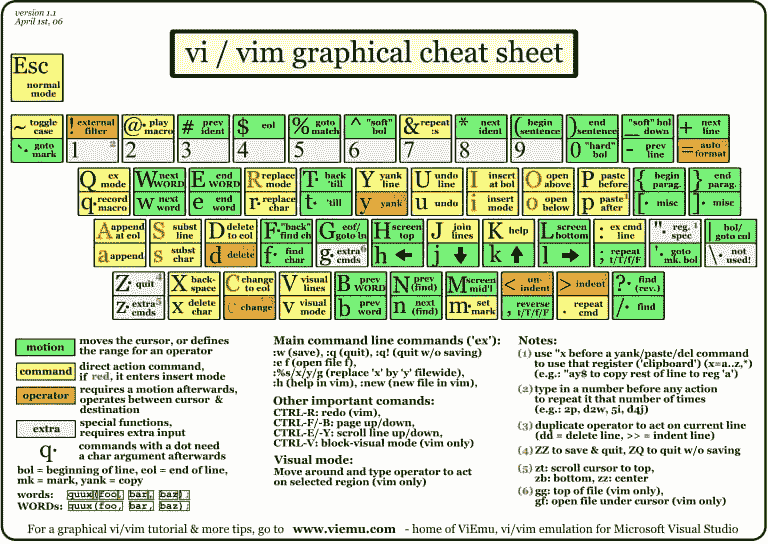

# Vim:操作指南

> 原文：<https://levelup.gitconnected.com/vim-a-how-to-guide-55f63bfdcff>

# 使用 Vim 加快编程的关键技术


费德里科·托马塞蒂的照片

“生活的期望取决于勤奋；技工要完善他的工作，必须先磨利他的工具。”

——孔子

## Vim 是什么？

Vim 是一个文本编辑器。它是开发人员用来编辑代码的强大工具。

您可以使用 Vim 做什么:

*   浏览+编辑文件(包括远程编辑)
*   打开标签
*   分屏功能(水平或垂直分屏)
*   运行 linux 命令，*而*不离开文件
*   从您的源代码中触发 make 构建(也不需要退出文件)
*   为文件的目录和/或行添加书签
*   自动完成
*   查找和替换单词
*   缺口
*   剪切、复制、粘贴
*   还有更多！

上面的列表是这篇名为*我为什么喜欢 Vim 的文章中强调的主要特性的总结:正是这些鲜为人知的特性让它如此令人惊叹。*

## 为什么是 Vim？

使用 Vim 的一个关键原因是速度。Vim 让您在导航和编辑文件时速度惊人。

Vim 还提供了自由和灵活性。您可以定制一个 vimrc 文件来覆盖缺省值，比如缺省缩进和语法高亮缺省值。关于这个话题的更多信息，请参考*学习 Vimscript the Hard Way* 链接[这里](https://learnvimscriptthehardway.stevelosh.com/chapters/07.html)。

每个操作系统都支持 Vim。此外，它是一个无论文件类型如何都可以使用的工具——大多数文件都可以用 Vim 编辑。

此外，与 ide(集成开发环境)相比，这个代码编辑工具是轻量级的，不需要任何配置就可以使用。也就是说，马上就可以用了！

## 我如何使用 Vim？

**我们从头说起吧。**

您可以在终端中使用的一些命令包括:

*   `pwd`:打印工作目录
*   `ls`:列出目录内容
*   `cd`:更改目录
*   `mkdir`:新建一个目录
*   `rmdir`:删除目录
*   `rm -R`:删除嵌套目录
*   `cp`:将文件复制到不同的目录
*   `open`:打开给定文件
*   `touch`:创建文件
*   `mv`:移动文件
*   `rm`:删除文件

**设置 Vim。**

与上面列出的终端命令一样，Vim 也在终端上使用。

Vim 预装在 Mac 电脑上。[此](https://www.digitalocean.com/community/tutorials/getting-started-with-vim-an-interactive-guide)页面包含如何下载(如果您使用的是不同的操作系统)或如何更新 Mac 上现有版本的说明。

输入`vim`会打开一个具有 Vim 文本编辑器功能的文件。

从您的终端，保存。巴沙尔和。vimrc 到主目录(`~/`)。

保存后，运行`source ~/.bashrc`和`source ~/.vimrc`。这些文件将根据您的个性化偏好进行更新。关闭或打开新的终端以查看更改。

**四种模式。**

Vim 有以下模式:

1.  **正常模式**(围绕文本移动)
2.  **插入模式**(允许打字)
3.  **视觉模式**(高亮文本)
4.  **命令模式**(运行保存、编辑、退出、查找&替换等命令)

**重要的 Vim 命令。**

模式切换:要退出视觉模式和插入模式，请按键盘上的`ESC`。

要编辑文件，您可以在终端`vim filename`中键入。

本文章[中的**操作符和动作、计数及其组合**一节有助于理解 Vim 的 *why* 。有许多命令需要记忆，理解其结构背后的逻辑会有深刻的见解，并在学习时提供更多的上下文。](https://www.digitalocean.com/community/tutorials/getting-started-with-vim-an-interactive-guide)

Vim 命令的结构可以描述如下。你会在下面看到一些例子。

```
 [OPERATOR][NUMBER][MOTION]
```

以下是让您启动并运行的几个主要命令:

航行

对于导航，您可以使用标准箭头键或如下图所示的`h`、`k`、`l`、`j`键。



自然振荡

*   `s` —删除字符并替换文本
*   `dd` —删除 1 行
*   `xdd` —删除 x 行(即`2dd`删除 2 行)
*   `dw` —删除单词
*   `d4w` —删除 x 个单词(即`d4w`删除 4 个字)
*   `.` —重复最后一个命令
*   `0` —移动到当前行的开头
*   `u` —撤销
*   `yy` —复制或猛拉一行
*   `y$` —复制到行尾
*   `p` —(小写 p)在光标后放置或粘贴
*   *`P` —(大写 P)在光标前粘贴*

**插入模式**

*   **`x` —(小写 x)删除字符**
*   **`i` —在光标前插入**
*   **`I` —(大写的 I)在行首插入**
*   **`a` —在光标后插入或追加**
*   **`A` —在行尾插入**
*   **`o` —(小写 o)在当前行下追加或打开一个新行**
*   ***`O` —(大写 O)在当前行上方添加一个新行***
*   ***`ea` —在单词末尾插入***
*   ***`ctrl + h` —在插入模式下删除光标前的字符***

***视觉模式***

*   ***`v` —进入视觉模式并突出显示一个字符***
*   ***`V`——(大写 V)进入视觉模式并高亮显示整行***

***命令模式***

*   ***`:%s` —查找并替换***
*   ***`:q` —退出***
*   ***`:q!` —退出(不保存)***
*   ***`:w` —保存***
*   ***`:wq` —保存+退出***

******

***有兴趣看现场演示吗？***

***你可以在这里观看一个简短的视频:***

***[](https://asciinema.org/a/wLpVX8lUuaK5mfG4tyVCk61qD) [## [演示 vim 的基本用法

### 要启动 vim 编辑器:在 shell 上使用` vim '命令要开始使用 vim 编辑文件，请使用:` vim filename '

asciinema.org](https://asciinema.org/a/wLpVX8lUuaK5mfG4tyVCk61qD) 

**打开新标签页。**

`:tabnew` —正常模式下的命令

**在多个标签页中同时打开文件。**

`vim -p file1 file2 file3 file4`

**文件历史。**

将文件恢复到先前版本:命令模式下的`u`将撤销最后的更改，而`CTRL-R`将重做更改。

另一个选项:`:earlier 15m`将把文档恢复到 15 分钟前的样子。同一个命令可以带不同的时间变量，比如`:earlier 5m`。您可以使用其相反的命令`:later` (来自 [RoseHosting](https://www.rosehosting.com/blog/vim-tips-and-tricks/) )恢复更改。

**对 CSS 进行排序。**

按字母顺序排列 CSS 选择器。

**横竖分屏。**

`:split` —水平分屏。

`:sp`(简称`:split`)

`:vsplit` —垂直分屏。

`:vsp`(短版`:vsplit`)

关于这个特定主题的更多信息可以在[这里](https://linuxhint.com/vim_split_screen/)找到。

## 为您的 Vim 学习之旅提供帮助的其他资源

*   Vim 备忘单:[https://vim.rtorr.com](https://vim.rtorr.com)
*   Vim 冒险:“边玩游戏边学 Vim”[https://vim-adventures.com](https://vim-adventures.com)
*   练习和学习:[https://www.openvim.com](https://www.openvim.com)
*   广泛的 Vim 教程:[https://danielmiessler.com/study/vim/](https://danielmiessler.com/study/vim/)
*   Vim 互动指南:[https://www . digital ocean . com/community/tutorials/getting-started-with-vim-an-Interactive-Guide](https://www.digitalocean.com/community/tutorials/getting-started-with-vim-an-interactive-guide)
*   在你的终端上输入命令`vimtutor`给你一个惊喜，而且很有帮助:)

## 特别感谢

我要感谢 Melissa Hovik，一位加州理工学院的计算机科学教授，他向我介绍了 Vim，没有他，我就不会学会这个工具，也不会充分看到它的美丽。***