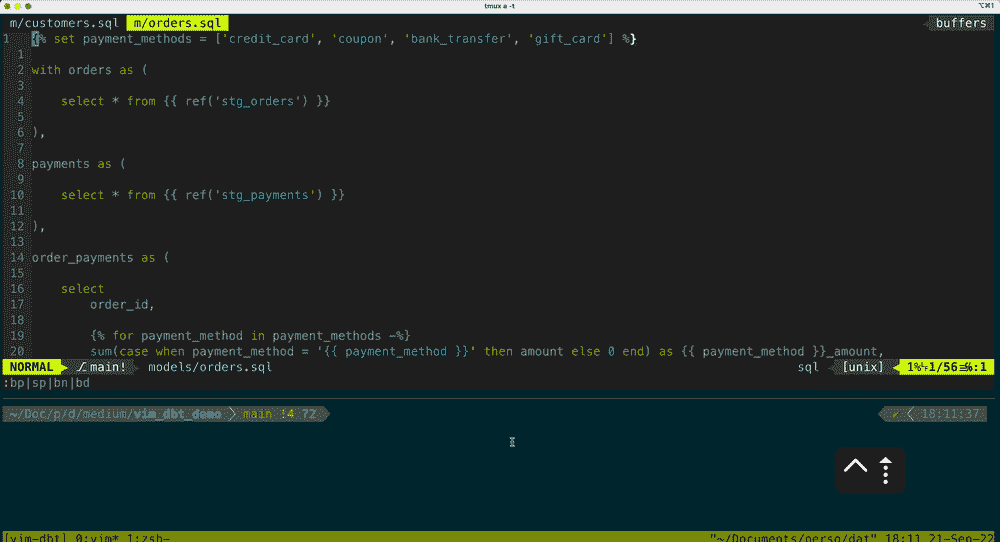
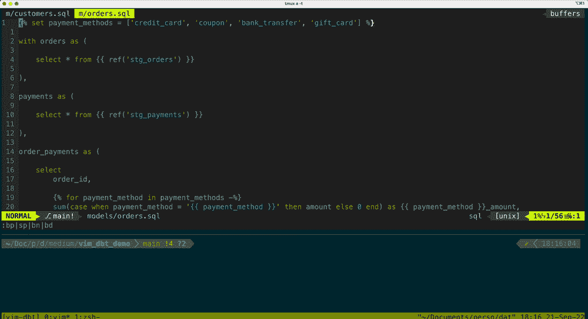

# Vim + dbt = ❤️

> 原文：<https://levelup.gitconnected.com/vim-dbt-%EF%B8%8F-4d0faf72d15d>

## 或者我如何通过稍微调整一下我的？vimrc

短短几年后，dbt 成为数据领域的主要参与者。dbt 承诺将软件工程的良好实践带到 sql 世界，降低了进入数据工程的门槛，并使任何掌握 sql 的人编写可靠的数据管道变得更加容易。

虽然我是现代数据栈的支持者，但谈到使用 shell，我仍然是一个非常保守的人。因此，我在寻找一种将 dbt 与我最喜欢的编辑器 vim 集成的方法。

在分析了我的工作流程之后，我意识到我使用的 90%的 dbt cli 命令都可以归结为三个步骤

1.  编译当前模型以检查 jinja 宏、引用等..得到了正确的解释
2.  运行模型
3.  测试模型

我在我的. vimrc 中添加了两个简单的函数。它允许我在 fav 编辑器中执行上述步骤，而无需离开键盘。

```
function! OpenDbtCompiled()
    call ExecuteDbtCommand("compile")
    let model_path = bufname()
    let project_name = substitute(split(getcwd(), "/")[-1], "-", "_", "")
    let compiled_model_path = "target/compiled/" . project_name . "/" . model_path
    execute 'edit' compiled_model_path
endfunctionfunction! ExecuteDbtCommand(command)
    :w
    let buf = bufname()
    let model = split(split(buf, "/")[-1], '\.')[0]
    let dbt_command = "dbt " . a:command . " -s " . model
    VimuxRunCommand(dbt_command)
endfunction
```

简单地说，第二个函数解析当前的缓冲区名称，构建相应的 dbt 命令，并通过利用一个名为 [vimux](https://github.com/preservim/vimux) 的插件将其发送到终端。

通过几个映射，我只需击几下键就可以调用这些函数。

```
nnoremap ,do :call OpenDbtCompile()<CR>
nnoremap ,dr :call ExecuteDbtCommand("run")<CR>
nnoremap ,dt :call ExecuteDbtCommand("test")<CR>
```

没有更多的 ados，这里是演示:



通过更多地使用函数参数，您可以定义额外的映射来执行 prod 环境中的命令，例如:

```
nnoremap ,drp :call ExecuteDbtCommand("run --target prod")<CR>
nnoremap ,dtp :call ExecuteDbtCommand("test --target prod")<CR>
```



就这样，伙计们！

您可以找到。vimrc 在这个[回购](https://github.com/greghor/vim-dbt-demo)。如果你有兴趣进一步了解如何利用 vim 进行数据科学，你可以看看[这篇](https://towardsdatascience.com/boosting-your-data-science-workflow-with-vim-tmux-14505c5e016e)或[那篇](https://towardsdatascience.com/5-killer-vim-features-for-your-data-science-daily-routine-ec814fc6c090)帖子。如果你觉得这个方法有用，请在评论中告诉我。如果我看到一些牵引，我会添加额外的功能。