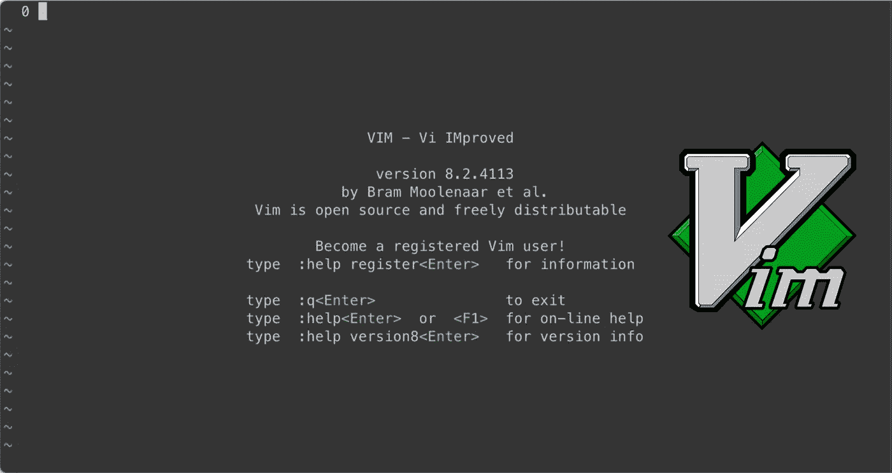
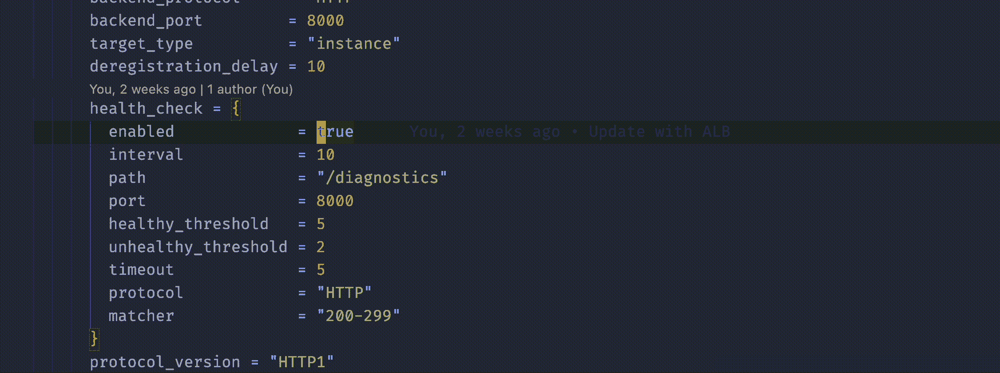

# 学习 Vim 时您希望知道的提示

> 原文：<https://levelup.gitconnected.com/vim-essentials-for-beginners-ultimate-vim-guide-68e7d3725de9>

## 没有人告诉你作为一个初学 Vim-er 的提示(包括 gif)



作者图片

对于那些一直关注我的人来说，你应该知道我是一个超级 [Vim n3rd](/cant-seem-to-master-vim-here-s-why-37077ba46511) 。因此，我决定写一篇短文，列出几个我认为对初学 Vim 的初学者非常有益的 Vim 要点。

## 先决条件

本文假设您已经熟练掌握了 Vim，并且假设您的机器上已经安装了 Vim。事不宜迟，让我们开始干吧！

# Vim 要点

## **目录**

```
1\. [Navigating faster](#63b8)
2\. [Edit multiple lines concurrently](#6772)
3\. [Use ‘Vimspeak’, a.k.a. Verb Modifier Objects (VMO)](#a60b)
4\. [Repeat last command is your best friend](#c752)
5\. [Common ways to start editing in insert mode](#5c38)
6\. [Indents, spaces, tabs and whitespace](#6ceb)[Bonus Tips!](#bd0c)
```

## 1.导航速度更快

对于初学者来说，在 Vim 中导航可能是一项艰巨的任务，尤其是当你还在习惯移动键`j`、`h`、`k`和`l`的时候。

这里有一些快速导航的技巧。

**a .)使用(相对)行号**

能够直观地看到行号并使用它们进行导航将使您的 Vim 学习曲线更加简单。

```
# Set absolute line number
**:set nu**# Set relative line number
**:set rnu**# Unset line number (add `!` at the end)
**:set rnu!
:set nu!**
```

一旦设定了绝对或相对行号，您就可以使用它们来导航。

```
# Go to line 20
**:20**# Move 10 lines up
**:-10**# Move 23 lines down
**:+23**
```


使用行号导航(GIF by Author)

导航代码块而不是代码行

通常情况下，我们希望在导航到我们想要的位置之前，先浏览代码块，以便快速浏览代码体。

```
# Move one code block up
**Shift-{**# Move one code block down
**Shift-}**
```


导航代码块(GIF by Author)

**c .)快速移动到**文件的顶部( `**gg**` **)和底部(** `**G**` **)**


导航到文件的顶部和底部(GIF by Author)

**d .)使用**重新居中页面


所有命令都可以以数字为前缀

这允许您将想要使用的命令重复设定的次数。例如，向下移动到 5 个代码块将是`5-Shift-}`。

## 2.同时编辑多行

首先用`Ctrl-V`进入视觉遮挡模式。这允许您使用常用导航键选择多行，如`j`、`k`，甚至是我们在【1】中学到的使用`Shift-{`或`Shift-}`。

接下来，使用`Shift-I`进入插入模式并进行编辑！


## 3.使用' Vimspeak '，又名动词修饰语对象(VMO)

如果你了解 Vim 基础知识，你会知道`d`代表*动词*‘删除’，`w`代表*对象【T24’‘单词’。将这些动词修饰语对象链接在一起是一个更高级的主题，所以我将分享一些对我特别有用的常见对象。*

> ***动词*** *:* `*v*` *:视觉；* `*c*` *:变化；* `*d*` *:删除；* `*y*` *:猛拉* ***修饰语*** *:* `*i*` *:内；* `*a*` *:左右；* `*t*` *:直到；* `*f*` *:查找* ***对象****:*`*w*`*:word；* `*s*` *:句子；* `*p*` *:段落；*`*b*`*:block；* `*t*` *:标签*

要使用 VMO，我们只需将一个动词、一个修饰语和一个宾语连在一起。我发现对初学者最有用的是:

*   **改变单词内部** ( `**ciw**`):删除光标当前所在的单词，之后进入插入模式。(不进入插入模式，使用`diw`代替。)


使用“ **ciw** ”的示例(GIF 由作者提供)

*   **改变到** `**<char>**` ( `**ct<char>**`):从光标处删除所有字符，直到下一次出现`<char>`，之后进入插入模式。(如果不进入插入模式，请使用`dt<char>`。)


使用 Change Till <space>的例子(作者 GIF)</space>

> **注意**！*更改*和*删除*的区别在于*更改*让你进入插入模式，在那里你可以立即进行编辑，而*删除*让你保持在正常模式。**

## *4.重复最后的命令是你最好的朋友*

*要重复上一个命令，使用`.`。相信我——这很简单，却能改变生活。用你在[3]中学到的上面的任何一个命令自己尝试一下。*

## *5.在插入模式下开始编辑的常用方法*

*a.)在行[ `**Shift-A**` ]的末尾开始书写*

**

*使用“Shift-A”的示例(作者提供的 GIF)*

*b.)删除光标前的所有内容，开始写作[ `**Shift-C**` ]*

**

*使用“Shift-C”的示例(作者提供的 GIF)*

*c.)在当前行的[`**o**`下方或[`**O**`]上方开始书写，并正确缩进*

**

*使用‘o’和‘o’的例子(作者 GIF)*

## *6.缩进、空格、制表符和空白*

*a)单行[ `**>>**` **、**、`**<<**`]和多行[ `**>**`、、`**<**` ]缩进*

**

*单行和多行缩进并使用`.'重复的示例(作者提供的 GIF)*

*b)可视化制表符、空格和空白*

*首先，我们在命令模式下使用`**:set list**`。这允许我们用`**$**`来可视化行尾，用`**^I**`来可视化标签。*

**

*使用“设置列表”来可视化制表符、空格和空白(GIF by Author)*

## *额外提示！*

*   *将`**Caps Lock**`键重新映射到`**Esc**`，因为`Esc`在 Vim 中使用过于频繁，而原来的`Esc`离你的小指太远*
*   *使用`**.vimrc**`设置个人 Vim 运行时配置*
*   *使用`**%**`找到匹配的支架(如`{([])}`)*

# *最后的话*

*在我结束之前，我想说，Vim 是一个不断学习的旅程，因为你在不断探索新的和更有效的方法来做同样的事情。但是有一点需要注意:*

> *如果你发现自己重复一个命令太多次，可能有一个更有效的方法。*

*如果你觉得这篇文章有用，请告诉我，也请告诉我你对 Vim 有什么问题，我一定会尽力为你找到解决方案！*

****支持我！*** —如果你喜欢我的内容并且*没有*订阅 Medium，请考虑支持我并通过我在这里的推荐链接[订阅](https://davidcjw.medium.com/membership) ( *注意:你的一部分会员费将作为推荐费*分摊给我)。否则，留下一个👏🏻鼓掌或💬注释也有助于算法！*

# *分级编码*

*感谢您成为我们社区的一员！在你离开之前:*

*   *👏为故事鼓掌，跟着作者走👉*
*   *📰查看[升级编码出版物](https://levelup.gitconnected.com/?utm_source=pub&utm_medium=post)中的更多内容*
*   *🔔关注我们:[Twitter](https://twitter.com/gitconnected)|[LinkedIn](https://www.linkedin.com/company/gitconnected)|[时事通讯](https://newsletter.levelup.dev)*

*🚀👉 [**软件工程师的顶级工作**](https://jobs.levelup.dev/jobs?utm_source=pub&utm_medium=post)*