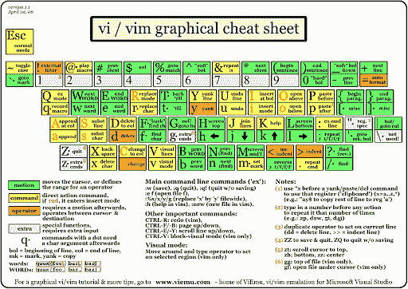

# 面向开发人员的 Vim:第 0 部分——为什么是 Vim？

> 原文：<https://levelup.gitconnected.com/vim-for-developers-part-0-why-vim-95e68dc5d3a1>

> * *注意:我将在本系列中使用 NeoVim。我在下面解释原因。但是在 Vim8 中，99.99%的内容都是一样的。所以，如果你更喜欢使用 Vim8，你仍然可以学到很多东西！从现在开始，我将交替使用 Vim 和 NeoVim，除非有不同之处。

## Vim 是什么？

有一次，我，一个爱狗人士，和我的朋友，一个爱猫人士谈论猫和它们对人类的普遍蔑视。那时他说了一些我永远不会忘记的话。“你不了解猫的一点是，它们不是狗”。哇哦。深刻。他的意思是，如果你像对待狗一样对待猫，那是行不通的。记住这一点:

> Vim 的问题是它不是一个 IDE

Vim 不是一个 IDE，它是一个文本编辑器。这是一个快如闪电、功能齐全的文本编辑器，比霍格沃茨还要多的秘密，我认为稍加调整，它有可能比你目前的 IDE 一样好，如果不是更好的话。

我已经做了大约 2.5 年的软件开发人员，在过去的 1 年里，我一直将 Vim 作为我的“日常驱动程序”。我大约 80%的时间花在 Javascript 上，另外 20%花在 Python 上。在使用 Vim 之前，我使用 VS Code 和 IntelliJ IDEs(在我的例子中是 WebStorm 和 PyCharm)。这些都是很棒的工具，但是都有它们的弱点，让我想知道“有没有更好的？”。

我开始注意到我公司的一些编码超级英雄(你知道这种类型)正在使用 Vim。一开始我以为这是他们用的东西，因为他们是超级英雄。但是，很快我开始怀疑他们是不是超级英雄，因为他们用了 Vim。事实是 Vim 本身不会让你成为 10 倍的开发者，但是如果你花一些时间去学习它的方式，它肯定会有帮助(或者不会有坏处)。如果你愿意冒险，请继续阅读。

## 我在 IDE 中寻找什么？

ide 的一些关键特性极大地提高了生产率，对我来说在开发环境中它们是不可协商的。

*   代码完成/智能感知
*   转到函数/变量等的定义。
*   目录导航和搜索

在本系列的最后，我们将使用 Vim 插件的力量来扩展功能，以包含所有这些特性。

## 为什么使用 Vim？

正如我们将在本系列中看到的，使用 Vim 有很多原因。它提高了生产率，非常酷(好吧，也许只有开发者*会这么想)，但我认为最重要的是它无处不在。说真的。Vim 无处不在。几乎每台电脑都预装了该软件(当然是 Mac 和 Linux，如果不是 Windows，我会感到震惊)。它在 Linux 服务器上，你可以通过 SSH 进入。你可能会被一家随机的公司要求在面试时亲自编写一些代码。如果您拥有 Vim，那么无论您的硬件设置如何，您都是高效的。*

这最后一点可能看起来有点牵强。我的意思是，希望您不要频繁地登录生产服务器并直接在其上编写代码(这种情况确实会发生，相信我，在这种情况下，您希望速度更快)。但远不止如此。要真正成为超级开发者，你需要成为你的开发环境的超级用户。当然，你现在工作的公司提供 IntelliJ 系列产品，你也知道 WebStorm 的每个角落。但你的下一家公司可能不会为 IntelliJ 买单，然后呢？或者你肯定是 VS Code 的专家，而且它是免费和开源的，所以你没有理由不能在任何地方拥有它？也许你的下一个角色是政府，或者其他一些大型企业，你会惊讶于在这些地方获得下载软件的许可。即使是免费的。

这真的是 Vim 触角的神奇之处。你可以确信，无论你去哪里，你都可以从一开始就进入状态。

## Vim 与 NeoVim

我知道我只是在宣扬 Vim 的无处不在是它的秘密武器。但是，我有一个坦白。我其实用的是 NeoVim。

但是为什么呢？NeoVim 不是到处都有吗？怎么回事！？

尼奥维姆确实不是无处不在。老实说在这个时候。Vim8 和 NeoVim 之间真的没有区别。我使用 NeoVim 的原因更多的是一种长期的原则性哲学，也是一种长期的心态。NeoVim 由一个大型开发人员社区维护，因此是非常社区驱动的。另一方面，Vim 是由一小部分核心开发人员(bus factor，jk)维护的。说真的，此时此刻他们几乎无法区分。事实上，我将在这个系列中使用 NeoVim，但我分享的 99.99%的提示和技巧*将在 Vim8* 上完全相同。

我选择 NeoVim 的原因是因为确信今天*它们基本上是相同的，但有一天它们可能会不同。我计划在未来许多年成为一名开发者，我宁愿把我的鸡蛋放在社区驱动的马车上(不确定我是否抓住了这个比喻)。*

## ***我为什么要写这个？我们需要另一个 Vim 教程吗？***

*我看了 Vim 的每一篇博文。我看过 YouTube 上的每一个配置视频。我在所有的子街道上。尽管有大量精彩的内容，但我经常发现有一个关键的细节被忽略了，或者一个概念没有被完全解释清楚。我的目标是从头教你一切。每个命令都将被完整地解释。init.vim/.vimrc 的每一行都会被解释。您将对您的 Vim 设置了如指掌。*

## *你能从这个系列中学到什么？*

*您可以通过以下方式远离本系列:*

*   *普通 Vim(命令、助记符、缓冲区、模式和宏)的工作知识*
*   *能够使用配置文件定制您的 Vim。vimrc/init.vim)*
*   *使用插件的力量增强您的 Vim 设置的知识。*
*   *在日常工作中开始使用 Vim 的信心。*

# *接受挑战*

1.  *[面向开发者的 Vim:第 1 部分——基础知识](https://medium.com/@dbo1093/vim-for-developers-part-1-the-basics-663619ca122a)*
2.  *[面向开发者的 Vim:第 2 部分——高级基础](https://medium.com/@dbo1093/vim-for-developers-part-2-advanced-basics-857c0dbda905)*