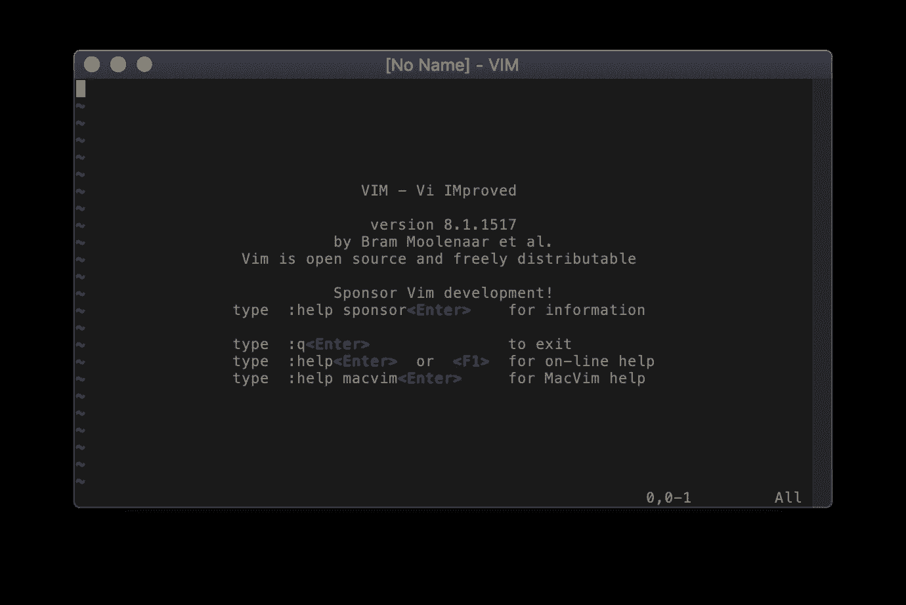
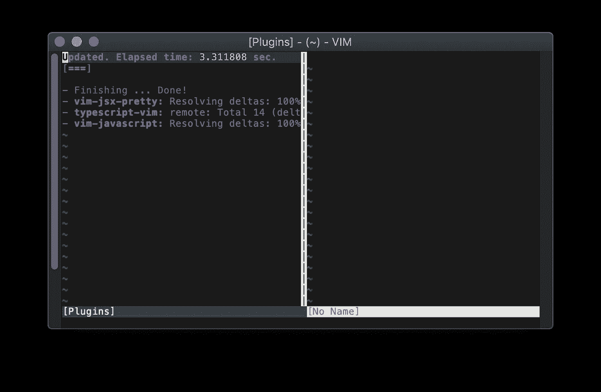
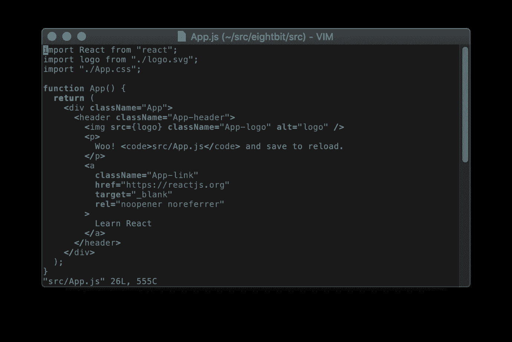
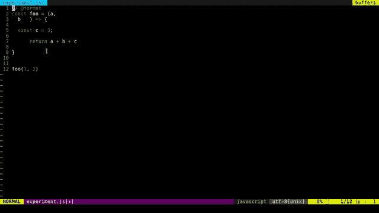

# Vim for React and TypeScript 天啊！

> 原文：<https://levelup.gitconnected.com/vim-for-react-and-typescript-oh-my-40b700c32cc>

接下来是我对令人敬畏的 [Vim](https://www.vim.org/) 编辑器的配置的描述；支持脸书的 [React](https://reactjs.org/) 框架，以及现代 Javascript 和微软的 [TypeScript](https://www.typescriptlang.org/) 语言。一如既往，Vim 为我们所有的开发需求提供了出色的支持。我们走吧！


# 获取最新的 Vim

我推荐一个基于 GUI 的 Vim 的最新版本来支持本指南的插件。至少，您应该确保您运行的是 **Vim 版本 8** 。

**在 Mac 上？我推荐麦克维姆[https://macvim-dev.github.io/macvim/](https://macvim-dev.github.io/macvim/)**

**Linux？**从发行版的包管理器安装最新的 gvim 包。

对于本指南中的大多数功能，您也可以使用终端版本(基于文本的)Vim。然而，为了获得最好的支持，我推荐 gvim。



MacVim 8.1 还没有插件:-)

# 插件管理器 vim-plug

插件管理器使得安装和维护我们将用来支持我们的开发环境的所有插件变得非常容易。我推荐 vim-plug 插件管理器[https://github.com/junegunn/vim-plug](https://github.com/junegunn/vim-plug)

Vim-plug 有一个简单的语法，可以很好地安装和更新我们的插件。

[vim-plug Github 页面](https://github.com/junegunn/vim-plug)有安装工具的详细指南。但是，如果您使用的是 Linux 或 macOS，下面的命令应该可以让您入门:

```
curl -fLo ~/.vim/autoload/plug.vim --create-dirs https://raw.githubusercontent.com/junegunn/vim-plug/master/plug.vim
```

接下来，我们需要将 vim-plug 添加到我们的 **~/中。vimrc** 文件，这样每次我们启动 Vim 时都会加载插件管理器:

就是这样！让我们添加一些插件；-)

# React、Javascript 和 Typescript 插件

## java 描述语言

对于 Javascript 支持，我们将使用[https://github.com/pangloss/vim-javascript](https://github.com/pangloss)的插件

## 以打字打的文件

为了支持打字稿，我们将使用 [Leaf Garland 的](https://github.com/leafgarland)插件，可从[https://github.com/leafgarland/typescript-vim](https://github.com/leafgarland/typescript-vim)获得

## 反应

对于 React 支持，我们将使用 [Kento Tsuji 的](https://github.com/MaxMEllon)插件，可在 https://github.com/MaxMEllon/vim-jsx-pretty[的](https://github.com/MaxMEllon/vim-jsx-pretty)获得

## 安装插件

首先，我们将配置 vim-plug 来通过我们的 **~/安装插件。vimrc** 文件:

然后，启动 Vim，运行 **:PlugInstall** 命令。Vim-plug 将为您下载并安装插件:



PlugInstall 命令的 vim-plug 结果

## 成功！

恭喜你！至此，您的 Vim 已经具备了 React、Javascript 和 Typescript 开发所需的所有基础知识。**继续阅读一些额外的插件，它们会让你的 Vim 变得更好！**



支持 JSX 的 Vim 呈现 React 组件

# 奖金部分

## prettier.io 代码格式化程序

每次在 Vim 中保存代码时，[漂亮的](https://prettier.io/)代码格式化程序会自动重新格式化代码。

我们将使用官方的[vim-beautiful 插件](https://github.com/prettier/vim-prettier)来集成格式化程序，方法是将下面的代码添加到我们的**中。/vimrc** 插件部分:

```
Plug 'prettier/vim-prettier', { 'do': 'yarn install', 'for': ['javascript', 'typescript', 'css', 'less', 'scss', 'json', 'graphql', 'markdown', 'vue', 'yaml', 'html'] }
let g:prettier#autoformat = 0
autocmd BufWritePre *.js,*.jsx,*.mjs,*.ts,*.tsx,*.css,*.less,*.scss,*.json,*.graphql,*.md,*.vue,*.yaml,*.html PrettierAsync
```

然后，运行 **:PlugInstall** 安装插件。[ *注意:Prettier 需要安装纱线卷装管理器。参见*[【https://yarnpkg.com】](https://yarnpkg.com/en/)

**

*保存时自动格式化文件更漂亮*

## *一些更有用的插件供您尝试:*

*   *[**vim-react-snippets**](https://github.com/mlaursen/vim-react-snippets)用于开发 React 应用程序的常见 Javascript 和类型脚本片段的集合。*
*   *[**de complete**](https://github.com/Shougo/deoplete.nvim)一个代码补全插件，方便自动补全建议。*
*   *用于 Vim 的文件树资源管理器*
*   *[**FZF**](https://github.com/junegunn/fzf) 使用模糊搜索快速查找并打开文件*
*   *[**vim-fugutive**](https://github.com/tpope/vim-fugitive) 轻松管理 Git 命令*
*   *[**航空公司**](https://github.com/vim-airline/vim-airline) 增压你的 Vim 状态栏*
*   *[**Vim-多光标**](https://github.com/terryma/vim-multiple-cursors)Vim 多光标支持*
*   *[**vim-surround**](https://github.com/tpope/vim-surround) 自动将您选择的文本放在括号中*

# *编码快乐！*

*Vim 为使用 Javascript、Typescript 和 React 开发现代应用程序提供了一个健壮的环境。我希望你喜欢这个指南 Vim 万岁！*