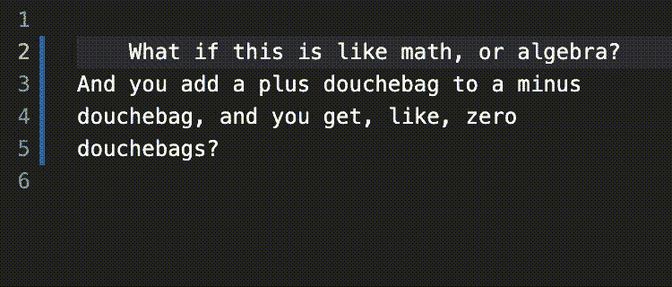
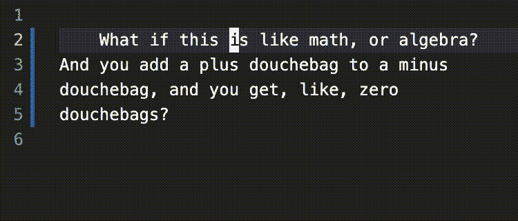
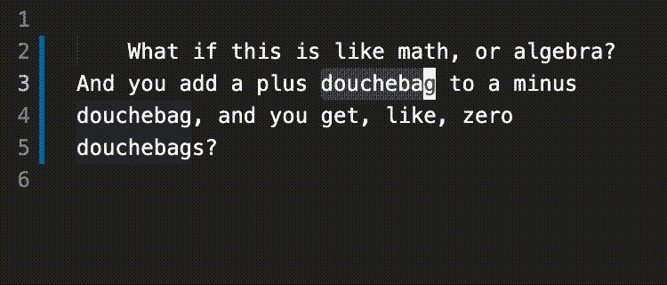

# Vim 比你想象的酷多了

> 原文：<https://levelup.gitconnected.com/vim-is-much-cooler-than-you-think-47361d6e130d>

## 在您最喜欢的代码编辑器中启用 Vim 来提高您的工作效率

[来源](https://twitter.com/jovica/status/1370702904819126273)

> *我用 Vim 已经 5 年了……
> 主要是不知道怎么退出*

如果你要问人们对 Vim 的体验，他们的回答看起来会是这样的——一个关于退出程序的笑话，以及当 Nano 出现在系统上时的一声松了一口气。

除了对我来说, [Nano](https://www.nano-editor.org/) 退出至少同样奇怪这一事实之外，Vim 的神秘名声是如此之广，以至于公众大多远离它，基本上没有意识到它的潜力。

尤其是程序员，被遗漏了。

在这里，我并不提倡使用 Vim 作为成熟的 IDE。我说的是把 Vim 带到你最喜欢的代码编辑器中，作为一个额外的层，可能已经有一个扩展了。

例如， [VSCode](https://github.com/VSCodeVim/Vim) ， [Sublime Text](https://github.com/NeoVintageous/NeoVintageous) ， [PHPStorm](https://www.jetbrains.com/help/phpstorm/using-product-as-the-vim-editor.html) 和 [Atom](https://atom.io/packages/vim-mode-plus) 都有 Vim 集成。如果你使用不同的程序，现在打开它的扩展管理器，搜索“Vim”——我肯定你会得到一些结果。

关键是你不必从头开始学习一个新的编辑器——你可以保留你最喜欢的软件，并在它上面撒上一些 Vim 的魔法。

Vim 也不必完全取代你与文本交互的方式。在大多数情况下，开发人员能够将 Vim 命令与原生命令一起逐步融入到他们的编码实践中。

他们可以选择保留自己喜欢的东西，不保留其他的。

# TL；速度三角形定位法(dead reckoning)

*   Vim 不必是一个晦涩难懂的精英文本编辑器；
*   它有很多特性可以大大加快你的编码速度；
*   大多数现代 ide 和代码编辑器都有不错的 Vim 集成；
*   这篇文章旨在向您展示诀窍，并说服您尝试一下。

# Vim 还是 Vi？

让我从一点点歧义开始。在您的开发之旅中，您可能遇到过 Vim 和 Vi，但不确定它们有什么区别。

简单地说，Vi 是一个标准，而 Vim 是该标准的一个实现。

事实上，Vim 是该标准最流行的实现，大多数 Linux 发行版都有。

这也是绝大多数 IDE 扩展会引用 Vim 而不是 Vi 的原因。

# 正常模式与插入模式

这通常是新 Vim 用户遇到的第一件事——*插入*模式不是默认模式。他们会把光标放在他们想要修改的地方，开始键入一些文本，然后…

没什么。

更糟糕的是，他们意外触发了一个 Vim 命令，使得文本的行为看似随机，产生了奇怪的结果，他们立即试图恢复。相反，当他们让事情变得更糟时，他们试图通过关闭程序来防止进一步的损害，但似乎找不到出路，想知道他们怎么会被困在这个邪恶的逃脱游戏中。

出自[《电锯惊魂》](https://en.wikipedia.org/wiki/Saw_(franchise))电影系列

最顽强的人最终会发现，他们可以通过按下`i`来做出改变，然后保存他们的工作，并通过按下 *escape* 键然后按下`:wq`来安然无恙地离开那里。

绝大多数人不会进一步探索，自信这就是他们需要的所有知识。至于在服务器上快速编辑文件，他们没有错。

但是 Vim 的用途远不止于此。为了得出这个结论，我们需要探索它的许多特性，从我们可以使用的进入插入模式的不同方式开始。

这里是第一个，我们已经提到过:按下`i`(对于*插入*)将允许用户在当前位置进行更改:

更具体地说，它会将光标*放在当前字符*之前。如果你想把光标放在后面，你可以选择`a`(对于*追加*):

您也可以在带有`I`(大写 I)的行首插入一些文本:

或者在一行的末尾加上`A`(大写 a):

您也可以通过按下`o`在当前行的下方创建一个新行(对于*打开*，虽然那个感觉有点像拉伸，但无论如何):

而如果要在上面加一条线来代替，那就是`O`(大写 o):

进入插入模式的基础就是这些。如前所述，按下*退出*键返回正常模式。

虽然你可能还没有留下深刻的印象，但从长远来看，重复使用这些快捷方式已经可以改善用户体验。

也就是说，只有当光标已经接近您想要进行更改的位置时，它们中的大多数才有用，而当您刚刚打开文件时，情况就不一定如此了。

幸运的是，Vim 有一些方法可以让我们快速到达目的地。

# 四处走动

Vim 首先是不使用鼠标四处移动的艺术。

这并不意味着你不应该使用鼠标——我一直在使用它。

这意味着如果你不想使用鼠标，你可以不使用。

现在，如果您已经这样做了一段时间，那么除了箭头键之外，您可能已经想出了一些在代码中移动的方法，比如一个单词一个单词地移动光标的位置，而不是一个字符一个字符地移动，或者快速到达一行或整个文件的开头或结尾。

让我们看看如何用 Vim 做同样的事情。

首先要记住的是，您需要在正常模式下使用以下命令。

接下来，你可能听说过应该使用`h`、`j`、`k`和`l`键分别向左、向上、向下和向右移动。我不知道。在实践中，我发现这些快捷方式极其不方便，所以我只用箭头键来代替。不要难过。

这样一来，你就可以使用 Vim 一个字一个字地移动光标了——按下`w`(代表*单词*):

注意，它会把你带到下一个单词的*开头*。如果您希望到达终点，按下`e`(对于*终点*):

要后退，按`b`:

要转到该行的最开始(硬*硬*开始)，按`0`:

要转到最后，请按下`$`(在 gif 上显示为 *shift* 键后跟数字 4，对此很抱歉):

要到达文件顶部，按`gg`:

并且到最后一行，按`G`(大写 g):

这应该涵盖了使用常规编辑器通常可以做的事情——现在让我们看看如何使用 Vim 做更多的事情。

我之前演示了如何转到一行的*硬*开头(用`0`)，这意味着存在一个*软*开头。

软开头是一行的第一个非空白字符，您可以通过按下`^`进入该行(在 gif 上显示为 *shift* 键后跟数字 6):

`^`和`$`字符可能很熟悉——它们通常标记正则表达式的开始和结束。

也可以转到特定的行号，例如，这有助于找到异常抛出的位置。这可以通过按下`#G`来实现，其中`#`是行号:

我一直使用的另外两个 Vim 快捷键是`f`和`t`。前者代表 *find* 并允许我们将光标放在第一个匹配的字符上:

`t`(从*到*)做同样的事情，但是将光标*放在第一个匹配字符*之前:

他们也有相反的对应词——`F`(大写 f)和`T`(大写 t)——我邀请你自己尝试一下。

还有许多其他可用的快捷方式，但这些也适用于本文。现在我想提醒大家注意的是，这些命令中的大多数都可以与一个数字相结合，就像我们之前将`G`与一个数字相关联以到达特定行一样。

例如，你可以通过输入`4e`跳过四个单词(记住`e`会带你到一个单词的*结尾*):

这也适用于将光标移动到第*个*匹配字符。例如，您可以键入`3F,`向后移动到第三个逗号:

尝试一下其他的快捷方式——这很酷。

这只是 Vim 允许我们组合不同命令来实现特定结果的方式的一瞥。有些可能一开始看起来很难掌握，但是经过一点点练习，它们都会自然而然地掌握。

知道如何使用 Vim 是非常重要的，因为这是执行复杂编辑的关键。

但是这对于更常见的操作也很有用——让我们来看看如何实现。

# 复制、剪切和粘贴

在复制和剪切方面，Vim 有自己的剪贴板，独立于操作系统。它被称为*未命名寄存器*，允许一些高级操作，我不会在这里深入讨论(主要是因为我自己不知道如何使用它们)。

换句话说，如果您以常规方式复制一个值(例如在 Mac 上使用`cmd+c`),然后使用 Vim 命令复制另一个值，后者不会覆盖前者——它们存储在不同的位置。

那么我们如何复制东西呢？

首先，确保你处于正常模式。然后，选择您感兴趣的文本。最后，按`y`将文本复制到寄存器中。就是这样。

`y`指令代表*猛拉*。我不知道他们为什么这么叫它，但我觉得有点好笑。

总之，一旦你完成了，把光标放在你想要粘贴文本的地方，然后按`p`:

这将把文本*粘贴到光标*之后。如果你宁愿之前粘贴，使用`P`(大写 p):

要粘贴某些文本，请先选择它，然后按`p`:

剪点文字怎么样？选择感兴趣的部分，然后按`d`(对于*删除*):

没错，剪切和删除没有区别，只要不粘贴相应的文字。如果那是你想要做的，同样的快捷方式也适用。比如说`p`:

以上内容很棒，但并没有带来任何新的东西。话说回来，当我们开始组合命令时，事情变得更有趣了。

我不会总是在下面给出拉取和删除的例子——你可以假设对一个有用的对另一个也有用。

首先，我们可以通过按两次相应的键来复制或删除/剪切一整行。例如，要复制整行，按`yy`(然后按`p`粘贴到下面):

要粘贴以上内容，请按`P`(大写 p —同上):

复制或删除多行怎么样？只需在那里输入一个数字即可——例如，要删除两行，请键入`d2d`:

要删除到特定的行号吗？那是`d#G`，其中`#`是行号:

这是我们之前见过的使用`G`快捷键的另一种方式，与另一个命令结合使用。

现在，还记得`f`、`F`、`t`和`T`命令将光标前后放置在特定字符处或之前吗？他们也从事复制和剪切工作。

这里，我们复制到并包括句号，并在光标前粘贴`P`:

但这还不是全部。我最喜欢的功能之一是能够在边界内拖拽和删除一些文本。

假设我们想要删除双引号之间的部分。我们可以用`di"`这样做(双引号在 gif 上显示为 *shift* 键后跟单引号):

在上述命令中，`i`是针对*内部的*。

这也适用于圆括号、花括号和方括号、大于号和小于号——任何标记开始和结束的符号。

这也适用于单词:

在上例中，`diw`代表*删除内部单词*。

您还可以在边界内粘贴内容(同样，双引号显示为 gif 上的 *shift* 键后跟单引号):

这里的技巧是使用 Vim 的*视觉模式*，它不同于普通模式和插入模式(还存在另外两种模式——命令*和*替换*——但在本文中我们将坚持使用这三种)。*

视觉模式本质上是一种选择模式，我们在前面讲述*猛拉*时已经简单地看到了。要进入该模式，请确保您处于正常模式并按下`v`。从那里，用于移动文本的相同快捷键也适用于选择它。

在上面的例子中，我们选择了 double 之间的文本，并使用`vi"p`序列在其上粘贴一些其他文本，这大致翻译为*可视内部双引号并粘贴*。

请注意，当您在正常模式下使用鼠标而不是键盘选择某些文本时，您会自动进入可视模式。

# 编辑

有几种方法可以进行编辑，但实际上我只使用一个命令，我把它和其他命令结合在一起。

在正常模式下启动，选择一串文本并按下`c`(用于*改变*):

这基本上是`di` - *删除和插入*的快捷方式。

与其他命令一样，它可以与不同的快捷方式相关联，以实现各种结果。

例如，您可以使用`ciw`更改当前单词(对于*更改内部单词*):

或者将后面三个字替换为`c3w`(对于*换 3 个字*):

或者直到下一个感叹号(在 gif 上显示为 *shift* 键后跟数字 1):

上例中，`ct!`代表*变化到感叹号*。

您也可以用`cc`替换整行:

或者用`C`(大写 c)改到行尾:

还有更多的东西需要编辑，但是由于上面的内容涵盖了我日常使用的 99%,我就不多说了。如果您感兴趣，可以在本文末尾列出的参考资料中找到更多信息。

# 搜索、保存和退出

由于 Vim 本来就是一个文本编辑器，所以它也有搜索/替换、保存和退出的命令。

但是因为本文的前提是在您选择的编辑器中使用它，所以您可能已经习惯了处理它们的方式。

虽然没有什么可以阻止你使用 Vim 方法，但是坚持你已经知道的东西，你不会错过太多。同样，如果您想了解更多，下面列出的资源会有所帮助。

# 撤消和重做

虽然撤销和重做也是标准的 IDE 特性，但是您可能想要学习这些特性的 Vim 快捷方式，因为它们不一定意味着相同的东西。

当您在 Vim 中撤销某项操作时，您将恢复自上次进入正常模式以来所做的一切。相反，当您重做某件事时，您将恢复更改，直到切换回正常模式。

您的代码编辑器可能对之前和之后的更改没有相同的概念，这就是为什么您可能应该学习 Vim 方法来处理这些更改。

谢天谢地，这一点也不复杂。

您可以通过按`u`来撤销一些更改:

注意，我先按下了*退出*键返回正常模式。

您可以通过按下`^r`(按下*控制键*，然后按下小写字母 r)来重做更改:

另一个需要知道的有用的事情是，当你开始输入一个 Vim 序列并意识到你输入错误时，按下 *escape* 键将会取消输入。

# 将 Vim 快捷方式与本机特性相结合

这是我今天最不想讨论的事情。在本文的介绍中，我提到开发人员将能够在使用本地 ide 特性的同时使用 Vim 特性。这里有一个例子，取自我自己的实践。

我真的很喜欢 VSCode 处理多个光标的方式，虽然使用原生 Vim 特性[有可能](https://medium.com/@schtoeffel/you-don-t-need-more-than-one-cursor-in-vim-2c44117d51db)获得类似的结果，但我一直使用 VSCode 的实现(Mac 上的`cmd+d`):

我经常做的是在常规剪贴板中复制一个值，使用 VSCode 的多光标特性选择我想要替换的一点文本的实例，然后按`c`并以常规方式粘贴文本(使用`cmd+v`):

这是一个奇怪的组合，最终只使用了一个 Vim 命令(`c`)，但对我来说很有用。

关键是没有什么能强迫你完全接受 Vim。尝试不同的方法，看看什么适合你，忽略其他的。

# 结论

根据这篇文章，您可能已经想到，Vim 几乎是它自己的语言。

你必须先学一些词汇，然后学一些语法，并确保你掌握了正确的语法。最终，你开始形成完整的句子，让你以一种近乎自然的方式获得越来越复杂的结果。

毫无疑问，Vim 有一个学习曲线，但在我看来，这是利用其潜力的一个小代价。此外，这个最初的障碍通过集成到流行的代码编辑器中得到进一步缓解，允许用户在熟悉的环境中进行实验。

Vim 提供了许多特性，虽然本文只是收集了一些基本的例子，但是它们已经让您受益匪浅了。

如果您想进一步探索这个主题，下一节中列出的参考资料将为您提供一些指导。例如，我发现这张[备忘单](https://www.reddit.com/r/vim/comments/a1z6lb/vim_wallpaper_to_quickly_peek_at_with_show/)特别有用。不管怎么说，Vim 已经存在很久了，被很多人使用；因此，有大量容易获取的知识。

我希望这篇文章能鼓励你尝试一下，如果你已经是 Vim 老手了，我很乐意在评论中了解你最喜欢的命令。

# 资源

*   Vim.org
*   [维姆历险记](https://vim-adventures.com/)
*   [学习 Vim(聪明的方法)](https://github.com/iggredible/Learn-Vim)
*   [Vim 备忘单](https://www.reddit.com/r/vim/comments/a1z6lb/vim_wallpaper_to_quickly_peek_at_with_show/)
*   [Vi vs Vim](https://www.shell-tips.com/linux/vi-vs-vim/)
*   [VSCode 扩展](https://github.com/VSCodeVim/Vim)
*   [崇高文本扩展](https://github.com/NeoVintageous/NeoVintageous)
*   [PHP 表单扩展](https://www.jetbrains.com/help/phpstorm/using-product-as-the-vim-editor.html)
*   [原子扩展](https://atom.io/packages/vim-mode-plus)
*   你可能听过《绝命毒师》中的一些引言
*   gif 是用 [Keycastr](https://github.com/keycastr/keycastr) 、 [QuickTime](https://support.apple.com/kb/DL837) 、 [FFmpeg](https://www.ffmpeg.org/) 和 [Gifsicle](https://www.lcdf.org/gifsicle/) ( [教程](https://gist.github.com/dergachev/4627207))制作的

*本故事原载于*[*tech . osteel . me*](https://tech.osteel.me/posts/vim-is-much-cooler-than-you-think)*。*