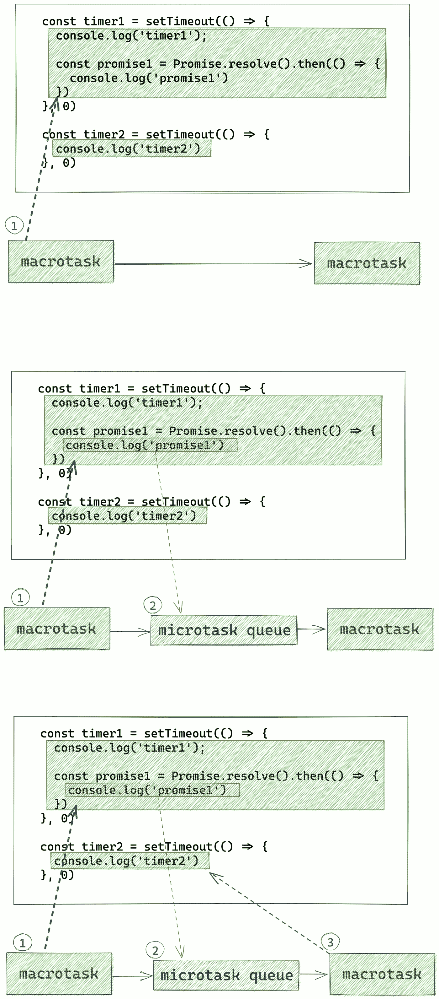

# 关于面试的 Javascript 承诺

> 原文：<https://levelup.gitconnected.com/vimp-javascript-promise-implementation-challenges-5a4f120d8606>

## JavaScript |承诺聚合填充|输出驱动问题|所有关于承诺的内容


承诺返回一个值，这个值可以是一个已解决的值，也可以是拒绝的原因。

# 承诺有四种状态

**待定**:在事件发生之前，承诺处于待定状态。

**已解决**:一旦事件发生，它就处于已解决状态。

**完成**:与承诺相关的动作成功。

**拒绝**:与承诺相关的动作失败。

# 对照表


# ` Promise.all()'

**Promise.all()** 方法并行执行许多承诺。它接受一组承诺并返回一个承诺。

*   只有所有通过的承诺都解决了，才会解决。
*   如果一系列承诺中的任何一个失败了，它就会拒绝。

```
const promiseArr = [
  new Promise(resolve => setTimeout(resolve, 100, 'apple')),
  new Promise(resolve => setTimeout(resolve, 100, 'banana')),
  new Promise(resolve => setTimeout(resolve, 3000, 'orange'))
]
**Promise.all**(promiseArr)
  .then(fruits => console.log(fruits))
  .catch(err => console.log('Error:', err))

// After 3 seconds, logs out the following
// ["apple", "banana", "orange"]
```

# 机具或聚合填料

```
*/**
 ** ***@param*** *{Array<any>}* ***promises*** *- notice input might have non-Promises
 ** ***@return*** *{Promise<any[]>}
 */**function* all(promises) {
  *return new Promise*((resolve, reject) => {
    *if* (!promises.length) {
      resolve([])
    }

    *const* poolResponses = []
    *let* count = 0

    promises.forEach((p, idx) => {
      Promise.resolve(p).then(res => {
        poolResponses[idx] = res
        count++
        *if* (count === promises.length) {
          resolve(poolResponses)
        }
      }).*catch*(err => {
        reject(err)
      })
    })
  })
}
```

# ` Promise.allSettled()'

**Promise.allSettled()** 接受承诺数组的方法。它返回一个新的承诺，如果数组中的所有承诺都被解决，则该承诺将被解决，而不管这些承诺是被解决还是被拒绝。

*一例****promise . all settled()****一口答应拒绝:*

```
const promiseArr = [
  new Promise(resolve => setTimeout(resolve, 100, 'apple')),
  new Promise((resolve, reject) => setTimeout(reject, 10, 'banana')),
  new Promise(resolve => setTimeout(resolve, 3000, 'orange'))
]**Promise.allSettled(promiseArr)**
  .then(fruits => console.log(fruits))
  .catch(err => console.log('Error:', err))

// After 10 ms, logs out the following
// [
//  {status: 'fulfilled', value: 'apple'},
//  {status: 'rejected', value: 'banana'},
//  {status: 'fulfilled', value: 'orange'}
// ]
```

# 机具或聚合填料

```
*/**
 ** ***@param*** *{Array<any>}* ***promises*** *- notice that input might contains non-promises* *** ***@return*** *{Promise<Array <{status: 'fulfilled', value: any} | {status: 'rejected', reason: any}>>}* **/**const* **allSettled** = *async* (promises) => {
  *if* (!promises.length) {
    *return* []
  }

  *const* poolResponses = []
  *let* counter = 0

  *for* (*let* i = 0; i < promises.length; i++) {
    *try* {
      *const* res = *await* promises[i];
      poolResponses[i] = {
        status: 'fulfilled',
        value: res
      }
    } *catch* (err) {
      poolResponses[i] = {
        status: 'rejected',
        reason: err
      }
    } *finally* {
      counter++
      *if* (counter === promises.length) {
        *return* poolResponses
      }
    }
  }
}
```

# 实现` Promise.race()'

*promise . race()方法返回一个承诺，该承诺在 iterable 中的一个承诺履行或拒绝时立即履行或拒绝，其值或原因来自该承诺*

```
*/**
 ** ***@param*** *{Array<Promise>}* ***promises*** *** ***@return*** *{Promise}
 */
const* race = (promises) => {
  *return new Promise*((resolve, reject) => {
    promises.forEach(p => p.then(resolve, reject))
  })
}
```

# 拒绝时自动重试承诺

*   在 web 应用程序中获取数据是很常见的。然而，如果我们遇到网络问题，我们可能需要**重试**机制。
*   如何实现接受一个**承诺**和一个 **maximumRetryCount** 的`fetchWithAutoRetry`。util 将继续重试**承诺**，直到计数器计数完毕，那时，我们将拒绝最后一个错误。

```
*/**
 ** ***@param*** *{() => Promise<any>}* **promise***** ***@param*** *{number}* ***maximumRetryCount*** *** ***@return*** *{Promise<any>}
 */
const* fetchWithAutoRetry = *async* (promise, maximumRetryCount) => {
  *try* {
    *return await* promise()
  } *catch* (err) {
    *if* (maximumRetryCount === 0) {
      *return* Promise.reject(err)
    }
    *return* fetchWithAutoRetry(promise, maximumRetryCount - 1)
  }
}
```

# 节流承诺

*   如何实现接受返回承诺的函数数组和表示最大并发调用的变量的`throttlePromises()`?
*   一般我们用`Promise.all`或`Promise.allSettled`来依次计算承诺。然而，有时候我们需要动态地限制一系列承诺。
*   由于网络或硬件的限制，或者缺少分页，我们不得不限制同时可以处理的并发请求的数量。

```
throttleAsync(callApis, 10).then((data) => {
  // the data is the same as `Promise.all` 
}).catch((err) => {
  // any error occurs in the callApis would be relayed here
})
```

通过运行上面的代码，在任何时候，请求的 API 都不会超过 10 个，因此节省了低规格的服务器。

```
*/**
 ** ***@param*** *{() => Promise<any>}* ***func*** *** ***@param*** *{number}* ***max*** *** ***@return*** *{Promise}
 */
const* throttlePromises = *async* (promises, max) => {
  *try* {
    *let* counter = 0
    *const* poolResponses = []*while* (counter <= promises.length) {
      *const* chunkPromises = promises.slice(counter, counter + max)
      counter += max*const* results = *await* Promise.all(chunkPromises.map(p => p()))
      poolResponses.push(...results)
    }*return* poolResponses
  } *catch* (err) {
    *throw* err
  }
} 
```


# 挑战 1:承诺建造者

这段代码的输出是什么？

```
console.log('start'); const promise1 = new Promise((resolve, reject) => {  
   console.log(1)
}) ;console.log('end');
```

同步代码块总是从上到下顺序执行。

*   当我们调用`new Promise(callback)`时，回调函数会立即执行。

> **输出**，所以这段代码是依次输出`start`、`1`、`end`。

# 挑战 2:。然后()

这段代码的输出是什么？

```
console.log('start'); const promise1 = new Promise((resolve, reject) => {  
  console.log(1)  
  resolve(2)
}) promise1.then(res => {  
  console.log(res)
}) console.log('end');
```

记住，JavaScript 引擎总是先执行同步代码，然后执行异步代码。


> **输出**，所以输出为`start`、`1`、`end`和`2`。

# 挑战 3:解决()

这段代码的输出是什么？

```
console.log('start'); const promise1 = new Promise((resolve, reject) => {  
  console.log(1)  
  resolve(2)  
  console.log(3)
})promise1.then(res => {  
  console.log(res)
}) console.log('end');
```

请记住，resolve 方法不会中断函数的执行。其背后的代码仍将继续执行。

> **输出**，所以输出结果为`start`、`1`、`3`、`end`和`2`。

# 挑战 4:未调用 resolve()

```
console.log('start'); const promise1 = new Promise((resolve, reject) => {  
  console.log(1)
}) promise1.then(res => {  
  console.log(2)
})console.log('end');
```

resolve 方法从未被调用过，所以`promise1`总是处于挂起状态。所以`promise1.then(…)`从来没有执行过。`2`不在控制台中打印出来。

> **，**输出，所以结果是`start`，`1`，`end`

# 挑战 5:让你困惑的那个

这段代码的输出是什么？

```
console.log('start') const fn = () => (new Promise((resolve, reject) => {   
    console.log(1);  
    resolve('success')
})) console.log('middle') fn().then(res => {  
   console.log(res)
})

console.log('end')
```

这段代码故意加了一个函数来迷惑挑战者，那就是`fn`。


> **输出**，所以结果是`start`、`middle`、`1`、`end`和`success`。

# 挑战 7:超时与承诺

这段代码的输出是什么？

```
console.log('start') setTimeout(() => {  
  console.log('setTimeout')
}) Promise.resolve().then(() => {  
  console.log('resolve')
}) console.log('end')
```

这是一个很难的问题。如果你能正确回答这个问题并解释原因，那么你对 JavaScript 异步编程的理解已经达到了中级水平。

在 JavaScript EventLoop 中，还有优先级的概念。

*   优先级较高的任务称为微任务。包括:`Promise`、`ObjectObserver`、`MutationObserver`、`process.nextTick`、`async/await`。
*   优先级较低的任务称为宏任务。包括:`setTimeout`、`setInterval`和`XHR`。


> **输出**，所以结果是`start`、`end`、`resolve`和`setTimeout`。

# 挑战 8:微任务混合宏任务

```
const promise = new Promise((resolve, reject) => {  
  console.log(1);  
  setTimeout(() => {    
    console.log("timerStart");    
    resolve("success");    
    console.log("timerEnd");  
  }, 0);  
  console.log(2);
}); promise.then((res) => {  
   console.log(res);
}); console.log(4);
```

我们只需要做三步:

1.  找到同步代码。
2.  找到微任务代码
3.  找到宏任务代码

首先，执行同步代码:


输出`1`、`2`和`4`。

然后执行微任务:


但是这里有一个陷阱:由于当前的承诺仍然处于**待定**状态，这里的代码目前不会被执行。

然后执行宏任务:


然后，通过事件循环，再次执行微任务:


# 挑战 9:区分微任务和宏任务的优先级

这段代码的输出是什么？

```
const timer1 = setTimeout(() => {  
  console.log('timer1');    promise1 = Promise.resolve().then(() => {   
    console.log('promise1')  
  })
}, 0) const timer2 = setTimeout(() => {  console.log('timer2')}, 0)
```

有些朋友可能认为微任务和宏任务是这样执行的:

1.  首先执行所有微任务
2.  执行所有宏任务
3.  再次执行所有微任务
4.  循环通过

但是上面的说法是**错**。

正确的理解是:

1.  首先执行所有微任务
2.  执行一个宏任务
3.  再次执行所有(新添加的)微任务
4.  执行下一个宏任务
5.  循环通过



# 挑战 10:典型的面试问题

这是我们最后的挑战。如果你能正确说出这段代码的输出，那么你对 Promise 的理解已经很强了。而且同类型的面试问题不会对你有任何困扰。

记住我们之前学到的内容:

1.  同步代码
2.  所有微任务
3.  第一个宏任务
4.  所有新添加的微任务
5.  下一个宏任务
6.  …

所以:

1.  执行所有同步代码:


2.执行所有微任务


3.执行第一个宏任务


4.执行所有新添加的微任务


5.执行下一个宏任务


# 结论

对于所有类似的问题，你只需要记住三条规则:

1.  JavaScript 引擎总是先执行同步代码，然后执行异步代码。
2.  微任务比宏任务具有更高的优先级。
3.  微任务可以在事件循环中插入行。

**参考**，

我发现了一篇关于承诺的很棒的文章，把这些文章整理成一篇…这是一篇非常重要的文章，有助于理解在面试中被问到的承诺、填充和挑战。

-[https://towardsdev . com/6-promise-problems-that-front-end-engineers-should-master-for-interview-8281848d 7721](https://towardsdev.com/6-promise-problems-that-front-end-engineers-should-master-for-interviews-8281848d7721)
-[https://better programming . pub/10-JavaScript-promise-challenges-before-you-start-a-an-interview-c 9 af8d 4144 EC](https://betterprogramming.pub/10-javascript-promise-challenges-before-you-start-an-interview-c9af8d4144ec)