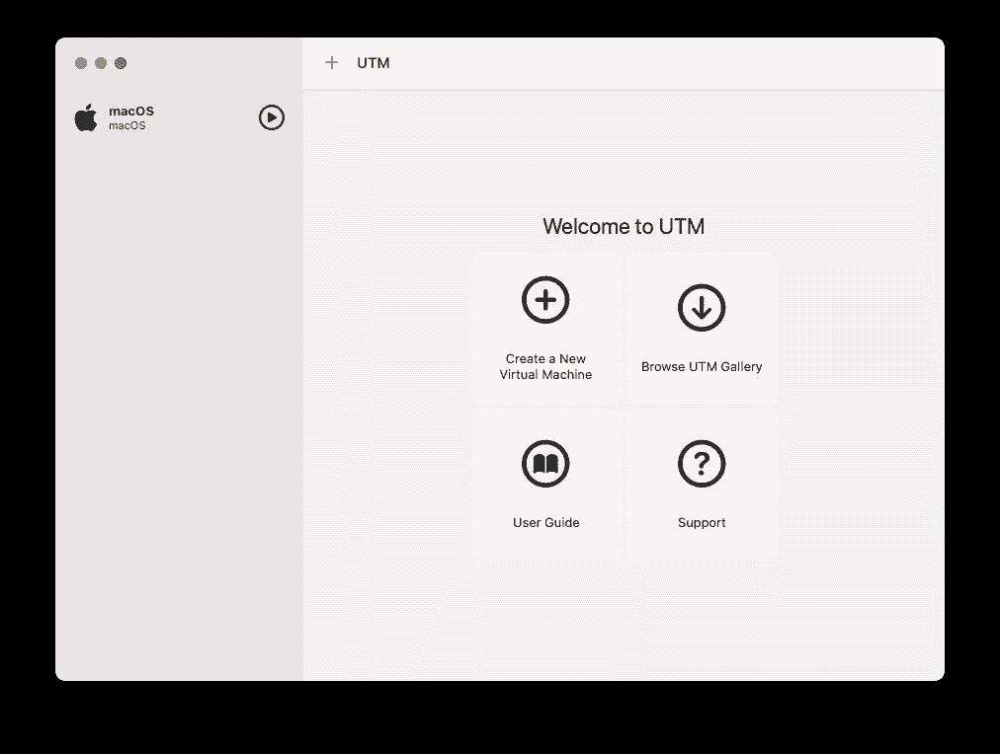
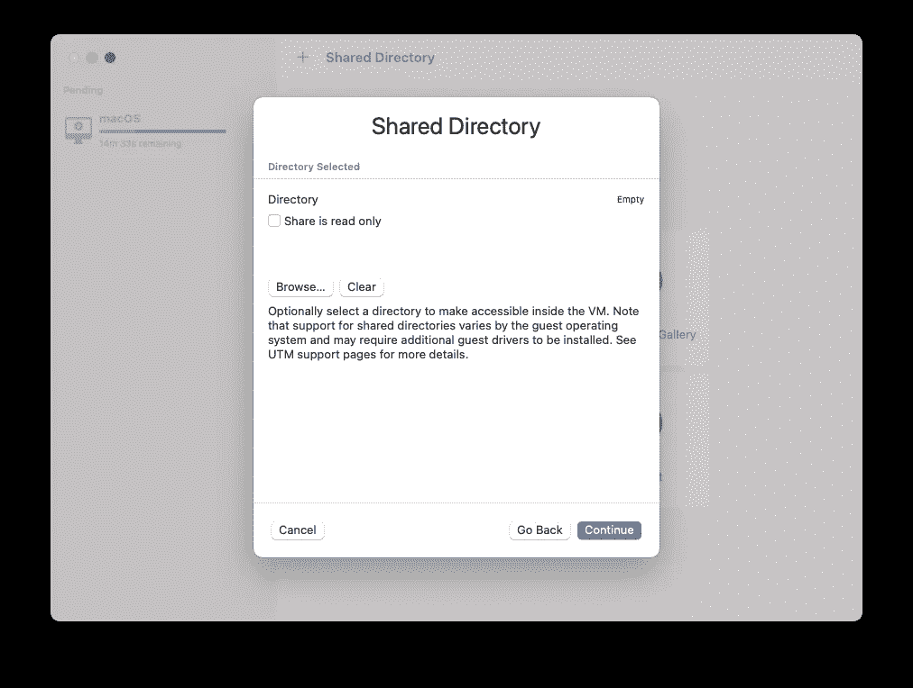
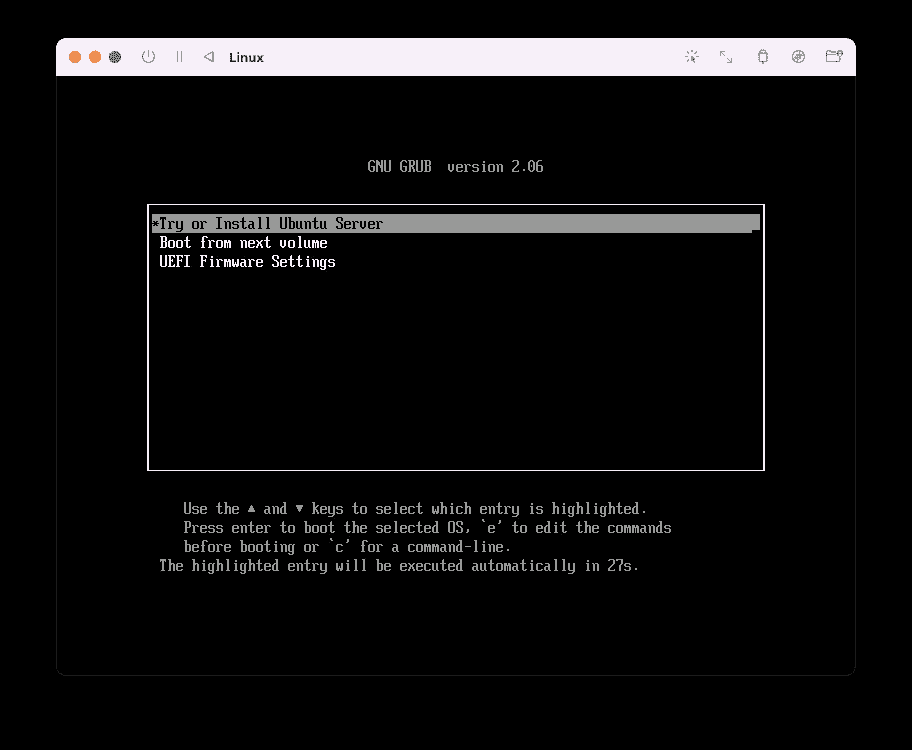

# 使用 UTM 在 Mac 上实现虚拟化

> 原文：<https://levelup.gitconnected.com/virtualization-on-the-mac-using-utm-e4c5abc3ee9c>

## 在 Mac 上运行 macOS、Linux 和其他操作系统的多个实例


作为一名开发人员和培训师，我经常需要测试新软件，并为我的客户/参与者将会遇到的各种场景配置我的机器。然而，在您的开发机器上这样做总是很棘手的——您不希望冒险搞砸您当前的工作配置，同时您希望非常确定您将能够确切地知道您需要在新的机器上安装什么依赖项。拥有另一台测试机器会很好，但不是最经济的方式——你不能只为了测试而购买新机器。这就是*虚拟机*派上用场的地方。Windows 用户应该熟悉虚拟化产品，如 **VirtualBox** 和 **VMWare Fusion** 。然而，有了苹果硅 Mac，事情就没那么简单了。有几种方法可以让你的 Apple Silicon Mac 运行其他操作系统，但我将留给你下面的文章来看看各种各样的(往往令人困惑的)方法:

[](https://www.macworld.com/article/668848/best-virtual-machine-software-for-mac-2022.html) [## Mac 2022 最佳虚拟机软件

### 即使是最忠实的 Mac 用户也承认，Windows 仍然是台式机和笔记本电脑的霸主…

www.macworld.com](https://www.macworld.com/article/668848/best-virtual-machine-software-for-mac-2022.html) 

相反，在这篇文章中，我想向你介绍一种在你的苹果电脑上运行多个虚拟机的免费方法。最棒的是，你甚至可以运行 macOS 的多个实例！

# 什么是 UTM？

**UTM** (基于 **QEMU** )是 iOS 和 macOS 的全功能系统仿真器和虚拟机主机。基本上，UTM 允许你在 Mac、iPhone 和 iPad 上运行 Windows、Linux 等等。

> **QEMU** 是一款[免费开源](https://en.wikipedia.org/wiki/Free_and_open-source) [仿真器](https://en.wikipedia.org/wiki/Emulator)。它通过动态[二进制翻译](https://en.wikipedia.org/wiki/Binary_translation)来模拟机器的[处理器](https://en.wikipedia.org/wiki/Central_processing_unit)，并为机器提供一套不同的硬件和设备模型，使其能够运行各种[客户操作系统](https://en.wikipedia.org/wiki/Guest_operating_system)。来源:[https://en.wikipedia.org/wiki/QEMU](https://en.wikipedia.org/wiki/QEMU)

看待 UTM 的最佳方式是，它是 QEMU 的 GUI 版本，不需要您掌握大量命令行选项和 QEMU 标志的知识。

在苹果硅 MAC 上，UTM 使用苹果的虚拟机管理程序虚拟化框架来运行基于 ARM64 的操作系统。而且在 Intel Macs 上，x86/x64 操作系统也可以虚拟化。您还可以使用仿真在 Apple Silicon 上运行 x86/x64 操作系统，以及在 Intel 上运行 ARM64 操作系统，尽管性能比使用虚拟化要慢。

> UTM 只能在 macOS (11.0 或更高版本)上运行

# 虚拟化与仿真

请注意，当我们讨论 UTM 时，两个术语被抛来抛去— *虚拟化*和*仿真*。那么这两个术语有什么区别呢？

***虚拟化*** 涉及计算机硬件的模拟部分。如果您的 Mac 使用 Apple Silicon (M1 或 M2)芯片，您可以虚拟化为 ARM64 (aarch64)编译的 macOS 副本，无需修改。这意味着您可以直接在 Mac CPU 上运行另一份 macOS(或系统内存允许的数量)。

然而，另一方面，如果你试图在 Apple Silicon Mac 上运行为 x86 或 AMD64 编译的 Windows 副本，你就不能使用虚拟化。这是因为 Windows 操作系统是为不同的架构(x86 或 AMD64)编译的，而 Apple Silicon 使用的是 ARM64 (aarch64)。而是要用 ***仿真*** 。在模拟模式下，虚拟机将使用软件模拟硬件。

> 您可以将仿真器视为将 x86 或 AMD64 中的指令翻译成 ARM64 的解释器。由于需要动态执行转换，仿真通常比虚拟化慢。

QEMU 既可以作为仿真器，也可以作为虚拟器，它可以通过直接在主机 CPU 上执行客户代码来实现接近本机的性能。

# 安装 UTM

安装 UTM 有两种方法:

*   通过苹果应用商店
*   直接从 [https://mac.getutm.app](https://mac.getutm.app) 下载

这两种方法的唯一区别是 Mac 应用商店，你需要支付 10 美元，而直接下载是免费的。

> 付费的主要原因是为了随时获得自动更新。此外，支付它也支持 UTM 的发展。我的建议是，如果你只是想尝试 UTM，用直接下载的方法。但是，一旦你开始使用它，并发现它在你的日常工作中很有用，就从应用商店购买一份，这样你就可以为 UTM 的发展做出贡献。对于本文，我将向您展示如何直接从 [https://mac.getutm.app](https://mac.getutm.app) 下载。

下载完 UTM 包后，将其拖到**应用程序**文件夹中:


然后双击**应用**文件夹中的 **UTM** 应用。您应该看到以下内容:


# 虚拟化 macOS

让我们从虚拟化 macOS 的副本开始。点击 **+** 按钮，你有两个选择:

*   **虚拟化** —如果您可以运行针对与您的主机相同的架构编译的操作系统，请选择此选项。当我在我的 Mac Studio 上测试时，我将选择这个选项，这样我就可以使用 UTM 运行 macOS 的实例。
*   **模拟** —如果您想要运行不是针对您的主机架构编译的操作系统，请选择此选项。例如，您希望在 Mac Studio 上运行面向 x86 的 Windows 10。这个选项会比较慢。


接下来，选择您想要虚拟化的操作系统。对于这个例子，选择 **macOS 12+** :


对于 macOS，你需要提供一个 **IPSW** 文件。如果您没有，UTM 会自动为您下载:

> IPSW 文件是 Apple 设备软件更新文件。把 IPSW 文件想象成你的设备的固件。IPSW 包含操作系统，您可以使用它来恢复设备上的 macOS。


您可以调整要分配给该虚拟机的内存量:


您还可以调整存储量:


最后，您将看到一份您要创建的虚拟机的摘要:


一旦你点击**保存**，UTM 将继续下载 IPSW(如果你没有提供)。由于 IPSW 文件非常大(14.1 GB)，完成下载需要一些时间。

> 您也可以从[https://ipsw.me/product/Mac](https://ipsw.me/product/Mac)手动下载不同 Mac 配置的各种 IPSW 文件。

一旦 IPSW 文件被下载，你可以在 UTM 窗口的左边看到苹果的标志。双击它以启动虚拟机:



当 VM 启动时，它会询问您是否要开始安装。单击确定:


安装完成后，您应该会看到熟悉的安装屏幕:


按照步骤操作(就像设置新的 Mac 一样)。当所有工作完成后，您就有了一个新的 Mac 虚拟机！


您可以运行的虚拟机数量取决于您拥有的磁盘空间和内存。

# 安装 Linux

我想尝试的下一个操作系统是 Linux。为此，点击主 UTM 屏幕上的 **+** 按钮，并选择**虚拟化**。这一次，选择 **Linux** 作为操作系统:


对于 Linux，你将从[https://ubuntu.com/download/server/arm](https://ubuntu.com/download/server/arm)下载一个 **ARM 版本的 Ubuntu 服务器**。


下载操作系统映像后，点击**浏览** …按钮，选择您刚刚下载的 ISO 映像:


在接下来的两个屏幕中，您将能够调整要分配给虚拟机的内存和存储:


您还可以配置一个共享目录，在虚拟机和主机之间共享:



最后，点击**保存**继续:


双击 **Linux** 图标启动虚拟机:


当虚拟机首次启动时，您将看到以下屏幕。选择第一个选项在虚拟机上安装 Ubuntu 服务器:



完成安装步骤:


安装完成后，重新启动虚拟机:


当虚拟机重新启动时，选择第二个选项从下一个卷启动:


如果一切正常，您应该会看到一个命令行界面，提示您登录到 Ubuntu 服务器:

> 根据我的经验，这一步有时行不通。如果您看不到登录屏幕，请尝试重新启动虚拟机。如果失败，通过重复上述步骤重新创建 Linux 虚拟机。


一旦你登录到你的虚拟机，你需要安装 **Ubuntu 桌面**。键入以下命令:

```
$ **sudo apt update**
$ **sudo apt install ubuntu-desktop**
$ **sudo reboot**
```

您的虚拟机现在将重新启动。像往常一样，在它启动后，选择第二个启动选项:


如果你看到下面的登录界面，Ubuntu 桌面已经成功安装了！立即登录:


你现在已经在你的 Mac 上运行 Ubuntu VM 了！


# 安装其他操作系统

除了在你的 Mac 上安装 macOS 和 Linux 虚拟机之外，你还可以通过访问这个链接安装一些其他的遗留操作系统:[https://mac.getutm.app/gallery/](https://mac.getutm.app/gallery/)


我想安装但遇到困难的一个特别的操作系统是 Windows。要使用 UTM 在 Mac 上运行 Windows，有两个选项:

*   **下载 x86(或 AMD64)的 Windows 10/11**。您可以在*仿真*模式下运行。对于这个选项，即使我设法完成了安装，我也无法正确启动虚拟机。如果我能克服这些问题，我会再次更新这个页面。可以从[https://www . Microsoft . com/en-au/software-download/Windows 10 ISO](https://www.microsoft.com/en-au/software-download/windows10ISO)下载 Windows ISO 镜像。
*   **下载 Windows 11 for ARM64 预览版 VHDX 镜像**。可以从[https://www . Microsoft . com/en-us/software-download/windowsinsiderpreviewarm 64](https://www.microsoft.com/en-us/software-download/windowsinsiderpreviewARM64)下载图片。但是，您需要成为 Windows Insider 计划的成员。在此选项下，您将能够在虚拟化模式下运行 Windows 11。再次，我会更新这个页面，一旦我能够获得预览 VHDX 图像。

## 如果你喜欢阅读我的文章，并且认为它对你的职业/学习有所帮助，请考虑注册成为一名灵媒会员。每月 5 美元，你可以无限制地访问 Medium 上的所有文章(包括我的)。如果你使用下面的链接注册，我会赚一小笔佣金(不需要你额外付费)。你的支持意味着我将能够投入更多的时间来写这样的文章。

[](https://weimenglee.medium.com/membership) [## 加入媒介与我的介绍链接-李伟孟

### 阅读李维孟(以及媒体上成千上万的其他作家)的每一个故事。您的会员费直接支持…

weimenglee.medium.com](https://weimenglee.medium.com/membership) 

# 摘要

本文向您展示了如何使用 UTM 在 Mac 上创建和运行虚拟机。如果你一直想运行多个 macOS 实例，或者只是想在同一台机器上运行 Linux 和 macOS，UTM 是一个天赐良机。如果你可以访问 **Windows 11 for ARM64 预览版 VHDX 镜像**，你应该可以在 UTM 上运行 Windows。一旦我试用了 Windows 部分，我将更新这篇文章。玩得开心！

# 分级编码

感谢您成为我们社区的一员！在你离开之前:

*   👏为故事鼓掌，跟着作者走👉
*   📰查看更多内容请参见[升级编码刊物](https://levelup.gitconnected.com/?utm_source=pub&utm_medium=post)
*   🔔关注我们:[Twitter](https://twitter.com/gitconnected)|[LinkedIn](https://www.linkedin.com/company/gitconnected)|[时事通讯](https://newsletter.levelup.dev)

🚀👉 [**加入升级人才集体，找到一份神奇的工作**](https://jobs.levelup.dev/talent/welcome?referral=true)