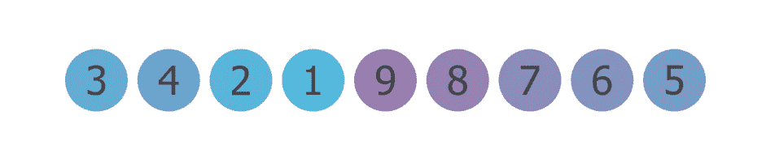
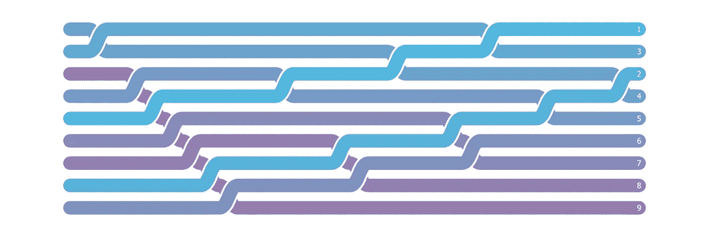

# 冒泡排序的可视化指南

> 原文：<https://levelup.gitconnected.com/visual-guide-to-bubble-sort-8dc39914f088>

所有图片由作者提供

## 看看冒泡排序是如何工作的

这是一个从 1 到 9 的升序排序序列。

这是随机排列的相同序列。

冒泡排序是我们可以用来将这个序列排列成升序的许多算法之一。虽然冒泡排序不是最好的排序算法(甚至不是一个好的)，但它很好地介绍了什么是排序算法，我们如何评估它的性能，以及我们如何最好地可视化算法。

# 步伐

步骤如下:

*   看看前两个值

*   左边的值比右边的值大吗？如果是的话，我们交换一下。如果没有，就离开他们

*   现在我们可以转到下两个值。

*   左边的值更大吗？如果是的话，把它们交换一下。如果没有，就离开他们

我们可以继续这个过程，直到我们到达终点。

一旦我们通过序列，最大值将从*冒泡到*结束。我们现在可以锁定这个位置并重复这个过程，而不需要再次检查最后一个点。

让我们按照同样的步骤再看一遍这个序列

*   看看前两个值
*   左边的值比右边的值大吗？如果是就交换，如果不是就离开。
*   继续这样，直到下一个最大的数字*冒泡*结束
*   将该值锁定在适当位置，并执行另一次传递

通过重复执行这些步骤，每个值都会冒泡到正确的位置。

如果我们在没有任何交换的情况下完成一遍，我们就可以确定序列已经排序，并停止冒泡排序算法。

# 大 O

我们来评估一下这个排序算法的性能。我们想知道随着列表大小的增加，这个算法需要多长时间。

# 最好的情况

假设我们之前的序列已经是升序了。如果我们对此应用冒泡排序，我们只需要执行一次序列并检查每个值一次。我们可以说我们算法的最佳情况是

# 最坏情况

通过将列表按降序排列，我们现在有了最坏的情况。冒泡排序必须通过交换每个比较将每个值移动到列表的末尾。这将需要与我们的列表中的元素数量相同的遍数，每一遍都比较每一对值。这导致了最坏的情况

# 一般情况

如果我们的序列的所有排列都是同样可能的(从已经排序到反转以及每隔一个变化)，平均时间复杂度仍然是

值得看看[这篇堆栈溢出帖子](https://cs.stackexchange.com/a/26)，了解计算这一问题背后的数学原理。

这个时间复杂度与其他一些流行的排序算法(如插入和选择排序)相同，但是，它通常需要执行两倍的写操作。当序列几乎*排序时，最好使用冒泡排序(一些值翻转错误)*

# 形象化

这是有趣的部分，老实说，也是我写这篇文章的个人动机。让我们来看一个典型的例子，它将序列中的每个值显示为一组条形:

这些动画很好，但是最好用一张图片展示整个过程。从左边开始，每进行一次比较，这些值就向前移动一步。如果发生交换，数据流会重叠:

随机流 1

随机流 2

逆序

这篇文章的灵感来自于迈克·博斯托克的形象化作品

所有的图像和动画都是用 [Manim](https://www.manim.community/) 制作的。特别感谢[社区分支](https://github.com/ManimCommunity/manim)的所有开发者和最初的 Manim 创建者[格兰特·桑德森](https://www.youtube.com/c/3blue1brown)

使用[此链接](https://mlee-articles.medium.com/membership)注册 Medium 的会员资格，您的一部分会员资格将用于未来内容的开发