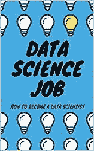

# 数据科学领域第一份工作的可视化指南

> 原文：<https://levelup.gitconnected.com/visual-guide-to-your-first-job-in-data-science-5049e9910ae0>

## 成为一名数据科学家，找到你的第一份工作。

我们生活在前所未有的数据和数字化时代。我们参与的每个流程都是数字化的，并且会留下数字足迹。这意味着需要收集、利用和提取有用的信息。找一份[数据科学工作](https://amzn.to/31jXMAS)的最佳时机。无论你是否有计算机科学背景，这个指南将帮助你成为一个。

找一份数据科学的工作

# 找一份数据科学的工作可能很难

但这都是关于耐心和遵循一定的道路。

如果你不想让它像大海捞针一样，你应该应用下面的过程:

## 1.[学统计和线性代数](https://medium.com/swlh/data-science-crash-course-3-10-linear-algebra-and-statistics-d0376a1e3157)

## 2.[在 Jupyter 笔记本上学习 Python 和实验](https://medium.com/p/data-science-crash-course-2-10-anaconda-and-jupyter-notebooks-d6aa7b5254d7)

## 3.[为你的实验找到一个好的数据集](https://medium.com/p/data-science-crash-course-5-10-getting-data-61134db6a39)

成为数据科学家的数据科学过程

# 启动 Github 存储库

尽快开始在 Github 资源库中在线共享您的代码。这样你就能展示你的专长。

Github 是数据科学家的必备

# 润色你的简历和 LinkedIn 个人资料

准备好 Github 项目后，开始润色你的简历，在你的 LinkedIn 个人资料上描述一切。这是在网上被人看到并找到第一份工作的最好方式。

写一份专注于数据科学项目的简历和 LinkedIn 简介

# 通过数据科学面试学习

学习的最好方法是通过实践。这就是为什么你应该尽快开始申请工作，参加各种数据科学工作面试，以便了解对你的期望。

数据科学工作面试可能会令人望而生畏，但这一切都需要实践

一开始不要担心结果。一切都是关于尝试，失败，再尝试。

# 不要忘记软技能

数据科学家可以被描述为既拥有知识等技术技能，又精通:

*   计算机编程语言
*   Anaconda/Jupyter 笔记本
*   sklearn、Keras、Tensorflow 等机器学习框架

以及软技能，如:

*   沟通
*   形象化
*   协同工作

不要忘记磨练你的社交技巧。你会更容易找到工作。

找到理想工作所需的数据科学技能

# 祝你好运，找到一份数据科学的工作

最后请记住，数据科学职业是一场马拉松，而不是短跑。学习，失败，再学习。尽量多编码。去参加多个工作面试。提问，好奇。

祝你求职顺利！

祝你找到一份数据科学的工作

数据科学工作:如何成为一名数据科学家

最后，如果你想对成为一名[数据科学家](http://www.datasciencerush.com)有个大概的了解，那么看看我的书[数据科学工作:如何成为一名数据科学家](https://amzn.to/3aQVTjs)，它将指导你完成这个过程。

**免责声明:以上链接是我的书的附属链接，感谢您的支持！**

如果你喜欢这段文字的视频版本，我已经在 YouTube 上录制了它[:](https://www.youtube.com/watch?v=yFOHqzkHSTA)

找到你的第一份数据科学工作。成为一名数据科学家。

你也可以关注我在 [Data Science Rush](http://www.datasciencerush.com) 上写的文章，这是一个关于数据科学、技术和更多内容的学习资料的资源库。