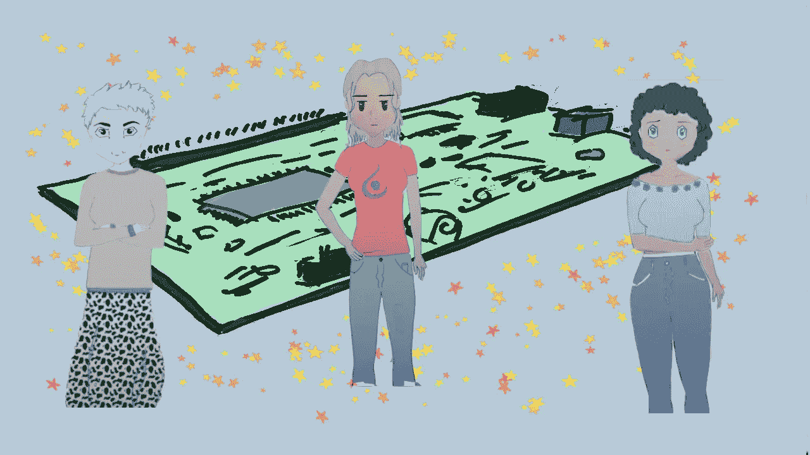
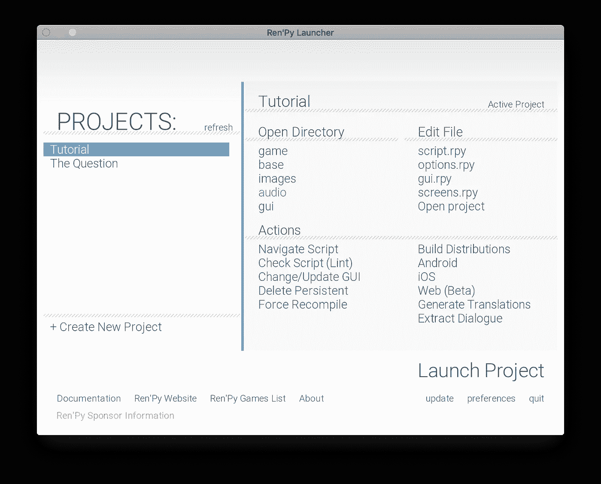
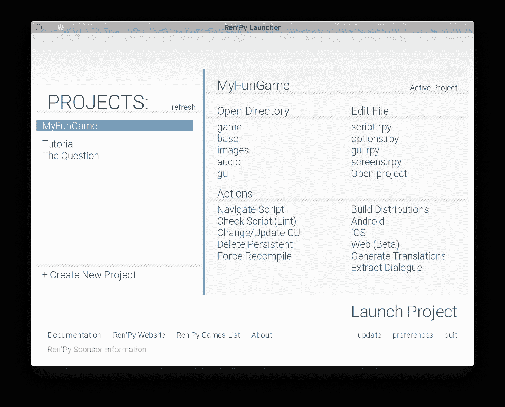
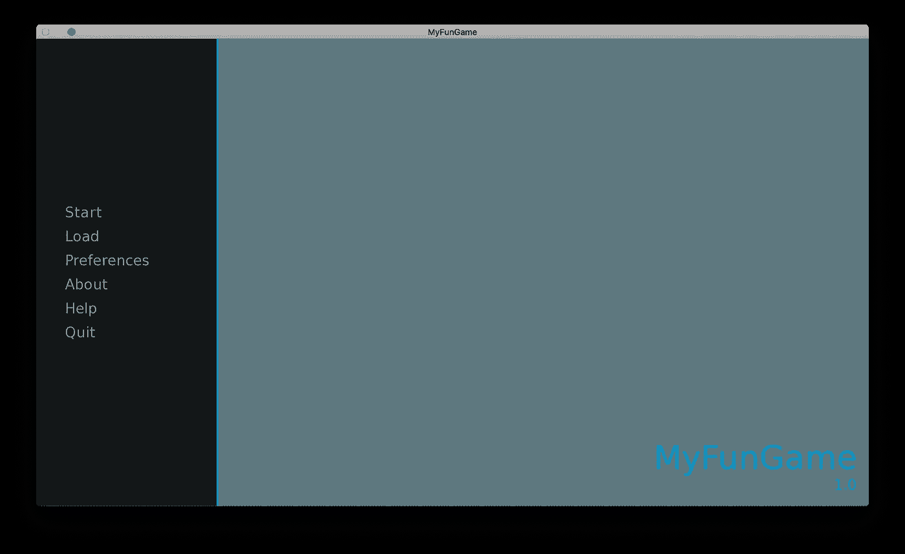
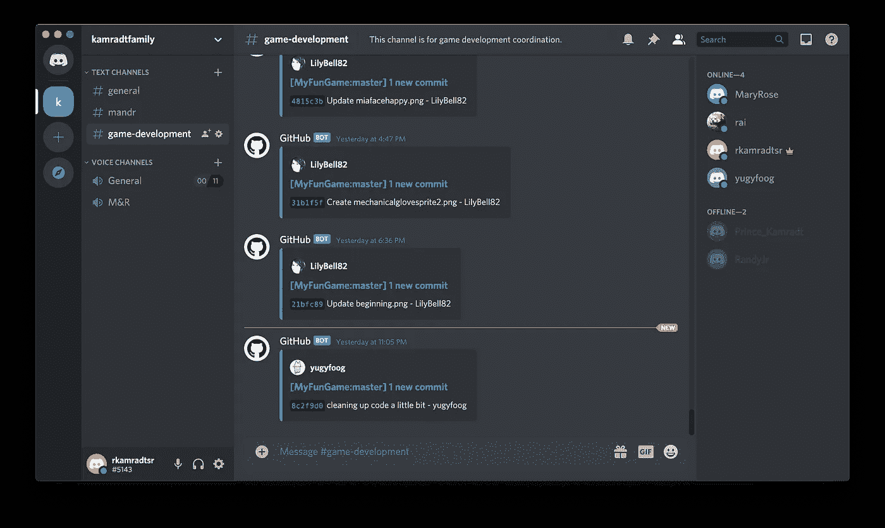
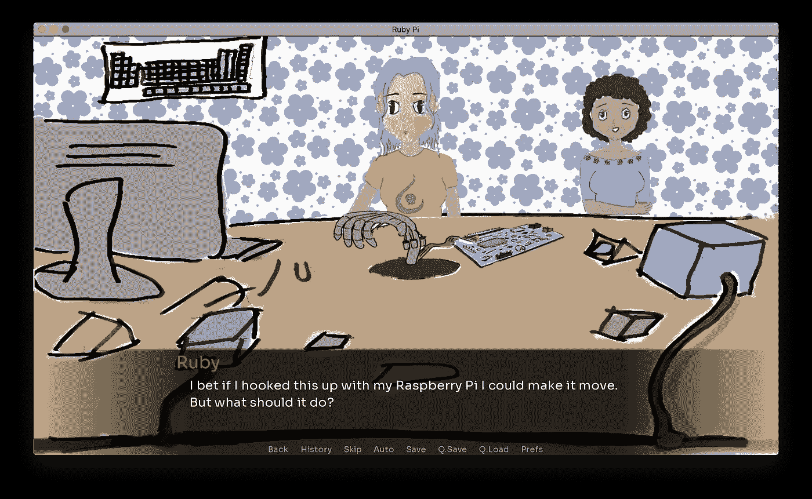
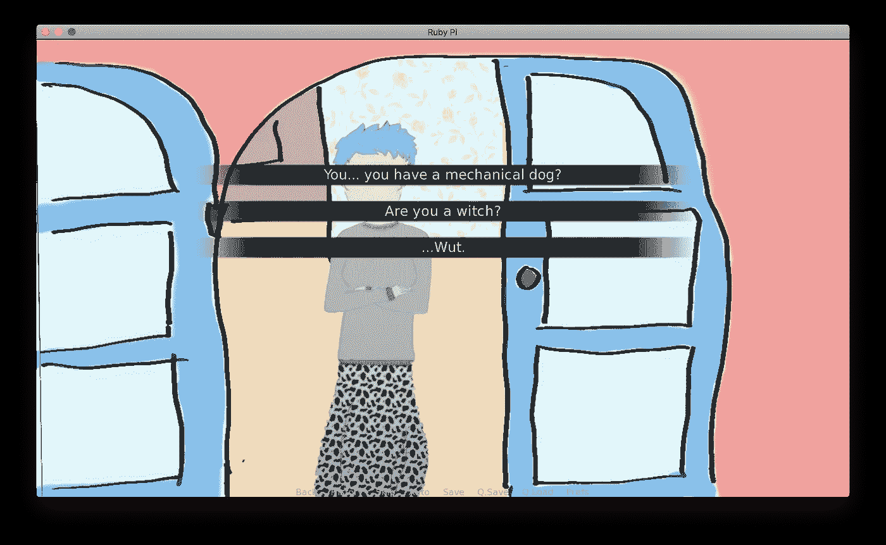
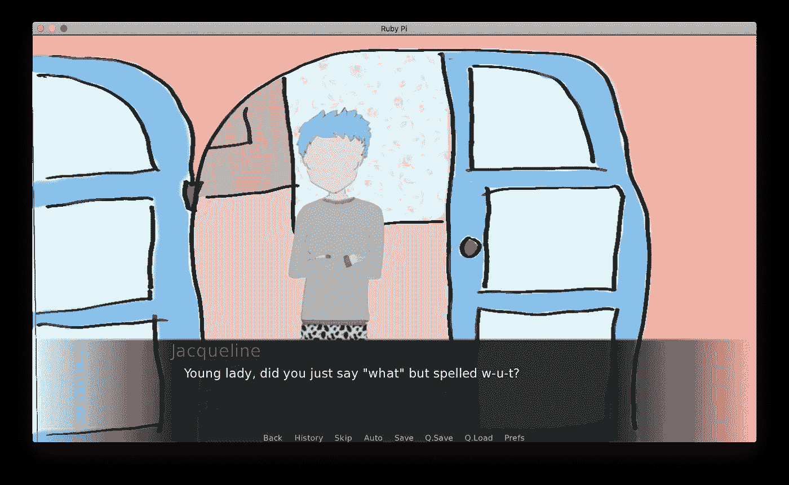

# 仁皮视觉小说

> 原文：<https://levelup.gitconnected.com/visual-novels-with-renpy-478a690c92d3>

## 让你的家人一起写视频游戏。



我们一家人总是一起玩电子游戏。但是现在我们一起写了一个，它让我们在分离的这段时间里更加亲密。在四个星期的过程中，我们集思广益，画出草图，并最终制作出一个可行的游戏。

现在这个游戏不是一个花哨的 3-D 射击游戏或模拟游戏。这是一部视觉小说，就像它的名字一样，一个配有图片的短篇故事。有几个选择，但大多数只是偏离了几个面板的主要故事。对于我们所有人来说，这是一种尝试视觉小说创作的有趣方式。

7 月 15 日，我的女儿雷切尔给我发短信，邀请我参加她在 [itch.io](https://itch.io/) 上举办的“游戏聚会”。她告诉我，itch.io 是视频游戏的乐队营地，你可以在那里主持并列出你的游戏，付费或捐款。他们还举办了各种各样的游戏，有人想出一个主题，你有有限的时间来写一个游戏。她推荐给我的特别游戏是[我不能写(但想讲个故事)](https://itch.io/jam/i-cant-write-but-want-to-tell-a-story)，一直持续到 8 月 10 日。然后在短暂的时间后宣布奖项。回报只是吹牛的权利，但这是一个很好的挑战，将我们限制在一个小的时间框架内，并限制我们的工作范围。

翻翻 jam 的游戏规则，上面说你可以在任何你想要的平台上写，但是推荐三个:[麻线](https://twinery.org/)、 [Ren'Py](https://www.renpy.org/) 和 [Quest](http://textadventures.co.uk/quest) 。瑞秋推荐了《Ren'Py 》,因为它专注于视觉小说。我同意，因为脚本是基于 Python 的，所以它应该相对容易学习。事实证明，脚本编写非常简单，不需要太多的学习。我从[最新](https://www.renpy.org/latest.html)页面下载了 Ren'Py，并安装在我的 Mac 上。点击启动它会弹出一个小对话框。



点击“创建新项目”，它给我带来了一系列的对话框，其中大部分我保持默认。然后它被添加到我的项目列表中:



然后我点击“启动项目”,它会弹出新游戏的主菜单:



点击“开始”，它开始游戏，这只是两个面板。您只需点击屏幕，从一个面板移动到下一个面板。

我在 GitHub 中为我的组织 [MuseApplications](https://github.com/MuseApplications) 创建了一个项目，并邀请 Rachel 和我的妻子合作。我把它设为私有，直到游戏结束，以避免任何人复制我们的东西(好像)。我还在我的 [Discord](https://discord.com/new) 服务器上增加了一个“游戏开发”聊天频道(我通常在和家人玩视频游戏时使用)。我添加了一个机器人，使用指令[在这里](https://support.discord.com/hc/en-us/articles/228383668-Intro-to-Webhooks)显示游戏开发频道的所有推送。

现在每个推送都显示如下:



由于我们分布在两个(很快将是三个)地方，这是协调我们所有变化的一个很好的方法。到 7 月 17 日，我们已经准备好合作了。

Rachel 添加了一个文件，其中有一些不同视觉小说的链接，比如这个[和一个](https://Brianna-lei.itch.io/butterfly-soup)并创建了一个关于视觉小说的 PDF 初级读本，所以我们都知道应该做什么。我们都开始讨论这个故事应该讲些什么。

我的兄弟也在我们的 discord 服务器上，他突然跑进来问这是怎么回事，所以我们让他做首席程序员。这意味着我们其余的人可以专注于故事和艺术(我也做了一点编程来帮忙)。

在讨论了各种不和谐的想法后，我们想出了一个基本的故事，一个女孩认为自己什么都不擅长，尽管她喜欢电脑和电子产品。她遇到了她的一个古怪的发明家邻居，她鼓励她追求电子学，在另一个朋友的帮助下，她带着她的一个项目参加了科学博览会。

我匆匆写了一个剧本，充实了一些细节。我还把剧本分成了几个场景，并下载了占位符图片。我哥哥给每个场景都加了一个脚本，还有编码的角色描述。场景文件如下所示:

```
label house:
      scene deskback
      with fadeshow rubyspritehalf:
          xalign 0.5 yalign 0.08show miaspritehalf:
          xalign 0.825 yalign 0.135show raspberrypisprite:
          xalign 0.66 yalign 0.5show mechanicalhandsprite:
          xalign 0.5 yalign 0.5rai "I bet if I hooked this up with my Raspberry Pi I could make it move. But what should it do?"mia "I can bake a raspberry pie, but how would that make it move?"rai "Not that kind of pie! A P-I pi. It's like a little computer."mia "Oh. Well, since it's a single hand, maybe you can teach it to play solitaire."$kiss_flag = Falsemenu:
    "That's a great ideal! I'm glad I thought of it!":
        jump mia_dejected
    "That's a great ideal! You're a genius, [mia]!":
        jump mia_happy
    "Kiss her.":
        jump mia_surprisedlabel mia_surprised:$kiss_flag = True
    rai "Wait what? Uh, yeah, no, let's just forget this ever popped in my head."menu:
    "That's a great ideal! I'm glad I thought of it!":
        jump mia_dejected
    "That's a great ideal! You're a genius, [mia]!":
        jump mia_happylabel mia_dejected:
    # show mia dejectedjump continuelabel mia_happy:
    # show mia happyjump continuelabel continue:mia "You know the science fair is tomorrow, can you do it by then?""..."mia "Can I help?""..."mia "I'll get some energy drinks, it sounds like it will be a long night."jump bedroom
```

第`scene deskback`行从文件`game/images/deskback.png`添加背景。这条线`show rubyspritehalf`在背景的顶部添加了一张主角露比的腰部以上的照片(这是一张腰部以上的照片，因为她在桌子后面)。人物已经有了对象，所以典型的台词就是<人物>“对话”。在`characters.rpy`脚本中定义了一个字符，如下所示:

```
define rai = Character("Ruby", color="#e0115f")
define mia = Character("Mia", color="#b57edc")
define yf = Character("John", color="#6080ff")
define rk = Character("Jacqueline", color="#00ad43")
```

然后是背景和人物艺术品。这个角色的作品非常简单，没有动画，甚至没有任何姿势，除了一个漫不经心的姿势。游戏中最后的东西是这样放在一起的:



基本的想法是你放上背景，然后放上角色，然后给角色一些对话。点击场景中的任何地方，你会看到下一个对话框。

选项显示为几个选项，您可以单击这些选项，根据您单击的内容，会将您带到不同的代码路径。在上面的示例代码中，有一个`menu`然后`jump`到一个`label`提供控制流。相当原始！这是菜单在屏幕上的样子:



然后，根据代码，在回到主要内容之前，每个对话框会带您进入一组不同的对话框:



所以我们所做的就是用一些小分支来讲述一个故事，这些分支主要是为了达到幽默的效果。

许多游戏特性都在`options.rpy`和`gui.rpy`中。`gui.rpy`设置显示器的属性，如颜色和字体。我们所做的唯一改变是将字体设置为黑脸田鸡。

```
## The font used for in-game text.
define gui.text_font = "fonts/Sora/Sora-VariableFont_wght.ttf"## The font used for character names.
define gui.name_text_font = "fonts/Sora/Sora-VariableFont_wght.ttf"## The font used for out-of-game text.
define gui.interface_text_font = "fonts/Sora/Sora-VariableFont_wght.ttf"
```

`options.rpy`设置了许多特性，如游戏名称、版本和主要音乐

```
define config.version = "1.0.0-beta"## Text that is placed on the game's about screen. Place the text between the
## triple-quotes, and leave a blank line between paragraphs.define gui.about = _("""
A Kamradt Family Production
Writers: Mary, Randy, rai
Technical team: Randy, yugyfoog
Character designer: rai
Colorist: Mary
Background art: Randy, Mary
Animation: yugyfoog
Music: 'Ruby Bells' composed and produced by Randy
Sound [https://www.freesfx.co.uk](https://www.freesfx.co.uk)
""")## A short name for the game used for executables and directories in the built
## distribution. This must be ASCII-only, and must not contain spaces, colons,
## or semicolons.define build.name = "RubyPi"## Sounds and music ############################################################define config.has_sound = True
define config.has_music = True
define config.has_voice = Truedefine config.main_menu_music = "audio/rubypi.mp3"
```

要创建发行版，请使用主屏幕上的“构建发行版”链接。它将生成在 Windows、MacOS 和 Linux 上发布游戏所需的安装文件。在此过程中，我们创建了几个里程碑版本，并将文件从构建发行版上传到 GitHub 发行版。

回到 itch.io，我们创建了一个项目，并能够给它一个小站点和地方来下载发行版。你也可以设定一个价格或者要求捐赠。部分价格或捐赠可以回馈给 itch.io。

它并不花哨，而且只有大约五分钟的故事价值。但是把所有的东西都放在适当的位置是很有趣的，并且有助于让每个人都习惯于使用 GitHub 作为合作的仓库，并在我们从一个想法到一个实际的游戏的过程中使用 GitHub 问题作为待办事项。这是一个伟大的方式来花时间在一起，而我们仍然被分开。

这是包含游戏源代码的存储库:

[](https://github.com/MuseApplications/MyFunGame) [## MuseApplications/MyFunGame

### 解散 GitHub 是超过 5000 万开发者的家园，他们一起工作来托管和审查代码，管理项目，以及…

github.com](https://github.com/MuseApplications/MyFunGame) 

该游戏可从以下网址下载:

[](https://raihka.itch.io/ruby-pi) [## 红宝石 Pi

### 《红宝石圆周率》是一部视觉小说，讲述了一名青少年发现自己在电子方面的天赋。和她最好的朋友米娅一起…

raihka.itch.io](https://raihka.itch.io/ruby-pi)