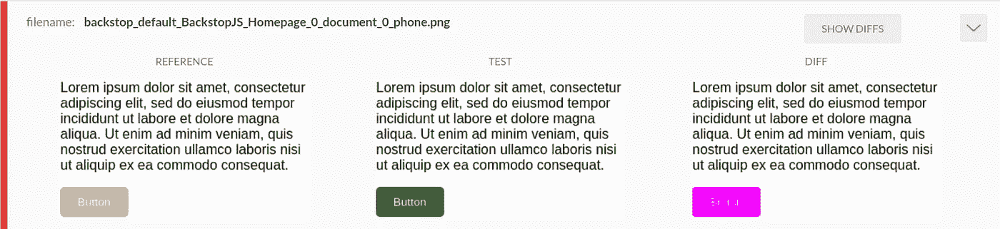

# 用 BackstopJS 进行可视化回归测试

> 原文：<https://levelup.gitconnected.com/visual-regression-testing-with-backstopjs-614703db1642>

## 项目越大，每次变更后花在回归测试上的时间就越多。BackstopJS 是一个工具，可以帮助你减少这个过程中的努力

[由 ADCI 解决](https://www.adcisolutions.com/?utm_source=medium&utm_medium=referral&utm_campaign=medium-story-backstopjs-mainpagewebsite&utm_content=medium-story-backstopjs)

# 介绍

一个组件的变化会导致其他组件发生不希望的变化。通常，这只是视觉上的变化。**回归测试**允许发现这样的变化。

简而言之，回归测试是在已经存在的功能发生变化或添加了新组件时检查其可操作性的过程。

这种测试可以手动完成(这种情况经常发生)，但是根据项目的大小，这可能需要付出大量的努力并且非常耗时。这就是为什么建议通过使用特殊的自动化程序来优化测试过程，从而进行**视觉回归测试**。

有许多可视化回归测试的工具。你可以在这里阅读其中一个。在本文中，我们将考虑 BackstopJS 工具，因为它功能强大，使用简单。

我们会考虑**逆推**的特点。读完这篇文章后，读者将会知道如何为他/她的项目安装和配置它，学习如何使用这个工具。

让我们开始了解背刺。

# 如何安装 BackstopJS

很简单。BackstopJS 既可以全局安装(推荐)，也可以本地安装在您的项目中。要安装，请运行以下命令:

# 如何配置背景

如果还没有配置 BackstopJS，可以在当前工作目录中创建一个默认的配置文件。在项目目录中运行以下命令:

将创建 backstop.json 配置文件:

让我们看看文件的主要部分。

*   id —用于屏幕截图命名
*   视窗—一组屏幕大小的对象，用于测试您的站点。您可以向视口中添加尽可能多的对象，但至少必须有一个
*   场景—这是您为测试设置特定数据的地方:

-场景[n]。标签—必需。用于屏幕截图命名

-场景[n]。url —必需。这正是我们想要测试的。它可以是绝对 URL，也可以是当前工作目录的本地 URL

这些是主要参数，但还有许多其他参数可以帮助测试过程。

*   onBeforeScript —用于在测试前设置浏览器状态
*   onReadyScript —在截屏前修改 UI 状态的脚本，例如悬停、点击等
*   readyEvent —在将该字符串记录到控制台之前，测试无法运行
*   readySelector —在该选择器出现之前，测试不会开始
*   hideSelectors —设置为可见性:隐藏的选择器数组
*   removeSelectors —设置为显示的选择器数组:none
*   延迟—等待(毫秒)

您可以模拟用户行为:

*   hoverSelector —在创建屏幕截图之前，将鼠标光标移动到指定的 DOM 元素上
*   单击选择—在屏幕截图之前单击指定的 DOM 元素

比较两种环境:

*   reference URL——可以在两个不同的环境中比较页面，而不是使用参考截图

这还不是**背刺**能做的全部。在[官方文件](https://github.com/garris/BackstopJS)中查看完整列表。

# 如何使用背景知识

在我们回顾了测试的基本设置之后，让我们来看看使用**背景图**的基本命令。

我们仍然没有参考截图，我们将在测试期间比较页面的当前状态。运行命令:

现在我们有了所有的截图，我们可以开始测试了。运行以下命令:

它将在“bitmaps_test/ <timestamp>/”文件夹中生成新的图像，并将显示一份报告，比较最新的参考截图和当前的参考截图。</timestamp>

如果所有测试用例都通过了，就可以更新参考截图了。运行以下命令:

接下来的测试将与您的新参考截图进行比较。

# 报告

在我们运行测试之后，BackstopJS 在“back stop _ data/HTML _ report/index . HTML”文件夹中创建 HTML 报告，它清楚地显示了哪里出了问题以及出了什么问题。

这些报告看起来像这样:

BackstopJS HTML 报表的外观

# 编后记

我们已经学习了 **BackstopJS** 的特性和功能，这是一个极大地方便了**回归测试**的工具，并且学习了如何使用这个工具。在社交网络上分享这个指南，以减少熵和一些不想要的变化。

*最初发布于*[*ADCI 解决方案网站。*](https://www.adcisolutions.com/knowledge/visual-regression-testing-backstopjs?utm_source=medium&utm_medium=referral&utm_campaign=medium-story-backstopjs-article&utm_content=medium-story-backstopjs)

**作者是弗拉德·布拉特尼科夫，ADCI 解决方案公司的网络开发人员**

Vladislav 致力于为全球各地的客户提供完美的网站。他不断提高自己的技能，以交付更好的项目。在业余时间，他看书，做饭或打排球。

在社交网络上关注我们: [推特](https://twitter.com/ADCISolutions) | [脸书](https://www.facebook.com/adcisolutions/) | [LinkedIn](https://www.linkedin.com/company/adci-solutions/)

 [## 如何使用项目文档

### 详细文档的存在对于任何项目来说都是重要的事情之一。你是否使用…并不重要

levelup.gitconnected.com](/how-to-work-with-project-documentation-3875135f0881)