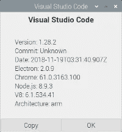
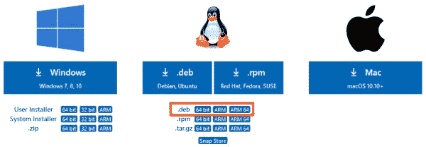
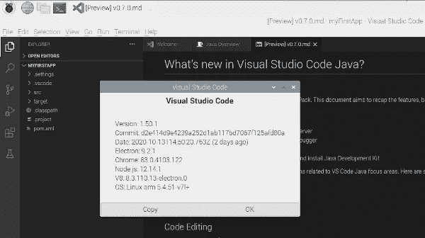
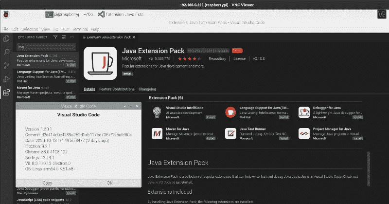
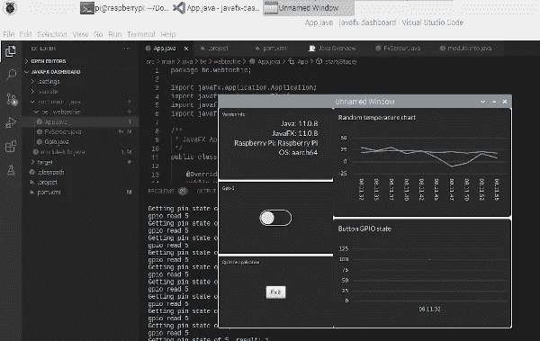

# Raspberry Pi 上的 Visual Studio 代码(使用 32 位和 64 位操作系统)

> 原文：<https://levelup.gitconnected.com/visual-studio-code-on-the-raspberry-pi-with-32-and-64-bit-os-600776825579>

在我的书[“Raspberry Pi 上的 Java 入门”](https://webtechie.be/books/)中，我给出了更多关于用于 Java 开发的 IDEs 集成开发环境)的信息。我更喜欢的是 [JetBrains IntelliJ IDEA](https://www.jetbrains.com/idea/) 和[微软 Visual Studio Code (VSC)](https://code.visualstudio.com/) 。

IntelliJ IDEA 是 Java 开发人员最常用的 IDE，有免费版和付费版。

Visual Studio 代码是完全免费的，但直到最近还没有树莓派的官方版本。你可以在 Steve Desmond 的 [GitHub 项目](https://github.com/stevedesmond-ca/vscode-arm/releases/tag/1.28.2)中找到 1.28.2 版本，但是 VSC 今天已经是 1.50.1 版本了。



幸运的是，微软决定再次发布新版本，安装 32 位和 64 位的 Raspberry Pis。杰哈！让我们安装并测试它们…

在你的 Raspberry Pi 上打开浏览器，进入 [Visual Studio 代码下载页面](https://code.visualstudio.com/Download)。我们将使用 Linux。黛比档案。



# 树莓 Pi 操作系统 32 位

如果你使用的是“默认”的 Raspberry Pi 操作系统——32 位版本——你需要下载“ARM”文件。下载完成后，启动一个终端，并使用以下命令运行安装:

```
$ cd /home/pi/Downloads 
$ sudo apt install ./code_1.50.1-1602600660_armhf.deb
```

你现在可以从开始按钮启动 VSC，你会在“编程”列表中找到它。



这就是了，Linux ARM 处理器上的最新版本 1.50.1！

# 树莓 Pi 操作系统 64 位

如果你已经在使用更新的正在开发的 64 位 Rapsberry Pi 操作系统(参见我的文章[“带 USB 启动的 Raspberry Pi 4 上的 64 位 Raspbian 操作系统”](/improve-raspberry-pi-4-disc-read-speed-with-64-bit-raspbian-os-with-usb-mass-storage-boot-4a22ff2d34e1))，你将需要另一个版本。

从下载页面选择“ARM 64”版本。安装命令与之前相同，但文件名略有不同。

```
$ cd /home/pi/Downloads 
$ sudo apt install ./code_1.50.1-1602600638_arm64.deb
```

此外，您现在可以在开始菜单的编程列表中找到 Visual Studio 代码。让我们添加“Java 扩展包”，这样我们就可以测试一个 Java 应用程序。



我的主板上已经安装了 Maven 和贝尔软 JDK 与 JavaFX:

```
$ mvn -version 
Apache Maven 3.6.0 
Maven home: /usr/share/maven 
Java version: 11.0.8, vendor: BellSoft, runtime: /home/pi/.sdkman/candidates/java/11.0.8.fx-librca 
Default locale: en_GB, platform encoding: UTF-8 
OS name: "linux", version: "5.4.51-v8+", arch: "aarch64", family: "unix" $ java -version 
openjdk version "11.0.8" 2020-07-14 LTS 
OpenJDK Runtime Environment (build 11.0.8+10-LTS) 
OpenJDK 64-Bit Server VM (build 11.0.8+10-LTS, mixed mode)
```

没有任何进一步的安装，我们现在可以试用我的书中的一个例子，即[“Java FX dashboard application”](https://github.com/FDelporte/JavaOnRaspberryPi/tree/master/Chapter_07_JavaFX/javafx-dashboard)。



# 结论

Raspberry Pi 已经是一款功能强大的低价电脑了。现在，随着我们心爱的主板版本的 Visual Studio 代码发布，以及该 IDE 可用的所有扩展，**我们可以使用 Raspberry Pi 作为 Java 和许多其他编程语言的真正开发人员 PC**！

*原载于*[*https://web techie . be*](https://webtechie.be/post/2020-10-15-visual-studio-code-on-raspberry-pi/)*。*