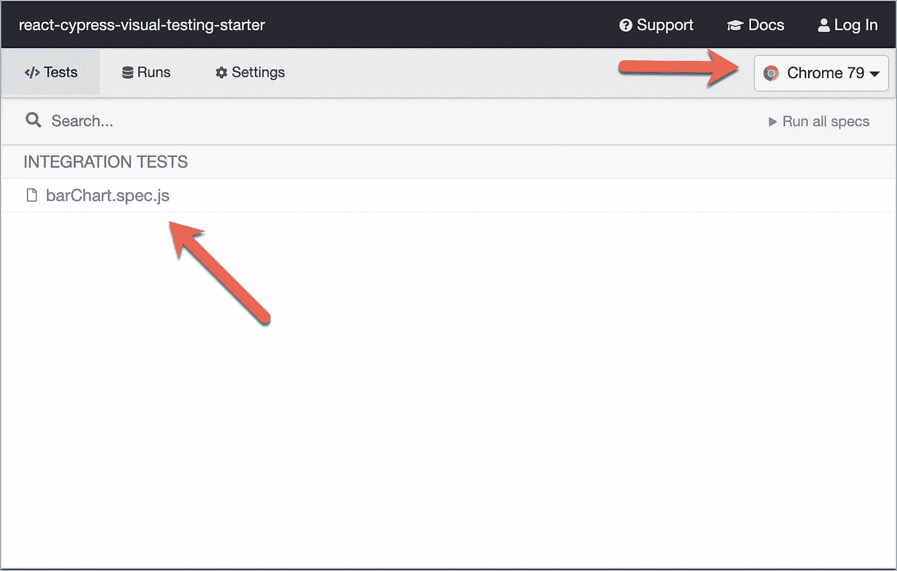

# 用 Cypress 进行视觉测试

> 原文：<https://levelup.gitconnected.com/visual-testing-with-cypress-607db87f7219>

## 验证您的应用程序看起来像它应该的样子


[居住者](https://inhabitat.com/this-crazy-school-in-singapore-looks-like-its-made-from-rainbow-lollipops/)拍摄

我参与了一个使用各种图表展示数据的项目。我们已经编写了大量的单元测试来涵盖后端的业务逻辑，以及客户端的小计算和格式化规则。我们非常有信心，该功能正在按预期工作。

在部署后的某个时刻，在我们所有的测试套件都通过之后，一个最终用户提交了一个 bug，显示一些图表看起来不对。图表使用的数据是正确的，但它看起来不像用户期望的那样。他希望图表的某些部分使用某种颜色。我们当前的测试无法确定元素在浏览器中呈现时的视觉外观。当然，它可以测试某个 DOM 元素是否存在，或者检查颜色和位置的 style 属性，但是很多因素仍然可以忽略那些使元素在浏览器中看起来不同的因素。

那时我们决定尝试视觉测试。*视觉测试*测试你的应用程序看起来是否像最终用户期望的那样。当我们对应用程序进行改变，打破了应用程序以前的外观时，我们引入了*视觉回归*。

Cypress 是一个端到端的测试工具，可扩展到足以支持可视化测试。在本教程中，我将向您展示如何以最少的努力执行可视化测试。

# React 应用程序示例

本教程中描述的步骤应该适用于任何框架编写的应用程序。我们将使用 React 应用程序来显示一个使用 [Highcharts](https://www.highcharts.com/) 创建的简单条形图。继续克隆这个 Git 存储库。

[](https://github.com/randalvance/react-cypress-visual-testing-starter) [## Randal vance/react-cypress-visual-testing-starter

### 这个项目是用 Create React App 引导的。在项目目录中，您可以运行:在…中运行应用程序

github.com](https://github.com/randalvance/react-cypress-visual-testing-starter) 

如果您想在完成本教程后看到最终的代码，那么您可以检查这个 Git 存储库的`final`分支。

运行`npm start`来运行应用程序。


测试显示条形图的 React 应用程序

图表包含图表系列的硬编码值。在实际项目中，它将从 API 后端获取。我们将使用视觉测试来确保我们的图表在用户看到时完全是这个样子。

# 安装 Cypress

从 Github 克隆了示例 react 应用程序 repo 之后，在终端中导航到它的根文件夹，并安装 Cypress。

```
npm install cypress --save-dev
```

创建一个 npm 脚本来启动 cypress。在您的`package.json`文件中，找到`scripts`部分并添加一个新条目。

```
"scripts": {
    "cypress:open": "cypress open",
    ...
},
```

这样，我们现在可以通过执行以下命令来打开 Cypress 测试运行程序:

```
npm run cypress:open
```

Cypress test runner 将会打开，它会建议创建一些示例测试来帮助您开始。点击“好的，知道了！”按钮。


Cypress 将创建必要的文件夹和示例文件。

将在项目的根目录下创建一个`cypress`文件夹，以及一个`cypress.json`文件。


这些是 Cypress 创建的文件夹和文件。

在`cypress/integration/examples`下，你会看到一些可以作为有用参考的示例测试。我已经在本教程中删除了它们，以消除混乱。

# 安装 Cypress `Image Snapshot` 插件

Cypress 有各种各样的命令，我们可以用它们来查找某些元素，检查它们的属性，与浏览器交互，以及模拟网络请求。然而，它没有支持开箱即用的可视化测试的命令。幸运的是，在插件的帮助下，cypress 是可扩展的。我们将使用的一个特殊插件是`[cypress-image-snapshot](https://github.com/palmerhq/cypress-image-snapshot)`。

让我们使用以下命令安装这个插件:

```
npm install cypress-image-snapshot --save-dev
```

安装包后，我们需要将插件注册到 Cypress。打开`cypress/plugins/index.js`文件，将其内容替换为以下代码:

注册 cypress 图像快照插件

该文件导出一个函数，该函数有两个用于监听事件和项目配置的参数。我们调用传递两个参数的`addMatchImageSnapshotPlugin`方法。

注册插件是不够的，因为它只会让插件准备好监听各种 cypress 事件来执行它的功能。Cypress 命令将调用这些事件。

`cypress-image-snapshot`插件有自己的命令来调用被插件监听的事件。这是我们将在 cypress 测试中使用的`matchImageSnapshot`,用于捕获特定的 UI 元素，并将其与现有的快照进行匹配。我们需要通过打开`cypress/support/commands.js`文件并将其内容替换为以下内容来注册该命令:

注册 matchImageSnapshot 命令

在您保存了所有的更改之后，我们现在就可以编写 Cypress 测试了。

# 编写测试

在`cypress/integration`文件夹下创建一个新的 javascript 文件。赛普拉斯试验如下:

第 1 行禁用了`no-undef` ESLint 规则，因为为这个文件启用它将标记出一个错误的`cy`变量，因为它没有被定义，但是第 2 行实际上引用了 Cypress 类型，包括全局变量`cy`。如果您没有使用 ESLint，可以删除这一行。

第 4 行调用了`describe`函数，这只是对相关测试进行分组的一种方式。即使我们只有一个测试，我们仍然需要将它包装在`describe`函数中。

第 5 行是实际测试。我们调用`it`函数，它将包含要执行的命令(或者，您可以使用完全相同的测试函数)。您为第一个参数指定一个描述，第二个参数是一个包含测试内容的回调函数。

第 6 行调用`visit`命令将浏览器导航到我们要测试的应用程序的 URL。第 7 行使用`get`命令来查找图表元素。如果您查看表示条形图的 React 元素的标记，您会看到我在包含实际图表的 div 中附加了一个类:


包含条形图的 div 附带了一个类

因此，我使用`.bar-chart`作为传递给`get`命令的选择器。

一旦使用`get`选择了这个命令，我就将一个调用链接到`matchImageSnapshot`。

```
cy.get('.bar-chart').matchImageSnapshot('barChart');
```

记得我们注册了这个由`cypress-image-snapshot`插件提供的命令。第一个参数是快照的名称。在查找快照映像时，您将引用该名称。

该命令执行以下操作:

1.  它获取所选元素的快照/屏幕截图，在本例中是我们的条形图。
2.  如果这是第一次拍摄图像，Cypress 会将其视为基础图像快照。该命令将自动通过，因为没有什么可比较的。
3.  如果这不是第一次，并且快照文件夹中已经有一个基础映像，那么它将在最新快照和基础快照之间执行逐个像素的比较。如果基础图像的像素有差异，该命令将失败。

# 运行测试

确保您将要测试的应用程序已经启动并且正在运行。在 Cypress 测试运行器中，点击您刚刚创建的测试文件。请注意，您还可以在右上角选择运行测试的浏览器。



运行 Cypress 测试

这将打开 Chrome 或您选择的浏览器，并执行测试命令。


运行测试后的结果

所有的测试都通过了，特别是第 3 行的任务，它代表了`matchImageSnapshot`命令。


图像快照任务已通过

这是我们第一次运行该命令，因此它会创建一个快照并将该命令标记为已通过。如果你查看你的项目文件，你会看到一个`snapshot`文件夹被创建。


快照文件夹已创建

`snapshots`文件夹包含了您运行的每个测试文件的子文件夹。子文件夹中是实际的快照。如果您打开图像文件，它会显示我们调用`matchImageSnapshot`时的条形图。

# 当快照不匹配时

在第一次运行测试之后，创建的快照将被视为基础映像，并假设它是元素的正确外观。如果没有，您可以删除图像并重新运行测试。

让我们通过简单地改变条形图所使用的数据来模拟一个失败的测试。打开`src/BarChart.tsx`文件。找到这段代码:

```
data: [
    ['John', 40],
    ['Mike', 24],
    ['Charles', 10],
    ['Susan', 5],
    ['Rebecca', 56],
],
```

每个子数组代表条形图的 X 轴和 Y 轴。继续更改一些数值，以影响每个条形的显示。我把`John`改成了`0`，把`Susan`改成了`20`作为例子。

```
data: [
    ['John', 0],
    ['Mike', 24],
    ['Charles', 10],
    ['Susan', 20],
    ['Rebecca', 56],
],
```

保存文件，并在打开的浏览器窗口中按快捷键`r`重新运行测试，该窗口显示了之前的测试运行结果。测试现在将失败。


修改图表后，测试失败

错误消息显示当前图像快照与`snapshots`文件夹中基础图像快照的差异百分比。它还显示了您可以看到显示两个文件差异的图像输出的路径。

在您的`snapshots`文件夹中，您应该会看到一个保存图像文件的`__diff_output__`文件夹。


差异结果的图像文件

打开文件以查看图像比较的结果。


基本快照和最新快照的差异

左侧是基本快照。右边是最新的快照。中间的图像是两个快照的差异，每个差异都以红色突出显示。

为了真正看到视觉测试的威力，让我们将图表的颜色从绿色改为蓝色。在同一个文件 src/BarChart.tsx 中，找到这一行:

```
*color*:'green',
```

将颜色更改为`‘blue’.`

再次运行测试，仍然会失败。让我们看看生成的 diff 图像。


更改图表颜色后的差异

现在，每个条形都在 read 中突出显示。这是因为执行的逐像素比较也考虑了每个像素的颜色值。

# 结论

在一些项目中，你可能需要测试你的 UI 对最终用户来说是什么样子。这可以通过创建可视化测试来完成。在`cypress-image-snapshot plugin`的帮助下，Cypress 将使您能够为您的项目执行可视化测试。视觉测试将使用与先前捕获的基础图像的逐像素比较来执行。我希望你学到了一些有价值的东西，并且可以将这些应用到你当前和未来的项目中。非常感谢你的阅读！