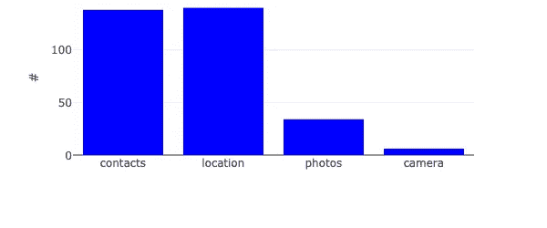
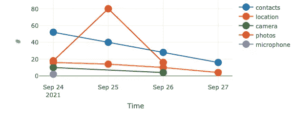

# 可视化应用隐私报告

> 原文：<https://levelup.gitconnected.com/visualise-appprivacy-report-a6c4cb38ce3b>

丹·尼尔森在 [Unsplash](https://unsplash.com?utm_source=medium&utm_medium=referral) 上拍摄的照片

## 使用 iOS15 新功能的简单方法

# **获取报告文件**

在 [iOS15](https://www.apple.com/ios/ios-15/features/) 上，有一个新的功能可以监视正在攻击我们的应用程序: [AppPrivacyReport](https://www.apple.com/newsroom/2021/06/apple-advances-its-privacy-leadership-with-ios-15-ipados-15-macos-monterey-and-watchos-8/) 。

这个回购的目标是有一个**易读的**表示。

访问不同类别的数据。图片作者。

苹果可能会在未来发布类似的东西，但是没有在发布时可视化数据的功能

# **隐私友好**

当然，我是以一种隐私友好的方式开发这个工具的。

所有的计算都是离线进行的，除了你的电脑之外，没有任何数据存储在其他地方。所有的代码现在和将来都是开源的。

## **导出您的报告**

按照这些[步骤](https://developer.apple.com/documentation/ios-ipados-release-notes/ios-ipados-15-release-notes#Privacy)导出您的报告:

*   设置
*   隐私
*   记录应用程序活动(如果禁用，则启用它)
*   保存应用程序活动

保存您的报告*。njson* 文件并上传到 index.html 页面。

应用程序随时间推移访问的信息。图片作者。

# 密码

要克隆的代码在这里[https://github.com/fvalle1/AppPrivacyReportVisualiser](https://github.com/fvalle1/AppPrivacyReportVisualiser)