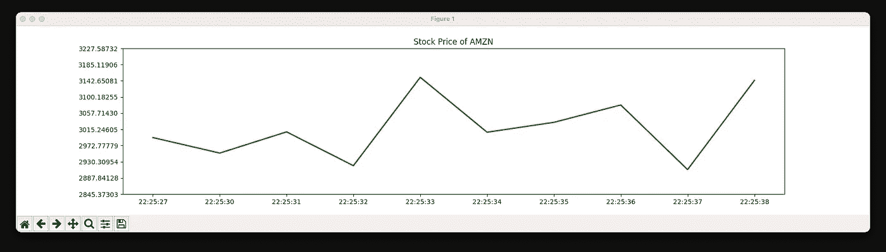
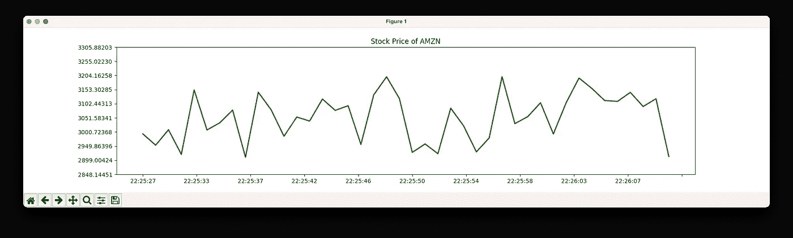
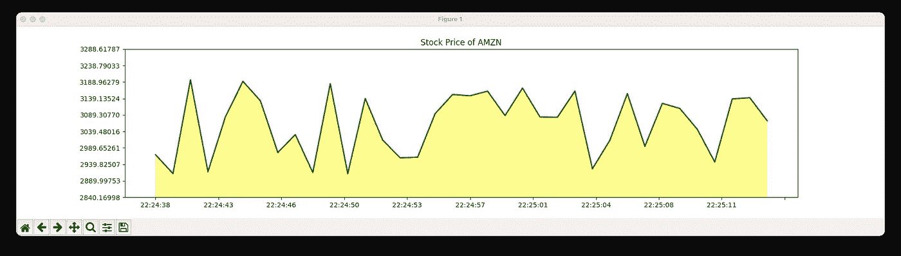
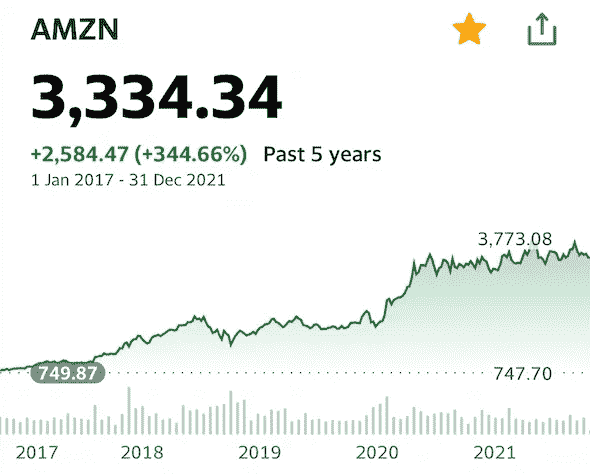
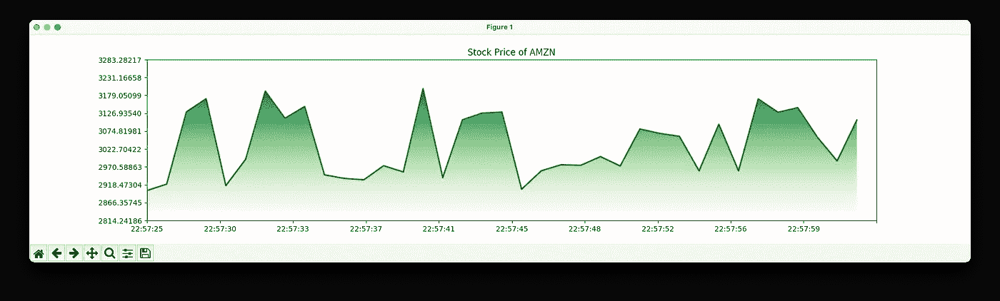
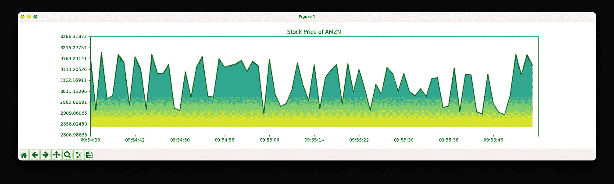
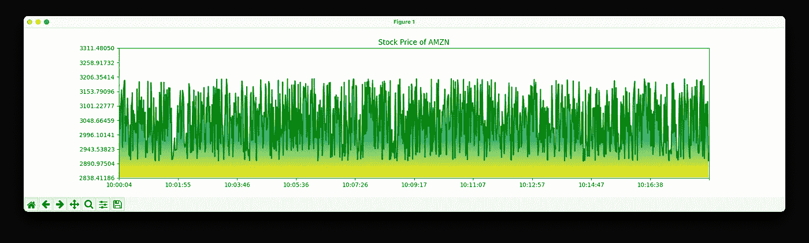
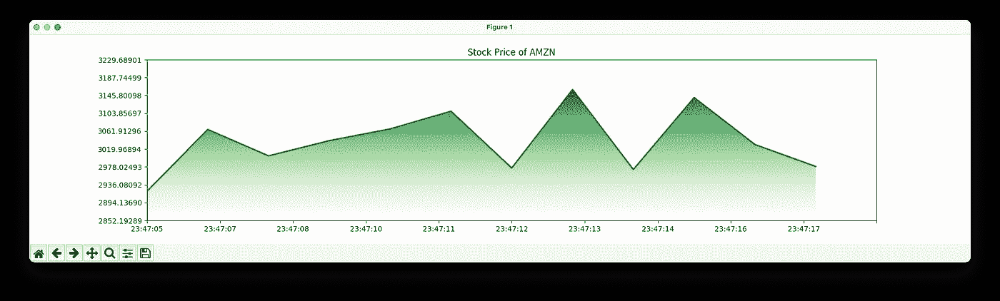
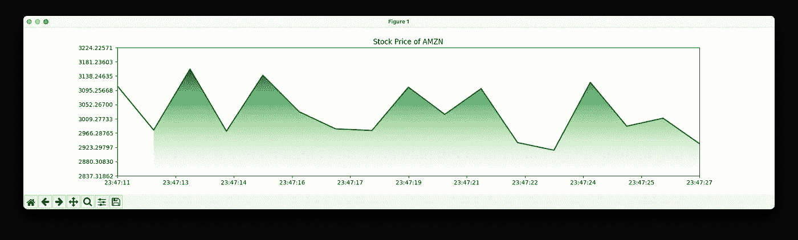
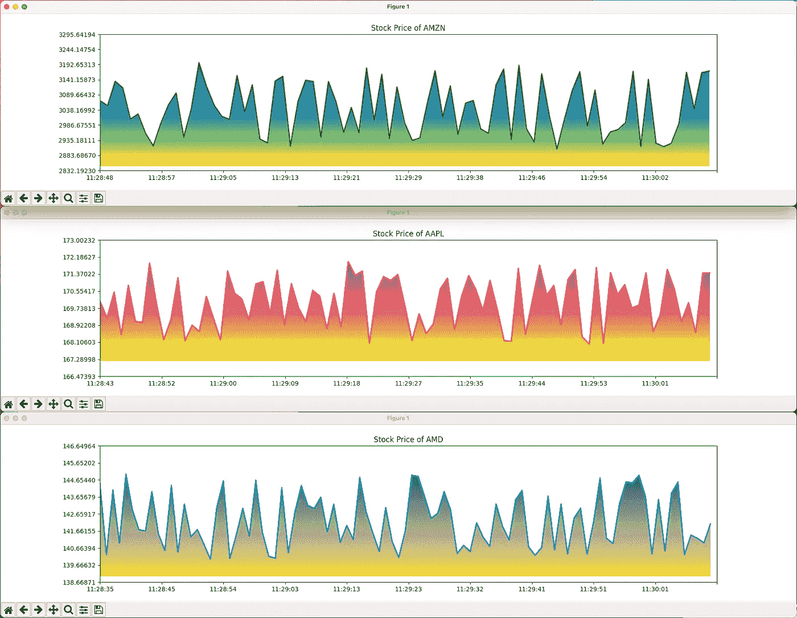

# Python 中的可视化—使用 matplotlib 创建动态时间序列

> 原文：<https://levelup.gitconnected.com/visualization-in-python-creating-dynamic-time-series-using-matplotlib-5fe971553dfa>

## 了解如何使用 matplotlib 创建动态时间序列


[摄于](https://unsplash.com/@greenpjy123?utm_source=medium&utm_medium=referral) [Unsplash](https://unsplash.com?utm_source=medium&utm_medium=referral) 上的智妍公园

大多数时候，当使用 matplotlib 时，您可能会使用它来创建静态可视化，如折线图、直方图、饼图、散点图等。但是，如果您想要创建一个随着时间的推移而自我更新的动态图表，该怎么办呢？

在本文中，我将向您展示如何使用 matplotlib 创建动态时间序列图。特别是，您将使用它来显示股票的价格，并每秒钟动态更新一次。

# 创建 Stocks REST API

与其连接到实时股票 API，不如编写自己的模拟 API 来检索股票价格。为此，我将使用 **flask** 框架创建一个简单的 REST API，用一个端点获取股票价格。

以下是 REST API 的完整程序(我将其命名为 **stocksdata.py** ):

```
import pickle
from flask import Flask, request, jsonify    
import numpy as npapp = Flask(__name__)@app.route('/stocks/v1/fetch', methods=['POST'])
def fetch():
    #---get the features to predict---
    details = request.json #---create the features list for prediction---
    symbol = details["Symbol"]    #---formulate the response to return to client---
    response = {}
    response['symbol'] = symbol
    if symbol == 'AAPL':
        response['price'] = np.random.uniform(168,172)
    if symbol == 'AMD':
        response['price'] = np.random.uniform(140,145)
    if symbol == 'AMZN':
        response['price'] = np.random.uniform(2900,3200)    
    return  jsonify(response)if __name__ == '__main__':
    app.run(host='0.0.0.0', port=5000)
```

在上面的程序中，有一个端点— `/stocks/v1/fetch`，您可以调用它来获取特定股票的股价。您只需要使用 POST 方法向它发送一个包含股票代码的 JSON 字符串。出于模拟目的，API 仅支持三只股票——AAPL、AMD 和 AMZN。我还根据每只股票最近的价格区间随机排列了它们的价格。结果作为 JSON 字符串返回。

REST API 到此为止。要测试 REST API，请在终端中键入以下命令:

```
**$ python stocksdata.py**
 * Serving Flask app 'stocksdata' (lazy loading)
 * Environment: production
   WARNING: This is a development server. Do not use it in a production deployment.
   Use a production WSGI server instead.
 * Debug mode: off
 * Running on all addresses.
   WARNING: This is a development server. Do not use it in a production deployment.
 * Running on [http://192.168.1.89:5000/](http://192.168.1.89:5000/) (Press CTRL+C to quit)
```

## 测试 REST API

测试 REST API 很容易。只需将**卷曲**与以下选项一起使用:

```
$ **curl -H "Content-Type: application/json" -X POST  http://localhost:5000/stocks/v1/fetch  -d '{"Symbol":"AAPL"}'**
```

> Windows 用户应该注意，命令行中不支持单引号字符(`**‘**`)。因此，在上面的命令中，JSON 字符串应该像这样用双引号括起来:`**“{\“Symbol\”:\”AAPL\”}“**`

您应该得到 JSON 字符串形式的结果:

```
{"price":171.65226451409433,"symbol":"AAPL"}
```

您可以尝试不同的股票代码:

```
$ curl -H "Content-Type: application/json" -X POST  http://localhost:5000/stocks/v1/fetch  -d '{"Symbol":"**AMD**"}'$ curl -H "Content-Type: application/json" -X POST  http://localhost:5000/stocks/v1/fetch  -d '{"Symbol":"**AMZN**"}'
```

## 使用 Python 使用 REST API

既然 REST API 已经开始工作，那么您将需要使用 Python 来使用这个 API。为此，我们创建一个名为 **DisplayStock.py** 的文件，并用以下代码填充它:

```
import requests
from requests.exceptions import HTTPError
import json
import systry:
    url = '[http://localhost:5000/stocks/v1/fetch'](http://localhost:5000/stocks/v1/fetch')
    data = {"Symbol": sys.argv[1]}
    data_json = json.dumps(data)
    headers = {'Content-type':'application/json'}
    response = requests.post(url, data=data_json, headers=headers)# Raise an exception if a request is unsuccessful
    response.raise_for_status()
except HTTPError as http_err:
    print(f'HTTP error occurred: {http_err}')  
except Exception as err:
    print(f'Other error occurred: {err}')  
else:
    try:
        # convert the JSON result into a dictionary
        stock_price = json.loads(response.text)    
    except ValueError as err:  
        print(err)
    else:       
        # get the value for the "price" key
        price = float(stock_price["price"])
print(price)
```

注意，要检索的股票价格是作为命令参数传递的— `sys.argv[1]`。

为了测试上述程序，在另一个终端窗口*中键入以下命令:*

```
$ **python DisplayStock.py AMD**
```

您应该会看到打印的值:

```
143.55937206250357
```

# 显示时间序列图表

使用我们在上一节中开发的 REST API，我们现在想要创建一个时间序列图，显示股票价格随时间的变化。到目前为止，在我们看到的大多数 matplotlib 示例中，所有绘制的图表大多是静态的。如果我们想让图表变得生动，并动态地绘制股票价格图表呢？嗯，这是可能的。让我们看看如何实现这一点。

基本思想是首先创建一个函数来绘制时间序列图中的各个点。随着新的点被添加到时间序列中，您可以通过使用`matplotlib.animation module`中的`FuncAnimation`类重复调用函数来更新图表并制作动画。

下面的代码片段说明了这个想法:

```
import matplotlib.animation as animation**# plot a figure of a specific size**
fig, ax = plt.subplots(1,1,figsize=(18,4))**# function to plot the chart**
def animate(i):
   **# fetch new data to be added to the plot
   # plotting logic and code here**
   # ...
   # ...
   # ...**# call the animate() function every second**
ani = animation.FuncAnimation(fig, animate, interval=1000)
plt.show()
```

在上面:

*   `animate(i)`是负责绘制时间序列的自定义函数。它接受一个指定帧号的强制参数。该号码是一个自动递增的号码。
*   `interval`指定调用`animate()`函数更新动画的频率。单位是毫秒，在本例中，动画每 1 秒刷新一次。
*   注意，将`FuncAnimation`类的实例赋给一个变量是很重要的，否则动画不会开始。另外，需要调用`plt.show()`来启动动画。

就是这样！我们现在准备填写细节来绘制我们的时间序列！我们将使用我们之前创建的同一个 **DisplayStock.py** 文件:

```
import requests
from requests.exceptions import HTTPError
import json
import sys**import matplotlib.pyplot as plt
import matplotlib.animation as animation
import matplotlib.ticker as mticks
from datetime import datetime****# plot a figure of a specific size
fig, ax = plt.subplots(1,1,figsize=(18,4))****# for storing the date and time
x = []****# for storing the stock price
y = []****# number of ticks intervals to display for each axis
no_x_intervals = 10
no_y_intervals = 8****# maximum and minimum stock price recorded
max_price = min_price = 0****def animate(i):
**    # fetch stock prices
    try:
        url = '[http://localhost:5000/stocks/v1/fetch'](http://localhost:5000/stocks/v1/fetch')
        data = {"Symbol": sys.argv[1]}
        data_json = json.dumps(data)
        headers = {'Content-type':'application/json'}
        response = requests.post(url, data=data_json, 
                   headers=headers) # Raise an exception if a request is unsuccessful
        response.raise_for_status()
    except HTTPError as http_err:
        print(f'HTTP error occurred: {http_err}')  
    except Exception as err:
        print(f'Other error occurred: {err}')  
    else:
        try:
            stock_price = json.loads(response.text)    
        except ValueError as err:  
            print(err)
        else:        
            price = float(stock_price["price"])
    **#** print(price) **global max_price
    global min_price** **# store the max and min of the stock price recorded
    max_price = max(price, max_price)    
    min_price = max_price if min_price == 0 else \
                min(price, min_price)

    # add the data for x and y-axis    
    x.append(datetime.now().strftime("%H:%M:%S"))
    y.append(price)

    # clear the chart and plot again
    ax.clear()
    ax.plot(x, y, 
        linewidth=2, 
        color=sys.argv[2])** **# calculate the buffer to add to the top and 
    # bottom of the line chart
    buffer = (max_price - min_price) * 0.20  # 20% of the price
                                             # difference** **# set the range of the y-axis
    ax.set_ylim(
        (min(price, min_price) - buffer, 
         max(price, max_price) + buffer)
    )** **# display the x-axis ticks with intervals
    ax.xaxis.set_major_locator(       
        # interval spacing of x-ticks        
        mticks.MultipleLocator(len(x) / no_x_intervals))** **# display the y-axis ticks with intervals
    ax.yaxis.set_major_locator(
        mticks.MultipleLocator(((max_price - min_price + 1) + \
                                (2*buffer)) / no_y_intervals))** **# get the y-ticks and their corresponding labels 
    locs, _ = plt.yticks()** **# format the y-axis labels to display 5 decimal places
    plt.yticks(locs, map(lambda x: "%.5f" % x, locs))
    plt.title("Stock Price of " + sys.argv[1])****ani = animation.FuncAnimation(fig, animate, interval=1000)
plt.show()**
```

代码片段中的大部分代码都是不言自明的，但有几点值得一提:

*   `mticks.MultipleLocator()`类控制 x 轴或 y 轴上的刻度间距。
*   对于 x 轴，刻度显示时间。随着时间的推移，x 轴的值将会增加，因此调整 x 轴刻度之间的间距以获得固定的 x 轴刻度非常重要。
*   同样，对于 y 轴，不同股票的价格范围也不同，因此调整 y 轴分笔成交点之间的间距很重要，这样你就有了固定数量的 y 轴分笔成交点。
*   基于股票的价格范围，我添加了价格范围 20%的缓冲区，以便它们在图表的顶部和底部有一些空间。您可以随意更改百分比，以找到图表的最佳视觉外观。
*   最后，应用程序还期望第二个参数指定为图表绘制的颜色。

现在，您可以通过在终端中键入以下命令来测试应用程序:

```
$ **python DisplayStock.py AMZN green**
```

图表将每秒更新一次:



作者图片

这是一段时间后的样子:



作者图片

下面是一段视频，展示了动画的样子:

作者提供的视频

# 填充图表

为了使图表更吸引人，您可以用一些颜色填充图表。您可以使用`fill_between()`功能来完成此操作:

```
 ... # display the y-axis ticks with intervals
    ax.yaxis.set_major_locator(
        mticks.MultipleLocator(((max_price - min_price + 1) + \
                                (2*buffer)) / no_y_intervals)) **ax.fill_between(
        x, y, 0, 
        facecolor='yellow', 
        alpha=0.5)** # get the y-ticks and their corresponding labels 
    locs, _ = plt.yticks() ...
```

图表现在将被填充为黄色:



作者图片

根据你的喜好，填充颜色可能不会太令人兴奋。做一个渐变填充怎么样？就像你在 iOS 上的**财务**应用上看到的一样:



作者图片

原来你可以通过使用来自`matplotlib.patches`的`PathPatch`类来做渐变填充:

```
**import numpy as np
from matplotlib.patches import PathPatch**... # display the y-axis ticks with intervals
    ax.yaxis.set_major_locator(
        mticks.MultipleLocator(((max_price - min_price + 1) + \
                                (2*buffer)) / no_y_intervals)) **fill_poly = ax.fill_between(
        x, y, 0, 
        color='none')** **y_min, y_max = ax.get_ylim()

    polycurve = PathPatch(
        fill_poly.get_paths()[0],    
        transform = ax.transData)** **ax.imshow(np.arange(256).reshape(-1, 1), 
        extent=[0, len(x), y_min, y_max],
        cmap= sys.argv[3], aspect='auto').set_clip_path(polycurve)** # get the y-ticks and their corresponding labels 
    locs, _ = plt.yticks()
```

注意，现在应用程序需要第三个参数来指定色彩映射表(`cmap`)。有关 matplotlib 的可用 cmaps 列表，请查看以下链接:

[](https://matplotlib.org/stable/tutorials/colors/colormaps.html) [## 在 Matplotlib - Matplotlib 3.5.1 文档中选择色彩映射表

### Matplotlib 有许多内置的色彩映射表，可以通过 matplotlib.cm.get_cmap 访问。还有外部库…

matplotlib.org](https://matplotlib.org/stable/tutorials/colors/colormaps.html) 

以下是一些您可以尝试的 *cmap* 值:

```
'viridis', 'plasma', 'inferno', 'magma', 'cividis', 'Pastel1',
'Pastel2', 'Paired', 'Accent', 'Dark2', 'Set1', 'Set2', 'Set3', 
'tab10', 'tab20', 'tab20b', 'tab20c', 'Greys', 'Purples', 'Blues', 
'Greens', 'Oranges', 'Reds', 'YlOrBr', 'YlOrRd', 'OrRd', 'PuRd', 
'RdPu', 'BuPu', 'GnBu', 'PuBu', 'YlGnBu', 'PuBuGn', 'BuGn', 'YlGn'
```

让我们试试**序列**类别中的一个 cmap 值— `Greens_r`:

```
$ python DisplayStock.py AMZN green **Greens_r**
```

您将看到绿色渐变填充:



作者图片

如果你想要更华丽的渐变填充，试试`viridis` cmap:

```
$ python DisplayStock.py AMZN green **viridis**
```



作者图片

下面是一段视频，展示了使用 `Greens_r` cmap 后图表的样子:

作者提供的视频

# 移动时间轴(水平轴)

随着程序的运行，你会发现 x 轴变得很有弹性:



作者图片

对于股票价格等应用程序，显示从交易开始到结束的 x 轴上的所有值非常重要。但是对于其他一些不需要显示所有值的应用程序来说，随着时间的推移在水平轴上移动图表是很有用的。

让我们将以下语句添加到应用程序中:

```
 # clear the chart and plot again
    ax.clear()
    ax.plot(x, y, 
        linewidth=2, 
        color=sys.argv[2]) **if i >= 15:
        # remove one element from both x and y
        del x[:1]
        del y[:1]** # calculate the buffer to add to the top and bottom of the line 
    # chart
    buffer = (max_price - min_price) * 0.20  # 20% of the price 
                                             # difference
```

在上面，我使用了`animate()`函数中的帧号`i`。如果`i`的值大于等于 15，我会删除`x`和`y`变量中的第一个元素。这样，我的 x 轴将显示固定数量的间隔。

当您第一次运行该程序时，一切看起来就像我们之前看到的那样:



作者图片

过一会儿，您会看到 x 轴开始移动:



作者图片

最好的视觉化方式是通过视频:

作者提供的视频

# 摘要

我希望这篇文章能让您对 matplotlib 的功能有一个全新的认识。与通常的静态图表不同，matplotlib 能够做一些真正令人惊讶的事情，比如动画，以及 3D 渲染(我将在另一篇文章中谈到这一点)。在我结束这篇文章之前，还有一件事。尝试使用`&`字符在后台运行该程序(仅适用于基于 Unix 的计算机)，您将看到 3 家公司的股票价格同时运行:

```
$ **python DisplayStock.py AMZN green viridis &**
$ **python DisplayStock.py AAPL red plasma &**
$ **python DisplayStock.py AMD blue cividis &**
```



作者图片

[](https://weimenglee.medium.com/membership) [## 加入媒介与我的介绍链接-李伟孟

### 作为一个媒体会员，你的会员费的一部分会给你阅读的作家，你可以完全接触到每一个故事…

weimenglee.medium.com](https://weimenglee.medium.com/membership)