# Python 中的可视化——创建单词云

> 原文：<https://levelup.gitconnected.com/visualization-in-python-creating-word-cloud-a3e1e73e7adb>

## 使用单词云来可视化文本内容


作者图片

每当提到 Python 中的可视化，大多数人都会想到条形图、饼状图等。如果您的数据围绕着一组项目，那么这些确实是您经常创建的可视化类型。但是如果你正在处理文字和文本呢？视觉上表现一段文字中包含的关键信息的最佳方式是什么？

答案是 ***字云*** 。

简单来说，*字云*就是包含以不同大小显示的字的图像。单词的大小决定了单词的重要性——单词越大、越粗，在给定的文本块中出现的频率就越高。

# 安装模块

要安装生成单词云所需的模块，请在 Jupyter Notebook 中运行以下命令:

```
!pip install wordcloud
```

让我们利用位于[https://www . ka ggle . com/Lakshmi 25 npathi/IMDB-dataset-of-50k-movie-reviews/version/1](https://www.kaggle.com/lakshmi25npathi/imdb-dataset-of-50k-movie-reviews/version/1)的 IMBD 数据集。

使用 Pandas，将数据集作为数据帧加载:

```
import pandas as pd
import numpy as npdf = pd.read_csv('IMDB Dataset.csv')
df
```

数据帧有 2 列和 50，000 行:

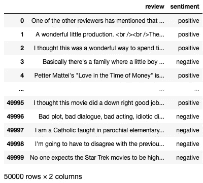

让我们对第一行进行采样，并打印出内容:

```
display(df.iloc[0,0])   # review
display(df.iloc[0,1])   # sentiment
```

该行的第一列包含电影的评论:

```
"One of the other reviewers has mentioned that after watching just 1 Oz episode you'll be hooked. They are right, as this is exactly what happened with me.<br /><br />The first thing that struck me about Oz was its brutality and unflinching scenes of violence, which set in right from the word GO. Trust me, this is not a show for the faint hearted or timid. This show pulls no punches with regards to drugs, sex or violence. Its is hardcore, in the classic use of the word.<br /><br />It is called OZ as that is the nickname given to the Oswald Maximum Security State Penitentary. It focuses mainly on Emerald City, an experimental section of the prison where all the cells have glass fronts and face inwards, so privacy is not high on the agenda. Em City is home to many..Aryans, Muslims, gangstas, Latinos, Christians, Italians, Irish and more....so scuffles, death stares, dodgy dealings and shady agreements are never far away.<br /><br />I would say the main appeal of the show is due to the fact that it goes where other shows wouldn't dare. Forget pretty pictures painted for mainstream audiences, forget charm, forget romance...OZ doesn't mess around. The first episode I ever saw struck me as so nasty it was surreal, I couldn't say I was ready for it, but as I watched more, I developed a taste for Oz, and got accustomed to the high levels of graphic violence. Not just violence, but injustice (crooked guards who'll be sold out for a nickel, inmates who'll kill on order and get away with it, well mannered, middle class inmates being turned into prison bitches due to their lack of street skills or prison experience) Watching Oz, you may become comfortable with what is uncomfortable viewing....thats if you can get in touch with your darker side."
```

第二列表示评论的情绪(无论是正面评论还是负面评论):

```
'positive'
```

# 绘制单词 Cloud

我们将使用的**单词云**模块生成一个单词云作为图像。为了显示图像，我们可以使用 matplotlib。为此，让我们定义一个名为`draw_wordcloud()`的函数:

```
import matplotlib.pyplot as pltdef draw_wordcloud(wordcloud, size):
    plt.figure(figsize = size)
    plt.imshow(wordcloud) 
    plt.axis("off")
```

该函数接受两个参数——第一个参数包含单词云图像，第二个参数是要绘制的图像的大小(包含宽度和高度的元组)。

接下来，让我们导入`WordCloud`类和`STOPWORDS`集，以及`random`模块。

```
from wordcloud import WordCloud, STOPWORDS
import random
```

停用词基本上是任何语言中的常用词。`STOPWORDS`集合包含常用单词列表:

```
**STOPWORDS**
{'<br />',
 '<br>',
 'a',
 'about',
 'above',
 'after',
 'again',
 'against',
 'all',
 'also',
 'am',
 'an',
 'and',
 'any', ...
 ...'you',
 "you'd",
 "you'll",
 "you're",
 "you've",
 'your',
 'yours',
 'yourself',
 'yourselves'}
```

从我们之前看到的回顾文本中，有几个类似于"`<br/>`"、"`<br>`"和`br`的单词实例，所以让我们将它们添加到我们的`STOPWORDS`变量中:

```
# add additional stop words
STOPWORDS.add('<br />')
STOPWORDS.add('<br>')
STOPWORDS.add('br')
```

我们还想从我们的数据框架中随机选择一篇评论:

```
# randomly select a review
row = random.randint(0, df.shape[0])
review = df.iloc[row,0]
rating = df.iloc[row,1]
```

最后，通过创建一个`WordCloud`类的实例，然后调用它的`generate()`方法，生成单词 cloud:

```
wordcloud = WordCloud(width = 1500, 
                      height = 1000, 
                      random_state = 42, 
                      collocations = False, 
                      background_color = 'lightgreen', 
                      colormap = 'tab10', 
                      stopwords = STOPWORDS).generate(review)
```

注意为`WordCloud`类的初始化器提供的各种参数:

*   `width`和`height`参数以像素为单位指定你的单词云的尺寸。
*   `random_state`参数保证你用同样的文字生成的词云始终是一样的。如果没有设置这个参数，那么每次运行代码时都会得到不同的单词云。
*   `collocations`参数被设置为`False`，使得单词云不包含二元模型或重复单词。

> 二元模型是一对连续的书面单位，如字母、音节或单词。例如“旧金山”、“慢慢走”和“刷牙”都是二元模型的例子。

*   `background_color`参数设置单词云的背景颜色。
*   `colormap`参数设置用于显示单词云中单词的颜色图。请参考[https://matplotlib . org/stable/tutorials/colors/colormaps . html](https://matplotlib.org/stable/tutorials/colors/colormaps.html)获取您可以使用的颜色地图列表。
*   `stopwords`参数设置词云的停止词。在这种情况下，生成的词云将排除提供的停用词列表(`STOPWORDS`)。移除词云中的停用词可以让我们专注于重要的词。

以下是 matplotlib 中色彩映射表的示例:

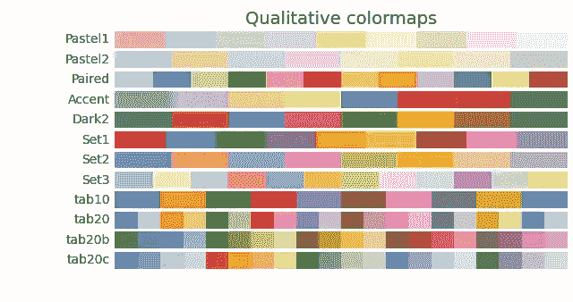

来源:[https://matplotlib . org/stable/tutorials/colors/colormaps . html](https://matplotlib.org/stable/tutorials/colors/colormaps.html)

单词云一旦生成，就需要显示出来。您将利用您之前定义的`draw_wordcloud()`函数:

```
draw_wordcloud(wordcloud, (12,8))
```

云这个词看起来是这样的:

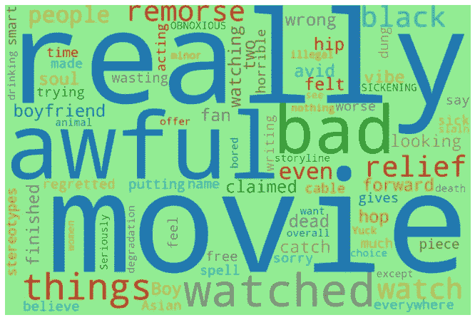

您也可以使用`to_file()`方法将 word cloud 保存到文件中:

```
wordcloud.to_file('wordcloud.png')
```

# 基于评论情绪定制词云

记住，每个评论都有一种情绪——积极的或消极的。让我们按`sentiment`对数据框架进行分组，然后抽取两个正面和两个负面评论，并为每个评论绘制一个词云。为了区分正面评价和负面评价，我们将执行以下操作:

*   为负面评价设置粉色背景，为正面评价设置黑色背景
*   使用`Set1`色图进行负面评价，使用`Paired`色图进行正面评价

以下代码片段为四个电影评论生成单词 clouds:

```
# stratified sampling based on sentiment
df_samples = df.groupby('sentiment').apply(lambda x: x.sample(2))for i in range(4):
    review = df_samples.iloc[i,0]
    review_sentiment = df_samples.iloc[i,1] wordcloud = WordCloud(
                    width = 1500, 
                    height = 1000, 
                    random_state = 42, 
                    background_color = 'black' 
                      if review_sentiment == 'positive' else 
                                             'pink', 
                    colormap = 'Paired' 
                      if review_sentiment == 'positive' else 
                                             'Set1', 
                    collocations = False, 
                    stopwords = STOPWORDS).generate(review) draw_wordcloud(wordcloud, (12,8))
```

以下两个字云是负面评价:

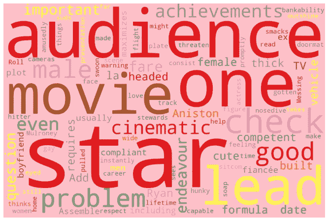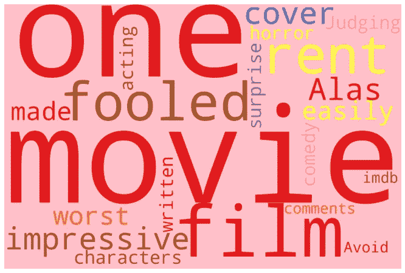

接下来的两个词云是正面评价:

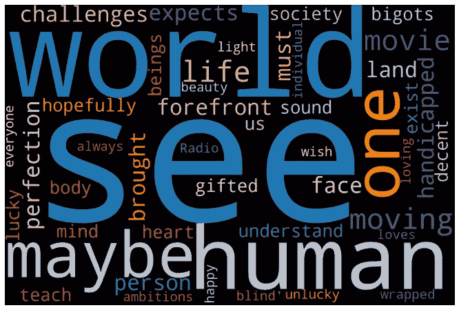

# 对单词云使用掩码

**单词云**模块有一些非常棒的功能，你可以用它们来突出你的单词云——你可以应用一个遮罩来生成任意形状的单词云。

> 理想情况下，你应该在图像是纯黑白的地方使用蒙版。

作为成像基础知识的复习:

*   对于一个黑色的像素，它的 RGB 值都是 0
*   对于一个**白色**像素，其 RGB 值都是 255

为什么知道这一点很重要？嗯，单词云将仅在非白色的像素上绘制，即任何非(255，255，255)的像素将用于绘制单词云。

让我们使用这张 Medium 徽标图片来尝试一下:

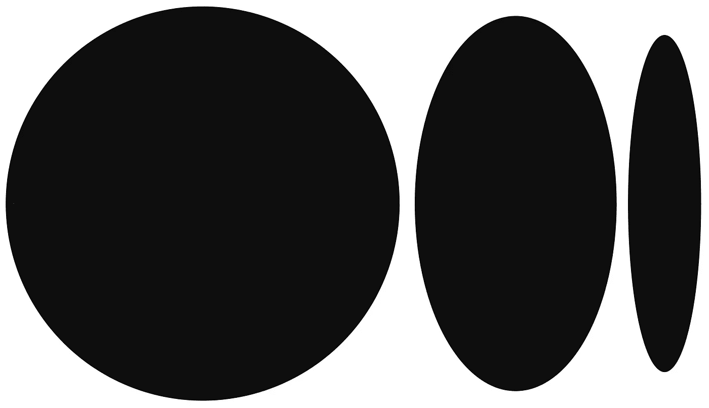

来源:[https://medium . com/blogging-guide/medicines-new-logo-2020-unfinished-ellipses-logo mark-e24c 059871 E7](https://medium.com/blogging-guide/mediums-new-logo-2020-unfinished-ellipses-logomark-e24c059871e7)

以下代码片段将中等图像作为 NumPy 数组加载，然后将其传递给`WordCloud`类的`mask`参数:

```
**import numpy as np
from PIL import Image****mask = np.array(Image.open('medium.png'))**wordcloud = WordCloud(
                random_state = 42, 
                background_color = 'black', 
                colormap = 'tab20',                       
                collocations = False, 
                stopwords = STOPWORDS, 
 **mask = mask,**
 **contour_width = 5, 
                contour_color='yellow'**).generate(review)draw_wordcloud(wordcloud, (14,10))
```

请注意，当您使用遮罩来生成单词云时，不再需要`width`和`height`参数，因为单词云的大小现在将基于遮罩的大小。您将看到以下输出:

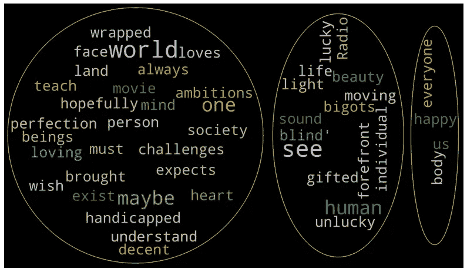

作为另一个例子，考虑下面的图像:


图片来源:[https://en.wiktionary.org/wiki/globe](https://en.wiktionary.org/wiki/globe)

我们将应用此图像作为要生成的单词云的遮罩:

```
**import numpy as np
from PIL import Image****mask = np.array(Image.open(
    'John_Newton_and_William_Palmer_SLNSW_globe_1782.jpg'))**wordcloud = WordCloud(
                random_state = 42, 
                background_color = 'black', 
                colormap = 'tab20',                       
                collocations = False, 
                stopwords = STOPWORDS, 
 **mask = mask,**
 **contour_width = 2,** 
 **contour_color='yellow'**).generate(review)draw_wordcloud(wordcloud, (14,10))
```

单词 cloud 将是这样的:

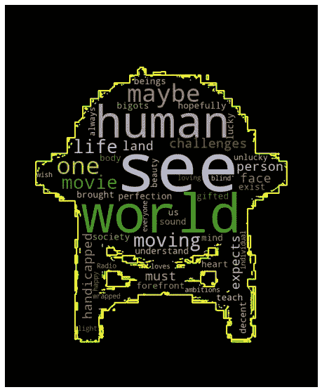

# 为奥巴马和特朗普的胜利演讲创建单词云

我将通过为奥巴马和特朗普的胜利演讲生成单词云来结束这篇文章。他们的演讲可以在这里找到:

*   **奥巴马 2012 年的演讲**——[https://www . the guardian . com/world/2012/nov/07/巴拉克-奥巴马-演讲-全文](https://www.theguardian.com/world/2012/nov/07/barack-obama-speech-full-text)
*   **唐纳德·特朗普 2016 年演讲**—[https://edition . CNN . com/2016/11/09/politics/唐纳德-特朗普-胜利-演讲/index.html](https://edition.cnn.com/2016/11/09/politics/donald-trump-victory-speech/index.html)

我所做的是提取他们的发言，并保存到两个单独的文本文件中:

*   **奥巴马演讲 2012.txt**
*   **特朗普演讲 2016.txt**

让我们为奥巴马 2012 年的获胜演讲生成单词云:

```
with open('Obama Speech 2012.txt') as f:
    lines = f.readlines()
speech = " ".join(lines)STOPWORDS.add('\n')wordcloud = WordCloud(width = 1500, 
                      height = 1000, 
                      random_state = 42, 
                      background_color = 'lightgreen', 
                      colormap = 'tab10', 
                      collocations = False, 
                      stopwords = STOPWORDS).generate(speech)draw_wordcloud(wordcloud, (12,8))
```

这里有一句话云:

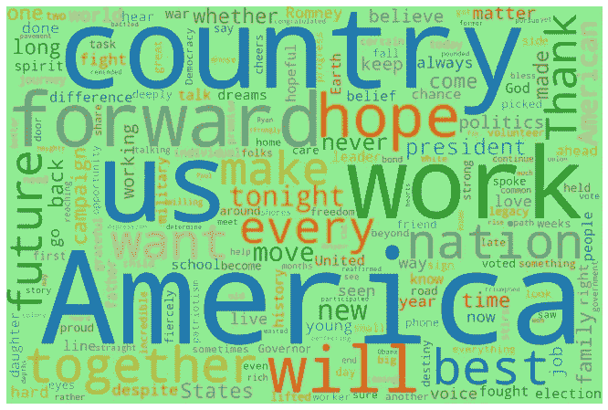

接下来，为唐纳德·特朗普 2016 年的胜利演讲生成单词云:

```
with open('Trump Speech 2016.txt') as f:
    lines = f.readlines()
speech = " ".join(lines)STOPWORDS.add('\n')wordcloud = WordCloud(width = 1500, 
                      height = 1000, 
                      random_state = 42, 
                      background_color = 'lightgreen', 
                      colormap = 'tab10', 
                      collocations = False, 
                      stopwords = STOPWORDS).generate(speech)draw_wordcloud(wordcloud, (12,8))
```

这里有一句话云:

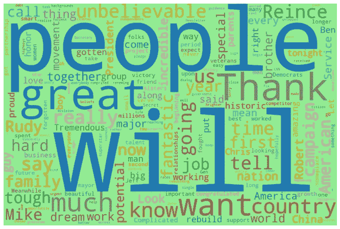

如果您想要单词及其相对频率(与其他单词)的列表，请使用生成的单词云的`words_`属性:

```
display(wordcloud.**words_**)
```

您将看到如下列表:

```
{'will': 1.0,
 'people': 0.8571428571428571,
 'great': 0.75,
 'Thank': 0.7142857142857143,
 'want': 0.4642857142857143,
 'much': 0.32142857142857145,
 'country': 0.32142857142857145, ... 'highways': 0.03571428571428571,
 'bridges': 0.03571428571428571,
 'tunnels': 0.03571428571428571,
 'airports': 0.03571428571428571}
```

如果你只是简单的想要演讲中使用的词的频数，你甚至不需要生成一个词云；只需创建一个`WordCloud`类的实例并调用`process_text()`方法:

```
display(WordCloud().process_text(speech))
```

您将看到如下列表:

```
{'Thank': 20,
 'much': 9,
 'everybody': 1,
 'Sorry': 1,
 'keep': 1,
 'waiting': 1, ... 'eight': 1,
 'proud': 3,
 'immediately': 1,
 'evening': 1,
 'year': 5,
 'Pence': 1}
```

享受单词云带来的乐趣！

[](https://weimenglee.medium.com/membership) [## 加入媒介与我的介绍链接-李伟孟

### 作为一个媒体会员，你的会员费的一部分会给你阅读的作家，你可以完全接触到每一个故事…

weimenglee.medium.com](https://weimenglee.medium.com/membership)