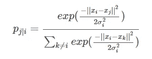
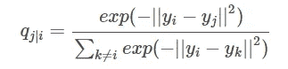
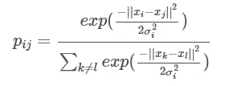
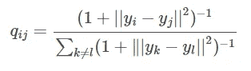
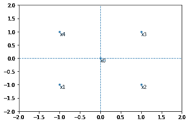
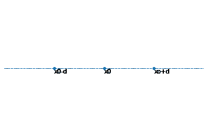
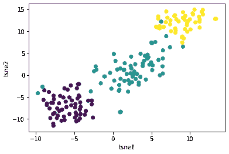
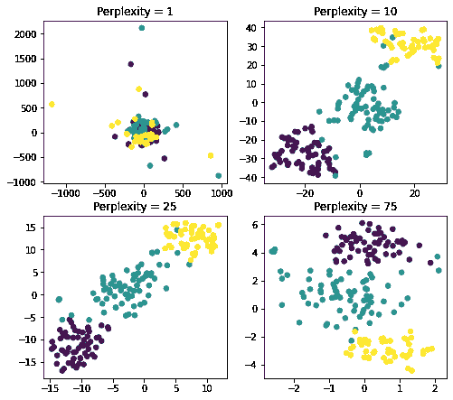
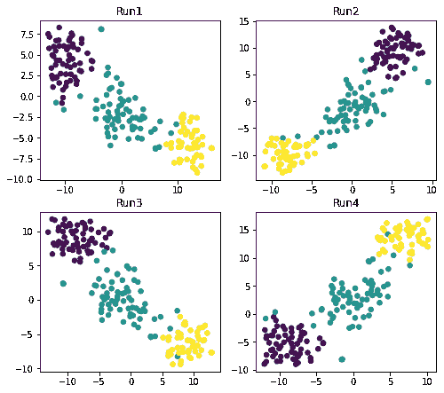

# Python 中使用 t-SNE 的多维数据集可视化

> 原文：<https://levelup.gitconnected.com/visualization-of-multidimensional-datasets-using-t-sne-in-python-64f1efa9ffe0>

本文将关注 Python 中的 t-分布式随机邻居嵌入(t-SNE)及其在多维数据集数据可视化中的应用。

**目录:**

*   介绍
*   随机邻居嵌入(SNE)概述
*   t 分布随机邻居嵌入(t-SNE)综述
*   Python 中的 t 分布随机邻居嵌入(t-SNE)
*   t 分布随机邻居嵌入(t-SNE)超参数调整
*   附加说明
*   结论

# 介绍

我们思考图形和可视化的方式通常是在 2D 和 3D 空间中。从高中开始，我们在 XY 平面和 XYZ 空间绘制数据，这对我们来说非常有意义。然而，当处理现实世界中的大多数数据集时，我们发现它们中的大多数都具有 3 个以上的特征，因此是多维的。现在出现了在 k 维中可视化数据的困难，仅仅是因为我们在日常生活中以 3D 形式看到和思考。

数据科学在线社区中有许多文章关注数据可视化和理解多维数据集。我个人阅读了几篇描述 4D 空间背后的代数和几何的文章，直到今天我还觉得很难在脑海中想象，更不用说更大的维度了。

在这种情况下，降维背后的思想有两个关键部分:

1.  帮助使数据对算法更加友好
2.  帮助重塑数据，使其可视化

第一部分更多的是一种数学方法，是算法开发和其他机器学习工作所需要的，例如，[主成分分析](https://pyshark.com/principal-component-analysis-in-python/)。

在本文中，我们将重点讨论第二部分。我们的目标是使多维数据集对可视化更友好。也有几种方法可以解决这个问题，但这里我们将与 SNE 霸王龙合作。

# 随机邻居嵌入(SNE)概述

随机近邻嵌入(或 SNE)是一种非线性概率降维技术。这对于将 k 维数据集降低到更低的维度(二维或三维空间)以实现数据可视化非常有用。

SNE 的做法是:

1.  构建一个概率分布来表示数据集，其中相似的点被选取的概率较高，不相似的点被选取的概率较低。
2.  创建一个低维空间，尽可能接近地复制步骤 1 中概率分布的属性。

## 第一步:高维空间中的条件概率

根据读者的统计知识，理解起来可能容易，也可能困难。此外，我们将使用最受欢迎的[论文之一](http://jmlr.org/papers/volume9/vandermaaten08a/vandermaaten08a.pdf)中关于 SNE 细节的公式和参考来展示这种转换是如何进行的。

所以我们说，SNE 从一个数据集构建了一个单一的概率分布，其中相似/不相似的点被选中的概率较高/较低。我们如何确定哪些点是相似的，哪些是不相似的？

在随机邻居嵌入中，相似点是具有高条件概率的点。下面是我们的计算方法:



这里的目标是找到两点的条件概率: *x_i* 和 *x_j* 。这是我们从数据集中选择的两个随机点(在模型中，它计算数据集中所有点对的条件概率)。

换句话说， *x_i* 选择 *x_j* 作为其邻居的概率是 *p_(j|i)* ，这又是它们在以 *x_i* 为中心的高斯(正态)分布下的概率密度与方差 *σ_i* 的比例。

上述计算的结果是，对于非常靠近的数据点， *p_(j|i)* 的值将会很高(意味着这些点彼此相似)，而对于彼此远离的数据点， *p_(j|i)* 的值将会很小(意味着这些点彼此不相似)。

## 第二步:低维空间中的条件概率

在前面的部分中，我们基于 k 维空间中的相似性找到了潜在的邻居。比如我们发现 *x_i* 和 *x_j* 是相似的。现在我们需要找到它们在低维空间中的对应物。

假设对于 *x_i* 其较低维度的对应物是 *y_i* ，对于 *x_j* 其较低维度的对应物是 *x_j* 。所以在低维空间我们有: *x_i- >* *y_i* 和 *x_j* - > *y_j* 。

因此，我们可以计算出 *y_j* 与 *y_i* 相似(并且是邻居)的相似条件概率，我们将其表示为 *q_(j|i)* 。

*q_(j|i)* 的公式类似于 *p_(j|i)* 的公式，其中有一处变化，我们将方差设置为(1/sqrt 2)，这使得 *σ* 项等于 1。下面是我们的计算方法:



计算背后的直觉类似于步骤 1 中的直觉。因此，如果高维点 *x_i* 和 *x_j* 正确地用它们在低维空间 *y_i* 和 *y_j* 中的对应物来表示，那么两个分布中的条件概率应该相等:*p _(j | I)*=*q _(j | I)*。

该技术采用了最小化[库尔贝克-莱伯散度](http://hanj.cs.illinois.edu/cs412/bk3/KL-divergence.pdf)的方法来得出其结果。它的作用是最小化两个概率分布之间的差异。

## 摘要

以上部分显示了随机邻居嵌入背后的逻辑和计算。

回想一下我们在 SNE 使用的步骤:

1.  使用高斯(正态)分布创建一个概率分布，定义 k 维空间中数据点之间的关系。
2.  使用高斯(正态)分布在低维空间中重新创建定义数据对应物之间关系的概率分布。

这种方法的缺点是什么？

*   它使用高斯分布，与学生的 t 分布(用于 t-SNE)相比，高斯分布具有较短的尾部。
*   它最小化了 [Kullback-Leiber 散度](http://hanj.cs.illinois.edu/cs412/bk3/KL-divergence.pdf)，该散度具有难以优化的成本函数。

# t 分布随机邻居嵌入(t-SNE)综述

在上一节中，我们讨论了降低数据集维度所需的大多数计算，我们在这里将重点解释为什么我们使用 t-SNE 而不是 SNE 进行可视化，以及它们有何不同。

从这部分的名字你可能注意到了这个技术的开头使用了“t-Distributed”。在前面的 SNE 计算中，我们使用了高斯(正态)分布和梯度下降成本函数来最小化 Kullback-Lieber 散度。

t-SNE 计算非常相似，只是它将使用学生 t-分布来重建低维空间中的概率分布。

SNE 霸王龙的做法是:

1.  使用高斯(正态)分布创建一个概率分布，定义 k 维空间中数据点之间的关系。
2.  使用高斯(正态)分布在低维空间中重新创建定义数据对应物之间关系的概率分布。

## 第一步:高维空间中的条件概率

该步骤与上一节中的步骤 1 相同。由于采用对称 SNE 方法，条件概率公式会有一些微小的差异，在[原始论文](http://jmlr.org/papers/volume9/vandermaaten08a/vandermaaten08a.pdf)中有详细描述。



## 第二步:低维空间中的条件概率

计算与上一节中的步骤 2 相似，只是有一处不同。我们将使用学生 t 分布来利用它在低维的重尾。它将改变公式如下:



## 摘要

你会注意到这两种技术非常相似，SNE 霸王龙本质上是 SNE 的改良版。但是我们为什么需要这个修改版本呢？为什么我们不能和 SNE 合作呢？

有两个主要原因:

*   难以优化成本函数
*   拥挤问题

优化成本函数的困难更多的是数学上的，不在本文中讨论，但是欢迎您在线搜索，因为有许多文章显示了详细的推导过程。

## 添加

我们更感兴趣的是拥挤问题。拥挤问题本质上是在将高维数据转换为低维数据时，无法保持高维数据点之间的距离。这听起来可能是很多理论上的概念，所以我们来看一个简单的例子:

假设您正在使用 2D 空间，并希望将其数据转换到 1D 空间。你的点有如下坐标:(0，0)，(-1，-1)，(1，-1)，(1，1)，(-1，1)。
在 2D 空间看起来是这样的:



注意，从 *x0* 到所有其他点( *x1* 、 *x2* 、 *x3* 、 *x4* )的距离是相同的，我们称之为 *d* 。

下一步你要做的是把它转换到 1D 空间。在较低维度中发生的情况是，容纳来自较高维度的所有数据的空间较少。在上图中，我们看到有 5 个点，每个点都有自己的位置。现在让我们来看看更低的维度:



注意，在 1D 空间中，距离点 *x0* 距离 *d* 以内的点只有两个光斑。最终会发生的是，他们将“拥挤”，因为我们有 4 个点，只有 2 个点可用，因此这些 1D 相邻点中的每一个都将从 2D 空间中得到 2 个点。这就是所谓的拥挤问题。

t-SNE 有效地解决了这个问题，它使用了一个更重尾的学生 t 分布来允许点之间有更大的分布，从而减少了“拥挤”。

# Python 中的 t 分布随机邻居嵌入(t-SNE)

为了继续学习本教程，我们需要两个 Python 库:pandas、numpy、sklearn 和 matplotlib。

如果您没有安装它们，请打开“命令提示符”(在 Windows 上)并使用以下代码安装它们:

```
pip install pandas
pip install numpy
pip install sklearn
pip install matplotlib
```

导入所需的库:

```
import pandas as pd
import numpy as np
import matplotlib.pyplot as plt
from sklearn.datasets import load_wine
from sklearn.preprocessing import StandardScaler
from sklearn.manifold import TSNE
```

一旦下载、安装和导入了库，我们就可以继续 Python 代码实现了。

## 步骤 1:加载数据集

在本教程中，我们将使用作为 sklearn 库一部分的葡萄酒识别数据集。该数据集包含 13 个特征，目标是 3 类葡萄酒。这与我们在[主成分分析](https://pyshark.com/principal-component-analysis-in-python/)文章中使用的数据集相同。

我选择这个数据集的另一个原因是因为它的形状，因为它符合我们展示 SNE 霸王龙性能的要求。另外，你可能已经从其他关于 [PyShark](https://pyshark.com/) 的文章中熟悉了。

让我们将特性存储到数据帧中，特性名称作为列名:

```
wine = load_wine() 
df = pd.DataFrame(wine.data, columns=wine.feature_names)
```

## 步骤 2:标准化数据集

为了使数据集对算法更加友好，我们将对其进行标准化:

```
df = StandardScaler().fit_transform(df) df=pd.DataFrame(df,columns=wine.feature_names)
```

注意:这不是必须的，但通常是首选。我们在以前的文章中研究了这个数据集，发现当它被标准化时，最好将其可视化，因为许多算法会受到彼此差异很大的特征范围的影响。

## 步骤 3:在 Python 中应用 t-SNE 并可视化数据集

sklearn 类 **TSNE()** 带有一个超级参数列表，在应用该技术时可以对其进行调整。我们将描述其中的前两个。然而，如果你有兴趣深入了解的话，我们鼓励你探索所有的。

让我们来讨论这两个超参数:

1.  **n_components : *int，optional(默认值:2)***
    这是一个参数，表示您要将数据集转换到的较低空间的维度。在我们的例子中，该值应该是 2，因为我们希望在 2 维空间中可视化数据集。
2.  **困惑度*:浮点型，可选(默认值:30)***
    这是最近邻居数量的参数，t-SNE 将根据该参数确定潜在邻居。通常，数据集越大，困惑值应该越大。下面我们将展示不同的困惑值如何影响结果。

首先，让我们从使用 t-SNE 默认值开始绘图，并在 Python 中创建 t-SNE 的实例时设置 **random_state=0** 。你可以为随机状态选择任何其他整数，我们在附录中描述了它的含义。

```
tsne = TSNE(random_state=0)
tsne_results = tsne.fit_transform(df) tsne_results=pd.DataFrame(tsne_results, columns=['tsne1', 'tsne2'])plt.scatter(tsne_results['tsne1'], tsne_results['tsne2'], c=wine.target)
plt.show()
```

这里我们首先用 Python 创建 t-SNE 的实例，并将其存储为 **tsne** 。接下来，我们将原始数据集转换成它的二维形状( **tsne_results** )，它采用 numpy 数组的格式。出于可视化的目的，我们将其转换为 pandas 数据帧，并为我们的列命名。最后，我们创建一个散点图，颜色标签类似于葡萄酒的类型(**葡萄酒。目标**)。

以下是我们得出的结论:



相当大的成就！我们从 13 维发展到 2 维，散点图看起来很棒！

# t 分布随机邻居嵌入(t-SNE)超参数调整

这一节是为更高级的读者准备的，但总的来说，这只是我们在前一节所做的基础上的又一层。

正如我们已经知道的，Python 中的 t-SNE 附带了一组我们可以调整的超参数。因此，对我们来说，调整 n _ components 没有意义，因为我们总是希望它等于 2，以便在二维空间中工作。

让我们讨论一下调优**困惑**并看看它对转换的可视化输出的影响。

sklearn 文档建议考虑一个介于 5 和 50 之间的困惑值。似乎这可能取决于您的数据集，选择不同的值可能会根据具体情况产生明显不同的结果。

作为一个例子，让我们用几个值来表示困惑:1，10，25，75。

**注意:代码编辑器不支持添加循环，建议从** [**原帖**](https://pyshark.com/visualization-of-multidimensional-datasets-using-t-sne-in-python/) **中复制代码。**

```
plt.figure(figsize = (8,4))
plt.subplots_adjust(top = 1.5) for index, p in enumerate([1, 10, 25, 75]):tsne = TSNE(n_components = 2, perplexity = p, random_state=0)
tsne_results = tsne.fit_transform(df) tsne_results=pd.DataFrame(tsne_results, columns=['tsne1', 'tsne2']) plt.subplot(2,2,index+1)
plt.scatter(tsne_results['tsne1'], tsne_results['tsne2'], c=wine.target, s=30)
plt.title('Perplexity = '+ str(p))
plt.show()
```



从上面的可视化中，我们可以得出一些重要的发现:

*   困惑= 1:局部变化占主导地位
*   困惑= 75:全球变化占主导地位
*   困惑= 10 或 25:都在推荐的范围内，并且结果似乎或多或少相似

因此，你可以看到，困惑是一个重要的参数，在使用 SNE 霸王龙时应该考虑到这一点，以确保你的可视化效果得到正确调整。

# 附加说明

回想一下，在 Python 中初始化 t-SNE 的所有实例中，我们将 **random_state** 参数设置为 0。它到底是做什么的？

顾名思义， **random_state** 是内部随机数生成器，它决定数据集中的索引拆分。

因此，如果它没有被设置，那么它会被随机初始化。

为什么这对 SNE 霸王龙很重要？让我们看看下面的图表。这里我们用相同的参数创建了 4 个散点图，除了我们没有指定 **random_state** :

**注意:代码编辑器不支持添加循环，建议从** [**原帖**](https://pyshark.com/visualization-of-multidimensional-datasets-using-t-sne-in-python/) **中复制代码。**

```
plt.figure(figsize=(8, 4))
plt.subplots_adjust(top = 1.5)
tsne = TSNE()
for i in range(4):
tsne_results = tsne.fit_transform(df) tsne_results=pd.DataFrame(tsne_results, columns=['tsne1', 'tsne2']) plt.subplot(2,2,int(i)+1)
plt.scatter(tsne_results['tsne1'], tsne_results['tsne2'], c=wine.target, s = 30)
plt.title('Run'+str(int(i)+1))plt.show()
```



注意:您生成的 4 个散点图可能不同。

这里我们观察到，即使模型的其他参数相同，不设置 **random_seed** 并执行代码确实会生成 4 个不同的数据集。

由于 t-SNE 在 Python 中的初始化是随机的，除非您以其他方式进行设置，所以会出现上述结果。增加了 t-SNE 的复杂性，因为它的成本函数和随机初始化导致该函数的不同局部最小值，并改变每次运行的结果。

# 结论

这篇文章是一个演练的应用 t-分布式随机邻居嵌入(t-SNE)的可视化多维数据集在 Python 中。

此外，您可以采取的进一步探索该技术优势的下一步是尝试将该技术应用于更多具有高级超参数调整的数据集，并将其性能与其他维度缩减技术(如[主成分分析](https://pyshark.com/principal-component-analysis-in-python/))进行比较。

如果你有任何问题或者对编辑有任何建议，请在下面留下你的评论。

*原载于 2020 年 4 月 13 日 https://pyshark.com*[](https://pyshark.com/visualization-of-multidimensional-datasets-using-t-sne-in-python/)**。**