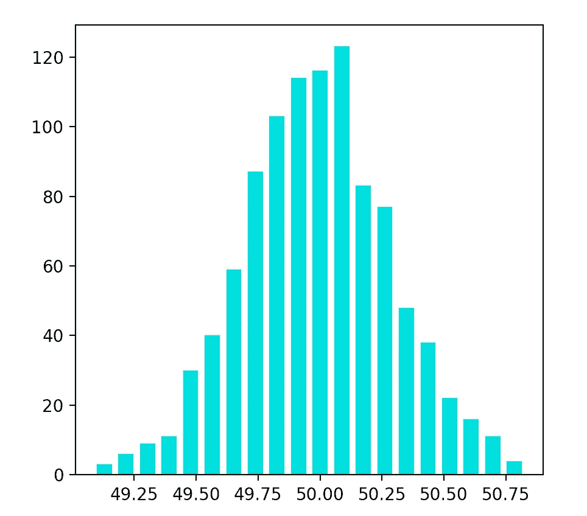
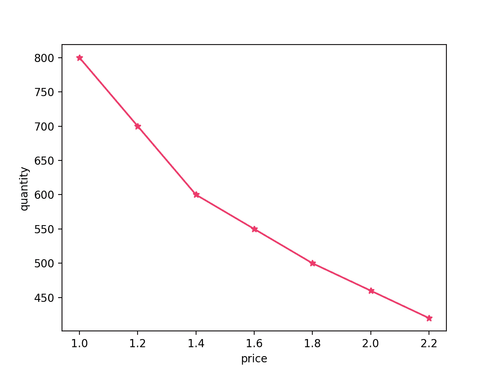
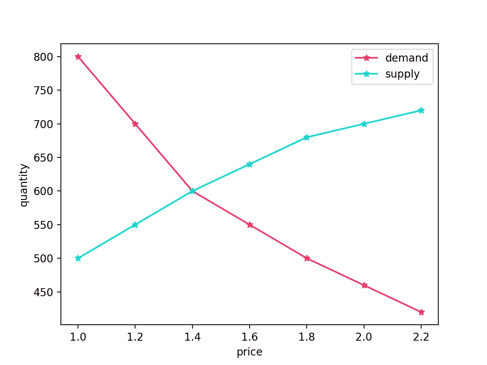
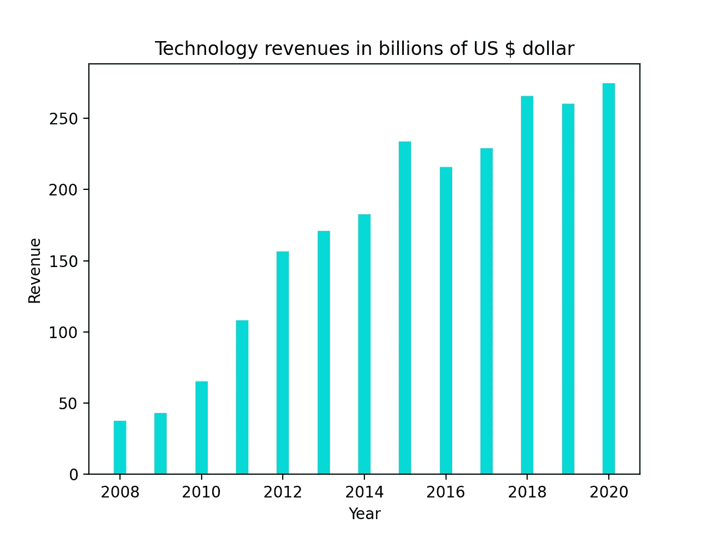
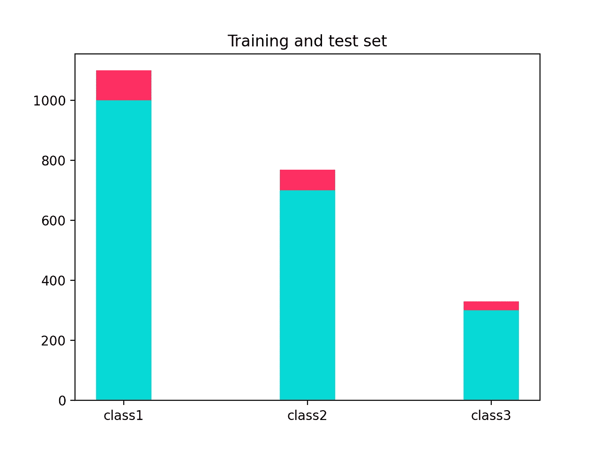
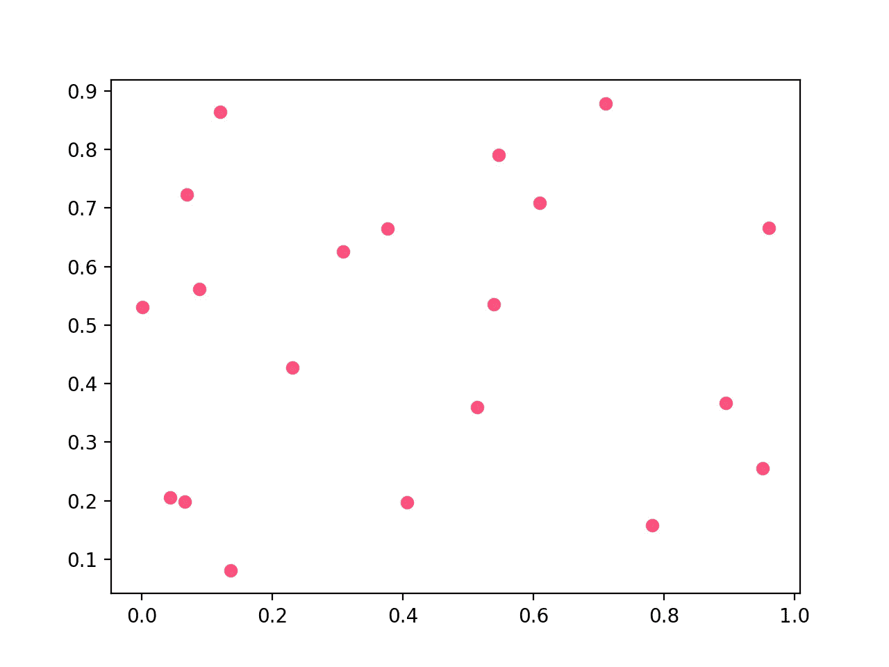

# 用 Matplotlib 可视化

> 原文：<https://levelup.gitconnected.com/visualization-with-matplotlib-a856d4de42d5>

## 数据科学家

## 快速绘制图形的模板


由[卢卡斯·布拉塞克](https://unsplash.com/@goumbik?utm_source=medium&utm_medium=referral)在 [Unsplash](https://unsplash.com?utm_source=medium&utm_medium=referral) 拍摄的照片

> *一图胜千言*。

Matplotlib 是用于各种可视化的最广泛使用的 Python 库:静态、动态或动画。今天，我们将学习如何使用 Python 中的这个库来绘制数据。

# 如何在 Python 中安装 matplotlib？

让我们看看如何在各种操作系统中使用 Python installer 安装`matplotlib`。

*   **视窗**

```
pip install -U matplotlib
```

*   **Linux**

```
sudo apt-get install python3-matplotlib
```

*   **Mac**

```
sudo pip3 install matplotlib
```

***绘制你的数据可视化:只让先复制，后编辑。***

# 柱状图

直方图是跨函数大量使用的图之一，因为它提供了数据分布的非常好的视图。

```
from numpy import random
from matplotlib import pyplot as plt

random.seed(0)
meu = 50
sig = 0.30
data = meu + sig * random.randn(1000)

plt.hist(data, bins=20, facecolor="#08D9D6", alpha=0.30, rwidth=0.7)
plt.subplots_adjust(left=0.30)
plt.show()
```



# 线条

## 单线线路

```
from matplotlib import pyplot as plt

price = [1, 1.2, 1.4, 1.6, 1.8, 2.0, 2.2]
quantity = [800, 700, 600, 550, 500, 460, 420]

plt.plot(price, quantity, marker='*', color='#FF2E63')

plt.xlabel('price')
plt.ylabel('quantity')

plt.show()
```



## 几行

我们如何在同一个图表中添加多条线？让我们更进一步，在同一个图表中绘制多条线。

```
from matplotlib import pyplot as plt

price = [1, 1.2, 1.4, 1.6, 1.8, 2.0, 2.2]
demand = [800, 700, 600, 550, 500, 460, 420]
supply = [500, 550, 600, 640, 680, 700, 720]

plt . plot(price, demand, marker='*', color='#FF2E63', label='demand')
plt . plot(price, supply, marker='*', color='#08D9D6', label='supply')

plt.xlabel('price')
plt.ylabel('quantity')
plt.legend()

plt.show()
```



我们通过调用 2plot 函数创建了一个多线图。

# 条形图

条形图是在任何类型的可视化中使用的最流行的图表之一，因为它像折线图一样以强调的方式显示相对数据点。

## 条形图

```
from matplotlib import pyplot as plt

classes = [ 'class1' , 'class2' , 'class3' ]
train = [ 1000 , 700 , 300 ]

plt . bar ( classes , train , width = 0.3 , align = 'center' )
plt . title ( 'Training set' )

plt.show()
```



## 堆积条形图

```
from numpy import random
from matplotlib import pyplot as plt

random . seed ( 0 )
classes = [ 'class1' , 'class2' , 'class3' ]
train = [ 1000 , 700 , 300 ]
test = [ 100 , 70 , 30 ]

plt . bar ( classes , train , width = 0.3 , align = 'center', color='#08D9D6' )
plt . bar ( classes , test , width = 0.3 , align = 'center' , bottom = train, color='#FF2E63')
plt . title ( 'Training and test set' )

plt.show()
```



## 散点图

```
from numpy import random
import matplotlib.pyplot as plt

random.seed(1968)
number = 20
x = random.rand(number)
y = random.rand(number)

area = (40 * random.rand(number))**2.5

plt.scatter(x, y, c='#FF2E63', alpha=0.8)
plt.show()
```



# 结论

很简单，对吧？让我们选择正确的图表。这将有助于你的演讲留在观众的脑海中。