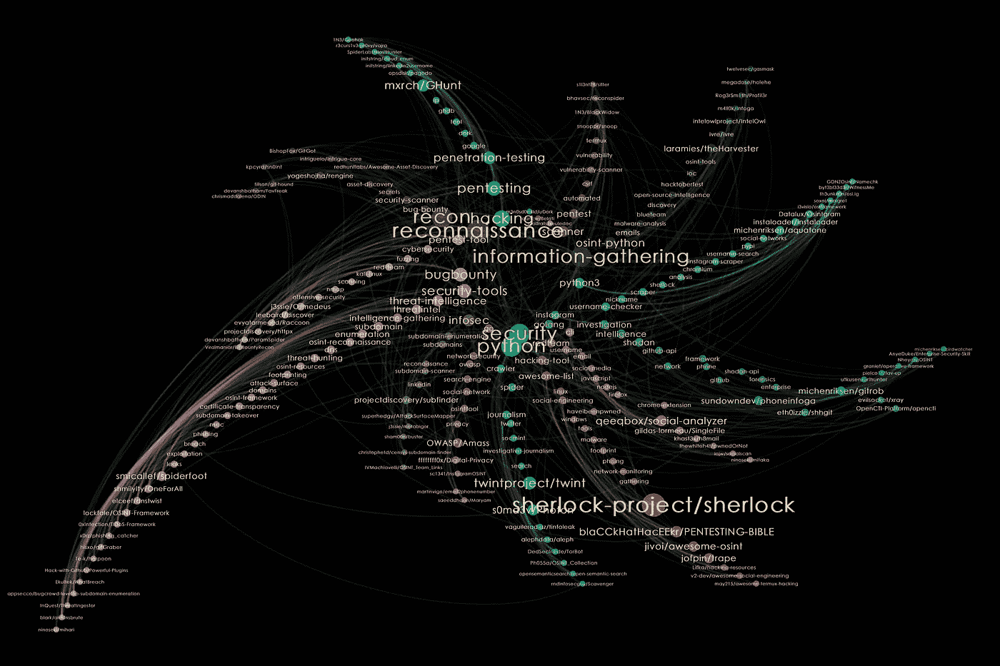
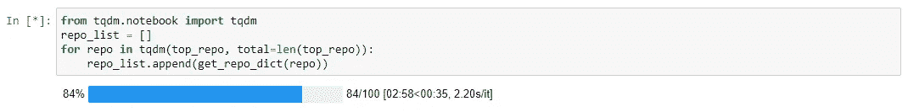
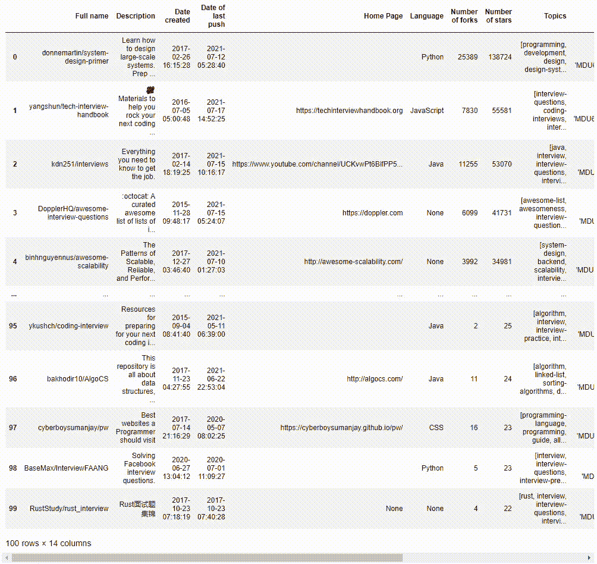
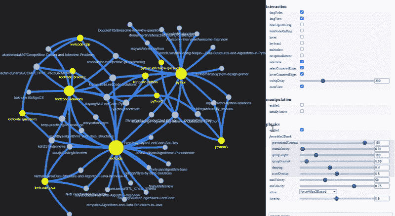
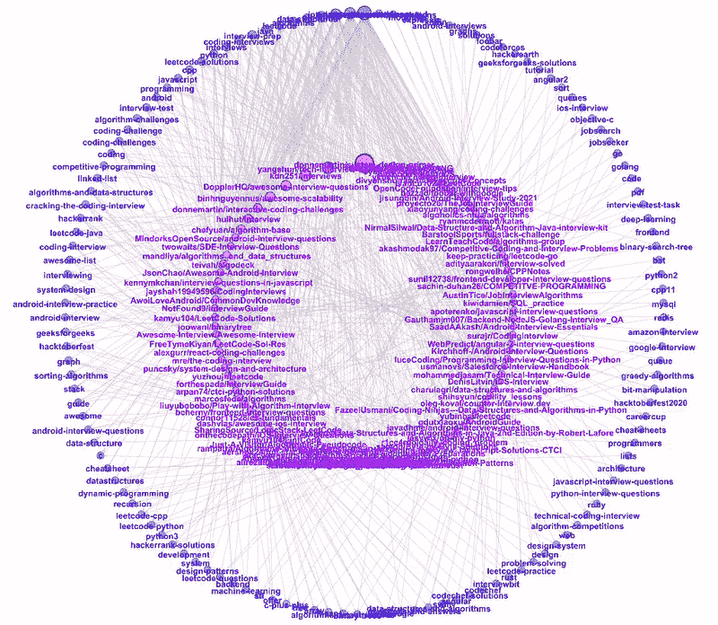
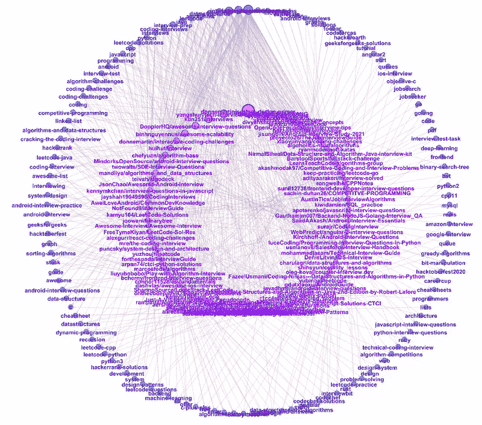
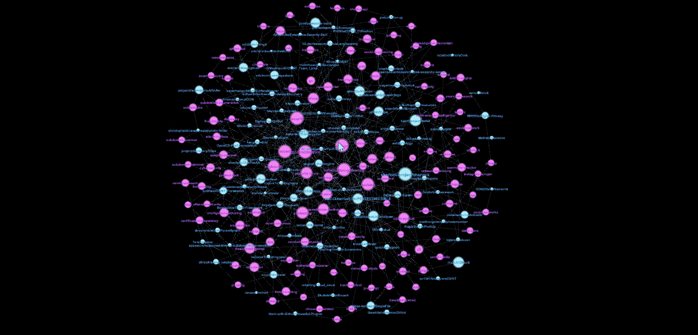
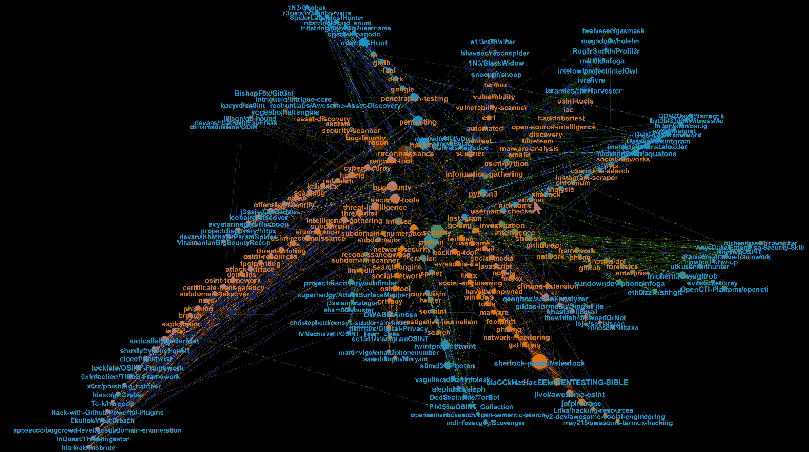
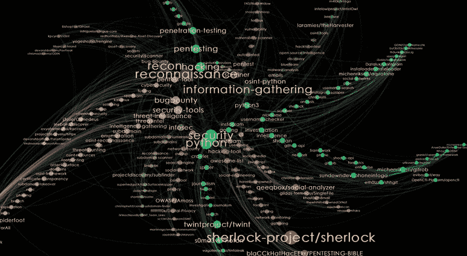

# 用 Python 可视化 GitHub Repos:搜索有用的项目和采访技巧

> 原文：<https://levelup.gitconnected.com/visualize-github-repos-with-python-trawling-github-for-useful-projects-and-interview-tips-42897299e113>

## 充分利用 Github

## 对 GitHub 存储库进行搜集、集群和可视化的逐步演练

Github 存储库的 Gephi 可视化以及与 OSINT 和 INFOSEC 相关的主题|作者图片

这里的每个人都熟悉 Github。软件工程师和数据科学家使用 Github 从开源项目中寻找灵感，并收集技术面试的技巧。

Github API 提供了一种基于流行度、编程语言和贡献者查询存储库的便捷方式。网络绘图工具提供了一种简单的方法来聚集和可视化这些结果。

## 抓取 Github

假设您正在为即将到来的技术面试做准备，并且想看看 Github 上是否有任何已编译的资源。

只需使用 [PyGithub](https://pygithub.readthedocs.io/en/latest/index.html) 库的几行代码，我们就可以搜索 Github 以获得与主题相关的存储库:*访谈-练习*。

接下来，我们可以获得每个存储库的更多统计信息，比如 *date_of_last_push* 、 *number_of_forks* 、 *list_of_contributors* 和 *number_of_subscribers* 。我们不会使用所有这些字段，但是它们可以在以后用于过滤和排序我们的数据。

调用 get_subscribers()和 get_watchers()来获取订阅者和观察器的列表需要几分钟，因为可能有数千个订阅者和观察器。tqdm.notebook 库将会派上用场，在 Jupyter Notebook 中查看动态进度条。

我们可以将查询结果的副本保存为 JSON 文件，并在 Pandas Dataframe 中查看数据。

## 将数据转换成节点和边

让我们在网络图中可视化数据，这样

*   节点代表存储库{r}或主题{t}
*   Edges {r} — {t}会将存储库节点链接到主题节点，如果存储库标记有主题的话
*   储存库{r}节点大小代表储存库的星数量
*   主题{t}节点大小表示数据集中带有主题标签的储存库的数量

## 使用 PyVis 进行数据探索

为了可视化网络图的样本，我们可以使用 [PyVis](https://pyvis.readthedocs.io/en/latest/index.html) ，在 Jupyter Notebook 中生成一个交互式绘图。让我们选择那些标有与 *Leet* 或 *Python* 相关主题的存储库。

PyVis 提供了一个*选项*面板来配置各种图形布局和美感。黄色节点代表 GitHub 主题，而蓝色节点代表 Github 存储库。

Jupyter 笔记本中的 PyVis 功能|作者图片

这些存储库包含针对 Python 的 Leetcode 解决方案，以及技术采访技巧和资源。

## 使用 Gephi 的网络可视化

[Gephi](https://gephi.org/) 是一款强大的工具，具有多种内置聚类算法和更多布局功能，可用于执行高级网络分析。

## 双环布局

*双圆形布局*是 Gephi 第三方插件*圆形布局*提供的布局之一。这种布局对于显示不同层次的两个节点类型之间的有向链接非常有用。

在我们的例子中，我们有两种节点类型:存储库和主题。我们可以将这两种节点类型绘制成两个独立的圆圈，内圈代表存储库节点，外圈代表主题节点。

节点按大小递减的方式逆时针排序。当我们浏览更受欢迎的主题时，我们可以看到所有与该主题相关的存储库。

将鼠标悬停在热门话题上(蓝色)以获得相应的 Github 库(紫色)|图片由作者提供

同样，当我们在存储库中悬停时，我们可以看到它们各自的主题标签。

将鼠标悬停在流行的 Github 存储库(紫色)上以获得它们的标记主题(蓝色)|图片由作者提供

## 开源工具的拖网

GitHub 作为一个 hivemind 来扫描开源工具，对于开源情报(OSINT)和信息安全(INFOSEC)领域的分析师特别有用。

对这些工具进行更好的搜索和分类，将有助于分析人员在研究中跟上最新的技术。在后面的小节中，我们将查看被标记为 OSINT 或 INFOSEC 的 Github 存储库。

## 弗鲁特曼-莱因戈尔德布局

标准 Fruchterman-Reingold 布局是一种力导向算法，将边缘视为弹簧。这种布局会将高度连接的节点拉到球体的中心，而将较少连接的节点留在外围。

让我们放大中心，悬停在流行的(即较大的节点大小)存储库和主题上。粉色节点代表主题，蓝色节点代表存储库。

将鼠标悬停在流行的 Github 存储库(蓝色)和与 OSINT 和 INFOSEC |作者图片相关的主题(紫色)上

## 模块化聚类

通过在统计面板中运行*模块化*集群，Gephi 使用 Louvain 方法进行网络中的社区检测，这将把具有相似连接的节点聚集在一起。

为了查看该聚类的结果，我们继续根据模块性输出对节点进行着色，并选择径向轴布局。我们将获得一个 shuriken 形状的网络，其中每个刀片代表属于同一个集群的主题(带有橙色标签的节点)和存储库(带有蓝色标签的节点)。

分析师可以将鼠标悬停在感兴趣的主题上，为他们的 OSINT 或 INFOSEC 研究寻找开源工具

## 解释径向轴布局

让我们通过选择顶级手里剑刃来查看其中一个集群。

带有橙色标签的节点是集群的主要主题。随着我们远离手里剑的中心，主题按大小递减排序。我们可以看到这个集群与*pentest*的话题有关。

带有蓝色标签的节点代表存储库。对于这个集群，我们得到了作为*测试*工具的存储库。当我们从刀片的边缘悬停在存储库上并向中心移动时，我们可以看到边缘处的存储库是带有少量标记主题的利基工具，而靠近中心的工具似乎更加多用途，带有更多标记主题。

聚类提供了不同存储库和主题如何相关的直觉|按作者分类的图片

## 其他使用案例

由于 Github API 提供了查询存储库的*创建日期*和*最后推送日期*的方法，可视化可以扩展到识别趋势开源项目或最近更新的文档。通过利用存储库的贡献者、订阅者和观察者的字段，可以进行更加以简档为中心的分析来对帐户进行排名。

放大封面照片 GIF |作者图片

***工具***

[1]雅克五世(2018)， [PyGithub 库](https://pygithub.readthedocs.io/en/latest/index.html)

[2]西健院(2018)，[皮维斯库](https://pyvis.readthedocs.io/en/latest/)

[3]巴斯蒂安·m .，海曼·s .，雅克米·m .(2009 年)。 [Gephi 软件](https://gephi.org/)